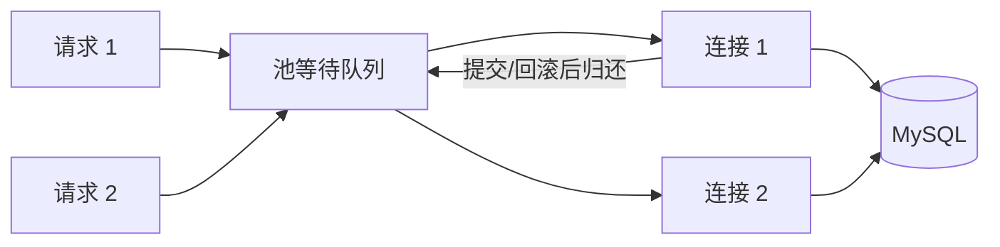

# 连接池、MySQL 上限与连接耗尽

API 有 20 个副本，每个副本连接池上限 50，看起来每台都不大，但总上限已经是 1000。MySQL 的 `max_connections` 只有 600，发布扩容后大量请求卡在“获取连接”，即使单条 SQL 很快也无法执行。连接池首先是一项容量预算。

## 一个连接是一段有状态会话

MySQL 连接完成 TCP、TLS 与认证后，会保存当前事务、隔离级别、临时表和会话变量。连接不是无状态 HTTP 请求，因此借出后必须在归还前提交或回滚，并清理会话状态。

频繁新建连接会重复握手和认证；永久保留过多连接又占用 MySQL 内存与线程资源。连接池在两者之间复用有限连接，并让超量请求排队或超时。



连接池满时，请求还没有执行 SQL。这个等待必须有独立指标和超时，不能统统归为“数据库查询慢”。

## 池大小从全局预算倒推

先给 MySQL 保留运维、迁移和后台任务连接，再把业务预算分给 API 与 Worker。每副本上限约等于业务连接预算除以最大副本数，而不是按开发机压测随意放大。

池太小会排队，太大可能把排队推入 MySQL，使上下文切换和锁竞争更严重。调整时一起看池等待 P95/P99、活跃连接、SQL 延迟、CPU 和事务时长。

| 预算项 | 示例值 | 含义 |
| --- | --- | --- |
| MySQL 总连接上限 | 600 | 数据库硬限制，不是业务可用数 |
| 运维与迁移保留 | 60 | 故障时仍能登录和恢复 |
| Worker 预算 | 140 | 后台消费有独立上限 |
| API 预算 | 400 | 若最大 20 副本，每副本最多约 20 |

示例数字只说明计算方法，不是通用推荐值。真实值取决于实例内存、查询并发、事务时长和副本策略。

## 事务必须跟着借出的连接走

事务的多条 SQL 必须使用同一个连接。若 Repository 每次自行从池中取连接，`BEGIN`、更新和 `COMMIT` 可能落到不同会话，事务就不存在。应由 Service 打开事务，把事务句柄显式传给数据访问层。

任何异常路径都要 rollback，再归还连接。把连接带到 HTTP 响应之后、外部 API 调用或消息等待中，会长时间占用池，并扩大锁持有时间。

这段 SQL 必须在同一连接上执行。应用层在 COMMIT 前检查影响行数；为 0 时回滚并返回 not_found 或 version_conflict。

```sql
START TRANSACTION;
UPDATE projects
SET name = :name, version = version + 1
WHERE tenant_id = :tenant_id
  AND id = :id
  AND version = :expected_version;
-- 检查 affected_rows = 1
COMMIT;
```

若 COMMIT 时网络断开，连接应从池中销毁而不是复用；业务结果进入未知状态，需要按项目 ID 和版本重新查询。

## 连接耗尽的排查顺序

先看池的 active、idle、waiters 和等待时间，再看 MySQL 当前连接、事务与锁。active 达上限且 SQL 很短，可能连接未归还；事务持续数分钟，可能把外部调用放进事务；MySQL 已达上限，则要核对所有副本和临时任务的总和。

不要先把 pool max 翻倍。那会暂时减少应用排队，却可能让数据库整体雪崩。先找到连接被占用的时间段，缩短事务和修复泄漏，再评估容量。

## 连接池最常被问错的问题

**为什么连接空闲也会被数据库断开？**

数据库、代理或防火墙都有空闲超时。池借出连接前可做轻量健康检查，并设置连接最大生命周期，让它早于基础设施超时轮换。失败连接必须丢弃。

**一个请求是否只能使用一个连接？**

普通单事务请求通常只需一个。并行查询可能占多个连接，但会快速放大池需求，也无法共享同一事务快照，应先确认确实有收益。

**池等待超时后可以重试吗？**

请求尚未获取连接时通常没有数据库副作用，但上层流程可能已有其他副作用。重试仍要遵守总 deadline、退避和幂等，不应在每层无限重试。

**Serverless 为什么容易出现连接风暴？**

大量实例可同时冷启动，各自建立池，实例数量增长快于数据库容量。可使用数据库代理、严格的小池、并发上限或支持弹性连接的服务，并按全局并发预算设计。
