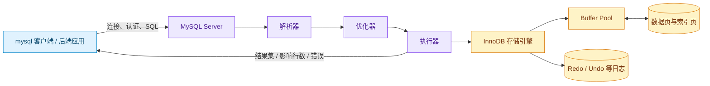
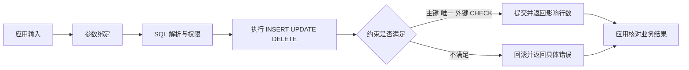

# MySQL 入门：数据库、表、SQL 与 CRUD

MySQL 是一个关系数据库管理系统，负责把结构化记录长期保存，并通过 SQL 提供查询、约束、并发和恢复能力。它位于后端应用和持久化数据之间：应用提交参数化 SQL，MySQL Server 解析并执行，存储引擎维护表、索引、事务和日志。CRUD 是进入这层系统的最小入口。

CRUD 分别是 Create、Read、Update、Delete 四类数据操作；参数绑定则是把外部输入作为参数传给 SQL，而不是拼接成 SQL 文本。先理解这两个概念和库/表/行/列的关系，再看连接、建表、影响行数和失败输出。

先看一张最小的用户表：

```text
+----+---------------+---------------------+--------+
| id | display_name  | email               | status |
+----+---------------+---------------------+--------+
|  1 | 小江          | reader@example.test | active |
|  2 | 管理员        | admin@example.test  | active |
+----+---------------+---------------------+--------+
```

表里的每一行是一名用户，每一列描述用户的一项属性。数据由 MySQL 管理后，应用进程可以退出再启动，另一台服务器也可以通过连接读取同一批记录。读取邮箱为 `reader@example.test` 的用户，只需告诉数据库查询条件：

```sql
SELECT id, display_name, email, status
FROM users
WHERE email = 'reader@example.test';
```

这条 SQL 没有说明数据页放在哪个文件，也没有要求程序逐行翻找。MySQL 接收查询，检查语法和权限，选择读取路径，找到符合条件的行，再把结果交给客户端。新增、修改和删除也通过 SQL 完成。

数据库解决的不只是“保存到磁盘”。多个进程可能同时读写同一批数据，服务器还要处理约束、并发、权限、索引、事务、备份和故障恢复。普通文件可以保存字节，却不会自动提供这些数据管理能力。

从零建立一个 MySQL 数据库，可以观察数据放在哪里、一条读写命令经过哪些组件、数据库怎样拒绝非法状态，以及应用如何判断写入是否真正发生。

## 安装 MySQL 并确认客户端可用

MySQL Community Server 的官方下载入口是 [MySQL Community Downloads](https://dev.mysql.com/downloads/mysql/)。页面会按操作系统、架构和版本列出安装包；截图中的版本只是采集时的页面状态，实际下载时以官方页面当前版本为准。

<figure class="doc-shot">
  
  <figcaption>MySQL 官方下载页。先选择操作系统和 CPU 架构，再核对 SHA256 或签名，不要把示例版本当成固定版本。</figcaption>
</figure>

本地学习可以使用官方容器镜像，避免把系统服务和其他项目混在一起：

```bash
docker run --name mysql-learning \
  -e MYSQL_ROOT_PASSWORD=change-me \
  -e MYSQL_DATABASE=company_learning \
  -p 3306:3306 \
  -d mysql:8.4

mysql --version
mysql --host=127.0.0.1 --port=3306 --user=root --password
```

`mysql --version` 只证明客户端在 PATH 中；第二条命令能连上并显示 `mysql>`，才证明端口、凭证和服务端已经就绪。教程结束后可执行 `docker rm -f mysql-learning` 清理隔离容器，但不要对包含真实数据的容器照做。

## 数据库、DBMS 和 MySQL 分别是什么

“数据库”在日常讨论中经常指三种不同东西：

| 名称 | 当前语境中的含义 | 示例 |
| --- | --- | --- |
| 数据库 Database | 一组按结构组织的数据 | `company_learning` 库里的用户表和部门表 |
| 数据库管理系统 DBMS | 管理数据的软件，负责查询、并发、权限和恢复 | MySQL、PostgreSQL、SQLite |
| 数据库服务器 | 正在运行并接受连接的 DBMS 进程 | `mysqld` 监听 3306 端口 |

MySQL 是关系数据库管理系统。关系模型把数据组织为表，每张表由列定义结构，由行保存记录。表之间可以通过键建立关系，例如一个部门有多个用户。

“关系”不只是两张表可以 JOIN。单张表本身也是一个关系：每行符合相同列定义，主键区分记录，约束限制合法值。SQL 是操作这些结构和数据的声明式语言。开发者描述“要什么”，优化器决定采用全表扫描、索引查找还是其他执行计划。

MySQL Server 与客户端是两个进程：



客户端先建立网络连接并认证，随后发送 SQL 文本和参数。解析器检查语法、名称和权限；优化器比较可用访问路径；执行器调用存储引擎读取或修改记录；InnoDB 管理数据页、索引、锁、事务日志和缓存。最后客户端收到结果集、影响行数或错误。

图中的 Buffer Pool 是 MySQL 进程内存中的数据页缓存。SELECT 优先从这里读取；未命中时才从存储设备加载页。INSERT 或 UPDATE 通常先修改内存页并记录恢复所需日志，脏页随后在合适时机刷回数据文件。**提交成功不要求每个修改后的数据页当场写回原位置，但必须满足当前持久化配置的日志提交要求。** 事务、redo、undo 和崩溃恢复会在事务与运维文章继续展开。

## 库、表、行和列怎样组织数据

把公司用户数据写成表，可以先画出下面的结构：

```text
数据库 company_learning
├── departments
│   ├── id
│   └── name
└── users
    ├── id
    ├── department_id
    ├── email
    ├── display_name
    ├── status
    └── created_at
```

数据库（也常称 Schema）是表、视图等对象的命名空间。表定义同类记录的结构。列有名称、数据类型、是否允许 NULL 和约束；行是一条符合这些列定义的记录；单元格是某行某列的值。

| 概念 | `users` 中的例子 | 它解决什么问题 |
| --- | --- | --- |
| 列 Column | `email VARCHAR(190)` | 规定属性名称和允许的数据形态 |
| 行 Row | ID 为 1 的完整用户 | 保存一条记录 |
| 主键 Primary Key | `id` | 稳定且唯一地标识一行 |
| 唯一约束 Unique | `email` | 阻止两个用户使用同一邮箱 |
| 外键 Foreign Key | `department_id` | 保证引用的部门存在 |
| 检查约束 Check | `status IN (...)` | 拒绝不在集合内的状态 |

数据库中的 NULL 表示值缺失或未知，不等于空字符串、数字 0 或布尔 false。`department_id IS NULL` 可以表示用户尚未分配部门；用 `department_id = NULL` 不会得到预期结果，因为 SQL 的 NULL 比较遵循三值逻辑，应使用 `IS NULL` 或 `IS NOT NULL`。

数据类型影响可保存的范围、比较规则、索引大小和计算语义：

- 整数 ID 可以使用 `BIGINT UNSIGNED`；
- 有固定精度要求的金额使用 `DECIMAL`，不使用浮点数表达精确货币；
- 有长度上限的文本使用 `VARCHAR`，大段文本可使用 `TEXT`；
- 时间点要统一时区策略，本教程的业务时间使用 UTC `DATETIME(6)`；
- JSON 适合结构确实会变化的附加属性，不应把需要约束和连表的核心字段全塞进一个 JSON 列。

类型只解决一部分合法性。邮箱是否唯一、部门是否存在、状态是否属于允许集合，需要约束或业务规则继续保证。

## 连接 MySQL 并创建数据库

MySQL Server 可以安装在本机、容器或远程服务器。以下命令连接本机教学实例；`-p` 让客户端交互式读取密码，密码不会直接出现在命令历史和进程列表中。

```bash
# 主机、端口和用户名来自教学环境配置，输入密码后进入 mysql 客户端。
mysql --host=localhost --port=3306 --user=root --password
```

连接成功后会看到 MySQL 版本和 `mysql>` 提示符。先查看当前服务器已有数据库，再创建一个独立库：

```sql
-- 列出当前账号有权查看的数据库。
SHOW DATABASES;

-- utf8mb4 能保存完整 Unicode；排序规则决定字符串比较与排序方式。
CREATE DATABASE company_learning
  CHARACTER SET utf8mb4
  COLLATE utf8mb4_0900_ai_ci;

USE company_learning;
SELECT DATABASE();
```

`CREATE DATABASE` 创建命名空间，不会自动创建业务表。`USE` 只切换当前连接的默认数据库；新连接不会继承这个选择，后端连接配置通常直接指定数据库名。

`utf8mb4_0900_ai_ci` 中，`ai` 表示比较时不区分重音，`ci` 表示不区分大小写。排序规则会影响唯一约束和 ORDER BY，例如在不区分大小写的规则下，部分大小写差异可能被视为相等。选择规则后应通过实际样本验证，而不是只看名字猜行为。

生产环境不会让业务应用使用 root。DBA 或平台管理员创建权限受限的应用账号，Secret 管理系统分发凭证；开发、测试和生产使用独立实例或数据库，迁移账号与日常读写账号也可以分开。这里使用 root 只表示本地隔离学习环境。

## 建表是在定义允许哪些数据存在

先创建部门表，再创建引用部门的用户表。这个顺序是为了让外键在创建时能够找到被引用的表；执行后会用 `SHOW CREATE TABLE` 核对索引和约束是否真的写入了 MySQL。

```sql
-- 部门名称唯一，避免出现两条无法区分的同名记录。
CREATE TABLE departments (
  id BIGINT UNSIGNED NOT NULL AUTO_INCREMENT,
  name VARCHAR(80) NOT NULL,
  PRIMARY KEY (id),
  UNIQUE KEY uk_departments_name (name)
) ENGINE = InnoDB;

-- 用户邮箱唯一；department_id 可以为空，但非空时必须引用已有部门。
CREATE TABLE users (
  id BIGINT UNSIGNED NOT NULL AUTO_INCREMENT,
  department_id BIGINT UNSIGNED NULL,
  email VARCHAR(190) NOT NULL,
  display_name VARCHAR(80) NOT NULL,
  status VARCHAR(20) NOT NULL DEFAULT 'active',
  created_at DATETIME(6) NOT NULL DEFAULT CURRENT_TIMESTAMP(6),
  PRIMARY KEY (id),
  UNIQUE KEY uk_users_email (email),
  KEY idx_users_department_id (department_id),
  CONSTRAINT chk_users_status CHECK (status IN ('active', 'disabled')),
  CONSTRAINT fk_users_department
    FOREIGN KEY (department_id) REFERENCES departments (id)
    ON UPDATE RESTRICT
    ON DELETE RESTRICT
) ENGINE = InnoDB;
```

`AUTO_INCREMENT` 让 MySQL 为新行分配递增 ID；它保证唯一分配，不保证号码连续，回滚或删除都会留下空洞。主键既是记录身份，也是 InnoDB 聚簇索引的组织键。邮箱唯一键同时创建唯一索引。外键让不存在的部门 ID 无法写入，并在删除仍被用户引用的部门时拒绝操作。

使用 `DESCRIBE` 查看列，再从 `SHOW CREATE TABLE` 核对 MySQL 最终保存的完整定义：

```sql
-- DESCRIBE 适合快速查看列；SHOW CREATE TABLE 包含索引、外键和表选项。
DESCRIBE users;
SHOW CREATE TABLE users;
```

`DESCRIBE` 会列出字段、类型、NULL、键和默认值；`SHOW CREATE TABLE` 会返回完整建表 SQL。若外键、CHECK 或索引没有出现在输出中，说明执行的脚本或当前 MySQL 版本与预期不同，应先停止后续 CRUD，修正 Schema 后再继续。

建表脚本应进入版本化迁移，而不是由每个应用实例在启动时随意执行。迁移记录哪次发布增加了列、索引或约束，也为测试空库重建提供同一来源。

## INSERT 创建新记录

CRUD 是 Create、Read、Update、Delete，对应常见 SQL `INSERT`、`SELECT`、`UPDATE`、`DELETE`。先写入两个部门：

```sql
-- 一条 INSERT 可以提供多组 VALUES；列名与每组值按位置对应。
INSERT INTO departments (name)
VALUES ('研发部'), ('运营部');
```

MySQL 客户端返回类似结果：

```text
Query OK, 2 rows affected
Records: 2  Duplicates: 0  Warnings: 0
```

`2 rows affected` 表示两行被写入。接着新增用户，部门 ID 通过子查询取得，避免假定 AUTO_INCREMENT 一定从某个数字开始：

```sql
-- created_at 和 status 使用表定义中的默认值。
INSERT INTO users (department_id, email, display_name)
SELECT id, 'reader@example.test', '小江'
FROM departments
WHERE name = '研发部';
```

这条语句先查询研发部 ID，再把查询结果作为待插入行。如果部门名称不存在，SELECT 返回零行，最终 INSERT 也写入零行；应用必须核对影响行数。若邮箱重复，唯一约束直接返回错误。若 department_id 指向不存在记录，外键约束返回错误。

查看刚分配的自增 ID 可以在同一连接调用 `LAST_INSERT_ID()`，但上面是 `INSERT ... SELECT`，批量和不同驱动的返回行为需要按客户端契约确认。后端常直接读取驱动返回的 insertId，而不是执行“SELECT 最大 ID”，后者在并发写入时可能读到别人的记录。

## SELECT 读取数据

最简单查询由 SELECT 列表和 FROM 表组成：

```sql
-- 明确列出接口需要的字段，避免 SELECT * 把新增敏感列带入输出。
SELECT id, email, display_name, status, created_at
FROM users;
```

当前只有一行：

```text
+----+---------------------+--------------+--------+----------------------------+
| id | email               | display_name | status | created_at                 |
+----+---------------------+--------------+--------+----------------------------+
|  1 | reader@example.test | 小江         | active | 2026-08-12 08:00:00.000000 |
+----+---------------------+--------------+--------+----------------------------+
```

真实时间由执行环境产生，上表只展示列的形态。读取特定记录使用 WHERE：

```sql
-- 等值条件可以使用 email 唯一索引定位至多一行。
SELECT id, email, display_name, status
FROM users
WHERE email = 'reader@example.test';
```

SQL 的逻辑处理可以先这样理解：FROM 确定数据来源，WHERE 过滤行，SELECT 选择输出列，ORDER BY 排序，LIMIT 限制返回数量。优化器可以调整物理执行方式，但不能改变查询语义。

列表查询必须有稳定排序：

```sql
-- id 作为第二排序键，在 created_at 相同的情况下仍能得到确定顺序。
SELECT id, email, display_name, created_at
FROM users
WHERE status = 'active'
ORDER BY created_at DESC, id DESC
LIMIT 20;
```

没有 ORDER BY 时，关系表没有承诺的默认行顺序。当前碰巧按主键返回，不代表加入索引、更新统计信息或升级版本后仍然如此。分页还要考虑 OFFSET 成本和并发数据变化，后续会使用游标分页继续处理。

## UPDATE 修改已有记录

修改显示名称时，先写明确 WHERE：

```sql
-- 主键条件把修改范围限制为一行。
UPDATE users
SET display_name = '小江同学'
WHERE id = 1;
```

客户端可能返回：

```text
Query OK, 1 row affected
Rows matched: 1  Changed: 1  Warnings: 0
```

Matched 表示条件匹配几行，Changed 表示值实际发生变化的行数。把 display_name 再更新为相同值时，匹配行可能是 1，变化行是 0。不同驱动可以配置返回 matched rows 或 changed rows，应用必须知道当前客户端的语义。

UPDATE 忘记 WHERE 会修改整张表。执行重要写入前可以先用相同 WHERE 做 SELECT，确认范围；应用接口还应把身份、资源范围和旧版本写进条件。例如后续的乐观并发会使用 `WHERE id = ? AND version = ?`，影响零行时再区分不存在与版本冲突。

一次给用户分配部门可以这样写：

```sql
-- 子查询找不到运营部时结果为 NULL；该列允许 NULL，所以应用应先确认目标存在。
UPDATE users
SET department_id = (
  SELECT id FROM departments WHERE name = '运营部'
)
WHERE id = 1;
```

这里暴露了一个业务问题：列允许 NULL，所以目标部门不存在时语句仍可能把 department_id 改成 NULL。数据库只能执行已经声明的约束，不能猜出“分配部门时名称必须存在”。更稳妥的应用流程会先取得目标部门 ID，检查结果，然后在事务中更新；或使用能在目标不存在时影响零行的 JOIN UPDATE，并核对影响行数。

## DELETE 删除记录

物理删除会移除符合条件的行：

```sql
-- 先创建一条专门用于删除练习的数据。
INSERT INTO users (email, display_name, status)
VALUES ('temporary@example.test', '临时用户', 'disabled');

-- 用唯一邮箱限制删除范围，并核对结果必须为一行。
DELETE FROM users
WHERE email = 'temporary@example.test';
```

DELETE 返回影响行数。结果为 1 表示一行被删除，0 表示条件没有匹配；大于预期则说明条件或数据约束有问题。外键会保护被其他表引用的记录，例如用户仍引用研发部时，删除研发部会因 `ON DELETE RESTRICT` 被拒绝。

很多业务需要保留审计和关联记录，会增加 `deleted_at`，用 UPDATE 标记删除，再让查询默认过滤 `deleted_at IS NULL`。这叫软删除。它没有真正释放记录，还会影响唯一约束、外键、统计和所有查询条件。是否软删除应由恢复、合规和业务语义决定，不能把它当成所有表的默认模板。

`TRUNCATE TABLE` 用于快速清空表结构中的全部数据，语义、锁和事务行为都不同于带条件 DELETE，不应拿来实现业务删除。生产操作前必须确认目标数据库、表和备份恢复路径。

## 参数绑定把 SQL 结构和外部值分开

把字符串拼进 SQL 会让输入改变语句结构：

```ts
// 错误：email 中的引号和 SQL 片段会进入语句结构。
const sql = `SELECT id, email FROM users WHERE email = '${email}'`
```

如果输入包含引号或注释符，查询含义可能被改变。正确方式是使用驱动占位符，把 SQL 模板和值分别传给数据库客户端：

```ts
import mysql from 'mysql2/promise'

const pool = mysql.createPool({
  host: 'localhost',
  port: 3306,
  user: 'app_user',
  password: process.env.DB_PASSWORD,
  database: 'company_learning',
  connectionLimit: 10,
})

export async function findUserByEmail(email: string) {
  // 驱动把 ? 当作值占位符，输入不会被解释为 SQL 关键字。
  const [rows] = await pool.execute(
    `SELECT id, email, display_name, status
     FROM users
     WHERE email = ?`,
    [email],
  )
  return rows
}
```

`execute()` 把 SQL 结构与参数分开。驱动按协议编码 email，数据库按参数值处理它。参数绑定适用于值，不一定能绑定表名、列名和 ASC/DESC 关键字；动态排序字段要从服务端白名单映射，不能直接拼接用户输入。

参数绑定主要防止 SQL 注入，不负责所有安全问题。`WHERE id = ?` 仍可能读取别人的记录，巨大 LIMIT 仍可能拖垮数据库，错误日志仍可能泄露敏感数据。权限、范围、限流和日志脱敏需要独立处理。

连接池复用少量已建立连接。每个请求借一条连接、完成查询后归还。事务内的多条 SQL 必须使用同一连接；如果在事务中从池里分别执行语句，可能落到不同连接和不同事务。连接上限还要与应用副本数和 MySQL `max_connections` 一起预算。

## 一条 SELECT 和 INSERT 在 MySQL 内部怎样运行

以 `SELECT ... WHERE email = ?` 为例，读路径可以概括为：

1. 客户端从连接池取得连接，发送 SQL 与参数；
2. MySQL 验证会话权限，解析语法和对象名称；
3. 优化器发现 email 有唯一索引，选择索引查找；
4. InnoDB 从 Buffer Pool 读取索引页，未命中时从数据文件加载；
5. 通过二级索引找到主键，再按需要读取聚簇索引记录；
6. 执行器把指定列编码为结果集，客户端解码为行对象；
7. 连接归还池中。

如果没有 email 索引，优化器可能扫描大量记录逐行比较。索引不是“让数据库变快”的开关，它是额外数据结构，会占空间，并让 INSERT、UPDATE、DELETE 维护更多页。后续会结合 `EXPLAIN` 和真实查询条件设计索引。

INSERT 路径则包含约束和持久化状态变化：

```text
接收 INSERT 与参数
  -> 检查类型、NOT NULL、CHECK
  -> 检查唯一索引和外键
  -> 生成主键并修改内存中的索引页/数据页
  -> 记录 undo 与 redo 等事务信息
  -> 提交成功后向客户端返回影响行数和生成 ID
  -> 脏页随后刷回数据文件
```

任一约束失败时，MySQL 返回错误，当前语句不能被当作成功。网络在提交后断开时，客户端可能不知道数据库是否已提交，这属于“结果未知”，需要幂等键或查询最终状态，不能盲目重放写入。

## 用结果而不是感觉判断 CRUD

每种操作都有不同验证证据：

| 操作 | 主要结果 | 还要核对什么 |
| --- | --- | --- |
| INSERT | 影响行数、生成 ID 或约束错误 | 写入值、默认值、关联记录 |
| SELECT | 结果集和列 | WHERE 范围、排序、分页、执行计划 |
| UPDATE | 匹配/变化行数 | 是否不存在、值相同、并发冲突 |
| DELETE | 影响行数 | 外键引用、审计、是否应该软删除 |

完成练习后，可以用一组查询核对最终状态：

```sql
-- 确认当前所在数据库和表结构，避免在错误环境检查结果。
SELECT DATABASE();
SHOW TABLES;
SHOW CREATE TABLE users;

-- 查看用户和部门的最终关联；LEFT JOIN 保留尚未分配部门的用户。
SELECT
  u.id,
  u.email,
  u.display_name,
  u.status,
  d.name AS department_name
FROM users AS u
LEFT JOIN departments AS d ON d.id = u.department_id
ORDER BY u.id;
```

如果结果与预期不同，先确认连接的是哪个 Server、数据库和账号，再检查 SQL、参数、影响行数与约束错误。大量“明明写入了却查不到”的问题，实际是写入与查询使用了不同环境、事务尚未提交，或查询条件过滤了记录。

## 关系约束与 CRUD 的边界

CRUD 操作会先经过语法与参数检查，再由表约束判断新状态能否存在。应用检查业务意图，数据库守住当前事务能够验证的结构关系，两层不能互相替代。



**JSON 文件也能持久化，为什么还要使用数据库？**

单进程、低并发、可整体重写的小数据确实可以使用文件。数据库额外提供并发控制、事务、索引、约束、权限、查询语言、备份与崩溃恢复。多个进程同时修改 JSON 时，要自己实现锁、临时文件、原子替换和恢复；查询某个邮箱也常要读完整文件。选择数据库不是因为文件不能保存数据，而是系统需要更强的并发、查询和恢复保证。

**主键为什么不能直接使用邮箱？**

邮箱看起来唯一，但它会变化、长度较大，还可能涉及大小写归一规则。把可变业务字段作为所有关联表的主键，修改邮箱会牵动大量关系和索引。使用稳定无业务含义的 ID 作为主键，邮箱保留唯一约束，既能稳定引用，也能阻止重复。具体 ID 可以是自增整数或 UUID，选择时还要考虑分布式生成、索引局部性和对外暴露。

**`VARCHAR(190)` 是否表示字符串占用固定 190 个字符？**

不是。VARCHAR 保存变长字符串，190 是字符长度上限，实际字节还取决于内容和字符集。utf8mb4 中一个字符可能需要多个字节。长度会影响行大小与索引限制。字段上限应根据业务、协议和数据库共同确定，不能把所有文本都设为最大值，也不能把 VARCHAR 的字符数误当成前端 JavaScript 的字符串长度语义完全一致。

**有了 NOT NULL、UNIQUE 和外键，为什么后端仍要校验输入？**

数据库约束是最后防线，能阻止非法状态真正落库；后端校验可以更早拒绝请求，并返回稳定、可理解的业务错误。数据库错误可能包含索引名和实现细节，也无法表达所有跨字段规则。两层并不重复：应用负责协议与业务体验，数据库负责所有写入路径共享的数据底线。

**UPDATE 返回 0 行，到底是记录不存在还是值没变化？**

要看驱动返回的是 matched rows 还是 changed rows，以及 SQL 条件。记录不存在、权限范围不匹配、乐观版本过期和值没有变化都可能表现为 0。接口不能一律映射为 404。常见处理是在受相同权限范围保护的条件下再查询当前记录，区分不存在、无变化和冲突，同时避免把其他租户或无权访问的记录泄露出来。

**为什么不应该默认使用 `SELECT *`？**

表新增大字段或敏感列后，`SELECT *` 会自动扩大读取和返回范围，使接口性能与数据边界悄悄变化。多表 JOIN 时还可能出现重名列。明确列名让查询意图、网络大小和权限审计更清楚，也能更好利用覆盖索引。临时探索可以使用星号，稳定应用查询应列出所需字段。

**参数绑定能否处理动态表名和排序方向？**

通常不能。占位符表示数据值，表名、列名和 SQL 关键字属于语句结构。让用户输入直接进入结构仍有注入风险。应用应把外部选项映射到固定白名单，例如 `sort=createdAt` 映射为代码中的 `created_at`，方向只允许 ASC 或 DESC 两种常量，随后只把过滤值和分页游标作为参数绑定。

**删除一行后，AUTO_INCREMENT 为什么没有复用这个 ID？**

自增值用于唯一分配，不承诺连续。删除、事务回滚、批量插入失败或服务重启都可能产生空洞。业务不应把 ID 连续性当作记录数量、排名或审计编号。若需要严格连续的业务单号，要单独设计生成和并发控制，并接受它带来的锁与可用性成本。
