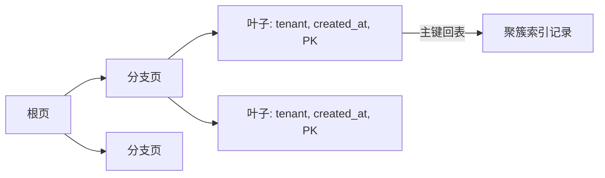

# 索引、EXPLAIN 与慢查询

索引是数据库为特定访问路径维护的有序查找结构，`EXPLAIN` 是查看优化器选择了哪条路径的诊断命令；慢查询是实际耗时或资源超过目标的请求。三者位于 SQL 与存储引擎之间，索引改变可用路径，`EXPLAIN` 解释选择，慢查询日志提供真实运行证据。

`SELECT * FROM projects WHERE tenant_id=? ORDER BY created_at DESC LIMIT 20` 在一千行数据上只要几毫秒，上线后却扫描数百万行。SQL 文本没有改变，数据分布和可用索引改变了执行成本。索引优化必须从访问路径和真实执行计划开始。

## InnoDB 索引是一棵有序 B+Tree

InnoDB 主键索引的叶子页保存完整记录，因此叫聚簇索引。二级索引叶子页保存二级键和主键值，查到后可能再次沿主键取整行，也就是回表。

B+Tree 有序排列键，适合等值、前缀范围和排序。索引不是“让任何查询变快”的副本；每增加一个索引都会占空间，并让 INSERT、UPDATE、DELETE 同步维护更多树。



复合二级索引中包含主键值。若 SELECT 的列已全部存在于索引叶子，就可能直接返回而不回表。
## 复合索引顺序来自筛选与排序

列表先按租户等值过滤，再按创建时间和 ID 倒序，索引可设计为 `(tenant_id, created_at DESC, id DESC)`。它既缩小租户范围，又提供稳定排序。只建 `tenant_id` 与 `created_at` 两个单列索引，通常不能同时高效完成筛选与排序。

“最左前缀”不是口诀终点。遇到范围条件后，后续列是否还能用于过滤、排序要看具体计划；函数包裹、隐式类型转换和排序规则不一致也可能让索引失效。

在接近真实数据量和分布的隔离库运行。先保存未建索引的计划，再建索引重跑；不要只比较耗时，还要比较实际行数、循环次数和是否排序。

```sql
CREATE INDEX idx_projects_tenant_created_id
  ON projects (tenant_id, created_at DESC, id DESC);

EXPLAIN ANALYZE
SELECT id, name, created_at
FROM projects
WHERE tenant_id = :tenant_id
ORDER BY created_at DESC, id DESC
LIMIT 20;
```

`EXPLAIN ANALYZE` 会实际执行查询，并显示估算与实测。写查询或高成本查询要在隔离环境使用，避免分析本身产生副作用或压力。
## 慢 SQL 先分清扫描、排序、锁等待和连接等待

应用看到的数据库耗时可能包含连接池排队、网络、锁等待与执行。慢查询日志主要记录进入 MySQL 后的查询表现，无法单独解释池等待。需要把 requestId、数据库会话、SQL 摘要和 Trace 时间线对应起来。

执行计划中的估算偏差很大时，检查统计信息和数据倾斜；扫描行少但仍慢时，检查回表、临时表、排序、锁与返回数据量。先定位成本组成，再决定改 SQL、索引或访问方式。

| 证据 | 可能问题 | 下一步 |
| --- | --- | --- |
| 实际扫描行远大于返回行 | 缺索引或选择性差 | 重设复合索引或改查询入口 |
| 出现 filesort | 索引顺序不能提供排序 | 确认筛选、方向和 LIMIT |
| 估算与实测差距大 | 统计信息或数据倾斜 | 更新统计并检查直方图 |
| SQL 快但接口慢 | 连接池、网络或序列化 | 拆分请求时间账本 |
## 索引上线也需要回滚依据

大表建索引会消耗 IO、CPU 和空间，可能影响复制延迟。上线前估算表大小、写入频率和临时空间，在候选环境用相近数据验证；上线后观察写延迟、磁盘、查询计划与复制。

删除旧索引前先确认没有其他查询依赖。MySQL 的 invisible index 可用于观察隐藏索引后的计划，但仍要理解版本和优化器行为，不能把它当成完整生产证明。
## 索引诊断中的难点

**选择性低的列一定不能建索引吗？**

不一定。单独的布尔状态选择性低，但放在租户、时间等复合索引中可能服务稳定列表。最终看查询占比、数据分布和执行计划。

**为什么 `SELECT *` 更容易拖慢索引查询？**

需要的列可能不在二级索引中，每个命中都要按主键回表，且网络与序列化数据更多。列表只选择展示字段，可能形成覆盖索引，也降低响应体成本。

**索引越多为什么写入越慢？**

每次修改都要维护相关索引页，并写 redo/undo。索引还占用 Buffer Pool，降低真正热点页的命中率。索引应对应稳定高价值访问模式。

**慢查询日志里没有那条慢请求怎么办？**

请求可能慢在取连接、DNS、网络或锁等待阈值配置之外，也可能 SQL 被 ORM 拆成多次短查询。用 Trace 和池指标先拆阶段，再与 MySQL performance_schema 对齐。
