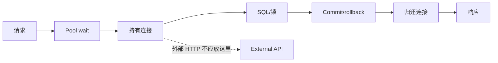

# MySQL 查询、连接与事务性能

一次请求耗时 900 ms：连接池等待 500 ms，SQL 执行 40 ms，锁等待 300 ms，序列化与网络 60 ms。把“数据库耗时”看成一个数字会先优化错地方；性能诊断要把请求的每段等待和持有资源时间写成账本。

## 查询端到端时间的阶段拆分

入口记录总 deadline 和 requestId，Trace 分出 pool.acquire、db.query、db.lock/execute、serialize。驱动通常只给 query 总时间，锁等待可从 performance_schema 和事务视图补充。

阶段要避免重复计时：SQL span 包含网络和服务器执行，不能再把它与相同区间相加。CPU Profile 与墙钟时间也不同，等待 IO 时 CPU 可能很低。

这是请求时间账本示例，数字仅表示拆分方式。真正数据来自同一次 Trace 与数据库会话。

```text
HTTP total                 900 ms
  auth/cache                 20 ms
  pool acquire              500 ms
  MySQL query               340 ms
    lock wait               300 ms
    execute                  40 ms
  serialize + network        40 ms
```

优化 SQL 执行从 40 降到 10 ms 只能节省 30 ms。更大收益来自缩短事务锁和连接占用，且能释放容量给其他请求。
## 查询计划与锁等待分别诊断

慢查询先保存 SQL 摘要、绑定参数范围、返回行数与 `EXPLAIN ANALYZE`；确认扫描、回表、排序和估算偏差。执行计划正常但耗时波动，检查锁等待、IO 和 Buffer Pool。

锁由事务持有，优化单条 SELECT 不能释放另一个长事务。查等待者与阻塞者的事务开始时间、SQL 和业务 requestId；修复外部调用夹在事务、批量更新顺序和缺索引。

| 表现 | 高价值证据 | 处理 |
| --- | --- | --- |
| 扫描多返回少 | actual rows/loops | 复合索引或改访问模式 |
| 计划快但偶发慢 | 锁等待/IO/缓存 | 定位阻塞事务 |
| 池等待高 | active/idle/waiters | 缩短持有或修泄漏 |
| 连接建立慢 | DNS/TLS/auth | 复用与网络检查 |
| 返回大量行 | bytes/serialize | 分页与字段裁剪 |
## 连接与事务长度共同决定并发容量

每请求连接持有时间越长，同一个池每秒能服务的请求越少。事务内等待消息、HTTP 或用户输入，会同时占连接和锁。先完成外部准备，再开启短事务提交；提交后才做可异步副作用。

API 与 Worker 分配独立池预算，避免批处理吃光在线连接。扩大池前检查 MySQL 总连接和 CPU；若数据库已饱和，扩大只会把排队从应用推到数据库。



连接应在最小数据库工作结束后归还。响应序列化通常不需要继续占用数据库连接。
## 优化用同一负载做前后对照

固定数据快照、查询参数分布、缓存状态、并发和版本，记录 P50/P95/P99、扫描行、池等待与资源。只看单次终端耗时容易受缓存和后台负载影响。

索引、池或事务改动均有副作用：写放大、连接内存、隔离语义。候选小流量观察并保留回滚；索引删除前先确认没有其他查询依赖。

慢日志记录数据库执行时间，应用 Trace 还要记录 pool checkout、网络往返和结果映射。两者用 requestId 或 trace 关联后，才能判断 800 ms 是 30 ms SQL 加 700 ms 等连接，还是数据库内部真正执行了 800 ms。
## 连接池与查询扩展边界

**慢查询是否都应该加缓存？**

缓存可能隐藏错误查询并引入一致性。先减少扫描和返回量；只有重复读取、可接受陈旧且命中可预测的数据才适合缓存。

**为什么连接池等待会突然非线性上升？**

当到达率接近服务能力，少量延迟增长让连接持有更久，排队进一步增长。设置获取超时和背压，在饱和前拒绝而非无限排队。

**读副本能解决所有查询压力吗？**

它分担读流量，但有复制延迟、路由和一致性问题，锁/写热点仍在主库。读后写场景可能读不到刚提交数据，需要主库粘性或版本等待。

**如何判断 ORM 是性能根因？**

记录 SQL 数量、参数化摘要和返回行数。N+1、过度加载或长 Session 才是具体问题；“用了 ORM”本身不是可操作诊断。
