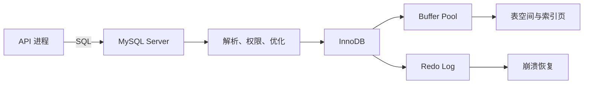

# 数据库是什么：关系、表、记录与持久化

API 把项目存在进程内的数组里，创建和查询都正常。重启进程后，数组重新变成空值。这不是代码偶发丢数据，而是内存的生命周期本来就只到进程退出。数据库把需要长期保存的事实交给独立进程和持久化存储，并在多个请求同时读写时提供统一裁决。

## 数据库不只是硬盘上的 JSON

数据库管理系统接收 SQL，负责解析语句、检查权限、选择执行计划、读取 Buffer Pool、修改内存页并记录日志。MySQL 是数据库管理系统；InnoDB 是 MySQL 8.4 默认的事务存储引擎。表结构、索引、事务和恢复能力由这两层共同提供。

一次 `INSERT` 返回成功，不等于每个数据页已经立刻写回表空间。InnoDB 会先修改内存中的页，并通过 redo log 保证崩溃恢复。事务提交后，即使服务器突然重启，也能用日志把已提交修改重放出来。**持久化承诺来自提交协议与恢复日志，不是来自“执行过一条 SQL”这件事。**



Buffer Pool 提高读写效率，redo log 负责恢复已提交修改。两者作用不同：缓存页可以丢，提交事实不能丢。

## 表保存一种事实，关系连接多种事实

关系表由列定义记录形状，由行保存一条事实。`tenants` 的一行表示一个租户；`projects` 的一行表示一个项目。项目引用租户，表达“项目属于租户”，而不是把租户名称复制到每条项目记录。

拆表不是为了追求数量。判断依据是事实是否拥有独立身份和生命周期：租户改名不应该更新所有项目；删除租户前应由外键检查仍存在的项目；项目查询则可以通过连接取得当前租户名称。

先观察这两张表分别保存什么事实，再看两个约束解决什么问题。示例使用 `BINARY(16)` 保存 UUID 的 16 个字节；应用层需负责字符串 UUID 与二进制之间转换。

```sql
CREATE TABLE tenants (
  id BINARY(16) PRIMARY KEY,
  name VARCHAR(120) NOT NULL,
  created_at DATETIME(6) NOT NULL DEFAULT CURRENT_TIMESTAMP(6)
);

CREATE TABLE projects (
  id BINARY(16) PRIMARY KEY,
  tenant_id BINARY(16) NOT NULL,
  name VARCHAR(120) NOT NULL,
  version INT UNSIGNED NOT NULL DEFAULT 1,
  created_at DATETIME(6) NOT NULL DEFAULT CURRENT_TIMESTAMP(6),
  CONSTRAINT fk_projects_tenant
    FOREIGN KEY (tenant_id) REFERENCES tenants(id),
  CONSTRAINT uq_projects_tenant_name UNIQUE (tenant_id, name)
);
```

`fk_projects_tenant` 拒绝不存在的租户，复合唯一约束只禁止同一租户内重名。两个租户仍可各自拥有名为 `website` 的项目。

## 从访问问题反推第一版模型

建表前先写出系统必须回答的问题：列出某租户最近的项目、根据 ID 更新一个项目、删除租户时阻止遗留项目。问题决定关系和索引。若只从 TypeScript 对象照抄字段，很容易把权限范围、唯一性和生命周期留给业务代码碰运气。

第一版模型不需要预测所有未来字段，但要明确主键、所属关系、时间语义和删除策略。生产系统通常统一使用 UTC 时间；软删除会影响唯一约束和所有查询，只有确实需要恢复或审计时才引入。

| 要回答的问题 | 模型决定 | 错误设计的后果 |
| --- | --- | --- |
| 项目属于谁 | `projects.tenant_id` 外键 | 只在接口参数中传租户，容易越权 |
| 租户内能否重名 | `UNIQUE (tenant_id, name)` | 先查后写会被并发穿透 |
| 怎样检测并发覆盖 | `version` 乐观版本 | 最后提交者静默覆盖他人修改 |
| 时间如何比较 | UTC `DATETIME(6)` | 服务器时区变化导致排序和审计混乱 |

业务规则若能由数据库约束精确表达，应让数据库做最终裁决。应用仍要提前校验并把约束错误翻译成稳定 API 错误。

## 读写失败时先区分哪一层没有承诺

连接失败说明 SQL 尚未到达 MySQL；语法错误说明解析阶段拒绝；约束错误说明执行到了数据规则；提交时断线则可能进入“结果未知”：事务可能已经提交，只是响应没送回。最后一种情况不能盲目重复写入，需要幂等键或按业务 ID 查询原结果。

数据库不是唯一副本策略。磁盘损坏、误删除和错误迁移仍需要备份、复制与恢复演练。持久化解决进程重启，备份解决数据被破坏后回到某个时间点，两者不能互相替代。

## 把模型继续推下去

### 为什么不把整个对象序列化进一个 JSON 列？

JSON 适合结构变化快且不参与关键约束的附加属性。租户归属、唯一名称和版本号需要索引、外键或条件更新，拆成明确列更容易让数据库验证。把所有字段塞进 JSON 会把关系、类型和查询成本重新推回应用。

### 数据库提交成功后，缓存为什么仍可能是旧值？

MySQL 与 Redis 是两个独立系统。数据库提交只承诺 MySQL 中的事实已改变，不会自动删除 Redis 键。应用需要在提交后失效缓存，或通过 Outbox 异步传播变更，并接受短暂不一致的处理策略。

### 外键会不会让系统变慢，所以企业都不用？

外键检查需要索引和锁，但它也阻止孤儿数据。是否使用取决于写入规模、跨库拆分和运维方式，不能用一句“慢”概括。单库企业后台通常能从外键得到明确收益；跨服务数据库则要用服务逻辑、事件和对账替代。

### 表拆得越细，设计就越规范吗？

不是。规范化用于消除重复事实和更新异常，不是追求表数量。把生命周期一致、没有独立身份的小值对象拆成多表，会增加 JOIN 和事务复杂度；把用户、角色这类独立事实塞进一列，又会失去约束和查询能力。拆分前要写出更新规则、基数和访问路径。
