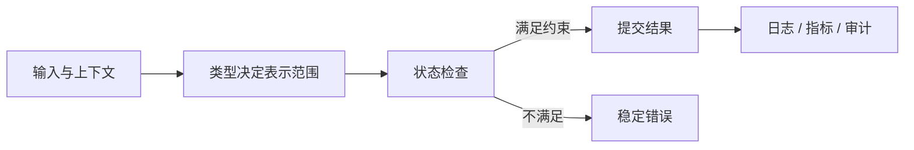

# MySQL 类型、约束、主键与索引键

`INSERT` 因 `Duplicate entry` 被拒绝，这不是数据库“坏了”，而是唯一约束在两个并发请求之间守住了不变量。字段类型和约束决定哪些状态根本不能进入数据库。

## 类型决定表示范围

类型决定表示范围不能只靠术语记忆。先确定输入来自谁、状态由谁拥有、一次操作改变了哪些记录，再看输出如何被下一层使用。**状态所有者一旦含糊，重试和故障恢复就会出现重复或丢失。**



图中失败分支不会假装成空成功。MySQL的调用方应根据稳定错误码决定停止、重试或重新读取状态。

## 约束在提交点裁决

约束在提交点裁决要放回请求时间线：开始时读到什么，中间获得什么锁、连接或租约，成功时提交什么，失败时又能否回到原状态。这样才能判断超时后是安全重试、查询原结果，还是进入人工对账。

下面的片段抓住 MySQL 中最容易出错的一条执行路径。先观察输入条件和状态标识，再看副作用在什么位置发生。

```sql
CREATE TABLE projects (
 id BINARY(16) PRIMARY KEY,
 tenant_id BINARY(16) NOT NULL,
 name VARCHAR(120) NOT NULL,
 version BIGINT UNSIGNED NOT NULL DEFAULT 1,
 created_at DATETIME(6) NOT NULL,
 UNIQUE KEY uq_project_name (tenant_id, name),
 CHECK (CHAR_LENGTH(name) >= 2)
);
```

片段之后要核对实际输出或影响行数。只看到函数没有抛错还不够；还要确认状态版本、提交结果和下游可见性与预期一致。

## 主键、业务键和复合索引

主键、业务键和复合索引最终要落实到可观察证据。MySQL的配置、日志或执行结果需要携带稳定标识，例如 requestId、资源版本、任务 ID 或制品摘要，避免只凭“看起来正常”判断系统。

| 阶段 | 应保存的事实 | 失败后的动作 |
| --- | --- | --- |
| 接收输入 | 身份、范围、版本、requestId | 拒绝无效或越界输入 |
| 执行中 | 锁、连接、租约或任务 attempt | 超时后取消或等待恢复 |
| 提交结果 | 影响行数、状态版本、事件 ID | 冲突则重新读取，不覆盖新状态 |
| 交付输出 | 状态码、结构化日志和指标 | 根据稳定错误码处理 |

这张表的重点是可恢复性：每次状态变化都要能回答“现在由谁负责，下一步允许什么”。

## 主键、业务键和复合索引出现异常时怎样定位

| 现象 | 先确认 | 处理顺序 |
| --- | --- | --- |
| 调用超时或无响应 | 确认请求是否到达当前组件，以及是否已产生副作用。 | 先查 requestId 和状态记录，再决定取消或重试 |
| 返回成功但状态不对 | 比较提交影响行数、版本号和后续读取。 | 绕过缓存读取真相，再检查序列化和失效 |
| 重试后出现重复 | 检查幂等键、唯一约束或消息 ID 是否覆盖副作用。 | 停止自动重试，查询原结果并修复去重边界 |

先固定版本、输入、时间窗口和资源状态，再沿 MySQL 的状态记录找到等待发生在哪一步。只有确认瓶颈后，才改变超时、池大小或副本数，并记录改变后的新证据。

## 约束在提交点裁决之后还要追问

### 类型决定表示范围为什么不能只放在调用方处理？

调用方可以改善交互，但无法控制并发请求、绕过客户端的调用和进程故障。约束必须由拥有业务状态的一层执行，并由数据库约束、消息确认或运行时所有权提供最终裁决。

### 约束在提交点裁决遇到超时后，什么时候可以重试？

超时只说明调用方没有及时拿到结果，不能证明服务端没有提交。读请求通常可以重试；写请求需要幂等键、版本条件或可查询的任务 ID，否则重试可能产生第二次副作用。

### 怎样用失败路径证明 MySQL 真的被理解了？

用一条正常路径和至少两条失败路径做对照，记录输入、状态变化、原始输出和恢复动作。测试应覆盖并发、重复、取消或依赖不可用，而不只是单次 200。

### 主键、业务键和复合索引与前一层的责任怎样交接？

交接内容写入契约：输入带身份、范围和版本，输出带结果、状态码和可追踪 ID。主键、业务键和复合索引只处理自己拥有的状态。
