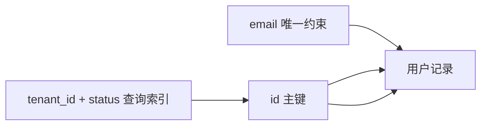

# MySQL 类型、约束、主键与索引键

下面四条写入不会得到相同结果：空名称触发 `NOT NULL`，重复邮箱触发 `UNIQUE`，不存在的租户触发外键，超出字段范围则触发类型错误。数据库类型和约束不是文档注释，它们在每一次写入时参与裁决。

## 类型先回答“能表示什么”

`VARCHAR(120)` 同时限制最大长度和参与字符集排序；`DECIMAL(12,2)` 精确保存金额，而浮点数适合允许近似误差的计算；`DATETIME(6)` 保存日期时间值，不随连接时区转换。选型时先写值域、精度、比较方式和空值含义。

`NULL` 表示未知或不适用，不等于空字符串、0 或 false。把可空字段带入唯一约束、聚合和比较时要特别检查 SQL 三值逻辑，例如 `deleted_at = NULL` 永远得不到 true，应该使用 `IS NULL`。

| 业务值 | 推荐类型 | 需要确认 |
| --- | --- | --- |
| 数量 | `INT UNSIGNED` | 是否允许负数、最大范围 |
| 金额 | `DECIMAL(p,s)` | 币种与最小单位 |
| 短文本 | `VARCHAR(n)` | 字符集、排序规则、索引长度 |
| UTC 时间 | `DATETIME(6)` | 输入输出都明确按 UTC |
| UUID | `BINARY(16)` 或 `CHAR(36)` | 可读性与索引空间权衡 |

## 约束把竞态变成一个确定结果

两个请求都先执行“邮箱是否存在”，都可能读到不存在。随后同时插入时，只有唯一约束能在数据库内部把其中一个拒绝。应用的预检查用于给出更早反馈，数据库约束才是并发下的最终防线。

约束名应稳定且可识别。错误适配层把 `uq_users_tenant_email` 转成 `email_already_exists`，响应中不暴露原始 SQL 和表名；日志保留数据库错误、requestId 与约束名。

在隔离库连续执行两次相同租户和邮箱的 `INSERT`。观察目标不是背错误编号，而是确认第二次写入没有产生第二条记录。

```sql
CREATE TABLE users (
  id BINARY(16) PRIMARY KEY,
  tenant_id BINARY(16) NOT NULL,
  email VARCHAR(254) NOT NULL,
  status VARCHAR(16) NOT NULL,
  created_at DATETIME(6) NOT NULL DEFAULT CURRENT_TIMESTAMP(6),
  CONSTRAINT uq_users_tenant_email UNIQUE (tenant_id, email),
  CONSTRAINT ck_users_status CHECK (status IN ('active', 'disabled'))
);

INSERT INTO users (id, tenant_id, email, status)
VALUES (UUID_TO_BIN(UUID()), @tenant, 'a@example.test', 'active');
```

第二次插入应由复合唯一约束拒绝。换一个租户 ID 后则允许同一邮箱，因为这里定义的是“租户内唯一”，不是全局唯一。

## 主键、业务键和索引键职责不同

主键稳定标识一行，业务键表达领域唯一性，索引键服务查询。邮箱可以改变，不适合作为所有关联表的主键；随机 UUID 适合跨服务生成身份，但作为 InnoDB 聚簇主键会增加二级索引空间和页分裂，需要结合写入模式评估。

InnoDB 的二级索引叶子节点保存主键值。因此主键越宽，每个二级索引越大。企业后台用 `BINARY(16)` 保存 UUID 能减少字符形式的空间，但调试和迁移工具必须统一转换方式。



查询索引命中后可能还要按主键回表。若查询只需要索引中已有列，则可能形成覆盖索引，减少回表。

## 约束失败不是 500

可预期约束错误应该进入业务错误映射：重复资源通常返回 409，字段形状问题返回 422，不存在的关联资源可返回 404。数据库连接断开、磁盘错误或未知错误才进入 500。

不要通过解析整段英文错误消息判断约束。优先读取驱动提供的错误码、SQLSTATE 和约束名，并为不同 MySQL 版本和驱动写集成测试。

## 容易继续混淆的地方

### 为什么手机号不能直接用整数？

手机号是标识字符串，不参与算术，可能包含国家码、前导零和格式符。用字符串保存，规范化后的值另建唯一索引，展示格式则由应用处理。

### CHECK 与应用校验重复吗？

两者面对不同入口。应用校验给当前 API 更友好的错误；CHECK 阻止后台脚本、旧版本服务或其他写入路径破坏不变量。关键状态集合适合两层都校验。

### UUID 为什么还要讨论版本和排序？

完全随机值会让聚簇索引插入位置分散。时间有序 UUID 可改善局部性，但也可能暴露时间信息。需要根据数据库写入压力、分布式生成和隐私要求选择，不能只看“是否全局唯一”。

### 删除父记录时应该 CASCADE 吗？

只有子记录确实随父记录一起失去意义时才级联。订单、审计等历史事实通常不应因用户删除而消失。先明确生命周期和合规要求，再选择 RESTRICT、CASCADE 或软删除。
