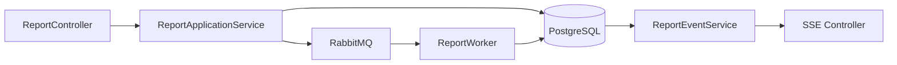

# NestJS 实时通信、测试、日志与部署

前三章已经完成资源接口、权限查询和 RabbitMQ Worker。本章补上用户能看到的任务进度，并把服务放进可测试、可观测、可发布的边界。

贯穿场景是报告任务：`POST /reports` 返回任务 ID，Worker 异步执行，客户端通过 SSE 接收事件。页面刷新或网络中断后，从最后事件序号恢复。

## 模块关系



Controller 不直接订阅 RabbitMQ。Worker 把状态和事件持久化，SSE 服务读取数据库事件；Broker 只负责派发任务。这样客户端断线不会丢掉业务状态。

## 第一步：定义稳定事件契约

事件不是随意的日志文字。客户端需要稳定类型和序号：

```ts
type ReportEvent = {
  id: number
  reportId: string
  type: 'started' | 'progress' | 'completed' | 'failed'
  occurredAt: string
  data: Record<string, unknown>
}
```

`id` 在单个报告内递增；`type` 是客户端状态机；`data` 根据类型另做 Schema 校验。错误事件只放公开错误码，不返回堆栈和连接信息。

数据库事务同时更新任务状态并追加事件。若状态提交成功、事件失败，页面可能永远停在旧状态；把二者放在同一事务能保持业务视图一致。

## 第二步：在 NestJS 输出 SSE

NestJS 的 `@Sse()` 返回 Observable。Observable 只是适配协议，历史重放和权限仍在应用服务中。

```ts
@Sse(':reportId/events')
stream(
  @Param('reportId') reportId: string,
  @Headers('last-event-id') cursor: string | undefined,
  @CurrentActor() actor: Actor,
): Observable<MessageEvent> {
  return this.events.subscribe({
    reportId,
    after: parseCursor(cursor),
    actor,
  })
}
```

Controller 解析路径和 Header，传入可信身份。`subscribe` 先检查数据范围，补发 `after` 之后的事件，再等待新通知。每次通知到达后按数据库游标读取，而不是把 Pub/Sub Payload 当成真相。

`MessageEvent` 映射 `id`、`type` 和 JSON `data`。Observable teardown 中解除订阅并传播客户端断开，避免连接关闭后仍保留监听器。

## 第三步：处理慢连接和代理

服务端为每个连接设置发送队列上限。进度事件可以合并成最新值，终态和引用事件不能丢。超过上限时关闭连接，客户端按事件 ID 重连。

Nginx 代理 SSE 需要关闭响应缓冲，并给长连接合适读超时：

```nginx
location /api/reports/ {
    proxy_pass http://node_app;
    proxy_http_version 1.1;
    proxy_buffering off;
    proxy_read_timeout 300s;
}
```

配置的输入是 SSE 路径、上游服务和代理超时，处理顺序是关闭缓冲、保持 HTTP/1.1 长连接、把请求转给 `node_app`，并在 300 秒无数据时断开。应用定期发送注释心跳，代理和负载均衡的超时仍要显式配置。心跳不是业务事件，不进入数据库序列；客户端断线后应根据最后事件 ID 重放，而不是把心跳当成进度。

## 第四步：建立四层测试

### 应用服务单元测试

使用 Fake Repository 和 Event Store，断言创建、状态迁移、权限和幂等。不启动 Nest Application，反馈最快。

### 数据库集成测试

连接隔离 PostgreSQL，验证唯一约束、事务、事件序号、ACL SQL 和并发 Worker。每个用例回滚或清理自己的数据。

### Nest 协议测试

使用 TestingModule 启动应用，发送真实 HTTP，验证 Guard、Pipe、Exception Filter 和响应 Schema。不要 Mock 掉所有框架层，否则看不到装配错误。

### 浏览器/端到端测试

创建任务、打开 SSE、记录游标、断线重连，确认事件不重复且到达唯一终态。只保留少量关键 E2E，把边界组合放在更快测试中。

## 第五步：结构化日志和 Trace

日志字段固定：

```text
timestamp level service version request_id trace_id
actor_scope operation report_id attempt event_id duration_ms error_code
```

不要记录 Access Token、Cookie、报告正文和完整用户输入。错误堆栈只进入受控内部日志，公共响应使用 `requestId`。

OpenTelemetry 在 HTTP 入口创建 Span，传播到 PostgreSQL、Redis、RabbitMQ 和 Worker。异步消息携带 Trace Context，但 Worker 仍创建自己的 Consumer Span。Trace 用于单次链路，Metric 用于总体分布，日志用于离散事件，三者通过稳定 ID 关联。

## 第六步：健康检查分层

- **Liveness**：进程事件循环仍能响应，不调用数据库和远端模型；
- **Readiness**：服务具备接流量的必要依赖，例如数据库可获得连接；
- **Startup**：启动迁移或预热较慢时单独判断。

把所有依赖都放进 liveness 会在数据库抖动时触发应用重启风暴。Readiness 失败可以从负载均衡摘除，Liveness 只处理进程本身不可恢复状态。

## 第七步：容器启动和优雅停止

Node 进程接收 SIGTERM 后：

1. Readiness 变为失败，停止接新请求；
2. 关闭 HTTP Listener；
3. 停止消费新消息；
4. 等待有限时间完成在途请求和事件提交；
5. 关闭数据库、Redis、Broker 与 Trace Exporter；
6. 超时后退出，让未 ACK 消息重投。

容器中 Node 应成为 PID 1 或使用能正确转发信号的 init。Docker/Kubernetes 的 termination grace period 大于应用排空时间。

## 发布时验证什么

候选容器使用与正式相同制品和配置形状，但不抢占正式队列。先验证：

- liveness/readiness；
- 数据库兼容；
- 创建和查询任务；
- SSE 正常、断线重放；
- 无权限订阅；
- RabbitMQ 派发与幂等消费；
- Trace 与日志；
- SIGTERM 排空。

数据库迁移采用 expand/contract：先增加兼容字段，新旧代码都能运行；切流稳定后再清理旧字段。候选失败只删除候选，不停止数据库、Redis 或旧应用。

## Node 服务交付清单

```text
接口与事件契约已版本化：
单元/数据库/协议/E2E 测试：
幂等、ACL、事务和死信：
SSE 游标与代理配置：
日志脱敏和 Trace 传播：
Liveness/Readiness：
SIGTERM 排空：
迁移兼容窗口：
候选验证：
切流和回滚指针：
```

清单的输入是同一个候选制品及其配置，输出是“可以切流”或“保留旧版本”的明确判断。检查项不能只勾选名称，还要附上测试命令、状态码、Trace 或日志证据。Node 项目线到这里形成一条完整路径。下一章进入 Python/FastAPI，重点比较 Pydantic、依赖注入、AsyncSession 和 Worker 复用方式。
