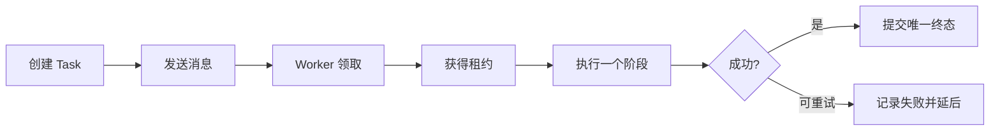

# Node 队列、幂等与重试

用户点击“生成报告”，网络超时后又点了一次。API 可能收到两个请求；消息队列也可能因为 Worker 在完成后、确认前崩溃而再次投递同一消息。如果两次执行都收费或覆盖文件，队列虽然“没有丢消息”，业务结果却错了。

本篇从这个重复请求出发，建立一条可查询的任务生命周期。我们会区分任务事实、消息投递和执行尝试，再用幂等键、租约和有限重试保证重复交付不会制造重复结果。

## 先分清三个对象

- **Task**：用户要完成的业务工作，有稳定 ID 和终态。
- **Message**：通知 Worker 有任务可做的传输载体，可能重复。
- **Attempt**：某个 Worker 的一次执行，失败后可以有下一次。

常见队列提供的是至少一次投递：消息最终会再次出现，因此消费者要接受重复。Broker 的 ACK 单独无法实现“恰好一次”；数据库提交、对象存储写入和外部请求都有各自的不确定窗口。



## 步骤一：用幂等键创建任务

幂等的意思是同一个业务意图重复提交，得到同一个业务结果。客户端生成请求键，服务端把它与主体、动作和关键参数摘要一起保存，并建立唯一约束。相同键但参数不同应返回冲突，不能误复用旧结果。

输入是用户、幂等键和任务参数，输出是已存在或新建的 Task。下面的最小示例假定数据库支持事务和唯一约束；它根据通用任务行为重写，没有依赖特定队列库。

```ts
async function createTask(input: CreateTask, actor: Actor) {
  return db.transaction(async (tx) => {
    const existing = await tx.tasks.findByKey(actor.id, input.key)
    if (existing) {
      if (existing.inputHash !== stableHash(input.payload)) {
        throw new ConflictError('IDEMPOTENCY_KEY_REUSED')
      }
      return existing
    }

    return tx.tasks.insert({
      ownerId: actor.id,
      idempotencyKey: input.key,
      inputHash: stableHash(input.payload),
      state: 'accepted'
    })
  })
}
```

数据库唯一约束负责处理两个并发请求同时“没查到”的竞态。业务返回稳定 Task ID，客户端之后查询同一任务，不需要猜第二次请求是否又创建了一份工作。

## 步骤二：任务事实和消息分开

API 创建 Task 后再向队列发送消息，中间存在崩溃窗口：数据库已提交，但消息还没发出。可靠性要求高时，可以在同一事务写入 Outbox 记录，由独立发布器把它发送到 Broker；发布器即使重复发送，Worker 仍按 Task ID 去重。

并非所有系统都已经使用 Transactional Outbox。若当前采用“提交后直接派发”，就要明确记录派发失败，并由扫描任务补发，文章也应明确它尚未具备原子投递。两种方案的差异在于失败窗口是否有持久的待发布事实。

消息只携带 `taskId`、Schema 版本和必要路由信息。大段正文、访问令牌和 ORM 对象留在持久存储中，由 Worker 重新按权限读取。

## 步骤三：Worker 用租约取得执行权

两个 Worker 可能同时收到同一消息。领取任务时使用条件更新：只有待执行、租约已过期或由同一拥有者续约的记录才能被取得。租约包含随机 fencing token；旧 Worker 即使在网络恢复后继续运行，也无法覆盖新 Worker 的结果。

每个有副作用的阶段还需要自己的唯一业务键。例如写文件使用 `taskId + artifactVersion`，扣费使用稳定交易号，调用支持幂等的外部 API 时传递同一键。只在入口去重，无法防止 Worker 中途重放某个阶段。

## 步骤四：只重试暂时性失败

超时、连接重置、明确的 429 或 503 可能适合重试；参数错误、权限拒绝、Schema 不兼容和确定性的业务冲突通常不适合。重试采用指数退避和抖动，并同时限制次数、总截止时间和累计成本。

死信队列不是错误垃圾桶。它应保留消息引用、失败分类、版本与最后一次上下文，并通过受控流程重放。新 Worker 无法理解旧 Schema 时，要迁移消息或保留兼容消费者，不能忽略未知字段继续执行。

取消同样是业务协议。删除尚未领取的 Broker 消息不代表已经运行的代码停止。API 先写入 `cancel_requested_at`，Worker 在阶段边界检查，再提交 `cancelled`；若完成先发生，取消请求只能得到“已经完成”。

## 正常结果和失败结果

| 场景 | 应观察到的结果 |
| --- | --- |
| 相同键重复提交 | 返回同一 Task ID，只创建一条任务 |
| 相同键但参数变化 | 409，不复用旧任务 |
| 消息重复投递 | 可以有多个 Attempt，业务结果只有一份 |
| Worker 写结果后、ACK 前崩溃 | 新 Attempt 复用或校验已有结果 |
| 旧 Worker 在租约接管后恢复 | fencing token 失效，不能提交 |
| 下游持续 503 | 到 Deadline 后进入失败终态 |
| 取消与完成竞争 | 条件更新只允许一个终态 |

故障测试要检查数据库行、制品数量、外部调用次数和事件序列。只断言函数抛错，证明不了副作用没有重复。容量观测还应包含队列等待时间、最老任务年龄、到达率、完成率和按原因分类的重试放大率。

## 哪些问题队列本身不会解决

队列负责缓冲和交付，不自动提供业务幂等、事务、撤销、顺序或最终状态。顺序通常只需要在同一资源键内保持；全局单消费者会让慢任务阻塞所有工作。下一篇转向实时通信，学习任务状态怎样通过 SSE 送到浏览器，并在断线后补回缺失事件。

## 跑一次“至少一次投递”实验

客户端用幂等键创建导出任务，API 在数据库提交任务后把任务 ID 投递到队列。Worker 完成处理却在 ACK 前中断，消息会再次到达。第二个 Worker 获取任务时先读取业务状态和 owner lease：已经完成就直接确认消息，仍可执行才取得有限时间租约。

| 事实 | 应由谁保存 |
| --- | --- |
| 用户只想创建一次导出 | 数据库幂等记录 |
| 消息可能重复送达 | 队列语义 |
| 哪个 Worker 当前有权执行 | 任务租约 |
| 每次尝试的错误与时间 | Attempt 记录 |
| 用户看到的最终状态 | 业务 Task |

重试只针对暂时性错误，例如依赖限流、连接中断和明确可恢复超时；参数无效、无权限和业务冲突直接进入可解释终态。退避要有上限并加入抖动，避免依赖恢复时所有任务同时重试。外部副作用使用业务幂等键或结果查询，不能靠队列“不重复”假设。

练习时让 Worker 在副作用完成后、状态提交前崩溃。观察第二次执行能否查询到原结果并安全收敛。然后让两个 Worker 同时竞争租约，旧所有者到期后迟到提交应被拒绝。队列负责交付机会，业务数据库负责最终事实。

## 参考资料

- [BullMQ Idempotent Jobs](https://docs.bullmq.io/patterns/idempotent-jobs)
- [RabbitMQ Consumer Acknowledgements](https://www.rabbitmq.com/docs/confirms)
- [PostgreSQL SKIP LOCKED](https://www.postgresql.org/docs/current/sql-select.html#SQL-FOR-UPDATE-SHARE)
- [Transactional Outbox](https://microservices.io/patterns/data/transactional-outbox.html)
