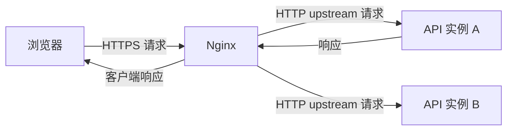

# Nginx 反向代理、TLS 终止与请求路由

浏览器收到 `502 Bad Gateway`，API 日志却没有这次请求。502 说明 Nginx 作为网关没有从 upstream 得到可用响应，问题可能是地址、端口、连接、协议或上游提前退出；它和应用已经返回的 500 不是一层错误。

## 安装 Nginx 并先验证配置

Nginx 的官方安装入口是[下载页](https://nginx.org/en/download.html)。macOS 可以用 Homebrew，Linux 服务器应按发行版和官方包源安装；下载后先查看版本和最终配置，再启动代理。

<figure class="doc-shot">
  
  <figcaption>Nginx 官方下载页。稳定版和主线版的变更节奏不同，生产环境应锁定版本并在变更前保留配置回滚点。</figcaption>
</figure>

```bash
brew install nginx
nginx -v
nginx -t
```

`nginx -v` 只显示二进制版本，`nginx -t` 才会解析配置和证书路径。测试通过后再 reload；若机器没有 Homebrew，使用发行版包管理器安装，不要把 macOS 命令直接复制到 Linux 服务器。

## 反向代理同时建立两条连接

客户端与 Nginx 建立一条 HTTP/TLS 连接，Nginx 再与应用建立另一条 upstream 连接。TLS 可以在入口终止，应用只监听内网 HTTP；也可以继续加密到上游。两条连接拥有各自的连接超时、读写超时和日志。

Nginx 根据 server_name、location 与 proxy_pass 选择目标。`location /api/` 搭配带或不带尾斜杠的 proxy_pass 会影响 URI 替换，路径错配常表现为 upstream 404，而不是 502。



排障时分别证明“请求到 Nginx”和“Nginx 到应用”。只用浏览器状态码无法判断第二条连接在哪一步失败。

## 转发 Header 之前先建立信任边界

应用通常需要原始 Host、客户端地址和协议，用于生成链接、Secure Cookie、审计和限流。代理应覆盖 `X-Forwarded-For`、`X-Forwarded-Proto` 等头，而不是原样相信客户端传入值。

应用只信任已知代理网段，并按代理层数解析客户端 IP。若公网可直连应用且应用盲信 X-Forwarded-For，攻击者可以伪造地址绕过限流或污染审计。

这段配置展示路径、Header 和超时。upstream 名称与端口必须替换为实际服务发现地址；上线前运行 `nginx -t`。

```nginx
location /api/ {
  proxy_pass http://backend_api;
  proxy_http_version 1.1;

  proxy_set_header Host $host;
  proxy_set_header X-Forwarded-Proto $scheme;
  proxy_set_header X-Forwarded-For $proxy_add_x_forwarded_for;
  proxy_set_header X-Request-Id $request_id;

  proxy_connect_timeout 2s;
  proxy_read_timeout 30s;
  proxy_send_timeout 10s;
}
```

`proxy_connect_timeout` 约束建立 upstream 连接，`proxy_read_timeout` 约束两次读取之间的等待。它们不能替代应用总 deadline，应用还要把取消传给数据库和外部调用。

## 缓冲对普通响应和 SSE 的影响相反

代理缓冲可以快速读取上游响应、平滑慢客户端并允许应用连接更早释放，适合普通 JSON 和静态文件。SSE 需要事件及时到达，缓冲会让多个事件积在一起，看起来像服务没有流式输出。

为 SSE 单独配置 location，关闭响应缓冲并设置足够的空闲读超时；应用定期发送心跳。不要为整个站点关闭缓冲，否则慢客户端可能长期占用应用资源。WebSocket 还需显式处理 Upgrade/Connection 头。

| 现象 | Nginx 证据 | 优先检查 |
| --- | --- | --- |
| 502 | error log connect failed/reset | upstream 地址、端口、进程和协议 |
| 504 | upstream timed out | 应用是否仍执行、超时预算 |
| 上游 404 | access log upstream_status=404 | location 与 URI 重写 |
| SSE 成批到达 | upstream 持续但客户端无事件 | proxy_buffering 与应用 flush |
| 客户端 IP 全是代理 | 转发头或 trust proxy 错误 | 可信代理链 |

## reload 不是 restart

`nginx -t` 先解析配置和引用文件；reload 后 master 启动新 worker，旧 worker 处理完现有连接再退出。错误配置不会因为“只是 reload”就变安全，证书权限、upstream DNS 与运行时行为仍要旁路验证。

切流前保留旧 upstream 配置和实例。先让候选实例在独立地址通过健康、鉴权和关键业务，再只改入口目标并观察 5xx、延迟与连接；异常时把 upstream 指回旧版本。

## 代理路由与故障定位

**应用返回 500，Nginx 会不会自动变成 502？**

通常不会。应用完成了 HTTP 响应，Nginx 会把 upstream 500 转发给客户端。只有连接失败、响应协议损坏或上游提前断开等网关无法获得有效响应时才常见 502。

**Nginx 有多个 upstream 时能保证 Session 吗？**

无状态 Access Token 不要求粘性；服务端 Session 应放共享存储，避免依赖某实例内存。粘性会导致负载不均和故障迁移复杂，只在确有本地状态且无法改造时使用。

**健康检查接口为什么不能查询所有依赖？**

liveness 若因数据库短暂故障失败会重启所有应用，放大事故。存活检查只证明进程可工作；readiness 可检查关键依赖并摘流；深度诊断另设受控接口或监控任务。

**直接访问 API 端口正常，为何域名仍失败？**

直接访问绕过了 TLS、server_name、location、转发头和代理网络。按客户端连接、Nginx access/error log、upstream 连接三段对齐 requestId，才能找到入口特有问题。

## 机制复核：Nginx 反向代理、TLS 终止与请求路由
这篇文章讨论的机制需要放回一次完整请求中验证。先记录输入约束、状态变化、外部依赖和失败结果，再确认成功路径是否留下可追踪的事实。配置、缓存、队列或数据库只承担各自职责，不能用一层的日志推断另一层已经完成。

迁移到实际项目时，优先补一条正常用例、一条重复或并发用例和一条依赖不可用用例。每条用例写明观察指标、错误分类、回滚动作与数据清理范围，测试替身的通过不能代替真实协议和权限验证。

当性能、可靠性和安全目标冲突时，先明确服务对象和可接受损失，再选择超时、容量、重试和降级策略。没有测量依据的阈值只作为待验证假设，发布后用同一公式复验。
