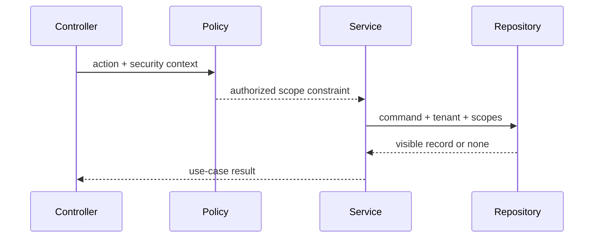

# Node ACL 与数据范围控制

授权失败通常不是缺少一个 `@Roles('admin')`，而是角色、动作、资源和数据范围没有形成一致模型。RBAC 可以表达“编辑者允许更新文档”，却不能回答“他能更新哪个租户、哪个集合、哪个状态的文档”。ACL/ABAC 与查询下推补全这个边界。

## 授权决策的四个输入

```ts
type AuthorizationRequest = {
  subject: { id: string; tenantId: string; roles: string[]; attributes: Record<string, string> }
  action: 'document:read' | 'document:update' | 'document:publish'
  resource: { id: string; tenantId: string; scopeId: string; ownerId: string; state: string }
  environment: { time: string; authenticationLevel: string; policyVersion: string }
}
```

角色提供粗粒度权限，资源 ACL/范围提供对象边界，属性和状态决定条件。例如编辑者可更新所属范围内的 draft，但 publish 需要 publisher 角色与近期 MFA。授权结果不仅是 boolean，还应返回原因与可下推范围。

| 模型 | 擅长 | 局限 |
| --- | --- | --- |
| RBAC | 角色到动作的稳定映射 | 资源范围表达弱 |
| ACL | 主体/组到具体资源 | 大规模管理成本 |
| ABAC | 按属性和环境组合 | 策略复杂、难解释 |
| ReBAC | 组织/项目/成员关系 | 需要关系模型与查询引擎 |

系统通常组合使用，而不是选一个名词覆盖全部。

## 查询前过滤，而不是查出后判断

列表与检索必须把范围变成查询条件。单对象查询也应同时带 tenant 与 scope：

```ts
type VisibleDocumentQuery = {
  documentId: string
  tenantId: string
  actorId: string
  allowedScopeIds: readonly string[]
}

async function findVisibleById(input: VisibleDocumentQuery): Promise<DocumentRecord | null> {
  return db.document.findFirst({
    where: {
      publicId: input.documentId,
      tenantId: input.tenantId,
      scopeId: { in: [...input.allowedScopeIds] },
      deletedAt: null
    }
  })
}
```

先 `findUnique(id)` 再 `if (tenantId !== ...)`，会让 ORM Hook、缓存、日志和错误处理先接触越权对象。Repository 的安全查询接口把范围设为必填，减少调用者漏条件。



## Policy 返回约束，而不只返回 true

列表接口若先读取所有记录再逐条 `can()` 会形成 N+1 和泄露风险。策略层返回可编译约束：

```ts
type ScopeConstraint =
  | { kind: 'none' }
  | { kind: 'all-in-tenant'; tenantId: string }
  | { kind: 'scopes'; tenantId: string; scopeIds: string[] }
  | { kind: 'owned'; tenantId: string; ownerId: string }

function readableConstraint(context: SecurityContext): ScopeConstraint {
  if (!context.permissions.has('document:read')) return { kind: 'none' }
  if (context.permissions.has('document:read:any')) {
    return { kind: 'all-in-tenant', tenantId: context.tenantId }
  }
  return { kind: 'scopes', tenantId: context.tenantId, scopeIds: [...context.visibleScopeIds] }
}
```

Repository 只接受有限 constraint union 并翻译为 ORM/SQL。禁止把策略字符串拼接进 SQL。复杂 ReBAC 可由授权引擎返回对象集合/关系条件，但最终仍需与业务查询在数据层结合。

## 写操作要同时检查状态不变量

拥有 update 权限不代表任何状态都能改。应用服务加载可见对象后，领域实体检查当前版本与状态转换：

```ts
async function publishDocument(command: PublishCommand, context: SecurityContext) {
  policy.assertAction(context, 'document:publish')
  return unitOfWork.run(async (repositories) => {
    const record = await repositories.documents.lockVisible(command.documentId, context)
    if (!record) throw new NotFoundError()
    const document = Document.restore(record)
    document.publish({ expectedVersion: command.expectedVersion })
    await repositories.documents.save(document)
  })
}
```

权限、对象可见性和领域状态是三道不同门禁。乐观版本阻止两个授权用户互相覆盖。高风险动作还要求近期认证或批准。

## 403 还是 404

对调用者本就不应知道存在的资源，可统一返回 404，减少枚举；对已知资源但动作禁止的场景返回 403 有助产品解释。策略要一致，响应时间和错误内容不要泄露“资源存在但属于别人”。审计内部记录真实拒绝原因。

批量接口也要防枚举：输入 100 个 ID 时，不返回哪些属于其他租户，只返回可见结果或统一拒绝。排序、过滤字段和分页大小使用白名单，避免查询注入和资源耗尽。

## 缓存是授权链的一部分

缓存结果带 tenant、范围摘要、主体/角色、策略版本、资源版本：

```ts
function documentCacheKey(input: {
  tenantId: string
  actorScopeDigest: string
  policyVersion: string
  documentId: string
  resourceVersion: number
}): string {
  return ['document', input.tenantId, input.actorScopeDigest, input.policyVersion,
    input.documentId, input.resourceVersion].join(':')
}
```

权限变更发布失效事件，删除主体/范围相关缓存。仅靠 TTL 会产生撤权窗口；高风险数据可以不缓存主体结果，或每次验证策略版本。缓存命中后仍映射公共 DTO，不返回内部记录。

搜索、向量、对象存储签名 URL 与 GraphQL DataLoader 也属于缓存/查询层，必须携带范围。不能只保护 REST Repository，而让搜索通道全局召回。

## NestJS 的职责分配

- Authentication Guard：构造可信主体；
- Policy Guard/Decorator：声明动作并做粗粒度门禁；
- Application Service：结合用例、状态与事务；
- Repository：下推 tenant/scope 过滤；
- Interceptor/Filter：稳定响应和审计关联，不决定权限。

不要把所有权限写成 Controller 装饰器。装饰器无法表达从请求 ID 解析的资源范围，且队列/MCP 入口无法复用。核心 policy 是普通 TypeScript 服务，HTTP Guard 只是适配。

## 多租户数据库保护

应用过滤是主路径，还可使用 PostgreSQL Row-Level Security 作为纵深防御。RLS 依赖每个事务正确设置主体/租户，并防连接池复用时上下文残留；迁移和管理连接使用独立角色。

数据库唯一约束也包含 tenant，例如 `(tenant_id, external_key)`，防止跨租户冲突。对象存储键使用不可猜内部标识和租户前缀，下载签名在授权后短期生成。

## 审计

审计事件记录主体摘要、租户、动作、资源公共引用、策略版本、决策、原因、请求 ID 和时间，不保存资源正文与令牌。授权拒绝率突降也要告警，可能是检查被绕过。

策略变更保存版本与 diff，支持用历史策略回放“当时为何允许”。但紧急撤权以当前安全策略为准，不能为了复现继续返回旧权限数据。

## 验证：权限矩阵

| 主体/场景 | 同范围 | 其他范围同租户 | 跨租户 | 撤权后缓存 |
| --- | --- | --- | --- | --- |
| Reader | 读允许、写拒绝 | 拒绝 | 拒绝 | 立即拒绝 |
| Editor | draft 读写 | 拒绝 | 拒绝 | 立即拒绝 |
| Publisher | publish 合法状态 | 状态非法拒绝 | 拒绝 | 立即拒绝 |
| Tenant Admin | 租户内按策略 | 允许 | 拒绝 | 策略版本刷新 |

```ts
it.each([
  ['same tenant and visible scope', fixtures.visibleDocument, 200],
  ['same tenant but hidden scope', fixtures.hiddenDocument, 404],
  ['another tenant with same public id', fixtures.crossTenantDocument, 404]
])('%s', async (_name, documentFactory, expectedStatus) => {
  const document = await documentFactory()
  const response = await api.get(`/documents/${document.publicId}`, fixtures.readerCookie())
  expect(response.status).toBe(expectedStatus)
})
```

还要覆盖撤权与并发、搜索/导出/批量接口、DataLoader、对象下载、队列和 MCP 入口。同一个安全上下文在所有协议下应得到同样范围。

## 常见误区

- 验证 JWT 后就认为所有资源可访问。
- RBAC 角色字符串代替资源范围和状态检查。
- 先查记录后判断 tenant，越权数据已进入应用。
- 列表逐条 `can()`，产生 N+1 且难以下推。
- 缓存键没有主体/范围/策略版本，撤权后仍命中。
- REST 有 ACL，但搜索、导出、对象下载或队列绕过。
- `admin` 默认跨所有租户，缺少独立管理边界。

## 参考资料

- [OWASP Authorization Cheat Sheet](https://cheatsheetseries.owasp.org/cheatsheets/Authorization_Cheat_Sheet.html)：默认拒绝、逐请求校验和对象范围授权。
- [OWASP API1: Broken Object Level Authorization](https://owasp.org/API-Security/editions/2023/en/0xa1-broken-object-level-authorization/)：对象级越权的威胁与测试方式。
- [PostgreSQL Row Security Policies](https://www.postgresql.org/docs/current/ddl-rowsecurity.html)：数据层行级范围策略。
- [NestJS Authorization](https://docs.nestjs.com/security/authorization)：Guard、Metadata 与策略适配边界。
