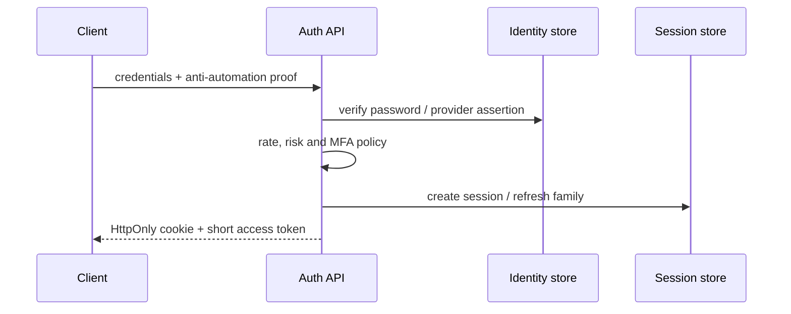

# Node 认证与 Token 生命周期

认证不是“签发一个 JWT 然后验证签名”。完整身份链路包含凭证校验、会话建立、访问令牌使用、刷新轮换、主动撤销、密钥轮换、风险升级和终止清理。只实现登录成功路径，用户退出、凭证泄露或权限撤销后仍可能长期有效。

## 先选择会话模型

| 模型 | 服务端状态 | 撤销 | 适用场景 |
| --- | --- | --- | --- |
| Session Cookie | 保存 session | 直接删除/禁用 | 同域 Web 应用 |
| 短期 Access + Refresh | 保存 refresh family | 轮换与家族撤销 | 多端 API、移动端 |
| 长期自包含 JWT | 少 | 困难 | 仅适合极少受控场景 |

浏览器应用优先考虑 `Secure`、`HttpOnly`、合适 `SameSite` 的 Cookie，减少令牌被前端脚本读取。`HttpOnly` 只能由服务端 `Set-Cookie` 设置，前端 `document.cookie` 做不到。Cookie 自动随请求发送，因此仍需 CSRF 防护；把令牌放 localStorage 则扩大 XSS 后的盗取风险。

## 登录入口



密码使用 Argon2id、scrypt 或当前安全建议的自适应哈希，保存算法与参数以便渐进升级。登录错误不暴露账号是否存在；按账号摘要、IP 风险和设备维度限速，同时避免攻击者利用全局锁定拒绝服务。

成功后生成新的会话 ID，防止 session fixation。高风险登录要求 MFA 或近期重新认证。日志只记录结果、风险原因和主体摘要，不记录密码、Token 和完整身份断言。

```ts
type AuthSession = {
  sessionId: string
  subjectId: string
  tenantId: string
  refreshFamilyId: string
  authenticationLevel: 'password' | 'mfa'
  createdAt: string
  idleExpiresAt: string
  absoluteExpiresAt: string
  revokedAt: string | null
  version: number
}
```

空闲期限和绝对期限解决不同风险。活跃会话可以延长 idle，但不能越过 absolute；敏感操作还要求 `authenticationLevel=mfa` 或最近登录时间。

## Access Token 的严格验证

JWT 验证不仅是 `verify(token, key)`：固定允许算法，验证签名、`iss`、`aud`、`exp`、`nbf`，限制时钟偏差，并根据 `kid` 从可信密钥集合选择。不能根据令牌自己声明的任意 URL 下载密钥。

```ts
type AccessClaims = {
  sub: string
  tid: string
  sid: string
  iss: string
  aud: string | string[]
  exp: number
  iat: number
  jti: string
  authLevel: 'password' | 'mfa'
}

async function verifyAccessToken(raw: string): Promise<AccessClaims> {
  const { payload, protectedHeader } = await jwtVerify(raw, trustedKeySet, {
    issuer: authConfig.issuer,
    audience: authConfig.audience,
    algorithms: ['ES256'],
    clockTolerance: 5
  })
  if (!protectedHeader.kid || !payload.sub || !payload.sid) throw new InvalidTokenError()
  return AccessClaimsSchema.parse(payload)
}
```

Access Token 短期有效，包含稳定身份与会话引用，不塞完整权限列表或敏感资料。权限变化频繁时，每次请求从策略缓存/服务解析当前权限，或让 Token 带短期策略版本；不能让一个小时旧角色持续访问已经撤权的数据。

## Refresh Token 轮换与重放检测

Refresh Token 是高价值凭证，数据库只保存哈希。每次刷新消费旧 Token 并签发新 Token，形成 family。若一个已消费 Token 再次出现，说明可能被复制，撤销整个 family 并要求重新登录。

```ts
type RefreshRecord = {
  tokenHash: string
  familyId: string
  sessionId: string
  parentHash: string | null
  status: 'active' | 'consumed' | 'revoked'
  expiresAt: string
  consumedAt: string | null
}
```

轮换必须在事务内原子完成：锁定旧记录，确认 active 与未过期，标记 consumed，插入新记录。两个并发刷新只有一个成功；另一个触发重放策略时要考虑客户端网络重试窗口，可通过短期结果复用或明确的 grace 设计避免误杀，但不能无限允许旧 Token。

```sql
UPDATE refresh_tokens
SET status = 'consumed', consumed_at = now()
WHERE token_hash = :old_hash
  AND status = 'active'
  AND expires_at > now();
```

影响行数不是 1 时，查询 family 状态并按重放/撤销/过期分类。不要把 Refresh Token 当普通 JWT 完全无状态验证，否则主动退出和泄露响应困难。

## Cookie 与 CSRF

Cookie 认证的写请求需要 CSRF 防护。`SameSite=Lax/Strict` 是重要防线但不是所有业务的唯一防线；跨站场景、浏览器兼容和子域信任要单独评估。常用组合：禁止 GET 产生副作用、检查 `Origin`/`Referer`、使用同步 Token 或 double-submit、敏感操作重新认证。

GET/POST 不是安全等级差异。TLS、认证、授权、输入处理和副作用语义决定安全；GET 查询参数还容易进入历史与代理日志。

```ts
function assertCsrf(request: Request, session: AuthSession): void {
  if (['GET', 'HEAD', 'OPTIONS'].includes(request.method)) return
  const origin = request.headers.get('origin')
  if (!origin || !allowedOrigins.has(origin)) throw new ForbiddenError('INVALID_ORIGIN')
  const supplied = request.headers.get('x-csrf-token')
  if (!supplied || !timingSafeEqual(hash(supplied), sessionCsrfHash(session))) {
    throw new ForbiddenError('INVALID_CSRF_TOKEN')
  }
}
```

CORS 不是 CSRF 防护。CORS 控制浏览器脚本读取响应，简单跨站请求仍可能发送。Cookie Domain 不要扩大到所有子域，任何被接管子域都可能影响会话边界。

## 撤销与退出

退出当前设备：撤销 Session 与 Refresh family、删除 Cookie。退出所有设备：按主体撤销全部会话，并提升 `sessionVersion`。密码重置、账号禁用、风险事件同样触发撤销。

短期 Access Token 可能在到期前继续有效。高风险 API 每次检查 session 状态；普通 API 在短 TTL 缓存撤销版本，权衡延迟与窗口。紧急撤权走主动失效通道。不要维护无限增长的每个 JWT 黑名单；按 Session/family/version 管理更可控。

## 密钥轮换

签名密钥有 `kid`、状态和有效期。发布新公钥，签发切到新私钥，保留旧公钥直到所有旧 Token 过期，再移除。验证端缓存 JWKS，但支持受控刷新；未知 `kid` 只触发一次限速刷新，防止攻击者制造请求风暴。

私钥存密钥管理系统，不进代码、镜像或普通环境日志。轮换演练包括新旧 Token 同时验证、回滚签发和旧 Key 安全移除。

## NestJS 边界

Guard 负责提取凭证、验证并构造 `RequestContext`；Controller 不解析 JWT；授权策略不散落在装饰器字符串。Passport Strategy 是协议适配，不承载租户数据查询和业务权限。

```ts
@Injectable()
export class AuthenticationGuard implements CanActivate {
  constructor(private readonly verifier: TokenVerifier) {}

  async canActivate(context: ExecutionContext): Promise<boolean> {
    const request = context.switchToHttp().getRequest<AuthenticatedRequest>()
    const token = readBearerOrCookie(request)
    const claims = await this.verifier.verify(token)
    request.security = await buildSecurityContext(claims)
    return true
  }
}
```

认证 Guard 只证明主体，资源授权由后续 Policy/Service/Repository 完成。WebSocket 和队列消费者使用同一验证服务，但协议适配不同。

## 验证：生命周期矩阵

| 场景 | 预期 |
| --- | --- |
| 错误签名/算法 | 401，不尝试备用不安全算法 |
| issuer/audience 不符 | 401 |
| 并发刷新同一 Token | 只有一个新 Token |
| 已消费 Refresh 重放 | family 撤销 |
| 当前设备退出 | 当前 session 不可刷新 |
| 全设备退出 | 所有 session 失效 |
| 角色撤销 | 高风险 API 立即拒绝 |
| 跨站写请求无 CSRF | 403 |
| Key 轮换过渡期 | 新旧合法 Token 均验证 |

```ts
it('revokes a refresh family when a consumed token is replayed', async () => {
  const first = await fixtures.login()
  await auth.refresh(first.refreshToken)
  await expect(auth.refresh(first.refreshToken)).rejects.toMatchObject({ code: 'TOKEN_REPLAY' })
  expect(await sessionStore.familyStatus(first.familyId)).toBe('revoked')
})
```

测试使用隔离身份数据，不把真实 Token 输出到失败快照。浏览器测试检查 Cookie 属性、CSRF、退出和多标签刷新竞争。

## 常见误区

- JWT 签名正确就认为请求已完整授权。
- 长期 Access Token 无服务端会话，无法有效撤销。
- Refresh Token 不轮换或明文保存。
- 前端声称可以设置 `HttpOnly`。
- 认为 CORS 或 POST 自动防 CSRF。
- 权限列表长期写入 Token，撤权后继续有效。
- 未固定 JWT 算法、issuer 和 audience。

## 参考资料

- [OAuth 2.0 Security Best Current Practice (RFC 9700)](https://www.rfc-editor.org/rfc/rfc9700.html)：当前 OAuth 威胁、Refresh Token 轮换与客户端安全建议。
- [OpenID Connect Core](https://openid.net/specs/openid-connect-core-1_0.html)：ID Token、issuer、audience、nonce 与认证流程。
- [OWASP Session Management Cheat Sheet](https://cheatsheetseries.owasp.org/cheatsheets/Session_Management_Cheat_Sheet.html)：Cookie、会话生命周期、撤销与重认证。
- [OWASP CSRF Prevention Cheat Sheet](https://cheatsheetseries.owasp.org/cheatsheets/Cross-Site_Request_Forgery_Prevention_Cheat_Sheet.html)：Cookie 会话下的 SameSite、Token 与 Origin 防护。
- [NestJS Authentication](https://docs.nestjs.com/security/authentication)：框架认证适配方式；授权与 Token 生命周期仍由领域策略负责。
