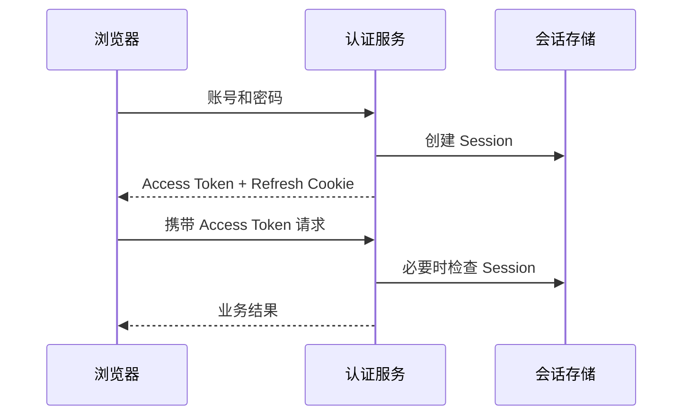
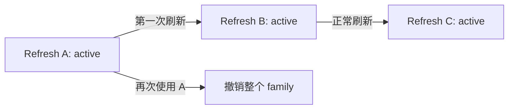

# Node 认证与 Token 生命周期

用户输入账号和密码后，服务端为什么不在之后的每个请求里重新检查密码？因为密码只适合证明“此刻知道凭证”，不适合长期跟随请求。登录成功后，系统会创建一段可撤销的会话，再用短期凭证代表这段会话。

本篇从一个浏览器登录开始，完成登录、访问接口、刷新凭证和退出四个动作。读完后，你应该能解释 Session、Access Token 和 Refresh Token 各自负责什么，以及为什么一个签名正确的 JWT 仍不等于完整授权。

## 先认识三个对象

- **Session**：服务端保存的一次登录记录，可以被撤销。
- **Access Token**：有效期较短，请求 API 时用它证明当前身份。
- **Refresh Token**：Access Token 过期后换取新令牌的高价值凭证。

把它想成进入办公楼：Session 是门禁系统里的员工访问记录，Access Token 是当天临时通行证，Refresh Token 是用来补办临时证的长期凭据。临时证被复制时，管理员仍能通过门禁记录终止整段访问。



## 步骤一：登录时创建会话

密码应使用 Argon2id、scrypt 等适合密码的自适应哈希验证。登录失败时使用统一提示，避免暴露“账号存在但密码错误”；还要有限速和异常登录检查。验证成功后，服务端生成新的 Session ID，记录用户、租户、认证强度、空闲过期时间、绝对过期时间和撤销状态。

这里有两个时间：空闲期限限制“多久没有活动”，绝对期限限制“这次登录最多活多久”。即使用户一直活跃，也不应无限延长到绝对期限之外。敏感操作还可以要求最近重新认证或完成 MFA。

下面是根据通用会话行为重写的最小示例。输入是已经通过密码验证的用户，输出是服务端会话与两种令牌；它省略了数据库、密码哈希和限速实现，只保留生命周期主线。

```ts
async function finishLogin(user: User) {
  const session = await sessions.create({
    subjectId: user.id,
    tenantId: user.tenantId,
    authLevel: 'password',
    idleExpiresAt: addMinutes(new Date(), 30),
    absoluteExpiresAt: addDays(new Date(), 7)
  })

  const accessToken = await accessTokens.sign({
    sub: user.id,
    sid: session.id,
    tid: user.tenantId
  }, { expiresIn: '10m' })

  const refreshToken = await refreshTokens.issue(session.id)
  return { session, accessToken, refreshToken }
}
```

关键点是先创建可撤销的会话，再让令牌引用它。浏览器端的 Refresh Token 通常由服务端通过 `Set-Cookie` 写入，并设置 `Secure`、`HttpOnly` 和合适的 `SameSite`；前端 JavaScript 无法设置 `HttpOnly`。Cookie 会自动随请求发送，所以写请求仍要考虑 CSRF。

## 步骤二：严格验证 Access Token

收到 Token 后不能只看“能否解码”。验证器要固定允许的算法，并检查签名、签发者 `iss`、接收方 `aud`、过期时间 `exp`、生效时间 `nbf` 和会话引用 `sid`。密钥只能来自受信任配置，不能跟随 Token 里的任意地址下载。

Access Token 只放稳定且必要的声明，不应塞入用户资料或长期权限列表。角色刚被撤销而旧 Token 还有效时，高风险接口需要查询当前 Session 或策略版本；普通接口可以在短 TTL 缓存与撤销速度之间做明确取舍。

## 步骤三：轮换 Refresh Token

Refresh Token 的有效期更长，泄露后的风险也更高。数据库只保存它的哈希。每次刷新都消费旧 Token，并签发一个新 Token；一组连续轮换的 Token 属于同一个 family。

刷新必须在一个事务中完成：锁定旧记录，确认它仍是 active，将其标记为 consumed，再插入新记录。两个并发刷新只能有一个成功。若已经消费过的 Token 再次出现，系统把它当作可能的复制重放，撤销整个 family，并要求重新登录。



移动网络可能让客户端误以为刷新失败并重试。系统可以设计很短的结果复用窗口，避免一次正常重试误伤，但这个窗口要有明确上限，不能让旧 Token 长期重复使用。

## 步骤四：退出与密钥轮换

退出当前设备时，服务端撤销当前 Session 和 Refresh family，并让浏览器删除 Cookie。退出所有设备时，撤销该用户的全部会话，或者提升一个服务端 Session 版本。密码重置、账号禁用和风险事件也应触发相应撤销。

短期 Access Token 可能在到期前仍能通过签名验证。因此，安全要求越高的接口越需要查询当前撤销状态。无限维护每个 JWT 的黑名单会持续增长，按 Session、family 或版本管理通常更清楚。

签名密钥轮换则分三步：先发布新公钥，随后用新私钥签发，同时继续验证旧 Token；等旧 Token 全部过期后，再移除旧公钥。`kid` 用于选择已知密钥，未知 `kid` 只能触发受限刷新，防止攻击者制造密钥下载风暴。

## 正常结果和失败结果

| 场景 | 服务端结果 |
| --- | --- |
| 正常登录后访问 | 200，身份来自已验证声明 |
| Access Token 过期 | 401，客户端可尝试刷新 |
| Refresh Token 首次使用 | 签发新 Token，旧记录变为 consumed |
| 已消费 Token 再次使用 | 撤销 family，要求重新登录 |
| 当前设备退出 | 当前 Session 无法继续刷新 |
| 跨站写请求缺少 CSRF 证明 | 403，不执行副作用 |
| JWT 算法或 audience 不符 | 401，不尝试不安全的备用算法 |

测试时不要只断言 HTTP 状态码。还要检查数据库中 Session、Refresh 记录和撤销版本的变化，确保失败请求没有生成新凭证。Cookie 测试要真实检查 `HttpOnly`、`Secure`、`SameSite`，并覆盖并发刷新和多标签页竞争。

## JWT 解决不了什么

JWT 的签名能证明声明未被篡改，却不负责回答资源是否属于当前租户、对象当前是否允许修改、权限是否刚被撤销。认证只解决“你是谁”，授权还要结合动作、资源和当前策略。下一篇会用两条属于不同用户的数据，把授权范围一直下推到数据库查询。

## 参考资料

- [OAuth 2.0 Security Best Current Practice (RFC 9700)](https://www.rfc-editor.org/rfc/rfc9700.html)
- [OWASP Session Management Cheat Sheet](https://cheatsheetseries.owasp.org/cheatsheets/Session_Management_Cheat_Sheet.html)
- [OWASP CSRF Prevention Cheat Sheet](https://cheatsheetseries.owasp.org/cheatsheets/Cross-Site_Request_Forgery_Prevention_Cheat_Sheet.html)
- [NestJS Authentication](https://docs.nestjs.com/security/authentication)
