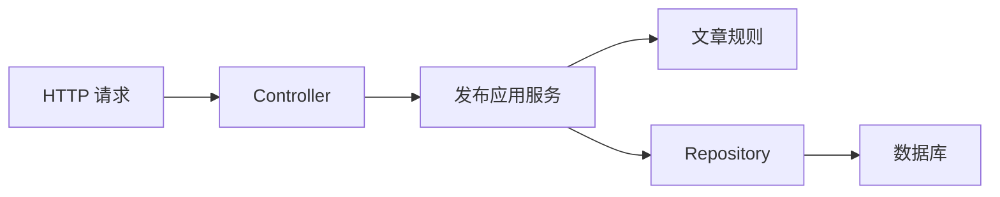

# Node.js 与 NestJS 分层架构

一个“发布文章”接口只有十几行时，把参数校验、权限判断和数据库更新都写进 Controller 似乎很快。几个月后，定时任务也要发布文章，开发者只好复制同样逻辑；规则改动时，两个入口开始出现不同结果。

这篇用同一个接口逐步拆分职责。目标不是背目录，而是让 HTTP、业务规则和数据库变化时各自有明确位置，并且让 API 与后台任务复用同一条发布规则。

## 先认识四个角色

**Controller** 接收 HTTP 请求，把路径、Body 和登录用户转换成应用能够理解的输入，再把结果转换成状态码。

**应用服务** 完成一个具体用例，例如“发布文章”。它决定先检查什么、何时修改状态、失败时返回什么。

**Repository** 是数据访问契约。应用服务只关心“按 ID 查文章”和“保存文章”，具体 SQL 或 ORM 写在实现中。

**Module** 负责装配依赖。NestJS 用模块组织 Controller 和 Provider，并决定哪些能力能被其他模块使用。

## 先看请求经过哪里



依赖方向从外向内：Controller 知道应用服务，应用服务知道业务对象和 Repository 契约。业务规则不应反过来读取 HTTP 请求，也不应导入某个 ORM 的查询对象。

## 第一步：写清楚输入和预期结果

我们要处理 `POST /articles/:id/publish`，当前用户和文章属于同一工作区，并且文章只有在 `draft` 状态才能发布。

```text
正常输入：articleId=42，actorId=u1，文章状态=draft
正常结果：文章状态变为 published，HTTP 200

失败输入：articleId=42，actorId=u2，用户无权限
失败结果：文章保持 draft，HTTP 403

重复输入：文章已经是 published
失败结果：不重复发布，HTTP 409
```

这份结果表比目录结构更重要。分层后的所有入口都要得到同样结果，数据库异常也不应被伪装成“文章不存在”。

## 第二步：让 Controller 只处理 HTTP

第一层只提取参数和身份，再调用应用服务。下面是根据 NestJS 官方 Controller 与 Provider 机制写的最小示例：

```ts
@Controller('articles')
export class ArticleController {
  constructor(private readonly publishArticle: PublishArticle) {}

  @Post(':id/publish')
  async publish(
    @Param('id') articleId: string,
    @CurrentUser() user: AuthUser,
  ) {
    const result = await this.publishArticle.execute({
      articleId,
      actorId: user.id,
      workspaceId: user.workspaceId,
    })

    if (result.kind === 'forbidden') throw new ForbiddenException()
    if (result.kind === 'conflict') throw new ConflictException()
    if (result.kind === 'missing') throw new NotFoundException()
    return result.article
  }
}
```

输入来自 URL 和认证上下文，输出是应用服务结果对应的 HTTP 响应。Controller 没有 SQL、状态修改和事务规则，因此队列消费者无需复制 HTTP 细节，也能调用同一个用例。

## 第三步：把发布规则集中在应用服务

应用服务按固定顺序完成读取、权限、状态转换和保存。为了突出职责，示例省略日志、事务对象和 DTO 定义：

```ts
@Injectable()
export class PublishArticle {
  constructor(private readonly articles: ArticleRepository) {}

  async execute(command: PublishCommand): Promise<PublishResult> {
    const article = await this.articles.findById(command.articleId)
    if (!article) return { kind: 'missing' }

    if (article.workspaceId !== command.workspaceId) {
      return { kind: 'forbidden' }
    }
    if (article.status !== 'draft') {
      return { kind: 'conflict' }
    }

    article.status = 'published'
    article.publishedBy = command.actorId
    await this.articles.save(article)
    return { kind: 'published', article }
  }
}
```

输入是与传输协议无关的命令，输出是可枚举的业务结果。关键逻辑只有一份，所以 HTTP、队列和管理脚本不会各自解释“什么状态允许发布”。Repository 可以在单元测试中替换为内存实现，无需启动完整 Nest 应用。

## 第四步：Module 只负责装配

NestJS Module 声明这个能力由哪些 Controller 和 Provider 组成。若应用服务依赖接口，可以用 Token 把接口与数据库实现绑定。模块只导出其他模块确实需要的应用能力，不要把内部 Repository 全部公开。

按业务能力组织目录通常更容易追踪一次改动：

```text
src/articles/
  article.controller.ts
  publish-article.service.ts
  article.ts
  article.repository.ts
  postgres-article.repository.ts
  article.module.ts
```

项目很小时不需要为了“分层”创建十几个空目录。判断是否拆分可以看变化原因：HTTP 表达、业务规则和存储实现是否经常独立变化；若答案是肯定的，边界就有实际价值。

## 怎样验证这次拆分

| 用例 | Repository 初始数据 | 预期结果 | 是否保存 |
| --- | --- | --- | --- |
| 正常发布 | 同工作区、draft | `published` | 1 次 |
| 无权限 | 不同工作区、draft | `forbidden` | 0 次 |
| 重复发布 | 同工作区、published | `conflict` | 0 次 |
| 不存在 | 无记录 | `missing` | 0 次 |
| 数据库失败 | save 抛错 | 传播基础设施错误 | 未成功 |

单元测试主要验证应用服务的分支；集成测试再验证 Module 装配、ORM 映射和 HTTP 状态码。只测 Controller 的 200 响应，会漏掉重复发布与保存次数等真正的业务约束。

## 当前示例还没有解决什么

真实发布流程还可能需要事务、并发版本、幂等键和异步通知。这些不应被一股脑塞回 Controller：

- 同一事务内的数据更新放在应用用例边界；
- 并发冲突由版本字段或数据库约束发现；
- 外部通知与数据库事实的一致性需要单独设计；
- 权限范围要在查询和写入条件中再次约束。

下一篇继续处理认证和权限。先有清楚的用例边界，再加入这些能力，读者才能看见每个机制解决的是哪一种失败。

## 参考资料

- [NestJS：Controllers](https://docs.nestjs.com/controllers)
- [NestJS：Providers](https://docs.nestjs.com/providers)
- [NestJS：Modules](https://docs.nestjs.com/modules)
