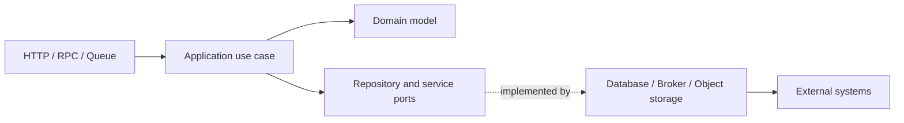
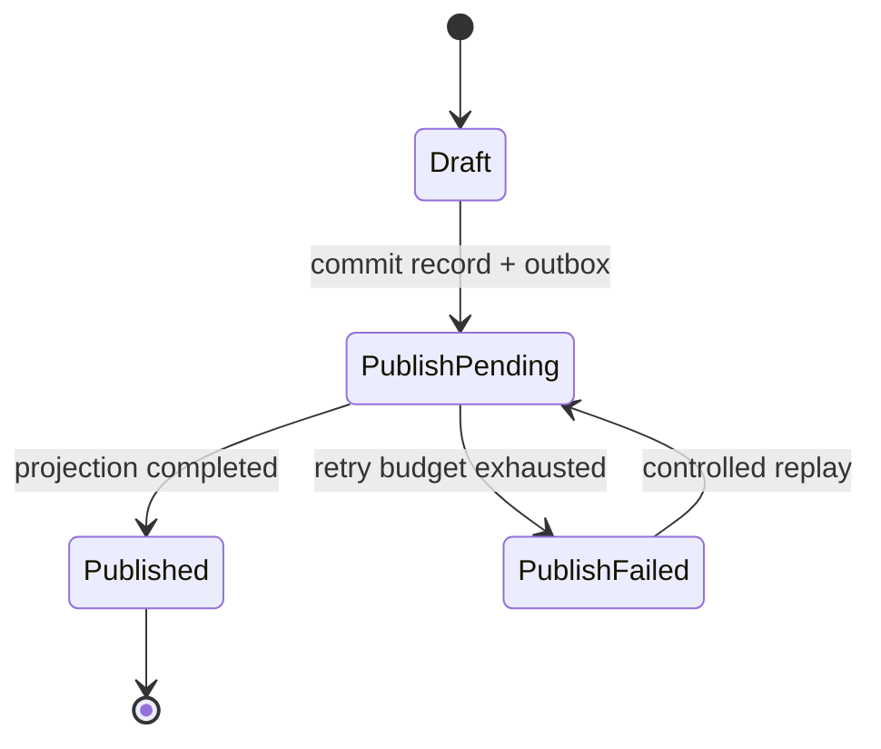

# Node.js 与 NestJS 分层架构

NestJS 提供 Module、Controller、Provider 和依赖注入，但使用这些装饰器并不等于系统已经分层。框架只能管理对象，不能替我们决定谁拥有数据、谁可以提交事务、错误如何跨边界传播，以及外部副作用失败后如何恢复。真正的分层体现在依赖方向、能力所有权和可验证的运行时约束。

本文讨论的不是固定目录模板，而是一套能随系统增长继续工作的判断方法。示例全部使用中性领域：租户中的文档记录从草稿进入已发布状态。它足够展示权限、并发、事务、事件和外部存储之间的关系，又不依赖特定业务。

## 先从用例和失败方式出发

“发布文档”看似只是一次更新，实际上通常包含多个约束：

1. 调用者属于正确租户且具备发布能力；
2. 记录仍处于允许发布的状态，客户端版本没有落后；
3. 数据库更新与待发布事件必须原子提交；
4. 搜索索引、通知或对象存储失败时，数据库事实不能回滚成未知状态；
5. 重试同一个请求不能产生两次发布或两条重复通知；
6. API、队列消费者和定时恢复任务必须复用同一组业务规则。

如果 Controller 直接操作 ORM，再调用消息服务，这些约束会散落在协议代码中。HTTP 测试可能通过，但队列入口遗漏权限或事务；消息发送成功后数据库提交失败，又会留下无法解释的外部副作用。分层的第一价值不是“目录整齐”，而是让上述约束只有一个可信实现。

## 五类边界与依赖方向

一个实用的服务可以划分为协议、应用、领域、端口和适配器五类边界：



| 边界 | 拥有什么 | 不应该拥有 |
| --- | --- | --- |
| 协议适配 | 参数、认证上下文、状态码、序列化 | ORM 查询、事务、领域状态转换 |
| 应用服务 | 用例顺序、权限、事务、幂等、跨对象协作 | HTTP 对象、SQL 细节、第三方 SDK 类型 |
| 领域模型 | 实体、值对象、不变量、状态转换 | NestJS 装饰器、数据库连接、网络调用 |
| 端口 | 应用真正依赖的最小能力契约 | 具体 ORM、消息中间件或云厂商细节 |
| 基础设施适配 | SQL、缓存、消息、文件和第三方协议 | 重新决定业务规则 |

依赖方向由外向内。领域层不导入 NestJS、Prisma、TypeORM 或消息 SDK；应用层可以依赖领域与端口；基础设施层实现端口并由组合根装配。这样替换数据库不必重写业务规则，改变 HTTP DTO 也不会污染领域对象。

并非每个小服务都需要五个物理包。两层代码也可以遵守依赖方向，十个目录也可能只是形式。应根据变化原因拆分：协议变化、业务规则变化和存储变化如果常常独立发生，就值得有明确边界。

## 模块按能力和所有权划分

全局建立 `controllers/`、`services/`、`repositories/` 三个大目录，在早期很直观，但系统增长后同一个用例横跨全仓库，模块所有权消失。更稳定的组织方式是先按业务能力切分，再在模块内部表达层次：

```text
src/
  publishing/
    api/
      publish-document.controller.ts
      publish-document.dto.ts
    application/
      publish-document.command.ts
      publish-document.service.ts
      ports.ts
    domain/
      document.ts
      publishing-errors.ts
    infrastructure/
      postgres-document.repository.ts
      postgres-unit-of-work.ts
    publishing.module.ts
  shared-kernel/
    result.ts
    identifiers.ts
  bootstrap/
    app.module.ts
```

模块只导出其他模块确实需要的应用能力，不导出内部 Repository 和所有 Provider。跨模块协作优先级如下：

1. 同步调用对方公开的应用端口，适合调用方必须立即得到结果；
2. 发布领域/集成事件，适合下游不影响当前事务是否成功；
3. 抽取稳定且真正共享的值对象，例如租户标识，而不是抽取一个无限增长的工具箱。

长期依赖 `forwardRef` 往往说明两个模块都认为自己拥有同一状态，或者一个用例被错误拆在两侧。正确处理不是消除 TypeScript 循环引用，而是回答“谁能修改这份数据，谁只是发起请求”。

## DTO、领域对象和持久化记录分开演进

把 ORM Entity 同时当作请求 DTO、业务对象和响应模型很省代码，也把三个变化周期锁在一起：数据库新增审计字段可能意外暴露到 API；API 的可选字段迫使数据库列变为可空；批量查询为了性能返回投影，却又被迫构造完整实体。

应用入口使用明确命令：

```ts
export type PublishDocumentCommand = Readonly<{
  documentId: string
  expectedVersion: number
  idempotencyKey: string
  actor: Readonly<{
    subjectId: string
    tenantId: string
    permissions: ReadonlySet<string>
  }>
}>

export type PublishDocumentResult = Readonly<{
  documentId: string
  state: 'published'
  version: number
  publishedAt: string
}>
```

领域对象负责不变量，而不是负责序列化：

```ts
export class Document {
  private constructor(
    readonly id: string,
    readonly tenantId: string,
    private state: 'draft' | 'published' | 'archived',
    private version: number,
    private publishedAt: Date | null
  ) {}

  static restore(snapshot: DocumentSnapshot): Document {
    return new Document(
      snapshot.id,
      snapshot.tenantId,
      snapshot.state,
      snapshot.version,
      snapshot.publishedAt
    )
  }

  publish(now: Date, expectedVersion: number): DomainEvent[] {
    if (this.version !== expectedVersion) throw new StaleDocumentVersion()
    if (this.state === 'archived') throw new ArchivedDocumentCannotBePublished()
    if (this.state === 'published') return []

    this.state = 'published'
    this.publishedAt = now
    this.version += 1
    return [new DocumentPublished(this.id, this.tenantId, this.version, now)]
  }

  snapshot(): DocumentSnapshot {
    return {
      id: this.id,
      tenantId: this.tenantId,
      state: this.state,
      version: this.version,
      publishedAt: this.publishedAt
    }
  }
}
```

这里让重复发布返回空事件，是领域层定义的一种幂等语义；也可以选择返回冲突。关键是显式决定，而不是依赖数据库最终恰好写成同一个值。

## 应用服务决定事务边界

事务应覆盖一个业务不变量需要原子变化的所有数据库写入，而不是“每个 Repository 方法各自事务”。若 Repository 自行提交，应用服务无法保证文档状态和 Outbox 同时成功。

定义足够小的端口，不把 QueryBuilder 泄漏给应用层：

```ts
export interface DocumentRepository {
  findVisibleForUpdate(input: {
    documentId: string
    tenantId: string
  }): Promise<Document | null>
  save(document: Document): Promise<void>
}

export interface OutboxRepository {
  append(events: readonly DomainEvent[]): Promise<void>
}

export interface UnitOfWork {
  transaction<T>(work: (scope: TransactionScope) => Promise<T>): Promise<T>
}

export type TransactionScope = Readonly<{
  documents: DocumentRepository
  outbox: OutboxRepository
  idempotency: IdempotencyRepository
}>
```

应用服务编排权限、幂等、锁、状态转换和提交：

```ts
@Injectable()
export class PublishDocumentService {
  constructor(
    private readonly work: UnitOfWork,
    private readonly clock: Clock
  ) {}

  execute(command: PublishDocumentCommand): Promise<PublishDocumentResult> {
    assertPermission(command.actor, 'document:publish')

    return this.work.transaction(async (scope) => {
      const replay = await scope.idempotency.findResult(
        command.actor.tenantId,
        command.idempotencyKey
      )
      if (replay) return PublishDocumentResultSchema.parse(replay)

      const document = await scope.documents.findVisibleForUpdate({
        documentId: command.documentId,
        tenantId: command.actor.tenantId
      })
      if (!document) throw new DocumentNotFound()

      const events = document.publish(this.clock.now(), command.expectedVersion)
      await scope.documents.save(document)
      await scope.outbox.append(events)

      const result = toPublishResult(document)
      await scope.idempotency.storeResult({
        tenantId: command.actor.tenantId,
        key: command.idempotencyKey,
        result
      })
      return result
    })
  }
}
```

权限范围进入查询条件，而不是先按主键读取所有租户的数据再比较。对于高并发状态变化，可以使用行锁或乐观版本条件：

```sql
UPDATE document_records
SET state = 'published', version = version + 1, published_at = :now
WHERE public_id = :document_id
  AND tenant_id = :tenant_id
  AND state = 'draft'
  AND version = :expected_version;
```

影响行数为零时再区分不存在、越权、状态冲突或版本冲突。公开 API 是否刻意把“越权”和“不存在”合并为 404，属于安全协议决策，不能由 ORM 异常文本决定。

## 外部调用不要占着数据库事务

在事务里调用模型、对象存储或第三方 API 会把未知网络延迟带入锁持有时间。超时后也无法确定远端是否已经成功，数据库回滚并不能撤销外部世界。

通常把流程拆成状态机：



数据库事务原子写入业务记录和 Outbox。独立发布器用 `FOR UPDATE SKIP LOCKED` 领取待发送事件，向 Broker 投递，再记录投递尝试。消费者依然要幂等，因为发布器可能在“Broker 已收到、数据库尚未标记”时崩溃。

```sql
SELECT id, aggregate_id, event_type, payload
FROM outbox_events
WHERE published_at IS NULL AND available_at <= now()
ORDER BY id
FOR UPDATE SKIP LOCKED
LIMIT 100;
```

Outbox 解决本地数据库与消息发布之间的原子意图，不提供端到端 exactly-once。每个副作用仍需稳定事件 ID、去重记录或目标系统幂等键。

## 查询模型不必强迫经过领域实体

写用例关注不变量，读用例关注过滤、排序、聚合和性能。列表、报表和搜索可以使用独立 Query Service，返回只读投影，同时仍要下推租户和授权范围。

```ts
export interface DocumentListQuery {
  execute(input: {
    tenantId: string
    allowedScopeIds: readonly string[]
    cursor?: string
    limit: number
  }): Promise<Readonly<{
    items: readonly DocumentListItem[]
    nextCursor: string | null
  }>>
}
```

这不是放弃领域模型，而是承认读写模型的优化目标不同。危险做法是为了“Repository 统一”让报表先加载成千上万个实体再在内存过滤，或者让查询层绕开相同的权限边界。

## 错误是跨层契约

错误至少分为四类：调用方输入、认证授权、业务冲突和基础设施故障。它们的重试含义、日志级别和 HTTP 映射不同。

| 错误类别 | 示例 | HTTP | 是否重试 | 日志 |
| --- | --- | --- | --- | --- |
| 输入无效 | 字段格式错误 | 400/422 | 否 | 低级别、聚合 |
| 未认证/无权限 | 会话无效、范围不足 | 401/403/404 | 重新认证后 | 审计但不含凭证 |
| 业务冲突 | 版本过期、状态不允许 | 409 | 读取新状态后 | 结构化原因 |
| 暂时故障 | 连接池、限流、超时 | 503/504 | 有预算地重试 | error + cause |

领域错误使用稳定代码；基础设施适配器把厂商异常转换为应用可以处理的错误；全局 Exception Filter 只负责协议映射和关联 ID。不能把 SQL、磁盘路径、第三方响应正文或堆栈直接返回给客户端。

```ts
@Catch()
export class HttpErrorFilter implements ExceptionFilter {
  catch(error: unknown, host: ArgumentsHost): void {
    const response = host.switchToHttp().getResponse<Response>()
    const request = host.switchToHttp().getRequest<RequestWithContext>()
    const mapped = mapApplicationError(error)

    request.log[mapped.logLevel]({
      errorCode: mapped.code,
      cause: mapped.internalCause,
      requestId: request.context.requestId
    }, 'request failed')

    response.status(mapped.status).json({
      code: mapped.code,
      message: mapped.publicMessage,
      requestId: request.context.requestId
    })
  }
}
```

不要用宽泛的 `catch` 把所有错误改成成功响应，也不要让取消信号被吞掉。上游已经断开时，能取消的数据库查询和外部请求应接收 `AbortSignal`，但提交临界区要根据语义决定完成提交还是回滚。

## Node.js 并发模型仍需要背压

事件循环擅长大量等待型 I/O，不代表资源无限。一次请求并发 500 个 Promise，仍会压满数据库连接池、文件描述符、远端配额和内存。CPU 密集解析、压缩或图像处理会阻塞同一进程中的其他请求。

需要在边界设置预算：

- 数据库并发不超过连接池与查询成本允许的范围；
- 调用外部 API 使用有上限的 semaphore，并传播 deadline；
- CPU 工作交给 Worker Thread、独立进程或任务队列；
- 流式读写尊重 Node Stream 的 `write()` 返回值和 `drain`；
- 请求级并行使用 `Promise.allSettled` 之前，先决定部分失败语义。

```ts
async function writeWithBackpressure(
  stream: NodeJS.WritableStream,
  chunks: AsyncIterable<Buffer>
): Promise<void> {
  for await (const chunk of chunks) {
    if (!stream.write(chunk)) await once(stream, 'drain')
  }
  stream.end()
}
```

“异步”只描述控制流，不自动提供取消、超时、隔离和容量规划。

## 配置、启动和关闭也是架构

配置必须在应用启动时按 Schema 验证。缺少数据库 URL、生产环境使用弱默认密钥、连接池上限小于 Worker 并发等问题，应在接流量前失败，而不是运行到某条请求才暴露。

```ts
const RuntimeConfigSchema = z.object({
  NODE_ENV: z.enum(['development', 'test', 'production']),
  DATABASE_URL: z.string().url(),
  HTTP_PORT: z.coerce.number().int().min(1).max(65535),
  DB_POOL_SIZE: z.coerce.number().int().positive(),
  SHUTDOWN_GRACE_MS: z.coerce.number().int().min(1000)
})
```

启动阶段按依赖顺序建立资源并执行 readiness 检查。健康检查分工：liveness 只判断进程是否需要重启；readiness 判断是否可以接新流量，不应因为一个非关键下游抖动就制造全实例重启风暴。

收到 `SIGTERM` 后先从负载均衡摘除，停止接收新请求和新任务，给在途工作有限时间完成，再关闭消费者、HTTP Server、连接池和遥测导出器。定时任务不能在每个 Web 副本自动启动，否则扩容会把单例任务复制多份；应作为独立角色部署并有租约。

## NestJS 组合根与测试替换

装配集中在 Module，业务代码不使用 Service Locator 动态获取任意 Provider。Token 表达端口，生产与测试使用不同适配器：

```ts
export const DOCUMENT_REPOSITORY = Symbol('DOCUMENT_REPOSITORY')
export const UNIT_OF_WORK = Symbol('UNIT_OF_WORK')

@Module({
  controllers: [PublishDocumentController],
  providers: [
    PublishDocumentService,
    { provide: DOCUMENT_REPOSITORY, useClass: PostgresDocumentRepository },
    { provide: UNIT_OF_WORK, useClass: PostgresUnitOfWork },
    { provide: Clock, useClass: SystemClock }
  ],
  exports: [PublishDocumentService]
})
export class PublishingModule {}
```

如果一个单元测试必须启动整套 Nest 应用、真实数据库和消息系统才能验证状态转换，说明边界可能过度依赖框架。反过来，只测 mock 调用次数也不能证明 SQL 的租户过滤和事务行为正确。

## 验证：按风险切分测试

测试结构应与架构边界一致，而不是所有问题都压到端到端测试：

| 测试层 | 主要证明 | 典型故障注入 |
| --- | --- | --- |
| 领域单元 | 状态不变量、版本、幂等语义 | 非法状态、重复调用、边界时间 |
| 应用服务 | 权限、用例顺序、事务协作 | Repository 失败、时钟、重复键 |
| Repository 集成 | SQL 范围、锁、唯一约束、映射 | 并发更新、回滚、不同租户同 ID |
| 协议契约 | DTO、状态码、错误体、认证上下文 | 无效字段、取消、未知错误 |
| 运行态 | 启停、Outbox、Broker、观测 | 杀 Worker、断网、重复投递 |

```ts
it('commits state and outbox once under a repeated command', async () => {
  const command = fixtures.publishCommand({ idempotencyKey: 'request-1' })

  const first = await service.execute(command)
  const replay = await service.execute(command)

  expect(replay).toEqual(first)
  expect(await database.documentVersion(first.documentId)).toBe(first.version)
  expect(await database.outboxCount('request-1')).toBe(1)
})

it('never returns a document from another tenant', async () => {
  const foreign = await fixtures.document({ tenantId: 'tenant-b' })
  const command = fixtures.publishCommand({
    tenantId: 'tenant-a',
    documentId: foreign.publicId
  })

  await expect(service.execute(command)).rejects.toMatchObject({
    code: 'DOCUMENT_NOT_FOUND'
  })
})
```

事务测试要连接明确隔离的数据库，真实验证唯一约束、隔离级别和 SQL，而不是用内存数组假装数据库。故障演练至少覆盖：数据库提交前进程退出、Broker 收到后发布器退出、消费者处理后 ACK 前退出、部署期间新旧消息版本共存。

## 演进策略：允许新旧版本短期共存

无停机演进遵循 expand-and-contract：先增加兼容字段/表和双读能力，再部署写入新格式，完成回填与观测，最后停止旧读写并收缩。不能在同一发布中先删除数据库列，再期待旧实例已经全部退出。

事件协议带 `schemaVersion`，消费者对未知未来版本明确拒绝或隔离，不能静默丢弃影响权限和幂等的字段。模块拆分也应先建立端口与契约测试，再迁移实现；一次“大重构”同时改目录、数据模型和协议，会让回归来源不可判断。

## 架构审查清单

- Controller 是否只做协议适配，还是正在拼 SQL、开事务和调用第三方？
- 每份可变数据是否有唯一所有者，跨模块是否通过公开能力协作？
- 事务是否覆盖完整业务不变量，网络调用是否被移出长事务？
- 数据库更新和事件是否通过 Outbox 建立原子意图？
- 列表、搜索、导出和队列入口是否都下推相同的租户与权限范围？
- 重试和重复投递是否能证明不会重复产生副作用？
- 错误码是否稳定，内部异常和敏感值是否被边界隐藏？
- Promise 并发、连接池、流和 CPU 工作是否有容量上限与背压？
- 进程能否在发布切流时停止接单、排空并释放所有资源？
- 单元、集成、契约和运行态测试是否分别证明了正确的风险？

分层的最终评价标准不是文件夹数量，而是变化能否被局部理解、故障能否被隔离恢复、关键不变量能否被测试证明。NestJS 负责装配和协议便利，系统边界仍必须由工程设计明确给出。

## 源码与规范

- [NestJS Modules](https://docs.nestjs.com/modules)：模块元数据、Provider 可见性和组合根。
- [NestJS Lifecycle Events](https://docs.nestjs.com/fundamentals/lifecycle-events)：初始化、关闭、信号与资源释放。
- [Node.js Streams](https://nodejs.org/api/stream.html)：背压、pipeline 与资源清理语义。
- [Transactional Outbox](https://microservices.io/patterns/data/transactional-outbox.html)：数据库事务与消息发布之间的一致性边界。
- [NestJS 入门实战](https://juejin.cn/post/7434059234760556594)：我的 CRUD、认证、Redis、日志、文件与部署实践；本文重构为模块、事务和故障边界。
- 个人实验材料已匿名化；本文只抽取通用机制，不建立项目映射。
