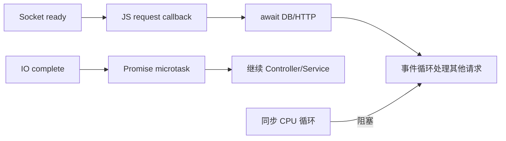

# Node.js 与 NestJS：运行时、模块和请求生命周期

Node.js 是运行 JavaScript 服务端代码的运行时，NestJS 是建立在它之上的模块化 HTTP 应用框架；二者位于请求入口和业务 Service 之间。事件循环负责推进异步回调，NestJS 的 Module、Guard、Pipe、Interceptor 和 Provider 负责组织应用边界，但不会替你消除同步 CPU 或资源生命周期问题。

NestJS Controller 中加入一次 800 ms 的同步密码批处理后，同进程所有请求都开始排队。JavaScript 回调主要在事件循环线程执行，同步 CPU 工作会阻塞这一线程。

## 事件循环在回调之间推进请求

Node 把 socket 交给操作系统等待，响应就绪后把回调排入相应阶段。Promise reaction 进入 microtask 队列，在当前回调结束后、继续下一轮事件前运行。`await` 只在等待 Promise 时让出，不会把之前的同步循环移到后台。

文件系统、部分 DNS、加密等工作可能使用 libuv 线程池；网络 socket 通常由事件通知处理。线程池有容量，批量密码哈希会竞争 CPU/内存，仍需业务并发上限或独立 Worker。



观察 event loop delay、CPU Profile 和在途请求。CPU 低时的慢请求则转查连接池、锁和下游等待。

## NestJS 请求管道按职责执行

Middleware 处理通用请求上下文；Guard 决定是否进入 Handler；Interceptor 可包裹执行并记录时间/转换结果；Pipe 校验和转换参数；Controller 调 Service；Exception Filter 统一映射错误。

顺序会影响状态：认证 Guard 需要 requestId/上下文已存在，Pipe 错误也应进入统一 Problem，Interceptor 若吞掉异常会让错误指标和事务处理失真。把业务权限只写 Decorator/Guard 会漏掉资源状态授权，Service 仍需校验。

下面的 Handler 只把框架输入交给 Service。Principal 来自 Guard，项目 ID 经 Pipe 校验，Service 拥有租户查询和业务错误。

```ts
@Get(":projectId")
@UseGuards(AccessTokenGuard)
async getProject(
  @Param("projectId", new ParseUUIDPipe()) projectId: string,
  @Principal() principal: Principal,
) {
  return this.projects.getProject({ principal, projectId })
}
```

不要注入原始 Response 后到处 `res.status().send()`，这会绕过 Interceptor/Filter 并使测试困难。流式/SSE 等确需底层响应时单独封装适配器。

## Module 与 Provider 决定对象生命周期

默认 Provider 是 Singleton，适合连接池、Repository 和无请求可变状态的 Service。Request-scoped Provider 每请求构造并沿依赖树传播，增加开销；只为读取 Principal 不必把整个数据层改成 request scope，可显式传参。

Module 导入导出依赖边界，避免 Auth、Projects、Files 相互循环。动态模块适合配置外部适配器，但 Secret 校验在启动阶段完成；Provider 构造函数不应发长时间网络请求。

requestId 与 Trace 上下文可用 AsyncLocalStorage 随异步调用传播，但它不是业务参数仓库。Principal、tenant_id 和资源版本仍显式传给 Service；上下文只放日志追踪等横切字段。第三方库若脱离异步资源链，上下文可能丢失，需要跨数据库、队列发布和 Timer 做集成检查。

Microtask 也可能让事件循环饥饿。递归创建已解决 Promise 会连续清空 microtask 队列，Timer 与新 socket 回调迟迟得不到运行；这类问题 CPU 未必打满。应结合 event loop delay 和火焰图定位，拆分批次或移到 Worker，继续增加 `await Promise.resolve()` 并不会释放这一轮 microtask。

| 横切需求 | NestJS 位置 | 仍需业务层处理 |
| --- | --- | --- |
| 身份认证 | Guard | 资源/租户授权 |
| 参数形状 | Pipe/DTO | 跨字段和状态规则 |
| 请求计时 | Interceptor | 业务步骤 Span |
| 错误协议 | Exception Filter | 领域错误分类 |
| 连接管理 | Singleton Provider | 事务边界 |

## 关闭时先停止入口，再释放外部连接

启用 shutdown hooks 后接收 SIGTERM，readiness 先失败，HTTP Server 停止新连接，再等待在途请求；随后取消 RabbitMQ Consumer、flush OpenTelemetry、断开 Prisma/Redis/MinIO。

不要在每个 Provider 的 destroy hook 各自无限等待。应用拥有总 shutdown deadline，每个组件得到子预算；测试在负载中发送 SIGTERM，证明未 ACK 消息重投且进程按时退出。

## Node 异步与 NestJS 生命周期边界

**把函数写成 async 是否一定不阻塞？**

不是。async 函数在第一个真正异步 await 前仍同步运行；JSON 大处理、循环、同步文件 IO 和密码哈希都能阻塞。用 Profile/event loop delay 观察并移入受限 Worker。

**Guard 能否访问数据库？**

可以，但每请求查询权限会增加连接压力，并可能与 Service 重复。Guard 做粗权限或缓存版本，依赖资源状态的决策由 Service 的租户范围查询完成。

**为什么 Singleton Service 不能保存 currentUser？**

同一实例服务并发请求，字段会被相互覆盖。Principal 显式作为参数或使用可靠请求上下文；Singleton 只保存不可变配置和线程安全客户端。

**Unhandled Promise rejection 会怎样？**

它表示异步错误失去所有者，进程行为随 Node 配置/版本变化。所有后台 Promise 都要被 await、进入任务系统或显式 catch 并上报，不能靠全局 handler 继续未知状态。
