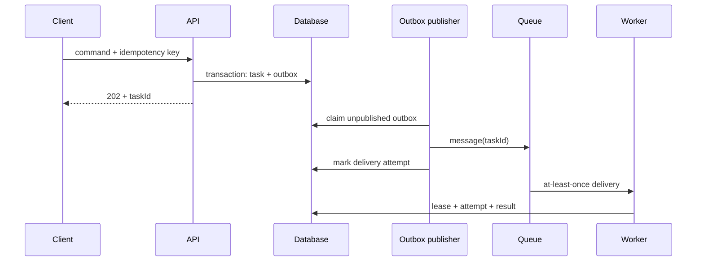
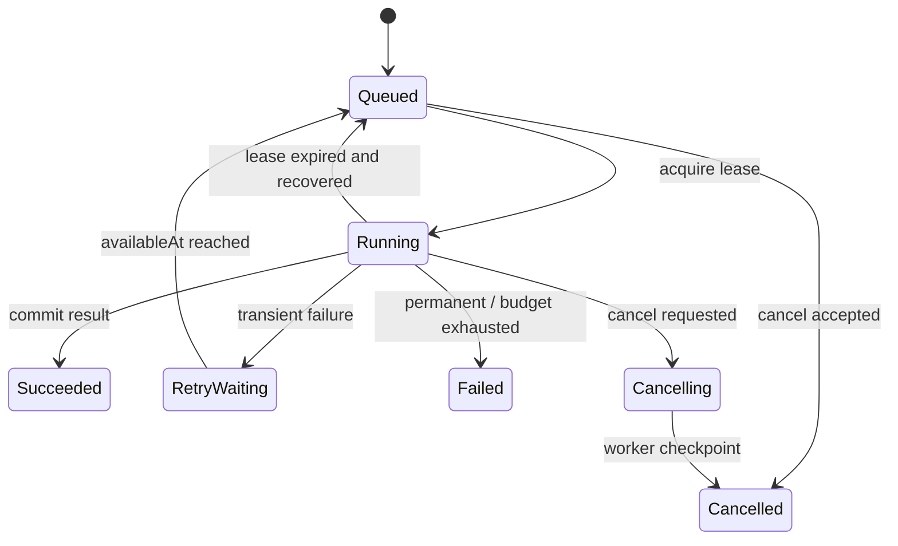

# Node 队列、幂等与重试

把工作放进 BullMQ、RabbitMQ 或 Kafka 只改变了执行位置，没有自动获得可靠性。消息可能重复、延迟、乱序；Worker 可能在副作用已经发生但 ACK 尚未完成时退出；发布方也可能在数据库提交后、消息发送前崩溃。工程目标不是幻想 exactly-once，而是让每一次不确定重放都得到可解释、可恢复的结果。

本文使用“异步生成文档投影”作为中性示例。任务会读取一个固定源版本，生成制品并原子激活。原则同样适用于导入、报表、通知、模型调用和媒体处理。

## 三种身份不要混用

一次异步工作至少有三个标识：

| 标识 | 表达什么 | 生命周期 |
| --- | --- | --- |
| `taskId` | 用户可查询的业务任务 | 从创建到清理 |
| `messageId` | 一次 Broker 投递 | 每次发布/重投可能不同 |
| `attemptId` | 一次实际执行尝试 | Worker 领取到终止 |

幂等键是第四个概念，它表达“两个提交在业务上是否是同一意图”。随机 UUID 只能去重网络重试时复用的同一请求；若调用方每次都生成新 UUID，就无法阻止相同源版本重复创建任务。合理键通常由租户、任务类型、源标识、源版本与参数摘要组成，并在数据库建立唯一约束。

```ts
function buildIdempotencyKey(input: ProjectionRequest): string {
  return sha256(canonicalJson({
    tenantId: input.tenantId,
    kind: 'document-projection:v2',
    sourceId: input.sourceId,
    sourceVersion: input.sourceVersion,
    options: input.options
  }))
}
```

规范化必须定义对象键顺序、缺省值、数字和 Unicode 行为。不要直接对任意 `JSON.stringify` 结果做摘要，也不要把未经授权的客户端字段全部纳入键，否则攻击者可以轻易绕过去重。

## 先提交任务事实，再发布消息

API 在一个事务中创建任务和 Outbox。独立发布器将 Outbox 投递到队列；重复请求命中唯一键后返回原任务，而不是再发一条消息。



数据库先提交、随后直接 `queue.add()` 会留下“任务存在但永不执行”的窗口；先发消息再提交则可能让 Worker 找不到任务。Transactional Outbox 保存的是发布意图，允许恢复器继续投递。发布器在 Broker 已接收但标记前退出会重复投递，所以消费者仍需幂等。

```sql
CREATE UNIQUE INDEX task_idempotency_unique
ON async_tasks (tenant_id, task_type, idempotency_key);

CREATE UNIQUE INDEX outbox_event_unique
ON outbox_events (event_id);
```

Outbox 不意味着永久重试。记录 `available_at`、尝试次数、最后错误类别和截止时间；超过预算进入隔离状态并告警。若 Broker 支持生产者确认，只有确认后才记录成功，但确认丢失仍按“不确定”处理。

## 持久状态机是唯一事实

队列内部的 waiting/active/completed 适合运维 Broker，却不应成为用户任务状态。Broker 清理、迁移或重新入队后，其 ID 和状态可能变化。业务数据库保存稳定状态机：



终态 `succeeded`、`failed`、`cancelled` 只能通过带版本条件的转换进入。每次转换追加事件或审计行，不能只覆盖一列后失去原因。

```ts
type TaskState =
  | 'queued'
  | 'running'
  | 'retry_waiting'
  | 'cancelling'
  | 'succeeded'
  | 'failed'
  | 'cancelled'

type TaskRecord = {
  taskId: string
  tenantId: string
  state: TaskState
  sourceVersion: string
  attempt: number
  stateVersion: number
  leaseOwner: string | null
  leaseExpiresAt: string | null
  deadlineAt: string
}
```

状态转换函数校验允许边，Repository 用 `WHERE state_version = :expected` 做乐观并发。取消与完成竞争时只有一个转换成功，失败方重新读取终态，不用“最后一次写入覆盖一切”。

## 租约解决 Worker 消失，而不是锁住整个任务

Worker 原子领取任务，写入短期租约。执行期间按阶段续租；进程崩溃后租约过期，恢复器把仍可执行的任务重新排队。租约必须有 fencing token 或递增 attempt，防止旧 Worker 暂停很久后恢复并覆盖新 Worker 的结果。

```sql
UPDATE async_tasks
SET state = 'running',
    attempt = attempt + 1,
    lease_owner = :worker_id,
    lease_token = lease_token + 1,
    lease_expires_at = now() + interval '45 seconds',
    state_version = state_version + 1
WHERE task_id = :task_id
  AND state IN ('queued', 'retry_waiting')
  AND (available_at IS NULL OR available_at <= now())
RETURNING attempt, lease_token, source_version, deadline_at;
```

后续进度和结果写入都携带 `lease_token`。即使旧执行者仍在运行，也无法用过期 token 提交。租约时长大于正常续租抖动但小于可接受恢复时间；长时间外部调用要设置自己的 deadline，不能只靠续租掩盖卡死。

## 阶段结果与副作用分别幂等

任务级去重只阻止重复创建，无法保证执行中每个副作用安全。一个任务可能完成解析后在写对象存储时退出，重放不应重新调用昂贵步骤或覆盖另一个版本。

把工作拆为可恢复阶段，每阶段输出带内容摘要、算法版本与源版本：

```ts
type StageResult = Readonly<{
  taskId: string
  stage: 'parse' | 'transform' | 'store' | 'activate'
  inputDigest: string
  implementationVersion: string
  artifactKey: string
  artifactDigest: string
  completedAt: string
}>
```

对象存储使用确定键并校验摘要；数据库激活使用源版本和目标版本条件；通知使用稳定 `deliveryId`；支持幂等键的第三方 API 传递稳定键。目标系统不支持幂等时，本地去重能缩小重复窗口，却无法严格证明远端 exactly-once，必须接受可重复副作用、建立对账或设计补偿。

结果发布遵循“构建不可变候选，验证后原子切换指针”。不要边处理边覆盖当前制品，否则半成品会被读流量看到，失败也无法回到已知版本。

## 重试必须先分类

重试是对暂时故障的容量预算，不是异常处理默认值：

| 类别 | 示例 | 处理 |
| --- | --- | --- |
| 暂时故障 | 连接重置、429、短暂 503、死锁受害者 | 指数退避与抖动 |
| 永久输入 | 格式无效、资源超限、参数不支持 | 立即失败 |
| 安全拒绝 | 权限撤销、租户范围不符 | 安全终止，不换来源 |
| 代码缺陷 | 不变量异常、未识别类型 | 失败并告警，不能无限重试 |
| 不确定副作用 | 调用超时但远端可能成功 | 先按幂等键查询/对账 |

指数退避使用 full jitter，避免一批任务同时恢复形成惊群：

```ts
function retryDelay(attempt: number, baseMs = 500, capMs = 30_000): number {
  const upper = Math.min(capMs, baseMs * 2 ** Math.max(0, attempt - 1))
  return Math.floor(Math.random() * upper)
}
```

同时限制最大次数、总截止时间和累计成本。例如三次模型调用仍可能超过成本预算；二十次 100ms 重试也可能越过用户请求的业务时限。读取 `Retry-After` 时仍要限制上限。捕获 `Exception` 全部自动重试会把编程错误和权限错误放大成持续流量。

死信队列不是垃圾桶。记录错误分类、原消息引用、版本和最后上下文；重放必须经过授权、限速和兼容检查。若当前 Worker 已无法解释旧消息版本，应由迁移器转换或部署兼容消费者，不能忽略未知字段继续执行。

## 取消是业务协议

Broker 的 remove/revoke 只能删除尚未领取的消息，不能可靠撤销已经运行的 JavaScript、数据库提交或远端请求。取消流程先持久化 `cancel_requested_at`，Worker 在阶段边界读取并停止后续副作用。

可取消的 I/O 使用 `AbortController`，CPU 或外部系统不支持取消时要等待当前原子步骤结束。最终状态区分：取消已接受、取消中、已取消，以及“完成先于取消”。API 不能在写下取消标记时就声称所有工作已停止。

```ts
async function runTask(context: TaskExecution): Promise<void> {
  for (const stage of context.plan) {
    await context.assertLease()
    if (await context.isCancellationRequested()) {
      await context.markCancelledAtBoundary(stage.name)
      return
    }
    await context.runStage(stage, { signal: context.abortSignal })
    await context.persistCheckpoint(stage.name)
  }
  await context.commitSuccess()
}
```

## 并发、顺序和背压

需要顺序的是同一聚合或同一源版本，而不是整个队列。可以按资源键分区、为每个资源设置并发 1，或使用乐观版本拒绝陈旧结果。全局单消费者会牺牲吞吐并把一个慢任务变成队首阻塞。

Worker 并发由最紧的下游决定：数据库连接池、模型 RPM/TPM、对象存储带宽、内存或 CPU。Node 事件循环能挂起许多 I/O，不意味着可以同时创建无限 Promise。在线任务、重型导入和离线评测分队列部署，避免重任务占满所有 Worker。

队列长度不是唯一容量信号。关注到达率、完成率、队列等待分位数、最老消息年龄和重试放大率。到达率持续大于处理率时，扩容只是短期措施；还需限流、降级或削减工作。

## 观测模型与数据保留

日志以 `taskId`、`attemptId`、`messageId`、`leaseToken` 关联，负载只记录白名单摘要。Trace 跨 API、Outbox、Broker 和 Worker 传播关联上下文，但业务任务状态不能只依赖可采样 Trace。

核心指标包括：

- `task_queue_delay_seconds`：创建到首次领取；
- `task_attempt_duration_seconds`：每次尝试耗时；
- `task_retry_total{reason}`：按可行动原因聚合；
- `task_terminal_total{state}`：终态比例；
- `task_lease_expired_total`：Worker 丢失或事件循环阻塞信号；
- `task_duplicate_delivery_total`：投递系统不确定性的可见度；
- `task_oldest_age_seconds`：判断积压是否伤及 SLA。

任务、事件和制品不能永久保留。先定义用户结果保留期、审计期和故障调查期，再做分层清理；删除任务前确保没有 Outbox、事件流或对象存储孤儿引用。幂等记录的保留期至少覆盖客户端可能重试和 Broker 可能重投的窗口。

## 验证：用故障而不是顺利路径证明可靠性

| 场景 | 注入点 | 必须证明 |
| --- | --- | --- |
| API 提交后退出 | Outbox 发布前 | 任务最终仍被投递 |
| Broker 收到后发布器退出 | 标记成功前 | 可能重复，但只执行一次业务结果 |
| Worker 写制品后退出 | ACK 前 | 重放复用/校验制品，不重复激活 |
| Worker 长暂停 | 租约过期 | 新 Worker 接管，旧 token 无法提交 |
| 两次取消/完成竞争 | 终态 CAS | 只有一个合法终态 |
| 下游持续 503 | 每次调用 | 截止时间后失败，不无限重试 |
| 权限执行中撤销 | 阶段检查 | 后续受限访问停止 |
| 新旧消息共存 | 滚动发布 | 兼容处理或明确隔离 |

```ts
it('rejects a stale worker after lease recovery', async () => {
  const first = await tasks.acquire(taskId, 'worker-a')
  clock.advanceBy(60_000)
  const second = await tasks.recoverAndAcquire(taskId, 'worker-b')

  await expect(tasks.commitSuccess(taskId, first.leaseToken, artifactA))
    .rejects.toMatchObject({ code: 'STALE_LEASE' })
  await tasks.commitSuccess(taskId, second.leaseToken, artifactB)

  expect(await tasks.result(taskId)).toEqual(artifactB)
})
```

故障测试要检查数据库行、制品、外部调用计数和事件序列，而不仅是函数有没有抛错。只有这样才能证明重试没有制造重复副作用。

## 常见错误

- 把队列的 completed 当作业务成功，不保存稳定任务记录。
- 认为 `removeOnComplete`、`acks_late` 或生产者确认提供 exactly-once。
- 用随机消息 ID 代替业务幂等键。
- 对所有异常自动重试，不设置总截止时间和成本预算。
- 任务消息携带 ORM 对象、Access Token 或大段敏感正文。
- 取消接口立即返回“已取消”，却没有 Worker 协作检查。
- 旧 Worker 恢复后仍能覆盖租约接管者的结果。
- 一个队列混跑在线、CPU 重型和离线任务，没有资源隔离。

## 参考资料

- [BullMQ Idempotent Jobs](https://docs.bullmq.io/patterns/idempotent-jobs)：任务幂等与重试设计原则。
- [RabbitMQ Consumer Acknowledgements](https://www.rabbitmq.com/docs/confirms)：消费者 ACK、重投和 Publisher Confirm。
- [PostgreSQL SKIP LOCKED](https://www.postgresql.org/docs/current/sql-select.html#SQL-FOR-UPDATE-SHARE)：并发任务领取和锁等待控制。
- [Transactional Outbox](https://microservices.io/patterns/data/transactional-outbox.html)：先提交任务事实、再可靠投递消息。
- [Idempotent Consumer](https://microservices.io/patterns/communication-style/idempotent-consumer.html)：至少一次投递下的消费去重。
