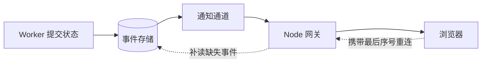

# Node 实时通信服务

后台任务需要一分钟，浏览器不能一直显示一个没有变化的转圈。我们希望页面依次看到 `created`、`running` 和 `completed`。如果网络在第二条事件后断开，重连时只补第三条，而不是丢失终态或把前两条重复执行。

本篇先选择通信协议，再建立事件序列、SSE 推送和断线重放。最后处理慢客户端与多实例。WebSocket 会作为需要双向通信时的扩展，而不是所有“实时”功能的默认答案。

## SSE、WebSocket 和轮询怎样选

SSE 是服务端到浏览器的单向文本事件流，沿用 HTTP，浏览器原生 `EventSource` 支持自动重连。WebSocket 是全双工连接，适合协作编辑、游戏控制或客户端需要高频发送的场景。轮询由客户端定期发起，实时性低一些，却最容易穿过既有代理，也适合作为兜底。

任务进度和生成文本大多是服务端单向发送，可以先选择 SSE。协议只解决传输，不负责保存业务事实；TCP 断开也只表示通道断开，不表示后台任务失败。



## 步骤一：先保存事件，再推送

每条事件包含所属 stream、单调递增的 sequence、唯一 eventId、类型和 Schema 版本。时间戳不能替代顺序，因为时钟会漂移，同一毫秒也可能出现多条事件。终态应明确为完成、失败、取消或拒绝。

业务状态与事件在同一事务或可靠投影中提交。推送层只发送已经提交的事件。若先推送再保存，客户端可能看到最终不存在的状态；若只保存最新状态，断线期间的增量就无法补齐。

## 步骤二：用 SSE 发送一条可重放的流

浏览器首次连接携带 `after=0`，服务端先读取历史，再订阅新事件。重连时带上最后一个已经解析并应用的序号。原生 `EventSource` 会使用 `Last-Event-ID`；使用自定义 fetch 流时也可以显式传递游标。

下面是根据 Node 可写流行为重写的最小发送循环。输入是一组已授权的事件，输出是符合 SSE 格式的文本帧。`response.write()` 返回 false 表示内部缓冲已满，此时等待 `drain`，避免无限占用内存。

```ts
async function writeSse(
  response: ServerResponse,
  source: AsyncIterable<StreamEvent>,
  signal: AbortSignal
) {
  for await (const event of source) {
    if (signal.aborted) break
    const frame = [
      `id: ${event.sequence}`,
      `event: ${event.type}`,
      `data: ${JSON.stringify(event.payload)}`,
      '', ''
    ].join('\n')

    if (!response.write(frame)) {
      await Promise.race([
        once(response, 'drain'),
        once(signal, 'abort')
      ])
    }
  }
}
```

发送前已经完成认证、资源授权和游标校验；断开时 AbortSignal 让异步读取停止，并释放订阅、Timer 与连接计数。代码只展示背压主线，生产实现还要设置响应头、心跳、错误映射和清理逻辑。

## 步骤三：用“快照加增量”恢复

客户端首次打开任务页时先获取当前快照，例如 `sequence=80`，随后订阅 `>80` 的事件。网络在 94 断开后，新网关从事件存储读取 `>94`，补齐后进入在线流。客户端只有成功应用事件后才推进游标，重复 eventId 直接忽略。

若游标早于事件保留窗口，服务端返回明确的 `cursor_expired`，客户端重新读取快照。悄悄跳到最新会让中间状态缺失。生成文本可以按稳定片段合并，不需要永久保存每个视觉字符，但开始、引用、错误和终态这类关键事件应可恢复。

## 步骤四：处理慢消费者和多实例

慢客户端会让 Node、代理和浏览器缓冲持续增长。每个连接应限制待发送字节、事件数和最大落后时间。可覆盖的进度事件可以合并，非关键遥测可以丢弃；终态、安全撤权和不可合并的协作操作不能随意丢弃。超出预算时发送 `resync.required` 后受控断开。

水平扩展时，实例内只保存易失连接。共享状态、事件序列和权限来源在外部系统，任何实例都能按游标恢复。粘性会话可以减少迁移，却不能成为正确性的前提。滚动发布先停止接收新连接，再让旧连接自然排空，最后提示客户端带游标重连。

浏览器原生 EventSource 不方便设置任意请求头。同站应用可以使用 `HttpOnly` Cookie 并校验 Origin，或先换取短期、单资源连接票据。长期 Access Token 不应放进 URL，因为 URL 容易进入历史、代理和日志。

## 正常结果和失败结果

| 场景 | 预期 |
| --- | --- |
| 首次连接 | 先补历史，再接收在线事件 |
| 在 sequence 5 后断网 | 重连只发送 6 及之后事件 |
| 同一事件重复到达 | 按 eventId 或 sequence 忽略 |
| 游标已经过期 | 要求重新获取快照 |
| 客户端停止读取 | 缓冲到阈值后合并或断开，内存稳定 |
| 网关实例退出 | 新实例从共享事件存储恢复 |
| 权限在连接期间撤销 | 在策略窗口内停止推送并关闭 |

测试应穿过真实代理，观察首事件延迟、响应缓冲和超时，而不只测试 EventEmitter。还要模拟后台标签页、网络切换、服务滚动发布和浏览器睡眠唤醒。Nginx 对 SSE 通常需要关闭响应缓冲，并设置与心跳匹配的读取超时；配置结果要由实际流式请求验证。

## 何时再引入 WebSocket

当客户端也需要持续发送命令、要求低延迟双向确认或传输二进制时，再选择 WebSocket。那时还要补充消息 ACK、入站限速、消息大小、协议版本和每条写命令的授权。下一篇开始 Python 后端，从一个最小 FastAPI 接口理解路由、业务和数据访问为什么需要分开。

## 参考资料

- [WHATWG Server-sent events](https://html.spec.whatwg.org/multipage/server-sent-events.html)
- [WebSocket Protocol RFC 6455](https://www.rfc-editor.org/rfc/rfc6455.html)
- [Node.js Streams](https://nodejs.org/api/stream.html)
- [Nginx WebSocket proxying](https://nginx.org/en/docs/http/websocket.html)
