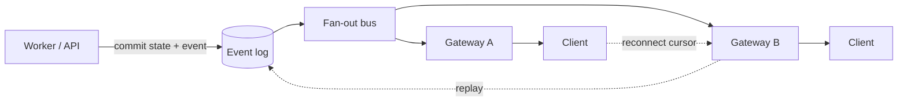
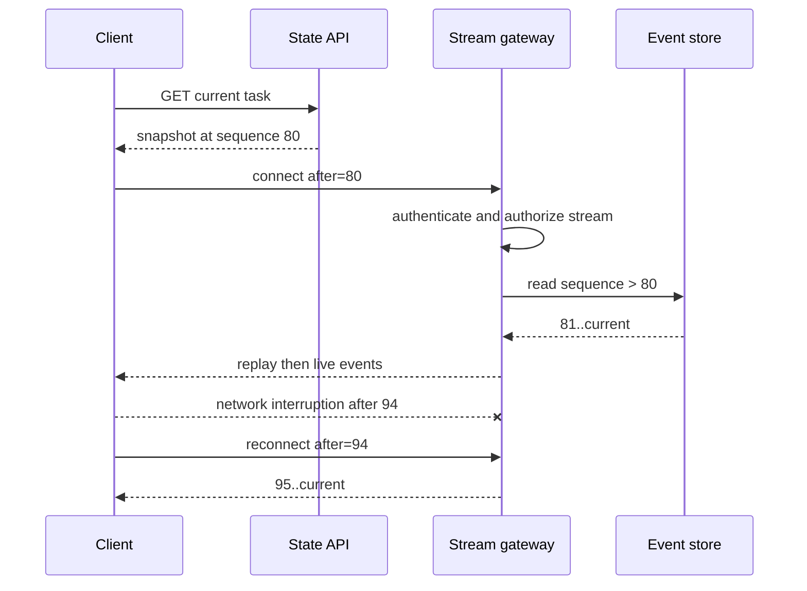

# Node 实时通信服务

实时服务的核心不是保持一个 socket，而是让业务事实在连接随时中断、实例随时替换的条件下仍然一致。连接是易失的传输通道；任务状态、事件顺序、权限和终态必须存在于可恢复存储中。否则用户刷新页面就丢进度，滚动发布就切断所有上下文，横向扩容还会看到不同实例各自的内存世界。

## 先按通信语义选择协议

SSE、WebSocket、普通 HTTP 轮询解决不同问题：

| 维度 | SSE | WebSocket | 条件轮询/长轮询 |
| --- | --- | --- | --- |
| 方向 | 服务端到客户端 | 全双工 | 客户端发起 |
| 数据 | UTF-8 文本事件 | 文本或二进制帧 | HTTP 响应 |
| 浏览器能力 | `EventSource` 自动重连，原生头部控制有限 | 显式连接与消息协议 | 最易经过现有网关 |
| 常见场景 | 任务进度、模型输出、通知 | 协作、低延迟双向控制 | 低频状态、兼容兜底 |
| 应用层仍需处理 | 鉴权、事件重放、背压、终态 | ACK、顺序、重放、背压、心跳 | ETag、间隔、并发请求 |

任务进度和生成式文本通常优先 SSE：协议简单，沿用 HTTP，重连可以携带 `Last-Event-ID`。持续双向状态同步、客户端高频发送或二进制数据才更适合 WebSocket。不要因为“实时”就默认 WebSocket，也不要把 HTTP/2 当成 WebSocket 的自动替代。

浏览器原生 `EventSource` 不方便设置任意认证头。可使用同站 `HttpOnly` Cookie 并做 Origin/CSRF 边界，或先通过受保护 API 换取短期、单资源、一次性的连接票据。不要把长期 Access Token 放进查询字符串，因为 URL 会进入历史、代理和日志。

## 事件协议独立于传输协议

SSE 的 `data:` 或 WebSocket frame 只是包裹。应用事件需要稳定结构：

```ts
type StreamEvent<TType extends string, TPayload> = Readonly<{
  streamId: string
  sequence: number
  eventId: string
  type: TType
  schemaVersion: 1
  occurredAt: string
  payload: TPayload
}>
```

`sequence` 在单个 stream 内单调递增，用于发现缺口和游标重放；`eventId` 用于去重；`schemaVersion` 支持滚动升级。时间戳不能代替顺序，因为时钟可漂移且多个事件可能同毫秒产生。

事件类型表示业务含义，如 `phase.started`、`token.delta`、`task.completed`，而不是把内部函数名暴露给客户端。终态必须明确为完成、失败、取消或拒绝；TCP 关闭、SSE `error` 或 WebSocket close 只表示通道变化，不等于任务失败。

## 先追加事件，再尝试推送

事件网关不应是业务事实的唯一保存者。状态变化与事件追加在同一事务或可靠投影链路中完成，推送层订阅已提交事件：



若先推送再保存，客户端可能看到一个最终不存在的状态；若只保存状态不保存事件，断线期间的增量无法补齐。事件日志可以是关系表、Redis Streams 或专门日志系统，但要明确保留期、顺序范围和读取权限。

```sql
INSERT INTO stream_events(stream_id, sequence, event_id, event_type, payload)
SELECT :stream_id,
       COALESCE(MAX(sequence), 0) + 1,
       :event_id,
       :event_type,
       CAST(:payload AS jsonb)
FROM stream_events
WHERE stream_id = :stream_id
ON CONFLICT (event_id) DO NOTHING;
```

真实高并发实现不能依赖无锁的 `MAX + 1`；可锁定 stream 元数据行、使用每流序列生成器或由单分区日志分配 offset。唯一约束至少覆盖 `(stream_id, sequence)` 与 `event_id`。

## 重连是“快照加增量”

客户端首次进入或游标过旧时获取当前快照，再从快照关联的事件序号订阅增量。重连携带最后完整处理的序号，服务端验证权限并补发其后事件，然后转入在线流。



SSE 格式示例：

```text
id: 95
event: phase.completed
data: {"schemaVersion":1,"phase":"retrieval"}

```

客户端只有在成功解析并应用事件后才推进本地游标。重复事件按 `eventId`/sequence 忽略，检测到序号缺口则暂停应用并请求重放。若游标早于服务端保留窗口，返回明确的 `cursor_expired`，客户端重新获取快照，不能悄悄跳到最新导致状态缺失。

生成式 Token 增量可以批量合并后持久化/传输，避免一个 token 一行事件。可恢复的关键是稳定片段或阶段事件，而不是保证每个视觉字符都永久保存。

## 背压发生在每一层

浏览器 WebSocket API 没有完整的接收背压；服务端 `socket.send` 也不意味着对端已经消费。SSE 的 HTTP 写缓冲、Node Stream、Broker 订阅和客户端渲染队列都可能积压。慢消费者若不受限，会让单连接占用不断增长的内存。

```ts
async function sendSse(
  response: ServerResponse,
  events: AsyncIterable<StreamEvent<string, unknown>>,
  signal: AbortSignal
): Promise<void> {
  for await (const event of events) {
    if (signal.aborted) break
    const frame = `id: ${event.sequence}\nevent: ${event.type}\ndata: ${JSON.stringify(event)}\n\n`
    if (!response.write(frame)) {
      await Promise.race([once(response, 'drain'), once(signal, 'abort')])
    }
  }
}
```

每条连接设置待发送字节数、事件数和最大滞后时间。超过预算时按业务选择：合并可覆盖的进度事件、丢弃非关键遥测、发送 `resync.required` 后断开，或直接关闭慢连接。不能丢弃终态、安全撤权和不可合并的协作操作。

WebSocket 发送端检查 `bufferedAmount` 或库提供的缓冲指标；入站消息限制大小、频率和未确认数。二进制压缩可能带来 CPU 与内存成本，不能只看带宽收益。

## 连接生命周期与心跳

连接建立步骤应固定：认证、资源授权、连接配额、游标验证、重放、进入在线订阅。每次重连都重新认证，不能因为 streamId 不可猜就视为授权。权限在长连接期间撤销时，通过短 TTL 重验、策略版本事件或主动断开传播。

心跳解决中间代理空闲超时和半开连接探测，不证明业务 Worker 健康。SSE 可以定期发送注释行 `: heartbeat`；WebSocket 使用协议 ping/pong 或应用心跳。客户端同时监控业务事件停滞，并通过状态 API确认任务是否仍运行。

断开时释放订阅、Timer、AbortController 和连接计数。Node 中只监听 `close` 不够时，要结合 response/request 的 aborted 状态，确保异步生成器停止读取。所有 cleanup 设计为幂等，避免 error 与 close 重复触发。

## 水平扩展不依赖粘性会话保证正确

粘性会话可减少订阅迁移，但不能成为正确性条件。实例本地只保存易失连接对象；共享状态、事件游标和授权来源在外部系统。任一实例都能从游标恢复。

Broker fan-out 有两种常见模式：每个网关订阅自己当前连接需要的 stream，或所有实例接收广播后本地筛选。前者节省流量但订阅管理复杂，后者简单却会随实例和事件量放大。规模增长后按 stream 分区并维护连接目录。

连接目录只用于路由优化，不能作为用户是否在线的强事实。实例可能在删除目录前崩溃；使用租约/TTL 和 instanceId，过期自然回收。需要“最后在线时间”时定义容忍误差，不要拿心跳直接驱动不可逆业务。

## 网关、部署与排空

反向代理对 SSE 要关闭响应缓冲、避免压缩器攒批并设置合理 read timeout；对 WebSocket 正确转发 Upgrade。任何配置都应通过实际流式测试验证，因为 CDN、Ingress 和应用中间件都可能缓冲。

滚动发布先把旧实例标记 not-ready，停止接收新连接；已连接流在排空期限内继续，或发送包含重连建议的服务事件后主动关闭。客户端带游标连接新实例。不能直接杀掉所有旧实例并依赖用户手动刷新。

```ts
async function drainGateway(deadlineMs: number): Promise<void> {
  readiness.markUnavailable()
  subscriptions.stopAccepting()
  connections.broadcast({ type: 'server.draining', retryAfterMs: 500 })
  await connections.waitForNaturalClose(deadlineMs)
  await connections.closeRemaining(1012, 'service restart')
}
```

WebSocket 关闭码和应用错误分开：协议错误、消息过大、认证过期、服务重启要能被客户端区分。客户端退避重连加入抖动，避免发布后所有连接同时冲击新实例。

## 安全与资源治理

- 建连前验证 Origin；浏览器 Cookie 认证尤其不能接受任意站点发起的连接。
- 每个主体、租户和 IP 设置连接数、建连速率与消息速率预算。
- 消息按 Schema 校验，限制深度、长度和解压后大小。
- streamId 与 tenantId 在服务端关联，查询时下推范围，不信客户端声明租户。
- 日志不记录完整 Token、Cookie、用户正文和每个生成片段。
- 长连接票据短期、单资源、一次使用；连接建立后仍受会话撤销控制。
- WebSocket 的双向写操作使用与 HTTP 相同的认证、授权、幂等和审计规则。

实时通道不是绕过 API 安全层的后门。前端隐藏按钮或只在握手时检查角色，都不能替代每条受保护命令的服务端授权。

## 观测：区分业务和通道健康

| 指标 | 说明 | 常见行动 |
| --- | --- | --- |
| 当前连接数/建连率 | 容量与重连风暴 | 扩容、限速、检查发布 |
| 重连率与原因 | 网络、代理、实例重启 | 按 close/error 分类 |
| replay 事件数/耗时 | 断线长度与存储性能 | 调整保留和索引 |
| 每连接待发送字节 | 慢消费者 | 合并、限额、断开 |
| 事件生成到送达延迟 | 端到端实时性 | 分解存储、Broker、网关 |
| cursor expired 数 | 保留窗口不足或离线过久 | 快照恢复、调整保留 |
| 终态送达率 | 用户是否能结束等待 | 查事件写入和回放 |

Trace 可以关联任务事件到网关发送，但高频增量不应每条创建重 Span。业务事件必须可靠记录；Trace 可采样。日志记录 streamId、sequence、connectionId 和事件类型，敏感 payload 只保留大小或摘要。

## 验证：网络故障和发布必须成为测试

```ts
it('replays only the missing events after reconnect', async () => {
  await events.append(streamId, fixtures.sequence(1, 8))
  const first = await client.connect({ streamId, after: 0 })
  await first.readThrough(5)
  first.forceDisconnect()

  await events.append(streamId, fixtures.sequence(9, 12))
  const resumed = await client.connect({ streamId, after: 5 })

  expect(await resumed.readThrough(12)).toHaveSequences([6, 7, 8, 9, 10, 11, 12])
  expect(client.appliedEventIds()).toHaveLength(12)
})
```

| 验证场景 | 预期 |
| --- | --- |
| 中途断网后重连 | 从最后已应用序号补齐，无重复状态变化 |
| 网关实例退出 | 新实例可读取共享事件并恢复 |
| 慢客户端停止读取 | 缓冲达到上限后合并或受控断开，内存稳定 |
| 事件存储暂时不可用 | 不伪造在线事件，连接返回可重试错误 |
| 游标过期 | 明确要求获取快照，不静默跳过 |
| 权限连接中撤销 | 在策略窗口内停止推送并关闭 |
| 滚动发布 | 旧实例排空，客户端抖动重连且终态不丢 |
| 代理开启默认缓冲 | 自动测试检测首事件延迟而失败 |

浏览器测试同时观察 DevTools 时间线和页面状态，模拟后台标签页、睡眠唤醒和移动网络切换。单测一个 EventEmitter 无法证明代理、浏览器和多实例行为。

## 常见错误

- 把内存连接 Map 和任务状态当成同一个数据模型。
- 把断开当失败、把连接成功当任务成功。
- 没有事件序号，重连后只能丢历史或整段重复。
- 只发心跳，不限制慢消费者缓冲。
- 把长期 Token 放 URL，或只在握手时做一次授权。
- 依赖粘性会话隐藏本地状态，实例替换后无法恢复。
- 发布时直接关闭所有连接，没有排空与抖动退避。
- 只测 localhost，未验证 Nginx/CDN 缓冲和超时。

## 参考资料

- [WHATWG Server-sent events](https://html.spec.whatwg.org/multipage/server-sent-events.html)：EventSource、事件 ID、重连与 MIME 语义。
- [WebSocket Protocol RFC 6455](https://www.rfc-editor.org/rfc/rfc6455.html)：握手、帧、Ping/Pong 与关闭语义。
- [Node.js Streams](https://nodejs.org/api/stream.html)：可写流背压和 pipeline 错误处理。
- [Nginx WebSocket proxying](https://nginx.org/en/docs/http/websocket.html)：Upgrade 转发、代理超时和连接隧道。
