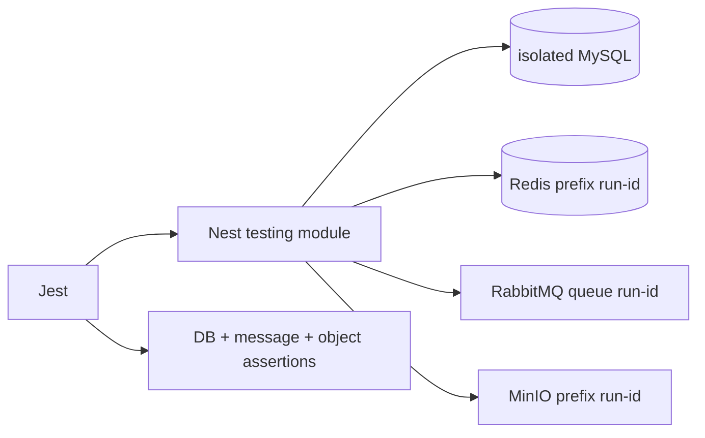

# Node.js 接入 Redis、RabbitMQ、MinIO 与质量门禁

RabbitMQ 重投文件任务，Node Worker 每次生成随机对象 key，于是 MinIO 出现三份结果；Jest 结束后进程又因 Redis 与 Channel 未关闭而挂住。外部依赖接入的难点不在 SDK 能调用，而在确定性 key、幂等提交、连接生命周期和隔离测试。

## 连接客户端由 Provider 统一拥有

Redis、RabbitMQ Connection/Channel 和 MinIO Client 在应用生命周期内复用，由 Infrastructure Module 创建、健康检查和关闭。业务 Service 依赖窄端口，不直接读取环境变量或 new SDK Client。

启动时验证 URL、TLS 和 Bucket/Exchange 配置；依赖暂不可用时 readiness=false，有限重连并抖动。连接错误不在每个请求内创建新客户端补救，否则故障会产生连接风暴。

RabbitMQ 的 Connection 和 Channel 不是同一层。TCP Connection 可以长期复用，Channel 承载 publish、consume、confirm 与异常状态；声明不存在的交换机等协议错误可能直接关闭 Channel。适配器收到 `close` 后要停止接受新发布，重建拓扑与 ConfirmChannel，再恢复 Outbox 派发。**只重连 TCP 而继续持有旧 Channel，发布调用可能已经失去确认能力。**

| 依赖 | Provider 拥有 | 业务方法关注 |
| --- | --- | --- |
| Redis | 连接、前缀、超时 | get/set/invalidate/rateLimit |
| RabbitMQ | Connection、Channel、confirm、prefetch | publish/consume 事件信封 |
| MinIO | Endpoint、TLS、Bucket | presign/head/delete |
| MySQL/Prisma | 连接池、事务客户端 | 状态与 Outbox |
| OpenTelemetry | SDK/Exporter | Span/结构化字段 |

## 任务 ID 同时约束消息、对象与数据库状态

API 在 MySQL 创建 task 与 Outbox；Worker 收到 task_id 后领取 attempt，用确定性对象 key `tenant/task/task-id/result.json` 上传。完成更新匹配 task_id 与 attempt，旧 Worker 无法覆盖新结果。

上传对象后、数据库完成前崩溃会重投；相同 key 的 PUT 应得到相同内容或先比 checksum。若结果依赖版本，把 content_version 放 key，不能让旧任务覆盖新源文件。

消费代码先读取当前租约，上传确定性 key，最后条件提交并 ACK。每个调用都有 timeout/AbortSignal。

```ts
const objectKey = [
  "tenants", task.tenantId,
  "tasks", task.id,
  "attempt-" + task.attempt + ".json",
].join("/")

await objectStore.put(objectKey, result, { signal })
const committed = await tasks.completeIfOwned({
  taskId: task.id,
  attempt: task.attempt,
  objectKey,
})
if (!committed) throw new LostTaskLease(task.id)
channel.ack(message)
```

LostTaskLease 时不能把旧 attempt 标成成功。对象成为孤儿，由按 task 状态和保留期执行的清理器删除；ACK/NACK 由错误分类决定。

发布端也有一个不能省略的状态。Outbox Dispatcher 在 ConfirmChannel 上发送事件，等待 Broker confirm 后才把 `published_at` 写入 MySQL。网络在 confirm 返回前中断时，发布结果未知，Dispatcher 会再次发送；消费者必须用 `event_id` 的唯一 Inbox 记录去重。Publisher confirm 证明 Broker 接收了消息，**不证明消费者完成业务，也不等于 MySQL 与 RabbitMQ 原子提交。**

## 测试用真实依赖验证协议，用替身验证规则

Service 单测替换 Cache、Publisher 和 ObjectStore 端口，验证 key、错误分类与状态转换。集成测试启动固定版本 Redis/RabbitMQ/MinIO/MySQL，使用唯一 run_id 前缀、Queue 与 Bucket key，测试结束精确删除。

RabbitMQ 测试包含 Consumer 崩溃重投、非法消息 DLQ 和 confirm；MinIO 验证 presign、HEAD、checksum、超限/不存在；Redis 验证 TTL、原子限流和失效。只 Mock SDK 无法证明。



并行测试不共享 Queue consumer 或数据库行。失败时保留容器日志到临时 Artifact，清理只匹配当前 run_id。

## 质量门禁覆盖编译之外的运行事实

Node 项目运行 ESLint、TypeScript、Jest 单元/集成、OpenAPI 契约和生产 build；镜像启动后做 health 与 SIGTERM drain。依赖锁文件固定，native argon2 模块在目标架构镜像中验证。

运行指标观察 Redis 错误/命中、publish confirm、ready/unacked/DLQ、MinIO 延迟、任务 oldest age 和进程 event loop delay。外部依赖错误按稳定 code 输出，不泄露 endpoint 和凭证。

停机测试不能只看进程最终退出。先把 readiness 切为失败，停止 HTTP 新流量与 Consumer 拉取，等待有上限的在途任务；随后关闭 Channel、Connection、Redis、Prisma，最后 flush Trace。测试在 confirm 未返回、对象正在上传和 Redis 命令超时三个位置发送 SIGTERM，确认消息要么已 ACK 并有数据库终态，要么会被重新投递。

## Node 外部依赖继续追问

### RabbitMQ Channel 可以被多个 Consumer 共用吗？

技术上可行，但确认、prefetch 和错误会互相影响。通常按用途建立有限 Channel，Connection 复用；关闭顺序先 cancel Consumer，再关 Channel/Connection。

### MinIO 上传能否放在 MySQL 事务里？

不能形成原子提交，且长上传持有数据库连接和锁。先建立任务/对象状态，上传后用条件事务提交，失败由清理和重试恢复。

### Jest `--forceExit` 为什么不是修复？

它掩盖未关闭的 Server、Timer、Redis/RabbitMQ 连接，生产停机同样会泄漏。用 open handles/生命周期 hook 找到所有者并显式关闭。

### 缓存异常时 Node API 应自动无限重连吗？

无限快速重连会阻塞和放大故障。客户端退避重连，业务按操作选择降级/拒绝，readiness 与告警反映状态，并保护 MySQL 回源。
