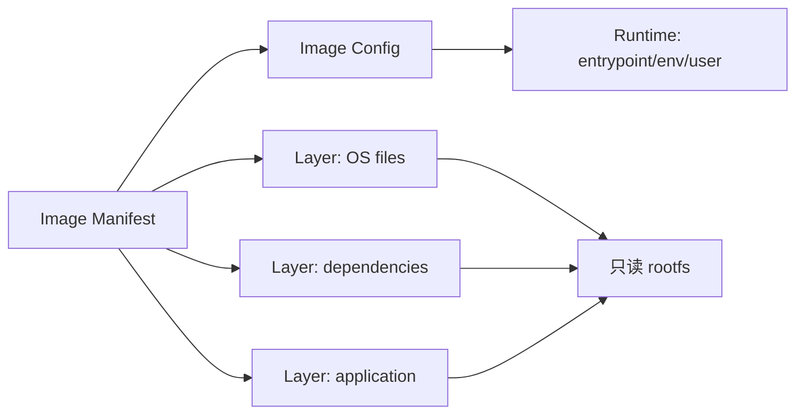

# OCI 镜像、容器网络与卷

镜像 `backend:v1` 只有几百 MB，容器启动后却立刻退出；重新 `docker run` 又得到一个全新的可写层。镜像是不可变文件系统和运行配置的打包描述，容器是基于镜像创建的一组隔离进程。把两者都叫“Docker”会看不清数据、网络和生命周期。

## OCI 镜像由清单、配置和只读层组成

镜像 Manifest 指向 Config 与按顺序叠加的 Layer。Layer 是内容寻址的压缩文件系统变更，Config 保存入口、环境、工作目录和 rootfs 摘要。同一 Layer 可被多个镜像复用，镜像 digest 则标识确定内容。

Tag 只是可移动名称，`api:latest` 今天与明天可能指向不同 digest。CI 发布不可变制品时记录 digest，部署也按 digest 或唯一版本 Tag 拉取，才能证明测试和上线使用同一内容。



容器启动时在只读层上加一个临时可写层。删除容器会删除该层，除非数据写入 Volume 或外部服务。

## Namespace 隔离视图，cgroup 限制资源

容器进程仍是宿主机进程。PID、mount、network、UTS 等 Namespace 让它看到独立视图；cgroup 统计并限制 CPU、内存和进程数。隔离不等于虚拟机，也不等于安全边界自动完整。

容器内 PID 1 负责接收信号和回收子进程。应用或 init 若不转发 SIGTERM，编排器只能等 grace period 后 SIGKILL，在途请求与任务就会被截断。

| 机制 | 解决 | 不负责 |
| --- | --- | --- |
| PID Namespace | 进程视图隔离 | 限制 CPU/内存 |
| Network Namespace | 接口、路由、端口隔离 | 自动开放公网 |
| Mount Namespace | 挂载视图隔离 | 持久保存可写层 |
| cgroup | 资源统计与限制 | 应用优雅退化 |
| Seccomp/capability | 缩小系统调用和权限 | 修复应用漏洞 |

## 容器网络有监听、寻址和发布三层

应用在容器内监听 `127.0.0.1` 只允许同一 Network Namespace 访问；通常监听 `0.0.0.0:3000`，其他容器再通过服务名和容器端口连接。宿主端口发布把宿主地址映射到容器端口，是额外一步。

数据库连接写 `mysql:3306`，不是 `localhost:3306`；容器里的 localhost 指当前容器。生产数据库不必发布到公网，API 与数据库加入受控内部网络即可。

下面命令只读取容器状态，用于区分进程退出、监听错误和端口映射。容器名需要替换成当前隔离环境实例。

```bash
docker ps -a --filter name=backend-api
docker inspect backend-api --format '{{json .State}}'
docker logs --tail 100 backend-api
docker exec backend-api ss -lntp
```

`docker ps` 显示容器生命周期，inspect 显示退出码/OOM，日志显示应用错误，容器内 `ss` 证明真实监听地址。只有四者对齐后才修改端口配置。

## Volume 只解决存放位置，不解决备份一致性

Named Volume 与 Bind Mount 把数据放到容器可写层之外，容器重建后仍存在。数据库使用 Volume，还需要数据库级备份、权限、版本兼容和恢复演练；复制一个正在写入的数据目录未必得到一致备份。

应用容器尽量只读根文件系统，临时文件写受限 tmpfs，对象写 MinIO/S3。Secret 通过编排平台注入，不能烘进镜像 Layer，因为删除后仍可能存在于历史层。

## 容器隔离与资源边界

**容器退出后为什么不能 exec 进去排查？**

容器主进程已经不存在。先用 inspect 查看退出码、OOM 与时间，用 logs 查看 stdout/stderr；需要交互时用同镜像覆盖 entrypoint 启动隔离调试容器，不修改原数据卷。

**镜像层越多是否一定越大？**

层数不是唯一因素，删除前一层的大文件不会从历史层消失。使用多阶段构建、合理复制顺序和 `.dockerignore`，并用镜像分析工具检查各层真实内容。

**内存 limit 达到后发生什么？**

内核会在 cgroup 内回收，无法满足时可能 OOM kill 进程，容器常以 137 退出。应用应设置合理堆上限、监控 working set 和 OOM 事件，不能只依赖重启。

**容器使用非 root 后为何仍读不到挂载文件？**

镜像内 UID/GID 与宿主卷属主可能不一致，目录遍历位、SELinux/AppArmor 也会限制。检查运行用户、每级目录、挂载选项和安全上下文，不用 777 掩盖。
