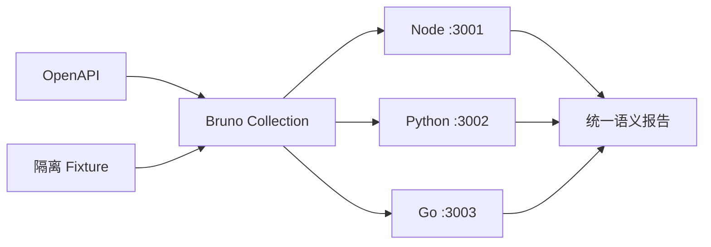

# OpenAPI、Bruno 与 API 安全测试

OpenAPI 是 API 的机器可读协议，Bruno 是发送请求并保存断言的客户端测试工具，安全测试则主动构造越权、重放和伪造输入来验证拒绝边界。三者位于接口实现之外的契约与运行验收层，目标是证明客户端看到的状态码、Schema、Header 和安全失败在不同实现中一致。

NestJS、FastAPI 和 Gin 都返回 200，但 Python 响应少了 `requestId`，Go 对跨租户资源返回 403。编译各自通过无法发现外部语义分叉，因此同一 OpenAPI 与 Bruno 集合要依次访问三套 API。

## 契约测试把规范变成可运行断言

OpenAPI 定义请求和响应形状，测试先从示例/Fixture 创建资源，再发送合法、非法、未认证和越权请求。响应通过 JSON Schema 校验，并检查 operation 特有不变量。

只验证 2xx 不够。统一 Problem 的字段类型、字段错误、requestId、Content-Type 和无敏感细节都要断言；204 不解析 JSON，429 检查 Retry-After，游标只作为 opaque 值回传。

这是 Bruno 响应测试脚本的核心意图，具体 API 以当前 Bruno 版本为准。它验证跨租户 404 不泄露租户存在性。

```javascript
test("cross-tenant resource is hidden", function () {
  expect(res.getStatus()).to.equal(404)
  const body = res.getBody()
  expect(body.code).to.equal("resource_not_found")
  expect(body.requestId).to.be.a("string")
  expect(JSON.stringify(body)).not.to.include("tenant")
})
```

测试需要先用租户 A 创建资源，再用租户 B 的 Access Token 访问同一 ID；只请求一个不存在 UUID 无法证明租户隔离。
## 环境文件只保存地址，不保存长期凭证

Bruno environment 保存 `baseUrl` 和非敏感测试开关。测试 setup 创建临时租户/用户并登录，令牌存在运行时变量，结束后通过管理 Fixture 或隔离数据库清理。

Node、Python、Go 分三次启动在不同端口，同一集合只替换 baseUrl。不能为某语言建立“稍微不同”的断言；确有框架差异应在适配层收敛，或先修改共同契约。

| 场景 | 必须一致 | 额外状态检查 |
| --- | --- | --- |
| 登录失败 | 401 + invalid_credentials | 不泄露用户是否存在 |
| Refresh 重放 | 会话族撤销 | 旧新 Token 都失效 |
| 项目冲突 | 409 + version_conflict | 数据库未被覆盖 |
| 重复幂等键 | 同一资源/响应 | 只存在一条业务记录 |
| 文件完成 | 任务 ID + 状态 | 对象 checksum 与数据库一致 |
| SSE | 事件类型与顺序 | 断线重连/终态 |
## 安全测试主动构造攻击者可控输入

修改 tenant_id、owner_id、role_id，尝试水平和垂直越权；重复 Refresh、幂等键和支付回调；上传伪装文件；给排序字段、游标和 URL 输入恶意值。目标是验证稳定拒绝和无副作用。

测试响应不含 SQL、堆栈、内部路径和 Secret；日志脱敏可在测试采集器中断言。速率限制用隔离 key 和较低阈值验证，不能压垮共享环境。



报告按 operation 和场景比较，不只统计通过数量。某实现漏字段或状态码不同必须阻断。
## 契约失败先判断规范、实现还是测试错

先保存请求原文、响应状态/Header/Body、实现版本和数据库状态。规范若含糊，暂停三套实现修改并先明确契约；实现偏离则只修对应适配；测试 Fixture 错则修初始化并重跑全部实现。

契约测试不是生产数据巡检。它运行在隔离环境，拥有最小管理权限；生产验证使用低风险只读/临时数据与单独 Runbook。

集合执行前创建独立租户、用户和资源，执行后按 run_id 精确清理。测试顺序不能依赖上一次残留 Token；同一集合访问三个实现时分别使用 Cookie Jar 和数据前缀。否则一套服务的 Refresh 轮换会让另一套用例随机 401，问题来自测试状态污染而不是契约差异。
## 契约测试与越权验证边界

**OpenAPI 校验通过为何仍可能越权？**

Schema 只验证输入输出形状，不知道当前用户是否能操作目标。需要构造两个租户/角色，验证同一资源在不同 Principal 下的状态和副作用。

**三套实现内部错误信息不同怎么办？**

内部日志可以不同，对外通过统一错误适配器映射稳定 code/detail/requestId。测试不依赖框架默认 Validation Error。

**Bruno 是否替代单元和集成测试？**

不能。它擅长外部协议和工作流，难以精确定位 SQL、锁和纯规则。三层测试共同覆盖，不把所有组合都变成慢 API 测试。

**测试 Refresh Cookie 时怎样读取 HttpOnly？**

不需要 JavaScript 读取。HTTP 客户端 Cookie Jar 保存 Set-Cookie 并在后续请求发送；测试检查响应和会话状态，HttpOnly 属性通过 Header/浏览器验证。
