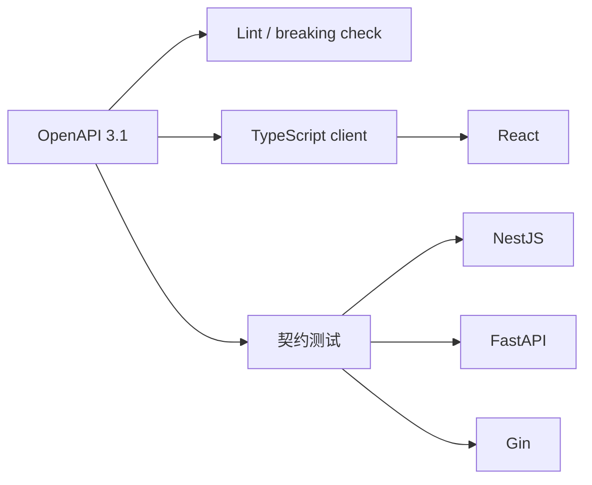

# OpenAPI 契约、类型生成与兼容变更

OpenAPI 是描述 HTTP API 的机器可读契约，记录路径、方法、参数、请求体、响应、错误和安全要求。它位于服务实现与客户端生成、契约测试之间：服务根据它暴露协议，工具根据它生成类型，测试根据它检查运行时是否偏离。类型生成只解决编译期重复定义，不替代服务器的运行时校验。

后端把 `nextCursor` 改成 `next_cursor`，React 编译仍通过，页面翻页后却总回第一页。前后端各自手写 TypeScript/Python/Go 类型不能证明运行时一致；共享契约可以把这种漂移放进生成和测试门禁。

## OpenAPI 描述的是线上协议

OpenAPI 3.1 文档由 `openapi`、`info`、`paths`、`components` 等组成。Path Item 描述操作，Parameter 区分 path/query/header/cookie，Request Body 与 Response 使用媒体类型和 JSON Schema 表达数据形状。

契约不应只覆盖 200。401、404、409、422 和 429 的响应结构、Header 与示例同样属于客户端可观察行为。共享的 Problem Schema 让三套后端返回相同 `status`、`code`、`detail`、`requestId` 和字段错误。

下面截取项目详情操作。观察 `$ref` 如何让成功资源与错误结构复用；完整契约仍需包含安全方案和所有状态码。

```yaml
paths:
  /projects/{projectId}:
    get:
      operationId: getProject
      parameters:
        - in: path
          name: projectId
          required: true
          schema: { type: string, format: uuid }
      responses:
        "200":
          description: Project in the current tenant
          content:
            application/json:
              schema: { $ref: "#/components/schemas/Project" }
        "404":
          $ref: "#/components/responses/ProblemNotFound"
```

`operationId` 应稳定且唯一，生成器据此产生方法名。跨租户与真实不存在都返回同一 404 Schema，避免契约泄露资源是否存在。
## 生成客户端消除重复类型，不消除运行时失败

CI 从固定版本的 OpenAPI 生成 TypeScript 类型和请求函数，React 通过环境变量切换 API Origin，但不切换类型。生成文件由工具维护，不手工修改；契约变化后重新生成并审查 diff。

类型生成只约束开发期。代理可能返回 HTML 502，旧服务可能输出错误字段，因此请求层仍要检查状态、Content-Type，并按生成的 Schema 做必要运行时验证。



契约是共同输入，不是某一个后端导出的临时文档。三套实现必须通过同一组可观察行为测试。
## 兼容性按消费者能否继续工作判断

新增可选响应字段通常向后兼容；删除字段、把可选改必填、收窄枚举或改变状态码可能破坏旧客户端。新增必填请求字段尤其危险，因为已发布客户端不会发送。

“数据库列没改”与 API 兼容无关。API Resource 可以组合多表，也可以隐藏字段。先修改契约并运行 breaking-change 检查，再实现服务与客户端；需要破坏性变化时采用版本化或兼容迁移窗口。

| 变更 | 通常影响 | 更安全的演进 |
| --- | --- | --- |
| 新增可选响应字段 | 旧客户端忽略 | 直接新增并测试 |
| 重命名字段 | 旧客户端读不到 | 一段时间同时返回新旧字段 |
| 新增枚举值 | 穷举客户端可能失败 | 客户端保留 unknown 分支 |
| 请求字段改必填 | 旧客户端 422 | 先可选并提供默认语义 |
| 200 改 204 | 客户端解析 JSON 失败 | 保留语义或同步升级版本 |
## 契约漂移要在 CI 阻断

Lint 检查 operationId、响应和 Schema 规范；生成步骤必须得到干净 diff；契约测试启动真实服务，发送合法和非法请求并校验状态与 Body。只比较路由是否存在不够。

框架可以从代码生成 OpenAPI，也可以契约优先。三语言共享时更适合把仓库中的 OpenAPI 作为评审入口，各实现对齐它；框架生成文档可与基准规范比较，但不能悄悄覆盖基准。
## 契约设计的进一步判断

**OpenAPI 能描述所有业务规则吗？**

它擅长协议形状和部分校验，无法完整表达“只有管理员能把 active 改成 disabled”这类带身份和当前状态的规则。规则仍由 Service 实现，并通过描述、错误码和场景测试记录。

**为什么服务返回多一个字段也可能有风险？**

宽松客户端通常忽略，但严格 Schema 校验或签名计算可能失败，新字段也可能泄露敏感数据。兼容判断应基于实际消费者和安全审查，而不只依赖通用规则。

**游标分页怎样写进契约？**

请求定义可选 cursor 与 limit；响应定义 items 和 nullable/optional nextCursor，并明确排序语义。游标本身视为 opaque string，客户端不得解析内部字段。

**接口文档页面能替代契约测试吗？**

不能。页面只展示规范，无法证明运行服务按规范返回。契约测试要针对实际构建启动服务，校验正常、错误、权限和边界请求。
