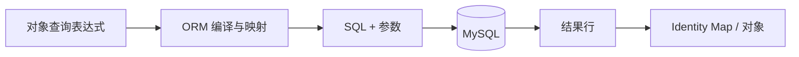

# ORM、Unit of Work 与 N+1 查询

ORM 把数据库记录映射成应用对象；Unit of Work 管理一组对象变化和事务提交；N+1 是先查一批父记录、再为每条父记录重复发查询的访问模式。它们位于领域代码和数据库 SQL 之间，映射方便不等于往返次数、事务边界和权限范围已经被正确设计。

项目列表只写了一行 ORM 查询，日志却出现 101 条 SQL：先查 100 个项目，模板访问每个项目的成员时又各查一次。ORM 隐藏了 SQL 拼装，不会消除数据库往返、连接占用或查询基数。

## ORM 负责映射，不负责替你设计数据

ORM 把表行映射成对象，把表达式转换成 SQL，并追踪对象变化。它减少重复数据访问代码，但表关系、索引、事务和权限范围仍由开发者设计。

读取 ORM 代码时要同时能回答：生成几条 SQL、每条返回多少行、使用哪个索引、何时提交。只看对象 API 会错过真正成本。



SQL 日志用于观察映射结果，但生产日志要参数脱敏并采样，不能记录密码、Token 或敏感正文。
## Unit of Work 把一组变化放进同一提交

Unit of Work 追踪当前工作单元加载、创建和修改的对象，在 flush 时生成 SQL，在 commit 时提交事务。SQLAlchemy Session、Prisma 事务客户端和 GORM transaction 都承担类似职责，具体 API 不同。

flush 只是把 SQL 发送到当前事务，不代表其他事务可见；commit 才完成事务。失败后要 rollback，并丢弃或刷新内存中可能过期的对象状态。

下面用 SQLAlchemy 2 风格展示工作单元。观察 `flush` 取得数据库生成状态，但事务直到上下文正常结束才提交。

```python
async with session.begin():
    project = Project(
        id=project_id,
        tenant_id=principal.tenant_id,
        name=input.name,
    )
    session.add(project)
    await session.flush()
    session.add(AuditLog.from_project(project, principal.user_id))

# 离开 begin 且无异常后 commit；异常则 rollback
```

项目和审计使用同一 Session 与事务。若审计写入失败，项目也回滚，避免“业务已改但审计缺失”。外部消息不能在此直接假设与数据库原子提交，应使用 Outbox。
## N+1 来自关联加载时机

Lazy loading 在访问关联属性时发查询，循环访问就形成 N+1。Join eager loading 用一条 JOIN 取回，可能产生重复父行；select-in loading 先查父项，再用 `WHERE project_id IN (...)` 批量查关联，通常是两条 SQL。

没有一种加载策略永远最好。列表需要成员数量时应直接聚合，不必加载成员对象；详情页需要少量完整成员时可批量预加载。用 SQL 计数和返回行数验证，不凭 ORM 方法名猜测。

| 场景 | 策略 | 代价 |
| --- | --- | --- |
| 100 项只显示成员数 | 聚合查询 | 不返回成员详情 |
| 20 项显示少量成员 | select-in 批量加载 | 两次往返、应用组装 |
| 单项详情与一对一关系 | JOIN eager | 列重复但规模可控 |
| 关系不一定使用 | 显式加载 | 调用方要声明需要什么 |
## Repository 返回什么决定事务是否泄漏

若 Repository 返回仍依赖打开 Session 的 lazy 对象，序列化阶段可能意外发 SQL，甚至在事务已经结束后报错。API 边界更适合返回已加载实体或明确 DTO。

分页、租户过滤和软删除条件应集中在可测试的查询构造中。任何“根据主键直接 First”都要检查是否遗漏租户范围；ORM 不会自动知道你的授权模型。

Identity Map 只保证当前工作单元内的对象身份，不保证值始终最新。另一事务提交后，旧 Session 中已加载对象仍可能保留旧字段；需要重新决策时显式 refresh 或开始新的工作单元，不能把 ORM 会话当共享缓存。
## 用 ORM 仍要回答的 SQL 问题

**ORM 能防 SQL 注入吗？**

使用参数化表达式通常能避免把值拼入 SQL，但原始 SQL、动态列名和排序字段仍要白名单。ORM 也无法阻止越权查询，租户和数据范围必须显式进入条件。

**为什么测试中没有 N+1，线上却出现？**

测试数据常只有一两个父项，额外查询不明显。加入查询计数断言，并使用接近页面大小的 Fixture；同时在 Trace 中记录 SQL 数量和数据库总耗时。

**对象已经修改，rollback 后还能继续用吗？**

ORM 可能把对象标记为过期、分离或保留内存修改，具体取决于框架。可靠做法是 rollback 后结束当前工作单元，重新查询需要的数据，不把失败事务中的对象继续传递。

**Repository 是否应该调用 commit？**

单表工具有时这么做，但跨多个 Repository 的业务操作会失去原子性。通常由 Service 或 Unit of Work 拥有事务，Repository 只在传入的事务上下文中查询和修改。
