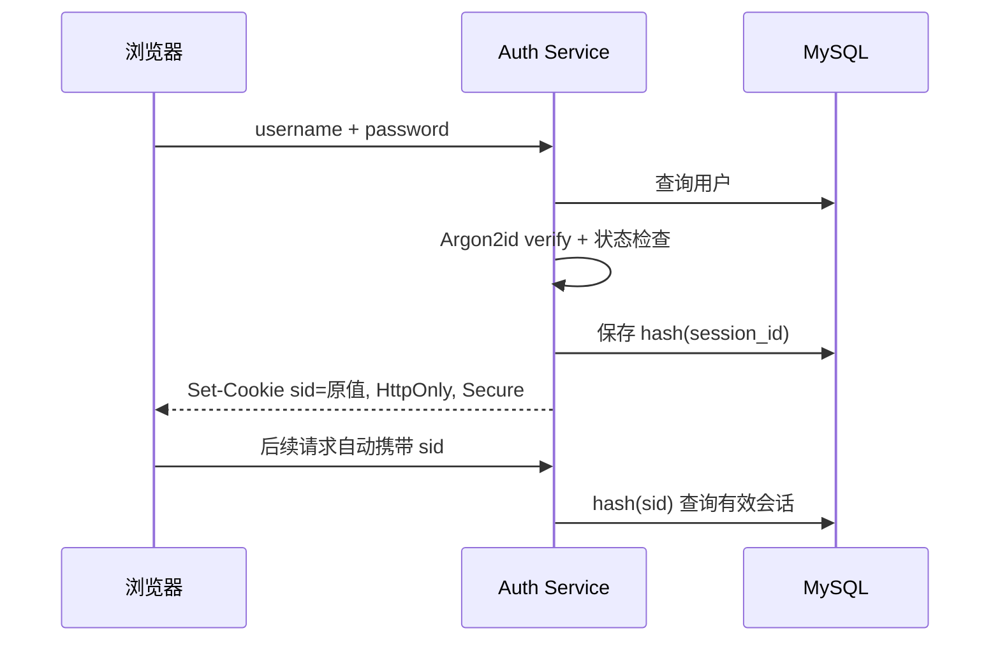

# 密码、Cookie、Session 与登录流程

数据库泄露后，如果保存的是明文或普通 SHA-256，攻击者可以高速离线尝试密码。密码存储的目标不是“加密后还能解开”，而是使用带随机盐、耗时且耗内存的单向 KDF，让每次猜测都付出成本。登录成功后再建立一条可撤销的服务端 Session。

## 密码哈希保存算法参数和随机盐

Argon2id 输出字符串包含算法版本、内存、迭代、并行度、盐和哈希。盐为每个密码随机生成，阻止相同密码得到相同结果和彩虹表复用；盐不需要保密。可选 pepper 应放 Secret 管理系统，不能与数据库一起保存。

参数要在目标服务器基准测试，使单次验证足够昂贵又不拖垮登录容量。OWASP 当前给出的一个最低组合是约 19 MiB 内存、2 次迭代、并行度 1；实际系统按硬件、并发和风险提高，并记录算法版本以便升级。

下面使用 Node `argon2` 库表达注册与登录边界。示例参数只是起点，部署前要在目标运行环境测量并设置登录并发上限。

```ts
const passwordHash = await argon2.hash(password, {
  type: argon2.argon2id,
  memoryCost: 19 * 1024,
  timeCost: 2,
  parallelism: 1,
})

const valid = await argon2.verify(user.passwordHash, password)
if (!valid) throw new InvalidCredentials()
```

验证函数从存储字符串读取参数。算法升级时，成功登录后可检测旧参数并重新哈希；失败时返回统一 invalid_credentials，不暴露账号是否存在。

## 登录流程先验证凭证，再创建会话

服务按规范化账号查用户。账号不存在时也执行接近真实成本的伪哈希验证，减少明显计时差异；随后检查密码、账号状态和必要的多因素步骤。只有全部通过才创建 Session。

随机 Session ID 至少具有足够熵，浏览器只持有原值，数据库保存哈希、user_id、创建/过期时间、最后使用时间、撤销状态和必要设备信息。原始 ID 写入 HttpOnly、Secure Cookie。



Session ID 本身没有用户信息。服务端查询允许立即撤销、限制并发会话，并在密码修改后终止全部会话。

## 限速按账号、来源和全局容量分层

只按 IP 限流会误伤共享出口，也容易被分布式攻击绕过；只按账号会允许攻击者锁死目标用户。常见做法组合账号退避、IP/设备速率、异常检测和全局并发保护。

错误消息保持一致，但内部审计区分用户不存在、密码错误、已禁用、MFA 失败。不要把密码、Session ID、Authorization 或完整 Cookie 写入日志。

| 风险 | 控制 | 失败后保留的证据 |
| --- | --- | --- |
| 撞库 | 账号/IP 速率、泄露密码检查、MFA | 规范化账号哈希、来源、结果码 |
| Session 固定 | 登录后重新生成 ID | 旧会话撤销事件 |
| 会话窃取 | Secure/HttpOnly、短闲置期、设备提示 | session family 与异常使用 |
| 密码修改 | 重新验证并撤销其他会话 | 操作者与撤销数量 |

## 注销和过期要同时处理客户端与服务端

注销事务把 Session 标记 revoked，再返回过期 Set-Cookie。即使清 Cookie 响应丢失，服务端撤销仍阻止旧值使用；即使数据库撤销暂时失败，浏览器清理也不能被当作最终安全证明。

会话有绝对过期和空闲过期。滑动更新不要每个请求都写数据库，可按时间窗口批量刷新 last_seen；权限或账号状态变化时，认证中间件仍要按策略重新验证。

## 密码存储与会话撤销边界

**为什么密码不能“加密后保存”？**

可逆加密意味着掌握密钥的人或入侵者能批量还原所有密码。认证只需验证是否相同，使用单向 KDF 即可。需要调用第三方时保存的是第三方凭证，不应复用用户密码。

**Argon2 参数越大越安全吗？**

攻击成本提高，但登录服务也会消耗更多内存和 CPU，可能被低成本 DoS。要在目标硬件测量 P95、并发与资源上限，配合速率限制后选择参数。

**服务端 Session 是否一定比 JWT 安全？**

两者风险模型不同。Session 易撤销但每次需要共享状态；短时 JWT 可离线验证但即时撤销更复杂。安全取决于生命周期、存放位置、轮换和服务端校验，不取决于名字。

**管理员重置密码后要不要退出所有设备？**

通常应撤销该用户所有 Session/Refresh Token，并记录审计；高风险操作还需重新认证。是否保留当前可信会话由产品策略决定，但必须明确而不是碰运气。

## 机制复核：密码、Cookie、Session 与登录流程
这篇文章讨论的机制需要放回一次完整请求中验证。先记录输入约束、状态变化、外部依赖和失败结果，再确认成功路径是否留下可追踪的事实。配置、缓存、队列或数据库只承担各自职责，不能用一层的日志推断另一层已经完成。

迁移到实际项目时，优先补一条正常用例、一条重复或并发用例和一条依赖不可用用例。每条用例写明观察指标、错误分类、回滚动作与数据清理范围，测试替身的通过不能代替真实协议和权限验证。

当性能、可靠性和安全目标冲突时，先明确服务对象和可接受损失，再选择超时、容量、重试和降级策略。没有测量依据的阈值只作为待验证假设，发布后用同一公式复验。
