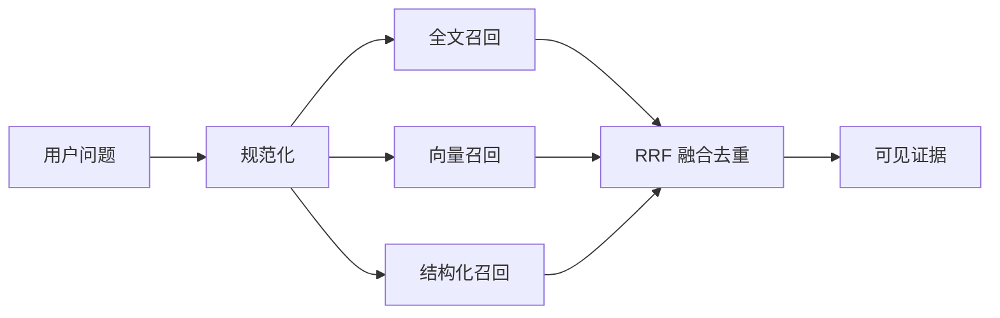

# PostgreSQL、pgvector 与混合检索

用户搜索“怎样开通访问”，文档标题写的是“权限申请流程”。全文检索擅长精确词和编号，却可能漏掉这种同义表达；向量检索能找到语义相近内容，却可能把精确的版本号排在后面。混合检索的目标是让两条通道互补，同时保持租户、权限和版本范围。

本篇先建一条带来源与权限的 Chunk 记录，再分别执行全文和向量召回，最后用 Reciprocal Rank Fusion（RRF，倒数排名融合）合并结果。我们不把不同通道的原始分数直接相加。

## 一条可引用记录需要哪些字段

只有 `id + text + vector` 无法解释结果来自哪一版，也无法在引用时定位。Chunk 至少需要租户、Release、来源版本、范围、标题路径、页码或字符位置、正文、全文索引、Embedding 模型与向量。

所有检索通道先应用相同的 tenant、release、scope 和 ready 状态。先在全库取 Top K 再由应用过滤 ACL，会让无权数据占据候选名额，也可能通过日志、缓存或重排器泄露。



## 步骤一：分别召回，不急着比较分数

全文检索会分词并计算文本相关性，适合产品名、错误码和精确短语。中文效果依赖实际分词与词典，需要用代表性查询验证。向量检索把问题与 Chunk 映射到同一 Embedding 空间，再按余弦距离等度量排序；模型、维度和归一化策略要随记录保存，混用会破坏距离含义。

结构化通道处理日期、状态、编号和表格字段。每条通道只返回已授权候选的稳定 ID、名次与定位信息。原始全文分数越大通常越相关，向量距离则越小越近，量纲不同，直接相加没有稳定含义。

## 步骤二：用 RRF 合并名次

RRF 只使用候选在各通道中的排名：`score += 1 / (k + rank)`。同一 Chunk 在多条通道都靠前时得分更高；某通道不可用时，其他通道仍可工作。`k` 和各通道候选数要通过评测确定。

下面是根据 RRF 公式重写的最小实现。输入是各通道已完成 ACL 过滤的 ID 列表，输出是融合后的 ID 顺序。它不包含具体数据库 SQL，因此不会掩盖每条查询都要独立下推范围的要求。

```py
def reciprocal_rank_fusion(
    ranked_lists: list[list[str]],
    *,
    k: int = 60,
) -> list[str]:
    scores: dict[str, float] = {}

    for ranked in ranked_lists:
        for rank, chunk_id in enumerate(ranked, start=1):
            scores[chunk_id] = scores.get(chunk_id, 0.0) + 1 / (k + rank)

    return [
        chunk_id
        for chunk_id, _ in sorted(
            scores.items(), key=lambda item: (-item[1], item[0])
        )
    ]
```

相同得分使用稳定 ID 打破平局，使同一输入得到可复现顺序。融合后可以对少量候选重排，但重排器只接收已经授权的内容；超时后降级到 RRF，候选范围仍保持过滤后的集合。

## 步骤三：理解向量索引的取舍

数据量小或权限过滤后候选很少时，精确扫描可能已经足够。HNSW 通常查询快、内存与构建成本较高；IVFFlat 依赖聚类列表与 probes 参数。近似索引提高速度的同时可能降低 Recall，索引存在不等于规划器一定会使用。

使用 `EXPLAIN (ANALYZE, BUFFERS)` 检查估计行数、实际行数、过滤丢弃、缓冲命中、临时文件和耗时。不同租户范围大小会改变最优计划，因此测试数据要接近真实分布，不能用一千条均匀随机向量推断大规模表现。

查询向量长度、元素有限性、候选上限和 statement timeout 由服务端校验。空权限范围直接返回空集合，不生成含糊 SQL。缓存键包含规范化查询、租户、范围摘要、Release、Embedding 与排序版本。

## 步骤四：从候选恢复上下文和引用

过小 Chunk 可能只命中一句话。系统可以在命中后读取有限的父标题与相邻块，但扩展查询仍使用相同租户、Release 和 ACL。最终 Evidence 保存 Chunk ID、来源版本、标题路径、页码或字符位置以及实际用于回答的摘录。

生成答案后，Claim 绑定 Evidence；渲染引用前再次检查来源仍可见。检索候选和回答声称的事实是两件事，可以分别评测。

## 正常结果和失败结果

| 场景 | 预期 |
| --- | --- |
| 精确错误码查询 | 全文通道靠前 |
| 同义改写查询 | 向量通道补回语义候选 |
| 同一 Chunk 两路靠前 | RRF 提升其融合名次 |
| 向量服务超时 | 降级到全文/结构化结果 |
| 另一租户有完全相同文本 | 任一通道都不返回 |
| 查询使用旧 Embedding 维度 | 在执行前拒绝 |
| Reranker 超时 | 使用确定性融合顺序 |

质量指标包括 Recall@K、MRR/nDCG、精确术语命中、无答案正确率、引用定位和权限泄露为零；性能指标包括查询分位数、连接池等待、buffer hit、索引大小和写放大。参数修改要同时跑两套门禁，不能用更低 Recall 换来漂亮延迟而不说明。

## 什么时候离开 PostgreSQL

当索引规模、独立伸缩、多区域延迟或专业检索能力成为已测量瓶颈时，可以引入独立搜索系统。PostgreSQL 仍可保存权限、版本与发布事实，搜索索引是可重建投影。迁移继续保留 tenant、release、scope 与 Evidence 契约，不能为了换引擎丢掉安全语义。

## 建立一个十条记录的小实验

准备包含精确编号、近义表达、不同租户和一张表格的十条匿名记录。为每条记录保存稳定 ID、正文、标题路径、可见范围、全文向量和 Embedding。先分别执行关系过滤、全文检索和向量检索，再用 RRF 按名次融合。

| 查询 | 预期通道 | 验收重点 |
| --- | --- | --- |
| `DOC-104` | 精确/全文 | 编号记录排名靠前 |
| “怎样开通使用资格” | 向量 + 全文 | 同义内容能召回 |
| “访客有效期” | 表格/全文 | 表头和字段语境存在 |
| 无权限文档标题 | 任何通道 | 在 SQL 候选阶段已经排除 |

`pgvector` 距离与 PostgreSQL 全文相关度不是同一量纲，不能直接相加。RRF 只使用各通道名次，融合后再恢复父级上下文和重排。向量索引的召回率、构建时间和查询延迟存在取舍，参数通过这组固定查询与更大代表数据验证。

对每个查询保存目标证据是否进入候选、各阶段名次、最终引用和耗时。若关系过滤在向量查询后才执行，候选不足时可能漏掉本该可见的记录，权限也更难证明。数据规模、延迟或多租户隔离超出单库能力时再评估独立检索系统，不因“用了向量”就默认迁移。

## 参考资料

- [PostgreSQL Full Text Search](https://www.postgresql.org/docs/current/textsearch.html)
- [pgvector](https://github.com/pgvector/pgvector)
- [PostgreSQL EXPLAIN](https://www.postgresql.org/docs/current/using-explain.html)
- [Reciprocal Rank Fusion](https://plg.uwaterloo.ca/~gvcormac/cormacksigir09-rrf.pdf)
