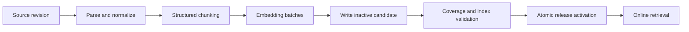
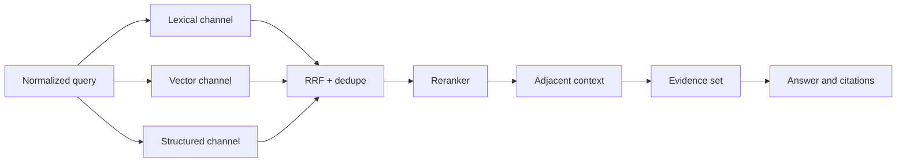

# PostgreSQL、pgvector 与混合检索

把 Embedding 写进 `vector` 列，再执行一次距离排序，只完成了向量近邻查询，不等于得到可上线的检索系统。生产检索还要同时回答：候选属于哪个租户和知识版本，用户是否可见，精确术语能否命中，向量模型是否一致，近似索引是否真的被使用，排序为什么产生，以及引用能否回到原文。

PostgreSQL 与 pgvector 的优势不是替代所有搜索引擎，而是让关系约束、全文检索、向量召回和版本事务在同一数据系统中组合。它适合中等规模、权限和结构过滤很重要、团队希望减少基础设施数量的场景。数据或查询规模继续增长时，也可以保留相同检索协议，将某些召回通道迁到独立引擎。

## 先定义检索对象，而不是只有文本和向量

一个可引用 Chunk 至少需要稳定身份、版本、结构定位、权限范围和索引状态：

```sql
CREATE EXTENSION IF NOT EXISTS vector;

CREATE TABLE document_chunks (
  chunk_id text PRIMARY KEY,
  tenant_id text NOT NULL,
  knowledge_base_id text NOT NULL,
  release_id text NOT NULL,
  document_id text NOT NULL,
  source_version_id text NOT NULL,
  scope_id text NOT NULL,
  section_path text[] NOT NULL DEFAULT '{}',
  ordinal integer NOT NULL,
  content text NOT NULL,
  search_text tsvector GENERATED ALWAYS AS (
    to_tsvector('simple', coalesce(content, ''))
  ) STORED,
  embedding_model text NOT NULL,
  embedding_dimension integer NOT NULL,
  embedding vector(1024),
  index_status text NOT NULL,
  active boolean NOT NULL DEFAULT false,
  content_hash text NOT NULL,
  created_at timestamptz NOT NULL DEFAULT now(),
  UNIQUE (release_id, document_id, ordinal)
);
```

`release_id` 固定一次查询使用的不可变知识版本；`source_version_id` 指向来源版本；`section_path` 和 ordinal 用于引用与相邻扩展；模型与维度防止不兼容向量混入。`active` 只是查询优化标志，真正的一致性仍由 release 指针和发布事务保证。

内容相同但权限不同的 Chunk 不能因为摘要一致就合并成一个无范围对象。稳定 `chunk_id` 可以由来源版本、结构路径和规范化正文摘要生成，但变更规则必须版本化，否则切片器升级会造成引用漂移。

## 写入管线与在线查询分离

Embedding 生成慢且依赖外部模型，不应在在线查询事务中补算。构建过程先写不可见候选，完成质量校验和索引准备后，再原子激活 release：



候选写入保证同一批次模型、维度和切片版本一致。批量 Embedding 返回顺序必须与输入稳定关联，不能只按数组位置盲信第三方响应；每个向量校验维度、有限数值和归一化假设。失败批次保留可重试状态，不把 NULL 向量的 Chunk 标记 ready。

激活事务锁定知识库当前指针，确认候选仍基于最新源版本，将新 release 设为当前并追加发布事件。构建期间若出现更新版本，旧候选标记 superseded，不能晚到覆盖新版本。

## 距离度量必须与模型训练一致

pgvector 支持欧氏距离、负内积、余弦距离等操作符：

| 运算 | 操作符 | 典型前提 |
| --- | --- | --- |
| Euclidean/L2 | `<->` | 绝对向量距离有意义 |
| Negative inner product | `<#>` | 模型按内积训练，常用于已归一化向量 |
| Cosine distance | `<=>` | 方向相似度重要，不关心模长 |

不能因为余弦常见就默认选择。查看模型文档并离线评测；若向量已单位归一化，内积与余弦排序相关，但实现和索引仍需保持一致。SQL 中距离是“越小越近”，若要相似度展示，可对余弦距离计算 `1 - distance`，但不要把不同度量的分数直接比较。

```sql
SELECT chunk_id,
       content,
       embedding <=> CAST(:query_embedding AS vector) AS distance
FROM document_chunks
WHERE tenant_id = :tenant_id
  AND knowledge_base_id = :knowledge_base_id
  AND release_id = :release_id
  AND scope_id = ANY(:allowed_scope_ids)
  AND index_status = 'ready'
  AND active = true
ORDER BY embedding <=> CAST(:query_embedding AS vector)
LIMIT :candidate_limit;
```

查询向量必须记录相同 embedding model/version 和维度。迁移模型时不要原地覆盖旧列后让部分记录混用；构建新索引版本或新列，双跑评测后切换 release。

## 权限与版本过滤必须在召回前生效

“先全库召回 Top 100，再在应用层删除不可见项”有两个问题：数据库/日志/缓存已经接触越权候选；删除后合法候选不足，Recall 下降。每个召回通道都要下推 tenant、release、scope、状态等约束。

如果 `allowed_scope_ids` 很大，不应把几万个 ID 拼进 SQL。根据权限模型选择：用户到范围关联表、角色/组展开表、关系授权服务生成的短期可见集合，或 PostgreSQL RLS。无论哪种方式，查询计划和撤权延迟都需要测试。

```sql
SELECT c.chunk_id, c.content,
       c.embedding <=> CAST(:query_embedding AS vector) AS distance
FROM document_chunks c
JOIN subject_visible_scopes v
  ON v.tenant_id = c.tenant_id
 AND v.scope_id = c.scope_id
 AND v.subject_id = :subject_id
 AND v.policy_version = :policy_version
WHERE c.tenant_id = :tenant_id
  AND c.release_id = :release_id
  AND c.index_status = 'ready'
ORDER BY c.embedding <=> CAST(:query_embedding AS vector)
LIMIT :candidate_limit;
```

缓存键同样包含 tenant、subject scope/policy version、release、查询规范化结果和检索配置版本。只用 query 文本作为缓存键会跨用户复用越权结果。紧急撤权优先于复现旧查询，应主动失效或让策略版本改变使旧缓存不可命中。

## 精确检索与向量召回互补

向量适合语义改写，不擅长精确编号、代码符号、罕见专有词和否定条件；全文检索对原词强，却可能错过同义表达。混合检索分别召回，再用 rank fusion 合并，而不是直接把不可比的 raw score 相加。

全文通道：

```sql
WITH query AS (
  SELECT websearch_to_tsquery('simple', :normalized_query) AS value
)
SELECT c.chunk_id,
       ts_rank_cd(c.search_text, query.value, 32) AS lexical_score
FROM document_chunks c, query
WHERE c.tenant_id = :tenant_id
  AND c.release_id = :release_id
  AND c.scope_id = ANY(:allowed_scope_ids)
  AND c.search_text @@ query.value
ORDER BY lexical_score DESC
LIMIT :lexical_limit;
```

中文检索需要选定可维护的分词/字粒度方案并版本化。数据库扩展、外部分词或预生成 token 各有取舍；不能假设 `simple` 配置会自动得到高质量中文分词。精确 ID、文件名、标签等可以增加结构通道，不必强迫全文或向量处理。

Reciprocal Rank Fusion 只依赖各通道名次：

```ts
type RankedCandidate = { chunkId: string; rank: number; channel: string }

function rrf(channels: readonly RankedCandidate[][], k = 60): Map<string, number> {
  const scores = new Map<string, number>()
  for (const candidates of channels) {
    for (const candidate of candidates) {
      scores.set(
        candidate.chunkId,
        (scores.get(candidate.chunkId) ?? 0) + 1 / (k + candidate.rank)
      )
    }
  }
  return scores
}
```

`k` 与各通道 candidate limit 用评测集调参。去重不能只按文本：相同正文在不同结构位置可能提供不同引用语义；可以按 canonical source 关系聚类，并保留权限和最佳定位。

## 近似索引不是默认更快

pgvector 的 HNSW 通常查询性能和 Recall 较好，但建索引慢、占内存，插入维护成本高；IVFFlat 构建快且参数直观，但需要合适训练数据与 probes，数据分布变化后可能需要重建。精确扫描对小而强过滤后的候选集可能更快。

```sql
CREATE INDEX chunks_embedding_hnsw
ON document_chunks
USING hnsw (embedding vector_cosine_ops)
WITH (m = 16, ef_construction = 96);
```

查询时 `ORDER BY embedding <=> :query LIMIT n` 的形式、操作符类和类型必须匹配。复杂过滤可能使优化器选择不同计划，或近似扫描先遇到大量过滤不通过的数据。新版本 pgvector 提供 iterative scans 等能力，但仍需在自己的数据分布下查看计划。

使用：

```sql
EXPLAIN (ANALYZE, BUFFERS, WAL, SETTINGS)
SELECT ...
ORDER BY embedding <=> CAST(:query_embedding AS vector)
LIMIT 40;
```

检查实际/估计行数、索引扫描、过滤丢弃数、shared hit/read、临时文件和总时间。不要只看到 “Index Scan” 就宣布优化完成；Recall 也可能因近似参数下降。

| 数据特征 | 起步选择 | 必须验证 |
| --- | --- | --- |
| 小数据或强过滤后很少 | 精确扫描 | P95、并发、CPU |
| 高频读、更新相对少 | HNSW | 内存、构建、Recall |
| 大批量导入、可重建 | IVFFlat/HNSW 对照 | lists/probes、漂移 |
| 多租户且单租户很小 | 关系过滤 + 精确/分区 | 规划稳定性、索引膨胀 |

不建议给每个小租户创建独立表和索引，元数据与维护成本会爆炸。可按规模分层：共享表满足长尾，大租户或冷热数据再按可测量阈值分区。

## SQLAlchemy 中避免隐式全表和类型漂移

pgvector Python 集成需要给参数正确类型；不要字符串拼接向量。Repository 返回候选投影，不把 ORM 对象和 Session 带到 Reranker。

```py
from dataclasses import dataclass

from pgvector.sqlalchemy import Vector
from sqlalchemy import bindparam, select


@dataclass(frozen=True)
class VectorCandidate:
    chunk_id: str
    content: str
    distance: float


async def vector_candidates(
    session: AsyncSession,
    query: RetrievalQuery,
) -> list[VectorCandidate]:
    distance = ChunkRow.embedding.cosine_distance(
        bindparam("query_vector", type_=Vector(1024))
    )
    statement = (
        select(ChunkRow.chunk_id, ChunkRow.content, distance.label("distance"))
        .where(
            ChunkRow.tenant_id == query.tenant_id,
            ChunkRow.release_id == query.release_id,
            ChunkRow.scope_id.in_(query.allowed_scope_ids),
            ChunkRow.index_status == "ready",
        )
        .order_by(distance)
        .limit(query.candidate_limit)
    )
    rows = (await session.execute(
        statement, {"query_vector": query.embedding}
    )).all()
    return [VectorCandidate(*row) for row in rows]
```

空 scope 列表应直接返回空结果，不生成意外语义。candidate limit、statement timeout 和查询向量长度由服务端限制。应用在执行前验证向量元素为有限数，防止 NaN/Infinity 破坏排序。

## 重排、相邻扩展与引用

融合后的 Top N 可以交给 Cross-Encoder/LLM Reranker，但重排器只看到已授权候选。请求记录 reranker 版本、输入候选 ID、截断方式和输出分数；失败时降级到固定 RRF 排序，不重新扩大无权限召回。

Chunk 过小会丢上下文。先命中核心 Chunk，再按同一 document/release 拉取父标题和有限相邻块。相邻扩展也要应用相同权限和状态条件，不能因为知道 parent ID 就直接查询。

最终 Evidence 对象保存：chunkId、releaseId、sourceVersionId、section path、字符/页码定位、用于回答的摘录摘要。模型生成后的 Claim 绑定 Evidence；引用渲染时再次确认 release 可用与用户可见。这样“检索到了什么”与“回答声称了什么”可分别评测。



## 性能与质量是两套指标

数据库指标包括查询 P50/P95/P99、buffer hit、连接池等待、索引大小、dead tuples、构建耗时和写放大。检索质量至少包括 Recall@K、MRR/nDCG、精确术语命中、无结果正确率、权限泄露为零、引用定位正确率。

只优化延迟可能把 candidate limit 降得过低；只看 Recall 可能把数据库拖垮。建立代表性查询集，按短查询、精确编号、语义改写、多约束、无答案和权限隔离分桶。参数改动同时跑质量和性能门禁。

索引维护关注 autovacuum、ANALYZE、批量导入后统计信息和磁盘增长。删除旧 release 不一定立刻释放文件空间；保留策略、VACUUM 和必要的重建要纳入容量计划。向量索引构建使用 `maintenance_work_mem` 等参数时，评估对同库在线流量的影响，优先在候选表/分区构建后切换。

## 验证：从 SQL 计划到越权对抗

| 测试 | 方法 | 通过条件 |
| --- | --- | --- |
| 精确正确性 | 近似结果对照 exact top K | Recall 达到门槛 |
| 权限隔离 | 两租户同文本、同 public ID | 永不返回另一范围候选 |
| Release 固定 | 查询中途发布新版本 | 一次请求只见固定版本 |
| 过滤计划 | 不同 scope 基数跑 EXPLAIN | 无不可接受全表扫描/延迟 |
| 模型一致 | 注入错误维度/版本 | 写入和查询均拒绝 |
| 近似参数 | 对照不同 ef/probes | 质量延迟曲线可复现 |
| Reranker 故障 | 超时/429 | 降级到确定性融合，不越权 |
| 引用定位 | 原文更新与旧 release | 引用仍指向本次证据版本 |

```py
async def test_acl_is_applied_in_every_channel() -> None:
    visible = await fixtures.chunk(tenant="tenant-a", scope="scope-1", text="same phrase")
    await fixtures.chunk(tenant="tenant-b", scope="scope-2", text="same phrase")

    result = await retriever.search(
        tenant_id="tenant-a",
        allowed_scope_ids=["scope-1"],
        release_id=visible.release_id,
        query="same phrase",
    )

    assert {item.tenant_id for item in result.candidates} == {"tenant-a"}
    assert {item.scope_id for item in result.candidates} == {"scope-1"}
```

性能基准使用接近生产的行数、向量分布、权限选择度和并发，不用 1,000 行均匀随机向量推断百万级真实表现。每次升级 PostgreSQL、pgvector、Embedding 模型或切片器都重新跑。

## 什么时候不应只用 PostgreSQL

当索引远超单机/可接受分片范围、写入与查询吞吐需要独立伸缩、复杂检索功能由专业引擎更成熟实现，或多区域低延迟成为硬约束时，可以引入独立向量/搜索系统。此时 PostgreSQL 仍可保存权限、版本和发布事实，索引是可重建投影。

跨系统发布要使用版本化索引与原子别名/指针，不能边覆盖在线索引。检索协议继续要求 tenant、release、scope 和 evidence 字段，防止迁移后丢掉安全语义。技术选型依据测量，而不是“专用数据库必然更快”或“PostgreSQL 什么都能做”。

## 常见误区

- 只建 `id + text + vector`，没有来源版本、权限和引用定位。
- 全库向量 Top K 后在应用层做 ACL。
- 混用不同 Embedding 模型/维度，或原地覆盖向量。
- 直接相加全文分数和向量距离，忽略尺度与方向。
- 建了 HNSW 就不看 `EXPLAIN ANALYZE` 和 Recall。
- 中文全文检索沿用默认配置却没有质量评测。
- Reranker 失败后扩大召回或绕过过滤。
- 缓存键只有 query，跨用户和 release 复用结果。
- 删除旧版本后忽略膨胀、引用保留和恢复需求。

## 源码与规范

- [PostgreSQL Full Text Search](https://www.postgresql.org/docs/current/textsearch.html)：`tsvector`、查询解析、词典与排名。
- [pgvector](https://github.com/pgvector/pgvector)：距离函数、HNSW/IVFFlat、过滤与 iterative scan。
- [PostgreSQL EXPLAIN](https://www.postgresql.org/docs/current/using-explain.html)：查询计划、估算和实际执行证据。
- [SQLAlchemy AsyncIO](https://docs.sqlalchemy.org/en/20/orm/extensions/asyncio.html)：异步连接、Session 和查询执行边界。
- [Reciprocal Rank Fusion](https://plg.uwaterloo.ca/~gvcormac/cormacksigir09-rrf.pdf)：异构召回名次融合的原始论文。
