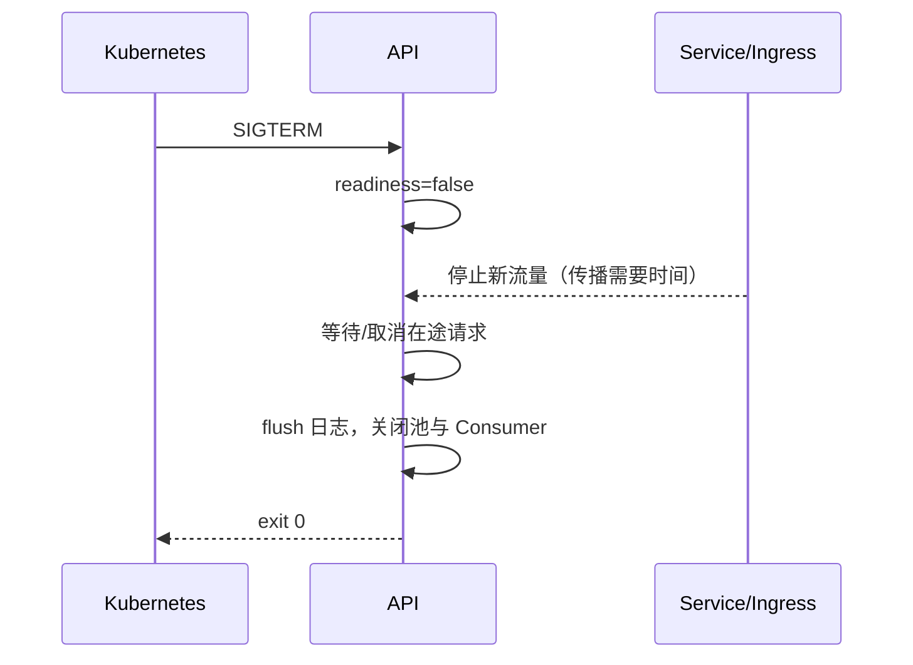

# Profiling、容量、超时预算与优雅停机

Profiling 记录 CPU、内存或阻塞时间花在哪里，容量模型估算资源能承受的负载，超时预算限制跨层等待，优雅停机则在退出前停止接单并收束在途工作。它们连接应用运行时与部署平台，用来处理性能瓶颈、过载、慢依赖和版本切换，而不是四个彼此独立的运维技巧。

发布器发送 SIGTERM，10 秒后强制终止；应用数据库 timeout 是 30 秒，Worker 任务没有取消。无论代码多正确，在途操作都可能被截断。Profile 找资源热点，容量模型决定可承受负载，timeout/cancel/drain 决定系统在慢与停机时怎样结束。

## Profile 区分 CPU、内存和阻塞

CPU Profile 采样正在运行的调用栈，找到计算热点；Heap Profile 看对象保留和分配；Block/Mutex/Event Loop Lag 揭示等待与阻塞。高墙钟延迟不一定有高 CPU，可能全在 IO 或锁。

在可控负载与明确版本采集，时间足以代表问题又避免长期开高开销探针。Profile 可能含函数名、路径和参数片段，按敏感诊断数据限制访问与保留。

采样会漏掉短而低频的路径，也可能因开销改变时序。结论要与 Trace、指标和可控复现实验互证；某函数占比最高只说明它在该窗口消耗最多，不代表修改它一定改善用户 P99。

| 现象 | 优先证据 | 不要先做 |
| --- | --- | --- |
| 单核 100% | CPU flame graph/event loop lag | 盲目扩连接池 |
| 内存持续增长 | heap diff/对象生命周期 | 只调大 limit |
| CPU 低但 P99 高 | Trace/锁/池等待 | 只做 CPU Profile |
| goroutine/Task 增长 | 创建栈与取消路径 | 定时重启掩盖泄漏 |

## 容量模型从每请求成本推到全局预算

记录请求 CPU 时间、内存峰值、数据库连接持有、外部调用和响应大小，再与目标到达率相乘。加上副本故障、发布 surge 和流量波动余量，得到副本与下游预算。

模型是初值，需要压测校正。CPU 可并行不代表数据库锁能扩；队列能缓冲峰值不代表长期超载。容量评审同时包含在线、Worker、迁移和运维流量。

下面是 timeout 与停机预算示例。内层要早于外层结束，停机窗口要大于入口总 timeout 加清理余量。

```text
gateway total timeout:       30s
  API request deadline:      25s
    MySQL statement:          5s
    object storage:           8s
    RabbitMQ publish:         2s

termination grace:           40s
  endpoint drain propagation: 5s
  max in-flight request:      25s
  cleanup/flush margin:       10s
```

这些数字不是推荐值。若业务任务超过入口预算，应返回 202 转异步，而不是把所有网关 timeout 拉到几分钟。

## 取消沿调用链传播，但提交事实不能假装消失

客户端断开或 deadline 到期后，Context/AbortSignal 传给数据库、HTTP 与对象存储，停止尚未产生价值的读取。若数据库 COMMIT 已完成，取消不能撤销事实；应用继续记录结果或通过幂等键让调用方查询。

每层自行重试会让总耗时和请求数倍增。选择一个拥有业务语义的层重试，其他层只提供单次 timeout 和可分类错误。



进程先摘流再 drain。超出 grace 才会被 SIGKILL，因此应用的内部 deadline 必须留出关闭连接和日志的时间。

## 优雅停机需要对 HTTP、消息和任务分别处理

HTTP 停止 accept 新连接，等待在途响应；RabbitMQ Consumer cancel 后停止新 delivery，完成已领取任务再 ACK；Scheduler 停止产生新任务；SSE 发送可识别的终止/重连信息。

停机测试应在负载中发送 SIGTERM，断言新请求被路由到其他副本、已提交写入可查询、未 ACK 消息会重投、进程在 grace 内退出。仅启动/停止空服务无法证明。

## 容量、超时与停机边界

**timeout 越短越好吗？**

过长占资源，过短会取消本可成功操作并引发重试。根据用户预算和下游分布设定，内层留清理余量，并用指标观察超时阶段。

**CPU Profile 没热点为何请求仍慢？**

CPU Profile 只采样运行 CPU 的栈。请求可能在连接池、锁、socket 或队列等待；用 Trace、阻塞 Profile 和资源指标补充。

**应用收到 SIGTERM 后能否继续接少量请求？**

应立即变为 not ready，监听可能暂时保留用于在途连接。新流量继续到达说明端点传播或入口连接复用，需要 grace/preStop 设计，而不是接受无界新请求。

**容量为何要考虑一个副本故障？**

正常满载时任何副本退出都会让剩余实例过载，滚动发布也无法进行。目标容量应在 N-1 或规定故障场景仍满足关键 SLO。

## 机制复核：Profiling、容量、超时预算与优雅停机
这篇文章讨论的机制需要放回一次完整请求中验证。先记录输入约束、状态变化、外部依赖和失败结果，再确认成功路径是否留下可追踪的事实。配置、缓存、队列或数据库只承担各自职责，不能用一层的日志推断另一层已经完成。

迁移到实际项目时，优先补一条正常用例、一条重复或并发用例和一条依赖不可用用例。每条用例写明观察指标、错误分类、回滚动作与数据清理范围，测试替身的通过不能代替真实协议和权限验证。

当性能、可靠性和安全目标冲突时，先明确服务对象和可接受损失，再选择超时、容量、重试和降级策略。没有测量依据的阈值只作为待验证假设，发布后用同一公式复验。
