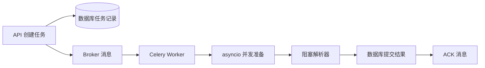

# asyncio、Celery、取消、超时与任务恢复

上传一份文档后，接口很快返回了任务编号。十秒后，页面显示解析进度；如果解析进程中途退出，任务不会永远停在“处理中”，而是能被重新领取或明确失败。

要实现这个结果，先要分清两种看起来都叫“异步”的技术：`asyncio` 负责一个 Python 进程内等待多个 I/O，Celery 负责把工作交给另一个进程，甚至另一台机器。它们解决的问题不同，也可以出现在同一条任务链中。

本章会完成一条匿名文档任务：API 创建任务，Celery Worker 领取任务，Worker 内部用 `asyncio` 并发读取元数据和规则，阻塞解析器被放进线程，所有步骤共享同一个截止时间。最后再推演 Worker 被终止后的恢复过程。

## 开始前先认识五个词

**协程**是可以在等待 I/O 时暂停、把执行权交还事件循环的函数。`async def` 只声明协程函数，调用它得到协程对象；真正调度还需要 `await`、`asyncio.create_task()` 或 `TaskGroup`。

**事件循环**负责调度就绪的协程。它适合网络、数据库这类“多数时间在等待”的工作，不会自动让 CPU 密集计算变快。

**消息 Broker**保存待消费的消息。Celery 常见 Broker 是 RabbitMQ 或 Redis；任务事实仍应放在数据库，因为消息可能重复、延迟或丢失可见性。

**ACK**是消费者告诉 Broker“这条消息已处理”。ACK 太早，Worker 崩溃后消息可能不会重投；ACK 较晚，处理完成但 ACK 前崩溃会产生重复执行。

**Deadline**是整次任务允许执行到哪个绝对时间点。它比“每一步各自等 30 秒”更可靠，因为后者会让五个步骤最多拖到 150 秒。

## 一条任务经过哪些位置

先只看主干，不急着写代码。



数据库中的任务记录回答“现在是什么状态、尝试过几次、谁拥有执行权”；Broker 消息只负责提醒某个 Worker 来处理。把两者混成一个对象，是许多恢复问题的起点。

我们约定任务状态为 `pending -> running -> succeeded | failed | cancelled`。执行者领取任务时还会写入 `owner` 和 `lease_until`：前者标识当前 Worker，后者表示所有权何时过期。

## 第一步：判断工作留在请求内还是交给 Worker

先用两个问题判断：客户端是否需要立即得到最终结果？工作能否在 HTTP 的短时间预算内稳定完成？

| 工作 | 更适合 | 原因 |
| --- | --- | --- |
| 同时读取用户与配置 | `asyncio` | 都是短 I/O，结果用于当前响应 |
| 调用两个只读上游接口 | `asyncio` + 并发上限 | 等待占主要时间，失败可在请求内返回 |
| 解析大文件 | Celery | 耗时波动大，客户端不必保持连接 |
| 批量生成向量 | Celery | 需要独立并发、重试和资源隔离 |
| 压缩一个很小的响应 | 普通函数 | 创建后台任务没有收益 |

不要看到 `async def` 就认为代码不会阻塞。普通 PDF 解析库、图片处理、同步 SDK 和 CPU 循环在事件循环线程里运行时，其他请求也要一起等。

## 第二步：在进程内做有边界的并发

假设 Worker 开始解析前，需要同时读取知识版本和解析规则。两次查询互不依赖，可以并发；任意一个失败，本轮准备阶段都没有继续的意义。

```python
import asyncio

async def prepare(task_id: str, timeout_seconds: float):
    async with asyncio.timeout(timeout_seconds):
        async with asyncio.TaskGroup() as group:
            version_task = group.create_task(load_version(task_id))
            policy_task = group.create_task(load_parse_policy(task_id))

    return version_task.result(), policy_task.result()
```

逐行看这段代码：

1. `asyncio.timeout(...)` 给整个准备阶段设置预算，而不是给每个查询分别计时。
2. `TaskGroup` 拥有两个子任务；退出上下文前会等待它们结束。
3. 一个子任务抛出异常时，TaskGroup 会取消仍在运行的兄弟任务，并把异常以异常组的形式抛给调用方。
4. 只有上下文正常退出后才读取 `result()`，因此不会拿到尚未完成的值。

输入是任务编号和本阶段剩余秒数，输出是版本与规则。这里适合并发，是因为两次调用彼此独立且都是可取消的异步 I/O。

如果需要同时处理一百个对象，不能无上限创建一百个外部请求。可以在调用外层加 `asyncio.Semaphore`，把并发上限与数据库连接池、上游配额和内存预算对齐。

## 第三步：隔离会阻塞事件循环的函数

现有解析器若是同步函数，可以先用 `asyncio.to_thread()` 把它移到线程池，避免堵住事件循环：

```python
async def parse_document(path: str, deadline: float):
    remaining = deadline - asyncio.get_running_loop().time()
    if remaining <= 0:
        raise TimeoutError("task deadline exceeded")

    async with asyncio.timeout(remaining):
        return await asyncio.to_thread(sync_parse_file, path)
```

`deadline` 使用事件循环的单调时钟计算，系统时间调整不会让剩余预算突然变大。`to_thread` 适合会阻塞的文件或同步库调用；纯 Python CPU 密集计算仍受 GIL 影响，通常要用进程池或独立 Worker。

还要注意取消边界：协程取消后，正在另一个线程执行的普通函数不会被强制杀死。生产解析器应支持分阶段检查取消标记，或者把不可中断步骤放到独立进程，并把结果提交设计成幂等操作。

## 第四步：Celery Task 只做协议适配

Celery 装饰器函数不适合堆积所有业务逻辑。它更像 HTTP Controller：读取消息参数，调用应用服务，再把异常映射成 ACK、重试或失败。

```python
@celery.task(bind=True, acks_late=True, max_retries=3)
def run_import(self, task_id: str) -> None:
    try:
        asyncio.run(import_service.execute(task_id))
    except TemporaryDependencyError as exc:
        raise self.retry(exc=exc, countdown=retry_delay(self.request.retries))
    except BusinessRejected as exc:
        import_service.mark_failed(task_id, str(exc))
```

这段代码按职责分成三部分：

- `bind=True` 让任务获得当前重试次数等请求信息。
- `acks_late=True` 让 ACK 尽量靠近处理完成，但因此必须接受重复投递。
- 暂时性依赖错误进入有限重试；文件格式不支持这类确定性错误直接终止，不浪费重试次数。

示例省略了事件循环复用和依赖装配。高频任务不应每条消息都随意创建复杂客户端；实际 Worker 启动时应初始化连接资源，并在关闭钩子中释放。

## 第五步：用租约防止两个 Worker 同时提交

重复消息并不罕见。可能是 ACK 前 Worker 退出，也可能是发布方重试。`task_id` 相同不能只靠“先查状态、再更新”两条语句，因为两个 Worker 可能同时读到 `pending`。

领取动作应是带条件的原子更新：只有任务仍可执行，或旧租约已经过期时，才能写入新的 `owner` 和 `lease_until`。更新影响零行，说明其他 Worker 已拥有任务，本条消息可以安全结束。

执行过程中定期续租，但续租 SQL 必须同时匹配 `task_id` 与当前 `owner`。Worker 失去租约后停止写进度、结果和终态；否则旧 Worker 恢复运行时可能覆盖新 Worker 的结果。

提交成功也使用同样的所有权条件：

```text
UPDATE task
SET status = 'succeeded', result_ref = ?, finished_at = now()
WHERE id = ? AND status = 'running' AND owner = ?;
```

这是根据真实状态语义重写的最小 SQL 形状，不代表公开某个私有表结构。关键不在字段名，而在“只有当前所有者能完成当前运行状态”这个条件。

## 第六步：取消要跨过数据库、协程和 Worker

Celery 的 `revoke` 主要控制消息消费，无法替代业务取消。任务可能已经被 Worker 领取，也可能正在同步解析器里。

更稳妥的做法是把取消写入数据库状态或取消标记，并在这些位置检查：

1. Worker 领取任务之前。
2. 每个可中断阶段开始之前。
3. 长循环或批处理的批次之间。
4. 外部模型、HTTP、数据库调用之前，用剩余 Deadline 设置超时。
5. 最终提交之前，再确认任务仍由当前 owner 持有且没有取消。

取消是协作式的。它表示“后续步骤尽快停止”，不意味着可以把任意线程从中间安全切断。文章或产品界面应区分 `cancel_requested` 与最终 `cancelled`，避免用户点下按钮就误以为资源已经释放。

## Worker 中途退出后怎样恢复

现在故意推演一次故障：Worker 已经把状态改为 `running`，解析到一半时进程被终止，消息因为晚 ACK 重新出现。

新的 Worker 收到消息后可能遇到两种情况：

- 旧租约还有效：不抢占，稍后重试或等待恢复扫描。
- 旧租约已过期：原子领取，清理本次可重建的临时输出，从最近的持久阶段继续或重新执行。

此外需要一个周期扫描器查找“状态是 running 但租约过期”的任务。扫描器只负责把异常状态送回可处理路径，不直接假装任务成功。

能否从中间恢复，取决于阶段产物是否持久且版本兼容。没有可靠 Checkpoint 时，从头幂等重跑通常比猜测内存执行到哪里更安全。

## 正常结果与验证方法

| 场景 | 应看到的状态 | 验证重点 |
| --- | --- | --- |
| 普通导入 | `pending -> running -> succeeded` | 结果只提交一次 |
| 版本查询超时 | `running -> retrying` 或失败 | 兄弟协程已取消 |
| 不支持的文件 | `running -> failed` | 不进入无意义重试 |
| 重复消息 | 一个 Worker 执行，另一个结束 | 条件更新只成功一次 |
| 用户取消 | `cancel_requested -> cancelled` | 外部调用收到取消或超时 |
| Worker 被终止 | 租约过期后重新领取 | 旧 owner 不能提交 |

测试分三层。应用服务单元测试用假时钟和假 Repository 验证状态转换；数据库集成测试让两个执行者并发领取同一任务；Worker 集成测试真实启动 Broker 与 Worker，发送任务后终止进程，观察消息重投和租约恢复。

不要用 `task_always_eager` 代替全部 Celery 测试。它适合快速验证函数调用，却覆盖不到序列化、Broker、ACK、Prefetch 和 Worker 进程退出。

## 生产环境还要补哪些能力

- 按在线请求、文档解析、向量生成和评测拆分队列与 Worker，并分别设置并发。
- 记录队列年龄、执行时间、重试次数、租约冲突和最终状态，不只看队列长度。
- 任务参数只传稳定 ID，不把大文件或敏感正文塞进 Broker 消息。
- 对外部副作用使用幂等键；数据库提交和消息派发之间的原子性需要 Outbox 等方案时，应明确引入，而不是声称 Celery 自动解决。
- Worker 停机先停止取新任务，再在明确 Deadline 内排空；超过时间的任务依靠晚 ACK 与租约恢复。

## 可以带回工作的检查清单

1. 这项工作是请求内等待，还是需要跨进程持久执行？
2. `asyncio` 路径里是否混入同步 I/O 或 CPU 长循环？
3. 并发上限是否服从连接池、外部配额和内存，而不是输入数量？
4. Task 是否只是适配层，业务状态是否保存在数据库？
5. 重复投递会不会产生重复写入或外部副作用？
6. Deadline、取消、ACK、重试和租约是否能沿完整链路解释？
7. Worker 中断后，系统依据什么事实恢复？

完成后可以做一个迁移练习：给导入链增加“生成缩略图”步骤，先判断它属于协程、线程、进程还是独立队列，再补上超时、取消、幂等和恢复测试。如果无法说明每一步的所有者与持久状态，说明任务链还没有设计完整。
