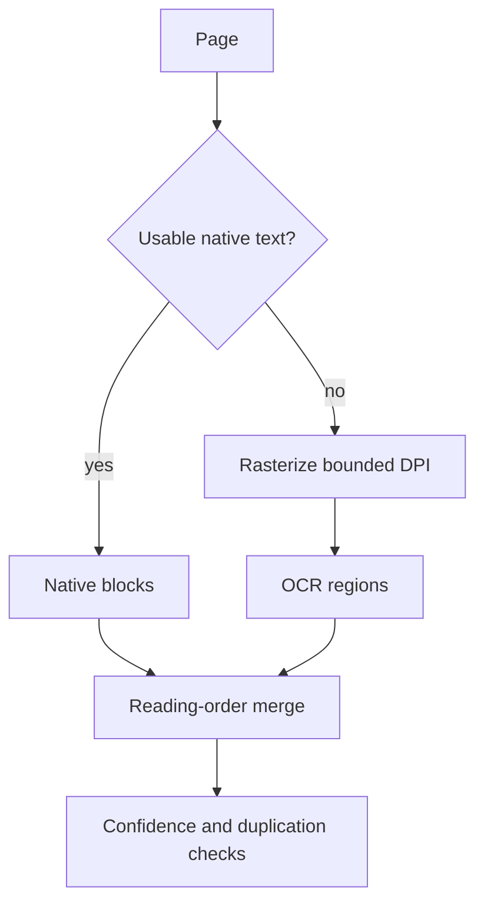
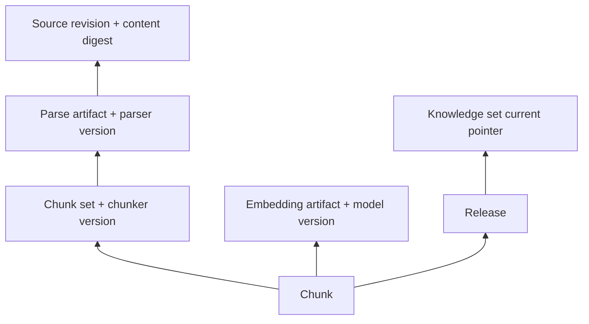

# Python 文档处理流水线

RAG 质量常被归因于模型和向量库，但大量问题更早发生：文件类型识别错误、解析丢表格、OCR 顺序混乱、标题层级消失、切片跨越权限边界、旧任务晚到覆盖新版本。文档流水线的职责，是把不可信、多格式输入转换为可追溯、可重建、可原子发布的知识版本。

这不是一个 `extract_text(file)` 函数，而是一条带版本、质量门禁、资源隔离和失败恢复的生产链路。

## 产物模型：来源、版本、结构块与发布

先分清几个身份：

| 对象 | 含义 | 是否可变 |
| --- | --- | --- |
| Document | 稳定业务身份 | 元数据可变 |
| SourceRevision | 一次来源快照与摘要 | 不可变 |
| ParseArtifact | 特定解析器版本输出 | 不可变 |
| ChunkSet | 特定切片/Embedding 配置输出 | 不可变 |
| Release | 一组通过门禁的可查询版本 | 指针原子切换 |

稳定 Document ID 让引用跨版本关联；Revision 固定本次输入；Release 确保一次查询不会混到发布前后的 Chunk。解析器、OCR、切片器、Embedding 和索引 Schema 都记录版本，任何一项变化都能重新构建而不覆盖旧产物。

```py
@dataclass(frozen=True)
class SourceRevision:
    revision_id: str
    document_id: str
    tenant_id: str
    content_digest: str
    media_type: str
    byte_size: int
    source_locator: str
    parser_version: str
    access_policy_version: str
```

不要把本地绝对路径或私有下载 URL写入公开引用。内部 locator 受保护，展示层使用中性来源标题和稳定公共定位。

## 管线阶段与状态机


阶段输出不可变并按输入摘要缓存；重试从最近稳定产物继续。任务状态至少区分 queued、running、retry_waiting、failed、superseded、ready、published、cancelled。晚到任务在发布前再次确认自己仍是最新源版本，过期则进入 superseded，不覆盖当前数据。

每阶段接受 deadline、资源预算和取消标记。进度按阶段/批次节流写入，不能把“Embedding 70%”当成完整发布已经 70% 可用。

## 输入是不可信的

文件扩展名和客户端 MIME 只作提示。读取魔数、解析器实际识别结果，并限制：总大小、页数、压缩展开大小、嵌套深度、图片像素、表格单元格、单行长度和处理时间。

攻击面包括 Zip Slip、压缩炸弹、XML 外部实体、解析器漏洞、恶意 PDF、公式/宏、超大图片、远程 URL SSRF。原则：

- 上传落到隔离对象区，不直接作为可下载文件发布；
- 文件名只用于展示，存储键由服务端生成；
- 解包后路径必须仍在任务临时目录内；
- 解析进程低权限、无不必要网络、有限 CPU/内存/文件描述符；
- URL 导入解析 DNS 后阻止 loopback、私网、metadata 地址，并防重定向绕过；
- 临时文件在成功、失败、取消后均有精确清理。

```py
def safe_archive_member(root: Path, member_name: str) -> Path:
    target = (root / member_name).resolve()
    if root.resolve() not in target.parents:
        raise UnsafeArchivePath(member_name)
    return target
```

真实系统还要处理符号链接与平台路径差异；最好使用默认拒绝链接的成熟解包库/隔离容器，而不是只依赖此示例。

## 解析输出保留结构而不只是一串文本

统一中间表示（IR）记录 Block：标题、段落、列表、代码、表格、图片说明、页眉页脚和页码范围。每个 Block 有稳定顺序、父子关系、字符定位与解析置信度。

```py
class Block(BaseModel):
    block_id: str
    kind: Literal["heading", "paragraph", "list", "code", "table", "image"]
    text: str
    level: int | None = None
    page_start: int | None = None
    page_end: int | None = None
    parent_id: str | None = None
    order: int
    attributes: dict[str, JsonValue] = Field(default_factory=dict)
```

PDF 是绘制指令，不天然有阅读顺序。多栏、页眉页脚、脚注、旋转文本和表格会破坏简单坐标排序。解析器需要保留页级布局信息和 warning；无法确定时标记低置信度，而不是静默拼接成貌似通顺的错误正文。

HTML 先删除脚本、样式、导航噪声，再保留标题、列表、表格、链接文本。DOCX/PPTX/XLSX 分别处理段落层级、幻灯片顺序、工作表和公式值，不能全部降成一段 plain text。

### 解析器选择、回退与版本兼容

同一种媒体类型可能需要多种解析器。选择器根据 sniff 结果、文件特征、语言和能力清单决定主解析器；只有明确的可恢复失败才进入备用解析器。不能用宽泛 `except Exception` 静默换解析器，否则主解析器的代码缺陷会被隐藏，两个解析结果也可能产生不可解释的差异。

```py
@dataclass(frozen=True)
class ParserCapability:
    parser_id: str
    parser_version: str
    media_types: frozenset[str]
    supports_layout: bool
    supports_tables: bool
    max_bytes: int


def choose_parser(
    media: DetectedMedia,
    capabilities: Sequence[ParserCapability],
) -> ParserCapability:
    candidates = [
        item
        for item in capabilities
        if media.media_type in item.media_types and media.byte_size <= item.max_bytes
    ]
    if not candidates:
        raise UnsupportedDocumentFormat(media.media_type)
    return max(
        candidates,
        key=lambda item: (item.supports_layout, item.supports_tables),
    )
```

解析器输出也有 Schema 版本。增加可选 Block 属性时，读取端先兼容缺失值，再升级写入端；改变阅读顺序、表格结构或 ID 生成算法时，需要新 major 版本并重建候选。旧产物不能被新代码“猜着读”，无法解释的未来版本应隔离，而不是忽略可能影响权限和引用的字段。

为同一 Golden Corpus 并行运行新旧解析器，比较 Block 数、文本保存率、标题树编辑距离、表格单元格、warning 和下游检索结果。解析器升级是否可发布由这些证据决定，不以“新库版本更高”为理由自动切换。

## OCR 是按页/区域的条件分支

不是所有 PDF 都应 OCR。先检测页面是否有足够可用文本、乱码比例与图像覆盖率，只对扫描页/可疑区域走 OCR。混合 PDF 合并原生文本和 OCR 时避免重复。



OCR 记录引擎、语言、DPI、区域坐标和置信度。低置信度文本可进入显示但不一定进入索引，或降低检索权重。表格 OCR 需要结构恢复；只得到按空格拼接的行时，应明确标注而不是伪造成字段可靠的表格。

OCR 是 CPU/GPU/内存重任务，独立队列与 Worker，并限制并发。大文件不能堵住轻量增量同步。

## 规范化必须可逆和保守

规范化统一换行、Unicode 形式、异常空白和重复页眉页脚，但不应破坏代码缩进、表格列、编号、数学符号和大小写有意义的标识符。保存原始展示内容与索引文本两个视图，引用回原文时使用展示内容。

去重分三层：

1. 完全内容摘要复用相同解析产物；
2. 页眉页脚/模板噪声在单文档内检测；
3. 近重复只作为候选发现，用来源权威、版本和权限选择 canonical。

相同正文属于不同权限范围时不能合并成无 ACL 记录。内容摘要不是权限身份。

## 结构化切片而不是固定字符砍断

Chunk 设计服务于检索和引用。先按标题、段落、列表、代码与表格边界形成语义单元，再在 token 预算内组合。每个 Chunk 保存 heading path、父块、相邻关系、页码、来源版本、权限和精确术语。

```py
@dataclass(frozen=True)
class Chunk:
    chunk_id: str
    revision_id: str
    release_id: str
    section_path: tuple[str, ...]
    content: str
    display_content: str
    token_count: int
    parent_chunk_id: str | None
    previous_chunk_id: str | None
    next_chunk_id: str | None
    page_range: tuple[int, int] | None
    access_policy_version: str
```

切片不变量：不产生空块；不越过权限边界；标题上下文随正文保留；代码围栏与表格行不在不可恢复位置断开；超长单块使用专门策略；每个有效源 Block 至少被一个 Chunk 覆盖。

Overlap 不是越大越好。固定高重叠会放大存储与召回重复。结构化父子与邻接扩展通常比复制大量文本更可控。表格可拆为“表头 + 行组”，同时保存 tableId 和 row range；问答式内容可分别保留问题、回答及组合检索文本。

## 用覆盖率和不变量检查切片质量

质量门禁在发布前计算：

```ts
type ChunkCoverage = {
  sourceCharacters: number
  representedCharacters: number
  preservationRate: number
  duplicateChunkIds: string[]
  orphanLinks: string[]
  oversizedChunks: string[]
  emptyChunks: string[]
}
```

字符覆盖率只是下限，不能证明阅读顺序正确。还要抽查结构：标题是否对应、表头是否随行、代码是否完整、页码定位能否回原文、敏感内容是否继承正确权限。解析 warning 超阈值或核心结构丢失，候选进入 review/failed，不自动激活。

## Embedding 批处理、缓存和模型迁移

Embedding 输入与展示文本可以不同：索引文本附加有限标题路径和精确术语，展示仍忠于原文。保存 embedding 文本摘要、模型名、维度和预处理版本；缓存键由这些值共同决定。

批处理受模型 token/条数限制，按 token 预算装箱而不是固定条数。429/503 使用带抖动退避，输入错误、超长和维度异常直接失败。返回向量检查数量、顺序映射、维度和有限数。

模型升级构建新的 index version，不原地混写。用固定评测集对比 Recall、排序、延迟和成本，候选通过后原子切换；旧版本保留一个恢复窗口。

## 候选写入与原子发布

在线查询只读已发布 Release。构建阶段写 inactive candidate，所有 Chunk、Embedding、稀疏索引和质量报告就绪后，事务内切换当前指针：

```sql
BEGIN;

SELECT current_release_id
FROM knowledge_sets
WHERE tenant_id = :tenant_id AND knowledge_set_id = :knowledge_set_id
FOR UPDATE;

UPDATE releases
SET state = 'published', published_at = now()
WHERE release_id = :candidate_release_id
  AND source_revision_id = :expected_revision_id
  AND state = 'validated';

UPDATE knowledge_sets
SET current_release_id = :candidate_release_id
WHERE tenant_id = :tenant_id
  AND knowledge_set_id = :knowledge_set_id;

INSERT INTO outbox_events(event_id, event_type, payload)
VALUES (:event_id, 'knowledge.release.published', :payload);

COMMIT;
```

事务前后再次检查候选是否仍对应最新源版本，防止慢任务晚到。发布失败不修改当前指针；旧 Release 继续服务。其他投影（图谱、搜索卡片等）可以作为同一 Release 的 readiness 条件或独立状态，必须明确哪些是上线硬门禁。

## 删除、撤权与保留

文档删除不是只删一行：当前索引、历史 Release、对象、缓存、事件引用和评测样本都有保留关系。先将当前可见性撤销并让在线查询立即过滤，再异步清理物理产物。安全撤权优先于历史可复现。

保留策略区分：当前版本、一个已验证回滚版本、审计所需元数据、用户要求删除的数据。不要永久保存原文件和 OCR 中间图。清理按明确引用图执行，防止删掉仍被当前 Release 使用的共享产物。

## 数据血缘与确定性重建

每个最终 Chunk 都应能沿血缘回到：Release、ChunkSet、ParseArtifact、SourceRevision 和稳定 Document。血缘记录输入摘要、代码/配置版本、生成时间与产物摘要，不依赖某台机器的临时路径。这样可以回答“这个引用来自哪一版文件、由什么解析器产生、为何当前仍可见”。



确定性不要求所有外部模型逐 bit 相同，而要求相同构建请求能定位相同输入、配置和模型版本，并对非确定输出保存实际产物与摘要。任务消息只传这些稳定引用；Worker 不重新读取“当前文件”替代固定 Revision。

重建演练从一份保留的 SourceRevision 和版本清单开始，在空候选命名空间运行完整管线，比较结构门禁、Chunk 身份、检索评测与引用。若依赖的模型版本已下线，应明确标记不能完全复现，并通过受控迁移生成新 Release；不能冒充原版本。

血缘也服务删除：从 Document 找到所有 Revision 和派生产物，先撤销在线可见性，再按保留策略删除；共享缓存按引用计数/摘要索引确认无其他对象使用。删除完成要有残留扫描，而不是只相信队列任务返回成功。

## 观测：每阶段都要能解释

| 阶段 | 指标 | 质量信号 |
| --- | --- | --- |
| 获取 | 字节、耗时、失败来源 | MIME/摘要一致 |
| 解析 | 页/Block 数、warning | 乱码率、顺序、表格 |
| OCR | 页数、置信度、资源 | 重复、低置信区域 |
| 切片 | Chunk 数、token 分布 | 覆盖率、孤儿、超长 |
| Embedding | token、批次、429、成本 | 维度、空向量 |
| 发布 | 候选等待、事务耗时 | 新旧版本一致性 |

日志包含 taskId、documentId、revisionId、releaseId、阶段和错误码，不记录全文、内部 URL 或本地路径。Trace 可采样，业务状态和质量报告必须可靠保存。

## 验证：Golden Corpus 与故障注入

建立小而覆盖复杂结构的 Golden Corpus：双栏 PDF、扫描 PDF、混合文本/OCR、合并单元格表格、代码、列表、长标题、中文/英文、空白文件、恶意压缩包。预期不仅是“有文本”，还包括 Block 顺序、标题树、表格结构、Chunk 覆盖与引用页码。

```py
def test_chunking_preserves_structure(golden_document: ParsedDocument) -> None:
    chunks, report = build_chunks(golden_document, token_budget=480)

    assert report.preservation_rate >= 0.98
    assert report.empty_chunks == []
    assert report.orphan_links == []
    assert all(chunk.section_path for chunk in chunks)
    assert code_block_is_contiguous(chunks, marker="example-function")
    assert table_headers_repeat_with_row_groups(chunks, table_id="table-1")
```

故障矩阵：

| 故障 | 预期 |
| --- | --- |
| 伪造扩展名/MIME | sniff 后拒绝或选择正确解析器 |
| 压缩展开超限 | 隔离失败，不耗尽磁盘 |
| OCR Worker 被杀 | 从页/批次检查点恢复 |
| Embedding 第三批 429 | 只重试暂时失败批次 |
| 新源版本在构建中出现 | 旧候选 superseded，不激活 |
| 候选 Chunk 缺失 | 质量门禁失败，当前 Release 不变 |
| 发布事务中断 | 要么全部切换，要么完全不切换 |
| 权限构建后撤销 | 在线查询立即不可见 |
| 回滚 | 指针恢复到已验证旧 Release |

端到端评测再用检索查询验证 Recall、精确术语、无答案和权限隔离。解析覆盖率高并不保证检索有效，两层门禁都需要。

## 容量与队列设计

按资源拆队列：轻量文本、OCR/图像、Embedding、索引发布。每类 Worker 独立并发和扩容；模型与数据库连接都有全局预算。大文档按页/批次生成子任务，但父任务负责版本与最终发布，子任务不能各自激活。

临时空间按最大输入、展开倍数和并发计算，磁盘水位到阈值后停止接新重任务。对象存储、数据库和 Broker 都设置 deadline；清理任务不能与导入争抢全部资源。

## 常见错误

- 信任扩展名、客户端 MIME 和文件名路径。
- 所有 PDF 强制 OCR，造成重复文本与成本浪费。
- 解析结果只有一串字符串，丢标题、表格和定位。
- 固定字符切片，代码/表格被任意截断。
- 用大 overlap 掩盖结构问题，召回结果高度重复。
- 不记录解析器、切片器和 Embedding 版本，无法重建。
- 边构建边覆盖在线索引，失败留下半版本。
- 慢旧任务完成后覆盖新来源版本。
- 向量 ready 就发布，不检查覆盖率、孤儿和权限。
- 日志写原文、内部路径、下载 URL 或模型请求。

## 源码与规范

- [Python zipfile](https://docs.python.org/3/library/zipfile.html)：压缩格式读取、大小与异常边界。
- [Apache Tika](https://tika.apache.org/)：通用文档类型检测和内容/元数据提取。
- [OWASP File Upload Cheat Sheet](https://cheatsheetseries.owasp.org/cheatsheets/File_Upload_Cheat_Sheet.html)：文件校验、隔离、大小限制和恶意解析风险。
- [OWASP SSRF Prevention Cheat Sheet](https://cheatsheetseries.owasp.org/cheatsheets/Server_Side_Request_Forgery_Prevention_Cheat_Sheet.html)：URL 导入、重定向与私网访问边界。
- [PostgreSQL Transaction Isolation](https://www.postgresql.org/docs/current/transaction-iso.html)：候选版本写入和原子发布所依赖的事务语义。
