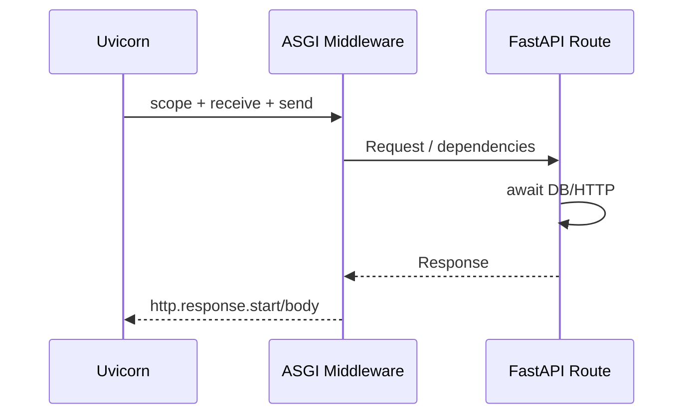

# Python 与 FastAPI：ASGI、依赖注入和异步边界

ASGI 是 Python Web 应用与服务器之间的异步协议，FastAPI 是在 ASGI 之上组织路由、依赖和响应的框架；它们位于 HTTP 连接与业务 Service 之间。`async def` 只有在等待真正可挂起的操作时才让出事件循环，同步 IO 和 CPU 工作仍需要线程池、进程或持久 Worker 的边界。

`async def` 路由中直接调用同步 PDF 解析，解析 2 秒期间同一事件循环无法处理其他 socket。FastAPI 基于 ASGI 支持异步请求，但不会自动把同步库变成异步。

## ASGI 用 scope、receive、send 表示一次连接

Server 为 HTTP 请求创建 scope，应用通过 receive 读取请求事件，通过 send 发送响应事件。WebSocket 和 lifespan 使用同一协议族的不同 scope，Middleware 可以包裹这三个参数。

FastAPI/Starlette 把 ASGI 事件适配成 Request/Response、路由和依赖。Uvicorn Worker 中事件循环调度多个 Task；多进程部署则每进程有独立内存、连接池和缓存。



客户端断开会通过协议/取消传播体现。路由仍要把取消交给数据库与 HTTP 客户端，不能捕获 CancelledError 后继续无界工作。

取消不是“撤销已经发生的一切”。MySQL 已提交的事务不会因为浏览器关页而回滚，外部服务也可能在超时前收到了请求。读请求可以尽快取消；写请求仍靠事务、幂等键和结果查询处理未知结果。日志要区分 client_disconnect、application_deadline 和 dependency_timeout，三者虽然都表现为请求没拿到结果，恢复动作并不相同。
## 依赖注入管理请求资源与认证上下文

FastAPI Dependency 可验证 Access Token、创建 Principal、提供 AsyncSession，并用 yield 在响应后清理。依赖有缓存语义，同一请求重复依赖默认复用结果；它不是全局 Singleton 容器。

数据库事务由 Service/Unit of Work 决定，不要在一个通用依赖中自动 commit 所有路由。异常 rollback 后 Session 不继续传递；Streaming Response 还要注意 yield 清理发生时机。

路由只接收已构造 Principal 与 AsyncSession，把资源 ID 和业务输入交给 Service。

```python
@router.get("/projects/{project_id}", response_model=ProjectOut)
async def get_project(
    project_id: UUID,
    principal: Annotated[Principal, Depends(current_principal)],
    session: Annotated[AsyncSession, Depends(db_session)],
) -> ProjectOut:
    project = await service.get_scoped(
        session=session,
        principal=principal,
        project_id=project_id,
    )
    return ProjectOut.model_validate(project)
```

Pydantic response model 约束输出形状，但不会自动证明 tenant_id 过滤。`get_scoped` 的 SQL 与集成测试必须包含 Principal 范围。
## 同步函数、线程池与进程各有边界

普通 `def` 路由/依赖可由 Starlette 放在线程池运行，避免阻塞事件循环，但线程池容量有限；同步数据库调用与文件解析高并发时仍会排队。

CPU 密集 Python 受 GIL 与内存影响，通常使用多进程/Celery Worker。小量阻塞库可 `to_thread`，但设置 Semaphore/线程池上限与 deadline；不要为每条请求无限创建线程。

异步链中混入一个同步客户端就会破坏容量估算。例如 `async def` 内调用同步 `requests.get`，事件循环直到响应或 socket timeout 才能继续。改用支持 asyncio 的客户端只是第一步，还要显式设置连接、读取、连接池等待三类超时，并限制总连接数。否则任务虽然能让出事件循环，却会堆积在客户端连接池里。

| 工作 | 位置 | 容量控制 |
| --- | --- | --- |
| 异步 HTTP/DB | 事件循环 Task | 连接池 + timeout |
| 短同步 IO | 受限线程池 | thread tokens/Semaphore |
| CPU/长解析 | 进程/Celery | Worker 并发与任务租约 |
| 进程内 BackgroundTasks | 当前应用进程 | 只适合短且可丢工作 |
| 可靠后台任务 | 持久任务表 + Broker | ACK/重试/幂等 |
## 异常与取消保持协议和所有权

Validation Error、领域错误和基础设施错误统一转换 Problem；日志保留 cause，响应不暴露 Traceback。TaskGroup 一个子任务失败会取消同组其他任务，清理块要能处理 CancelledError。

`asyncio.shield` 不能当通用的“保证执行”。它只隔离外层取消，内部 Task 仍要有引用、deadline 和异常观察；随手 shield 审计或消息发布会留下请求结束后无人管理的工作。需要可靠完成的副作用先与业务数据写入 Outbox，交给持久 Worker。

lifespan 启动共享 Client/Engine，关闭时先 readiness=false、停止 Worker/新请求，再 dispose Engine、关闭 Redis/HTTP 与 flush Telemetry。测试用 lifespan 实际启动，避免只调用函数错过资源问题。
## FastAPI 异步执行边界

**多 Uvicorn Worker 能解决所有阻塞吗？**

它减少单个事件循环阻塞的影响并利用多核，但每进程都有连接池和内存，阻塞仍降低容量。先移除/隔离阻塞，再按全局数据库预算设置进程数。

**BackgroundTasks 适合发邮件吗？**

短、失败可接受的通知可以；进程重启会丢任务，也没有 ACK/重试。重要邮件先写任务/Outbox，由 Celery 等持久 Worker 处理。

**为什么不要捕获所有 Exception 后返回 200？**

会把失败伪装成功，事务和监控无法判断。只捕获可分类错误，映射稳定状态；未知错误 rollback、记录并返回 500。

**AsyncSession 能否跨并发 Task 共用？**

它是有状态事务会话，不适合多个并发 Task 共享。每个独立事务使用自己的 Session；同一事务内通常顺序执行 SQL。
