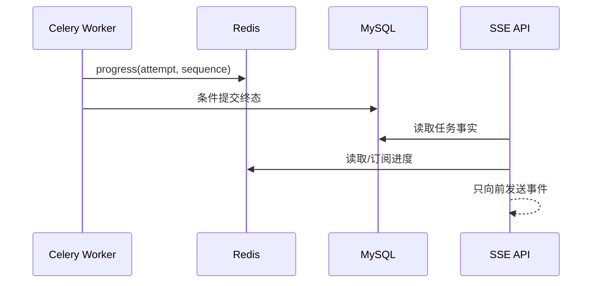

# Python 接入 Redis、Celery、MinIO 与测试质量

Celery 任务超时后重投，新 Worker 把 attempt=2 标成 failed；旧 Worker 随后恢复，把同一任务覆盖成 completed。`acks_late` 只改变 Broker 确认时机，不能阻止旧所有者写状态。任务表需要 attempt/租约，外部对象需要版本化 key。

## Celery 传递 task_id，不传 ORM 对象和大文件

API 在 MySQL 创建任务和 Outbox，Celery 消息只带稳定 task_id、schema_version。Worker 创建自己的数据库 Session，重新读取 Principal 范围/任务状态；ORM 对象不能跨进程序列化。

大文件保存在 MinIO，消息带 object_key 或 document_id。JSON Serializer 与白名单任务避免 pickle 执行风险；Broker/Result Backend 凭证和 Queue 权限最小化。

| 组件 | 保存 | 不保存 |
| --- | --- | --- |
| MySQL tasks | 状态、attempt、租约、结果引用 | 高频百分比每次写 |
| Redis | 短时进度/限流/缓存 | 唯一成功事实 |
| RabbitMQ/Celery | 待投递任务 | 长期结果 |
| MinIO | 源文件与派生对象 | 授权规则 |
| SSE | 进度事件传输 | 任务状态真相 |

## ACK、retry 和任务租约共同决定恢复

`acks_late` 让任务执行后 ACK，Worker 丢失会重投；`autoretry` 仍要只覆盖临时错误，并设置 max_retries/backoff/jitter。业务非法不重试，进入 failed。

每次领取增加 attempt。完成 SQL 同时匹配 task_id、attempt 和 running；影响 0 表示租约丢失。`soft_time_limit` 提供协作异常，hard limit 可能直接杀进程，清理不能只依赖 finally。

Worker 的 prefetch 会改变故障表现。并发为 8、prefetch multiplier 为 4 时，一个进程可能预取 32 条消息；长任务会让其他 Worker 空闲，而这些消息仍显示 unacked。需要按任务时长拆 Queue，降低长任务预取，并同时观察队列 ready、unacked 与 oldest age。只看 ready=0 可能误以为积压已经消失。

下面的任务只演示所有权检查，真实代码还要为 MinIO/DB 客户端设置 timeout，并分类异常。

```python
@celery.task(bind=True, acks_late=True, max_retries=5)
def parse_document(self, task_id: str) -> None:
    lease = tasks.claim(task_id, celery_task_id=self.request.id)
    try:
        object_key = parser.run(lease.document_id, lease.attempt)
        if not tasks.complete_if_owned(
            task_id, lease.attempt, object_key
        ):
            raise LostLease(task_id)
    except RetryableDependencyError as exc:
        raise self.retry(exc=exc, countdown=backoff(self.request.retries))
```

同步 Celery Worker 使用同步 SQLAlchemy/MinIO 客户端，不能随意在任务中混用一个全局 asyncio loop。FastAPI 的 AsyncSession 不传入 Worker。

Celery 的 retry 是一次新的投递机会，不是事务回滚。若第一次已经上传对象或调用了外部 API，重试前必须能识别原副作用。代码按错误类型决定：输入格式错误写终态并 ACK；依赖超时且结果可查询时先查；临时网络失败才退避重试；达到上限后保留任务、异常分类和最后一次 attempt 供人工恢复。

## Redis 进度与 SSE 有版本防倒退

Worker 把 `{attempt, sequence, percent, stage}` 写 Redis，并发布进度；Lua/条件逻辑只接受更高 attempt 或同 attempt 更高 sequence。旧 Worker 的 90% 不能覆盖新 attempt 的 20%。

SSE 端先从 MySQL/Redis读取当前快照，再订阅新事件；断线用 task_id 和 Last-Event-ID 恢复。Redis 丢失后至少从 MySQL 得到 queued/running/terminal，不把空进度当任务不存在。



SSE 只是传输层；浏览器重连或丢事件不会改变任务是否成功。终态始终可通过 GET /tasks/{id} 查询。

## pytest 验证崩溃、重投与清理

单元测试用 eager/直接调用验证错误分类，但 eager 不模拟 Broker ACK 与多进程。集成启动真实 Worker 和 RabbitMQ，杀掉执行中 Worker，断言重投且业务只产生一个结果。

ruff 检查代码，mypy 检查类型，pytest 覆盖 MySQL/Redis/MinIO。测试对象使用 run_id 前缀，关闭 Worker/连接后精确清理；失败日志和 task_id 保存到临时 Artifact。

集成用例还要让 Worker 在三个时间点退出：领取后尚未写入、对象上传后尚未提交、数据库提交后尚未 ACK。前两种应由租约和对象清理恢复；第三种会重复投递，但 Inbox/终态条件更新必须吸收重复。这样才能证明 `acks_late`、业务幂等和资源清理真的组合起来了。

## Python 任务链继续追问

### Celery Result Backend 能否替代 tasks 表？

它适合框架任务结果和调试，不一定满足租户权限、业务状态、长期审计和跨语言契约。业务任务仍在 MySQL 建模，Result Backend 可选。

### 为什么 Celery eager 测试不够？

它在测试进程同步执行，没有序列化、Broker、ACK、预取、Worker 崩溃和重投。规则单测可用，可靠性必须真实集成。

### 任务 hard timeout 后对象上传到一半怎么办？

使用分段上传/临时 key，完成后才标记数据库；周期任务清理过期 multipart 和非当前 attempt 对象。不能依赖被强杀进程执行清理。

### Celery retry 会不会产生新 task_id？

通常 retry 维持 Celery task identity，但业务不能依赖实现细节保证幂等。始终使用自己的业务 task_id/event_id/attempt 进行状态裁决。
