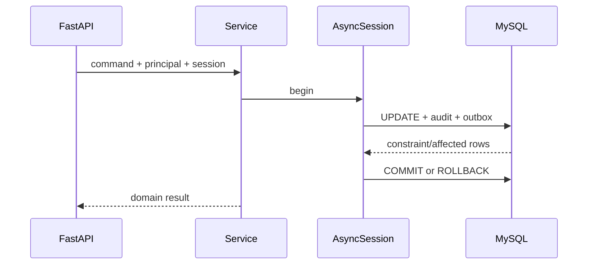

# SQLAlchemy 2、MySQL 与认证会话

SQLAlchemy `Session` 与登录 Session 名字相同，却完全不是一类状态：前者追踪 ORM 对象和数据库事务，后者证明浏览器会话身份。把两者混在依赖中会出现数据库已 rollback、登录 Session 却被误撤销，或反过来。

## SQLAlchemy 2 先构造 Statement，再显式执行

`select(Project).where(...)` 构造 SQL 表达式，AsyncSession.execute 通过异步 MySQL 驱动执行。Identity Map 保证同一 Session 内同一主键通常映射同一对象，但它不是跨请求缓存。

租户范围进入每条 Statement，详情使用 `tenant_id + id`；列表使用稳定排序和游标。Lazy load 在 async 中容易产生隐式 IO，应显式 selectinload/joinedload 或 DTO 查询，并用 SQL 日志/查询计数验证。

查询把 tenant_id 与 project_id 同时绑定，找不到统一返回领域 NotFound。参数由 SQLAlchemy 绑定，不拼字符串。

```python
statement = select(Project).where(
    Project.tenant_id == principal.tenant_id,
    Project.id == project_id,
)
result = await session.execute(statement)
project = result.scalar_one_or_none()
if project is None:
    raise ProjectNotFound(project_id)
```

不要先按 id 查询再在 Python 比较 tenant_id，那会把越权对象加载进内存并可能泄露日志/关联。Repository 集成测试准备其他租户同类数据。
## 一请求一个工作单元，事务由用例拥有

依赖创建 AsyncSession 并保证关闭，Service 使用 `async with session.begin()` 包住项目更新、审计与 Outbox。flush 获取约束结果但不提交；异常离开 begin 自动 rollback。

捕获 IntegrityError 后 Session 处于失败状态，先 rollback；根据驱动错误码/约束名映射冲突。不要在 Repository 内 commit，否则跨 Repository 操作无法原子回滚。

`flush` 会把待处理 INSERT/UPDATE 发给 MySQL，因此唯一约束、外键和类型错误可能在 flush 阶段出现；它仍属于当前事务，其他连接通常看不到未提交结果。`commit` 还可能因为死锁、连接中断或日志刷盘失败而报错。连接在 COMMIT 响应返回前断开时结果可能未知，不能在新事务中盲目再执行一次非幂等写入，应通过业务 ID 或幂等记录查询最终状态。



数据库 Session 生命周期结束后才由 HTTP 层序列化稳定 DTO，避免序列化触发 lazy query。

关联加载需要根据访问形状选择。`selectinload` 先查父项，再用主键集合查关联，适合一对多列表；`joinedload` 使用 JOIN，集合关系会产生重复行并可能放大分页结果。对管理端列表，直接选择 DTO 所需列通常更清楚。测试对固定 fixture 记录 SQL 数量，新增字段时若从 2 条变成 102 条即可及时发现 N+1。
## 密码与 Refresh 会话使用独立表和事务

用户表保存 Argon2id hash；认证会话表保存 Refresh Token hash、family_id、expires、revoked、replaced_by。登录事务创建会话，响应设置原始随机 Token 到 HttpOnly Cookie。

刷新先按哈希锁定会话，检查未撤销/未过期，再创建新 Token 并把旧会话 replaced_by 指向新会话。旧值重放时撤销 family。数据库事务保证同一个旧 Token 只能成功轮换一次。

| 状态 | 数据库动作 | 对外结果 |
| --- | --- | --- |
| 有效 Refresh | 锁定、创建新行、替换旧行 | 新 Cookie + Access |
| 已替换值重放 | 撤销整个 family | 401 并清 Cookie |
| 过期/撤销 | 不创建新会话 | 401 |
| 登出 | 撤销当前行/family 策略 | 过期 Cookie |
| 密码修改 | 更新 hash、撤销全部会话 | 重新登录 |
## Alembic 管结构，应用不自动建表

Model 变化生成/编写 Alembic migration，人工审查类型、索引、数据迁移和 downgrade 现实性。在空库与上一版本库升级，比较 information_schema；生产由单独 Job 运行。

Python 测试运行 ruff、mypy、pytest；MySQL 集成验证事务、N+1 和认证并发。SQLite 语义与 MySQL 类型、锁、约束不同，不能作为唯一集成数据库。

AsyncEngine 的 pool_size、max_overflow 与 Uvicorn Worker 数相乘才是服务总连接上限。四个进程各允许 20 条连接，不是 20，而是最多 80；再叠加 Celery 与迁移 Job 可能超过 MySQL 预算。Pool timeout 应短于请求 deadline，指标记录 checkout 等待和连接使用量，避免把“池里排队”误判成慢 SQL。
## SQLAlchemy 会话与认证一致性

**expire_on_commit 应该设 false 吗？**

async API 常设 false 避免 commit 后访问属性触发隐式 IO，但对象可能是旧值。返回前构造 DTO；需要最新数据库状态时显式 refresh，而不是依赖默认。

**为什么 Refresh 轮换要锁行？**

两个并发刷新都读到有效旧行时可能各自签发新 Token。`SELECT FOR UPDATE` 或原子条件更新让只有一个成功，另一个识别为已替换/重放。

**Pydantic Model 能直接当 ORM Model 吗？**

职责不同。Pydantic 表达 API 输入输出，SQLAlchemy 表达持久化与关系。直接共用会把数据库字段暴露给客户端，也难以兼容演进。

**为什么 Alembic autogenerate 仍需人工审查？**

它无法理解重命名 vs 删除新增、数据回填、锁风险和业务兼容窗口。生成结果只是候选迁移，不是生产计划。
