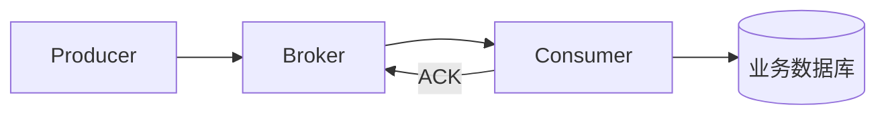
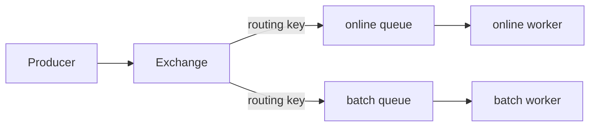
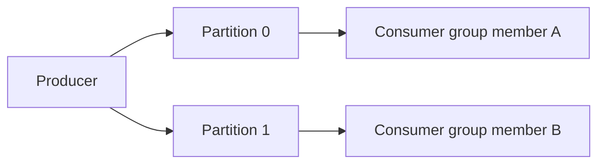
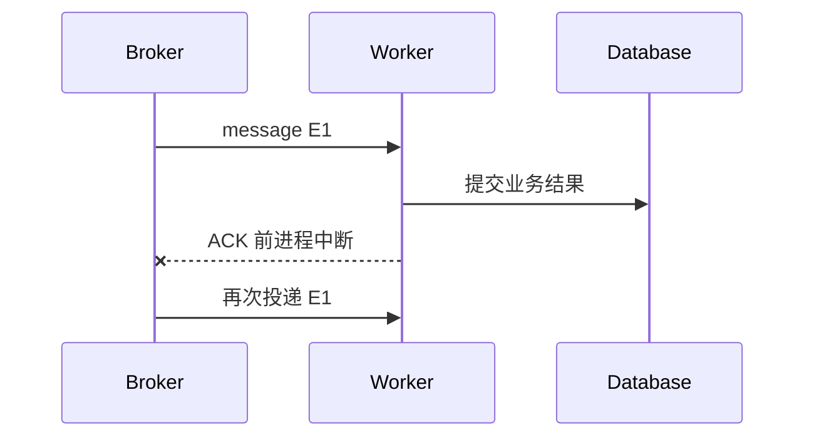

# RabbitMQ、Kafka、ACK、消费组与重复消息

API 创建任务后，要异步发邮件、生成向量和更新统计。把这些工作放进请求里会增加延迟和失败耦合，于是引入消息系统。但“把消息发到队列”并没有自动解决丢失、重复、顺序和数据库一致性。

本章用两个场景比较 RabbitMQ 和 Kafka：命令式后台任务，以及可回放业务事件流。

## 消息链中的四个角色

Producer 发布消息；Broker 持久化并路由；Consumer 拉取或接收；业务数据库保存处理结果；ACK 告诉 Broker 当前消息可以确认。

消息体使用稳定事件 ID、类型、版本、发生时间和业务引用。不要把数据库完整实体或敏感字段无选择塞入消息。

## RabbitMQ：以队列和路由为中心

RabbitMQ 常见概念：Exchange 接收发布，按 Binding 把消息路由到 Queue，Consumer 从 Queue 消费。

Direct、Topic、Fanout 等 Exchange 支持不同路由。任务队列适合明确命令、优先级、延迟和每条消息被某个 Worker 处理。

可靠发布需要 Durable Exchange/Queue、Persistent Message 和 Publisher Confirm。只设置消息持久化却不等待 Confirm，连接中断时 Producer 不知道 Broker 是否接受。

Consumer 处理成功后 ACK；失败可 NACK/reject。立即 requeue 一个永久错误会形成高速死循环，应区分暂时性失败和永久失败，限制重试并进入死信队列。

## Kafka：以分区日志和消费位置为中心

Kafka Topic 被分成 Partition。消息追加到分区日志，有 Offset；Consumer Group 中同一 Partition 同时由一个消费者处理，从而在组内分摊。

Kafka 保留消息一段时间，消费者提交 Offset 表示进度。它适合事件流、审计、重放和多个独立消费组。吞吐和保留能力强，但分区、再均衡、Schema 演进和运维更复杂。

顺序只在单个 Partition 内成立。若同一业务实体需要顺序，使用稳定 Key 让它们进入同一 Partition；这会影响热点和并行度。

## 至少一次为什么会重复

Consumer 完成数据库提交后、发送 ACK 前崩溃。Broker 没收到 ACK，会再次投递。数据库副作用已经发生，所以重复是正常行为。

消费端按 `eventId` 或业务幂等键去重：在同一数据库事务中记录已处理事件并写业务结果。若事件已经处理，返回成功并 ACK。

“Exactly once”往往只在特定系统边界和条件下成立。消息系统的事务不能自动覆盖任意数据库和第三方 API。

## Prefetch 和背压

RabbitMQ Prefetch 控制一个 Consumer 同时持有多少未 ACK 消息。过高会让一个慢 Worker 抢走大量任务，也增加崩溃后重新投递；过低可能浪费吞吐。

Kafka Consumer 每次拉取批次并按处理能力推进 Offset。处理时间超过 `max.poll.interval` 等配置可能触发再均衡。长任务可以拆分、暂停分区、使用独立 Worker 或把消息只作为领取业务任务的通知。

队列长度只看条数不够，还要看最老消息年龄。大量快速任务和一个等待两小时的任务，业务影响完全不同。

## RabbitMQ 还是 Kafka

| 需求 | RabbitMQ 倾向 | Kafka 倾向 |
| --- | --- | --- |
| 后台命令任务 | 强 | 可以但需更多约定 |
| 灵活路由和优先级 | 强 | 以 Topic/Partition 为主 |
| 长期事件保留与重放 | 可用但非主要模型 | 强 |
| 多个独立消费者重读 | 需额外队列 | 原生消费组 |
| 分区内高吞吐日志 | 一般 | 强 |
| 简单任务队列起步 | 常更直接 | 可能过重 |

系统可以同时使用：RabbitMQ 处理命令任务，Kafka 处理业务事件。但两套基础设施意味着两套监控、容量和恢复，需求不足时不要同时引入。

## 消息 Schema 演进

事件包含版本，消费者采用向后兼容读取。新增可选字段通常较安全；删除、改类型和改变含义需要新版本与迁移窗口。

Producer 不应假设所有 Consumer 已同步升级。契约测试使用旧消费者样本读取新事件，并记录 Topic/Queue 所有者。

## 死信队列不是垃圾桶

死信记录消息、失败分类、尝试次数、首次/最后失败时间和消费者版本。运维需要告警、查看、修复和受控重放。

重放前确认 Consumer 已修复且幂等，避免把永久坏数据再次压垮下游。敏感消息的死信保留和访问权限同样受控。

## 本章实践设计

画出一个“创建文档处理任务”的链路：API 写任务，发布 `document.process.requested`，Worker 读取并更新状态。

为它写明：

- Broker 与 Queue/Topic；
- 消息 Key 和事件 ID；
- 发布确认；
- ACK 时机；
- 幂等表或唯一约束；
- 暂时性与永久错误；
- 最大重试和死信；
- 队列年龄告警；
- 停机时如何停止取新任务并排空。

## 消息系统检查表

- Producer 知道发布是否被 Broker 接受；
- 消息和队列按需求持久化；
- ACK 发生在业务提交后；
- Consumer 能处理重复；
- 顺序范围明确到队列或分区；
- 重试有限并带退避；
- 死信可观察、可修复、可审计重放；
- 消息 Schema 有版本；
- 监控积压条数、年龄、处理耗时和失败；
- 优雅停机停止取新任务并等待在途任务。

下一章把消息与数据库事务连接起来，解释幂等、Outbox、死信和 Saga 分别解决哪一段可靠性问题。

## 参考资料

- [RabbitMQ Reliability Guide](https://www.rabbitmq.com/docs/reliability)
- [RabbitMQ Consumer Acknowledgements and Publisher Confirms](https://www.rabbitmq.com/docs/confirms)
- [Apache Kafka Consumer Design](https://kafka.apache.org/documentation/#consumerapi)
- [Apache Kafka Message Delivery Semantics](https://kafka.apache.org/documentation/#semantics)

