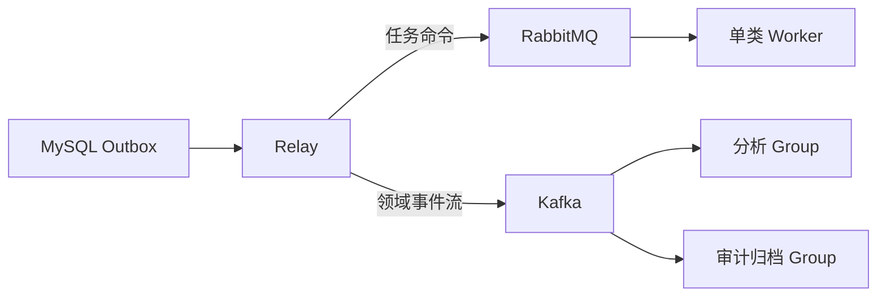

# RabbitMQ 与 Kafka：按消息语义和运行责任选型

RabbitMQ 以交换机、队列、路由和 ACK 组织任务投递，Kafka 以持久分区日志、Offset 和 Consumer Group 组织可重放事件流。两者都连接生产者与异步消费者，但解决的运行责任不同：前者擅长任务路由与确认，后者擅长长期保留和多组独立重放。

“消息多就用 Kafka，少就用 RabbitMQ”无法指导设计。订单异步邮件需要任务路由、ACK、延迟重试和 DLQ；行为日志需要长时间保留、分区吞吐和多个 Group 重放。二者的差异来自数据模型和消费语义，不只是吞吐数字。

## 安装消息代理并确认管理端口

RabbitMQ 的官方安装入口是[下载页](https://www.rabbitmq.com/download.html)，Kafka 的版本和二进制入口在[Apache Kafka 下载页](https://kafka.apache.org/downloads/)。本地比较可以用两个隔离容器，生产环境应改用固定版本、持久卷和受控凭证。

<figure class="doc-shot">
  
  <figcaption>RabbitMQ 官方下载页。先选安装方式，再核对 Erlang 兼容范围；管理插件能打开不代表消息确认和恢复策略已经验证。</figcaption>
</figure>

<figure class="doc-shot">
  
  <figcaption>Kafka 官方下载页。二进制包、容器镜像和云服务的运维边界不同，教程中的本地命令只用于建立可重复的实验环境。</figcaption>
</figure>

```bash
docker run --name rabbitmq-learning -p 5672:5672 -p 15672:15672 \
  -e RABBITMQ_DEFAULT_USER=demo \
  -e RABBITMQ_DEFAULT_PASS=change-me \
  -d rabbitmq:management

docker run --name kafka-learning -p 9092:9092 -d apache/kafka
curl -fsS http://127.0.0.1:15672
```

RabbitMQ 管理端口返回页面只证明管理插件和 HTTP 监听，Kafka 容器启动也不等于 Topic、分区和 Consumer Group 已按目标配置。后面的选型仍以 ACK、Offset、回放和故障演练为准。
## 任务消息与可重放事实流

任务强调某个消费者最终完成工作，常需要灵活路由、单条 ACK、重试队列、优先级或 RPC 风格；RabbitMQ 的 Exchange/Queue 模型直接表达这些需求。

事件流强调按 key 有序追加、保留一段时间、多组独立读取和回放；Kafka 的 Partition/offset/retention 更自然。两者都能做对方部分工作，但运维和实现成本会不同。

| 问题 | RabbitMQ 倾向 | Kafka 倾向 |
| --- | --- | --- |
| 消息消费后还需长期保留吗 | 通常由队列移除 | 按 retention 保留 |
| 需要复杂路由吗 | Exchange/Binding 强 | Topic/Partition 相对简单 |
| 消费位置如何保存 | Broker 跟踪 ACK | Consumer Group offset |
| 单条失败怎样处理 | nack/retry/DLQ 直接 | 应用重试 topic/DLQ |
| 需要多组重放吗 | 需额外复制/拓扑 | 新 Group 或重置 offset |
| 顺序范围 | Queue/Consumer 配置相关 | 单 Partition 明确 |
## 用三个真实工作负载做选择

文件解析任务需要一个 Worker 领取、耗时较长、失败退避、最终进入 DLQ，RabbitMQ 更直接。审计事件要被告警、归档和分析三个消费者独立读取并可重放，Kafka 更合适。

Outbox Relay 可以同时支持两者，但事件 Schema、key、路由和保留策略不同。不要在业务代码中到处直接调用 Broker SDK，统一由消息适配器处理信封、追踪和发布确认。



同时使用两套 Broker 只在需求明确时成立。小团队应优先选择一套能覆盖主要场景的系统，避免双份监控、权限、升级和事故处理。
## 选型要包含企业运维能力

比较托管服务可用性、团队经验、跨机房、容量扩展、监控、备份/恢复、Schema 管理、权限和升级。Kafka Partition 扩容与 RabbitMQ Queue 类型/集群策略都需要长期维护。

PoC 不能只测发送成功。固定消息大小与到达率，验证 Broker 重启、消费者崩溃、重复、积压、重试、DLQ 和恢复时间；结果绑定版本与环境，不写成通用性能承诺。

下面是一张决策记录骨架。每一项都要填当前业务事实和验证证据，而不是打主观分数。

```text
工作负载：文档解析任务
顺序范围：单 document_id
保留/重放：完成后不需长期重放
失败语义：10s/1m/5m 重试，最终 DLQ
峰值与消息大小：来自压测记录
团队现有能力：RabbitMQ 监控与 Runbook
选择：RabbitMQ quorum queue
退出条件：需要多个独立消费组和长期事件回放
```

决策记录要写退出条件。未来工作负载变化时重新评估，而不是把某个中间件变成不可质疑的组织标准。

还要把迁移成本放进选择。消息信封、事件 ID、Schema 演进、重放工具和业务幂等可以独立于 SDK，但 routing key、partition key、顺序与延迟策略无法完全抽象。所谓统一 Broker 接口若抹掉这些差异，只会把关键约束藏进适配器。
## 应用语义不能交给 Broker 品牌决定

无论选哪套，消息都有 event_id、schema_version、occurred_at、tenant_id、trace context 和 payload；消费者验证 Schema、幂等处理、有限重试并记录终态。

“Kafka exactly-once”或“RabbitMQ durable”都不能证明外部数据库副作用恰好一次。端到端仍用 Outbox/Inbox、唯一约束和状态机。
## 选型时容易问偏的问题

**系统已经有 Redis，能否直接用 List 当队列？**

简单低风险任务可行，但 ACK、消费者崩溃恢复、延迟重试、DLQ 和监控都要自己实现。任务重要性提高后，专业 Broker 或 Redis Stream/任务框架更合适。

**RabbitMQ 能否做事件广播？**

Fanout/Topic Exchange 可把消息复制到多个 Queue，各消费者独立 ACK。但长期保留和任意 offset 回放不是它的核心模型，需要额外存储。

**Kafka 能否做延迟任务？**

可以通过重试 Topic、定时调度或外部系统实现，但不像 RabbitMQ TTL/DLX 那样直接，且维护分区顺序和重试风暴更复杂。

**什么时候不需要消息队列？**

短、可靠、调用方必须立即知道结果的操作可同步完成。引入队列会增加最终一致性、重试和运维；不要为“解耦”把简单请求拆成无法追踪的异步链。
