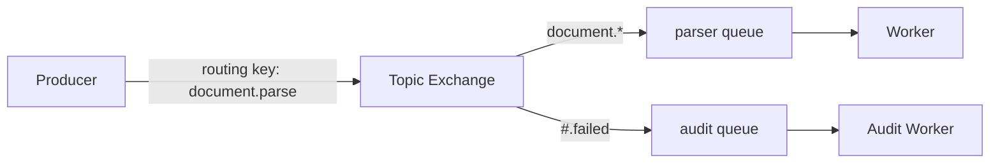

# RabbitMQ 路由、ACK、重试与死信

Worker 已把任务写入数据库，进程在 `basic.ack` 前退出。连接关闭后，RabbitMQ 把未确认消息重新入队，另一个 Worker 再次收到它。手动 ACK 提供的是“处理完成前不删除消息”，不是 exactly-once；消费者必须允许重复。

## Exchange 路由，Queue 保存，Binding 连接规则

生产者把消息发布到 Exchange，并提供 routing key。Direct Exchange 精确匹配，Topic 按词模式匹配，Fanout 广播到所有绑定 Queue。Queue 才保存等待消费的消息；Exchange 没有匹配且未配置 mandatory/alternate 时，消息可能被丢弃。

声明 durable Exchange/Queue 只保证拓扑在 Broker 重启后存在；消息还需要 persistent 属性，Broker 的持久化与 publisher confirm 才能建立发布证据。



Producer 不应依赖某个消费者在线。它依赖已声明的路由契约和 publisher confirm；拓扑通常由受控部署或幂等声明建立。

## Publisher confirm 与 Consumer ACK 在链路两端

Publisher confirm 告诉生产者 Broker 是否接管 publish；Consumer ACK 告诉 Broker 消费者已完成处理。两者互不替代。API 在 publish 超时时仍可能不知道 Broker 是否接收，因此消息要有稳定 event_id。

消费者先完成数据库事务，再 ACK。若先 ACK 后写库，进程崩溃会永久丢任务；写库后 ACK 虽会重复，但幂等表、唯一约束或条件状态转换能安全吸收。

下面的伪代码展示 event_id 去重和 ACK 顺序。数据库事务成功才确认消息。

```ts
channel.consume(queue, async (message) => {
  const event = decodeAndValidate(message.content)
  try {
    await db.transaction(async (tx) => {
      const claimed = await inbox.claim(tx, event.eventId)
      if (claimed) await tasks.apply(tx, event)
    })
    channel.ack(message)
  } catch (error) {
    await handleRetryOrDeadLetter(channel, message, error)
  }
}, { noAck: false })
```

重复 event_id 时事务不再执行副作用，但仍 ACK 当前投递。decode/Schema 错误通常不可重试，应带原因进入 DLQ，而不是无限 requeue。

## Prefetch 把在途消息限制在消费者容量内

Prefetch 控制一个 Consumer 同时持有多少未 ACK 消息。值过大导致慢 Worker 囤积消息、分配不均和内存上升；值过小可能无法覆盖 IO 等待。根据单任务资源、处理时间和 Worker 并发测量。

进程收到 SIGTERM 后先停止获取新消息，等待在途任务在 deadline 内完成并 ACK；超时则关闭 Channel，让未确认消息重投。不能在关停时批量 ACK 尚未完成的任务。

| 失败类型 | 动作 | 原因 |
| --- | --- | --- |
| 临时网络/依赖错误 | 延迟后有限重试 | 可能恢复 |
| Schema/参数非法 | 直接 DLQ | 重复不会变正确 |
| 业务已终止 | ACK 并记录终态 | 不是基础设施失败 |
| Worker 崩溃 | 连接关闭后重投 | 未 ACK 保留 |
| 超过最大尝试 | DLQ + 告警 | 需要分析或人工处理 |

## 重试不能原地高速 requeue

立即 `nack(requeue=true)` 会形成热循环，故障依赖继续被打满。使用带 TTL 的重试队列、延迟交换插件或调度服务实现 10s/1m/5m 等退避，并在 Header 或消息信封记录 attempt。

DLQ 不是垃圾桶。它需要消息原文的受控副本、失败码、首次/最后失败时间、attempt、处理 Runbook 与重放工具。重放仍使用同一 event_id，消费者幂等保护不能绕过。

生产队列还要确定复制类型和故障策略。单节点 durable Queue 无法承受所在节点与磁盘同时失效；Quorum Queue 用多数副本提交换取更强可用性，也带来写放大和容量成本。选副本数前先定义允许丢失窗口、Broker 故障时是否继续发布，以及磁盘告警后的止损动作。

## 投递保证、确认与重放边界

**消息设置 persistent 为什么仍可能丢？**

若发布到不存在/无匹配路由、生产者没等 confirm、Broker 集群策略不足或磁盘故障，persistent 本身不建立端到端保证。要组合 durable 拓扑、mandatory/alternate、confirm 和监控。

**ACK 能否放在数据库 COMMIT 同一事务？**

RabbitMQ ACK 与 MySQL COMMIT 属于不同系统，无法普通地原子提交。采用数据库 Inbox 幂等，让 COMMIT 后 ACK 的重复投递安全。

**DLQ 消息修复后怎样重放？**

先修复消费者或数据，按筛选批量重发到原交换机，保留 event_id 与审计，限制速率并观察成功/再次失败。不要直接清空 DLQ。

**Queue 长度为零是否代表系统健康？**

不一定。消息可能未路由、生产停止、全部堆在 unacked，或消费者错误 ACK。一起看 publish rate、confirm、ready、unacked、消费成功和任务业务状态。
