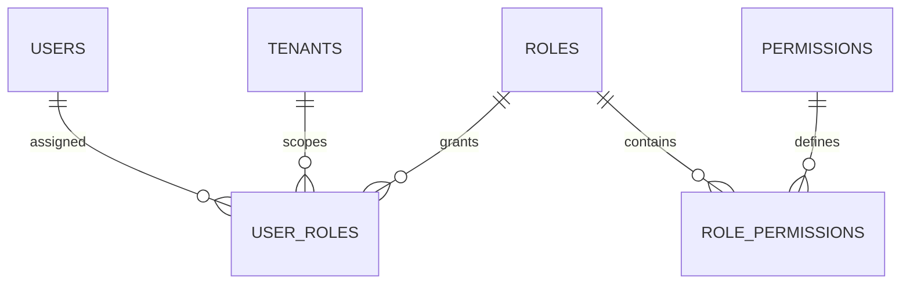

# RBAC：角色、权限与授权判断

RBAC 用角色聚合一组权限，再把角色分配给用户或服务身份。它位于认证完成后的服务端授权层，用来回答当前主体是否具备执行某个动作的资格；目标资源属于哪个租户、是否满足对象条件，还要由数据范围或 ACL 继续判断。

前端隐藏了“删除用户”按钮，但攻击者直接调用 `DELETE /users/{id}` 仍然成功。页面权限只能改善交互，服务器必须把当前 Principal、权限、租户和目标资源放进每次请求的授权决策。RBAC 用角色聚合权限，减少逐用户配置。

## 权限表达动作，角色打包权限

权限码使用稳定业务语义，例如 `user.read`、`user.update`、`role.assign`。角色是权限集合，例如 tenant_admin、auditor；用户在某个租户中获得角色。不要用前端路由名或 Controller 类名作为权限码，它们会随实现重构。

角色并不天然等于组织职位。同一用户可在租户 A 是管理员，在租户 B 只是查看者，因此用户角色关联必须带 tenant_id 或作用域。



角色和权限是多对多。业务查询先确定当前租户内的角色，再展开权限；不能拿用户在其他租户的角色复用。
## 授权决策发生在资源动作之前

认证回答“你是谁”，授权回答“你能否在当前范围执行此动作”。Guard 可以检查粗粒度权限码，Service 还要检查目标资源属于当前租户、目标角色是否可管理、是否违反职责分离。

默认拒绝。新增接口若没有声明授权策略，测试应失败，而不是自动对所有登录用户开放。跨租户资源统一 404，内部审计记录 authorization_denied 的真实原因。

授权函数输入全部显式化，便于在 NestJS、FastAPI 和 Gin 中复用同一决策表。

```ts
function canUpdateUser(
  principal: Principal,
  target: UserSummary,
): boolean {
  return principal.tenantId === target.tenantId
    && principal.permissions.has("user.update")
    && !target.isPlatformOwner
}

if (!canUpdateUser(principal, target)) throw new NotFound()
```

示例把平台所有者保护写成额外不变量，说明“拥有权限码”仍不等于能操作所有目标。真实系统还可能比较部门范围和角色等级。
## 权限缓存必须能按版本失效

每次请求多表展开权限可能昂贵，可以把用户在租户中的权限集合缓存到 Redis 或 Access Token。但角色变更后旧缓存会继续授权，必须有权限版本、短 TTL 或主动失效。

高风险操作可读取数据库当前权限，普通读取接受短暂缓存。把大量权限直接塞进长时 JWT 会放大撤销窗口和 Token 体积；已验收的 JWT 生命周期仍应保持短时 Access。

| 变化 | 必须失效的状态 | 验证 |
| --- | --- | --- |
| 用户移除角色 | 该用户该租户权限缓存 | 旧会话下一请求被拒绝 |
| 角色删除权限 | 所有持有该角色的主体 | 批量版本递增或按角色索引失效 |
| 用户离开租户 | 会话范围与权限 | 跨租户查询统一 404 |
| 权限码下线 | 角色映射与前端能力表 | 契约与迁移同时发布 |
## 角色管理本身是最高风险权限之一

能创建角色并给自己分配权限的人可能绕过所有业务限制。角色创建、权限变更、用户授权与平台角色操作要分级，必要时禁止自我提权或要求第二人审批。

审计记录 actor、tenant、target、before/after 权限集、requestId 和结果。批量导入角色也必须走同样的 Service 规则，不能直接写关联表。
## RBAC 设计还要回答

**为什么不直接在 users 表放 role 字符串？**

单角色、小系统可以，但无法表达一用户多角色、租户作用域、自定义角色和权限演进。即使先用字符串，也应让授权代码依赖稳定权限语义，避免散落 `role === admin`。

**前端是否还需要权限判断？**

需要，用于隐藏不可用入口和减少无效操作，但它只是体验层。服务端仍在每次请求做最终授权，前端不能据此推断资源存在。

**超级管理员怎样设计才不会失控？**

平台角色与租户角色分离，默认不参与普通业务；启用强认证、短时提升、操作理由和完整审计。不要用一个全局布尔字段绕过所有 Service 检查。

**权限数量越来越多怎么办？**

按资源动作命名并维护权限目录，角色组合权限。避免为每个按钮造权限，也避免一个 `manage_all` 包含所有行为；定期扫描未使用权限和高风险组合。
