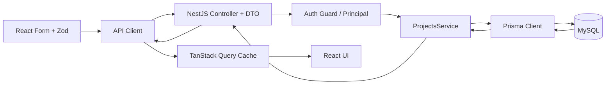

# React、NestJS 与 Prisma：打通登录和项目 CRUD

React 承担浏览器表单和页面状态，NestJS 处理 HTTP、认证与业务编排，Prisma 把服务代码映射到数据库查询。登录和项目 CRUD 构成一条贯穿客户端、应用层与 MySQL 的垂直切片，同一契约必须在每层保持一致。

用户在 React 表单输入“采购系统改版”，点击提交后页面出现新项目。要让这件事成为可靠的全栈功能，至少有六个位置必须同时正确：表单 Schema、HTTP 契约、认证主体、业务规则、租户查询条件和 MySQL 事务结果。

```text
POST /api/projects 201 46 ms
request_id=01J... user_id=user-1 tenant_id=tenant-a
prisma: INSERT INTO projects (...)
query cache: invalidate ["projects"]
```

第一行来自浏览器或访问日志，第二行把请求关联到验签后的主体，第三行确认数据库确实执行写入，最后一行说明前端重新读取服务端事实。实际系统应使用同一个 request ID 串联这些证据，示例中的耗时不代表生产性能基线。

这组输出连接了浏览器、API 和数据库。任何一层只显示“成功”都不够：前端 Mutation 成功不代表数据已提交，数据库插入成功也不代表越权规则正确。第一个全栈垂直切片的价值，是让你能沿同一条请求解释每个状态由谁拥有。

完整示例位于 `examples/backend/react` 与 `examples/backend/node`。前端使用 React、Vite、React Router、TanStack Query、React Hook Form、Zod 和 Ant Design；后端使用 NestJS、Prisma 与 MySQL 8.4。

## 垂直切片先小到能够看完整

首个切片只实现这些行为：

| 用户行为 | API | 持久状态 | 关键失败 |
| --- | --- | --- | --- |
| 登录 | `POST /auth/login` | 创建 Refresh Session | 密码错误、会话写入失败 |
| 恢复会话 | `POST /auth/refresh` | 轮换 Refresh Token | 过期、撤销、旧令牌重放 |
| 查看项目 | `GET /projects` | 不修改 | Access 无效、租户范围错误 |
| 创建项目 | `POST /projects` | 插入 Project | 名称重复、校验失败 |
| 修改项目 | `PATCH /projects/:id` | 名称与版本加一 | 不存在、越权、版本冲突 |
| 退出 | `POST /auth/logout` | 撤销 Session | 即使重复调用也应得到稳定终态 |

没有先加入角色配置页面、文件上传和消息队列，因为它们会让第一次调用链难以读完。后续章节会在同一模型上扩展，而不是重新建一套互不相关的演示项目。
## 目录让职责可以被追踪

```text
examples/backend/
├── compose.yaml
├── node/
│   ├── prisma/schema.prisma
│   └── src/
│       ├── auth/          # 登录、刷新、Guard 与主体
│       ├── projects/      # Controller、DTO、Service
│       ├── prisma.service.ts
│       └── main.ts
└── react/
    └── src/
        ├── api/client.ts  # Access 内存状态与单飞刷新
        ├── auth/          # 登录与会话恢复
        ├── projects/      # Query、Mutation 与页面
        └── main.tsx
```

目录从协议入口逐步走向数据访问，又把浏览器请求客户端与页面状态分开。新增权限时可以集中修改 Guard 和 Service 范围，新增字段时同步 DTO、Prisma 迁移与前端 Schema，而不是在一个页面组件里同时改 SQL 与 Cookie。

React 组件不连接 MySQL，也不拼数据库错误；NestJS Controller 不保存 Access Token；Prisma Service 不决定 HTTP 状态码。每个目录拥有一类变化原因，因此可以分别测试。



正常路径从左到右写入，再把数据库生成的 `id`、`version` 和时间返回页面。失败路径也沿相同边界返回：DTO 错误停在 Controller 前，401 停在 Guard，租户或资源不存在由 Service 返回 404，版本冲突返回 409。
## Prisma Schema 把领域关系落成数据库约束

下面的核心模型省略了审计与完整权限表，但已经包含租户、用户、会话和项目。真实示例中的 Schema 是可由 Prisma 生成 MySQL Client 的版本。

```prisma
model User {
  id           String        @id @db.Char(36)
  tenantId     String        @map("tenant_id") @db.Char(36)
  email        String        @unique @db.VarChar(190)
  passwordHash String        @map("password_hash") @db.VarChar(255)
  sessions     AuthSession[]
  projects     Project[]
  createdAt    DateTime      @default(now()) @map("created_at") @db.DateTime(6)

  @@index([tenantId])
  @@map("users")
}

model Project {
  id          String    @id @db.Char(36)
  tenantId    String    @map("tenant_id") @db.Char(36)
  ownerId     String    @map("owner_id") @db.Char(36)
  name        String    @db.VarChar(120)
  description String?   @db.Text
  version     Int       @default(1) @db.UnsignedInt
  deletedAt   DateTime? @map("deleted_at") @db.DateTime(6)
  createdAt   DateTime  @default(now()) @map("created_at") @db.DateTime(6)
  updatedAt   DateTime  @updatedAt @map("updated_at") @db.DateTime(6)
  owner       User      @relation(fields: [ownerId], references: [id])

  // 租户前缀同时服务范围过滤与名称唯一性。
  @@unique([tenantId, name])
  @@index([tenantId, updatedAt, id])
  @@map("projects")
}
```

`tenantId` 出现在 Project 中，即使可以通过 Owner 关系推导，也让所有项目查询能直接下推租户条件。唯一约束处理并发创建同名项目，`version` 处理旧页面覆盖，`deletedAt` 为后续审计保留入口。

Prisma 类型来自 Schema，但 Schema 不能替代数据库迁移。开发时用 `prisma migrate dev` 创建版本化迁移，CI 和部署环境使用 `prisma migrate deploy` 应用已经审查的迁移，不能在生产自动推送未记录结构。
## Controller 只处理 HTTP 契约

创建接口需要当前主体和已经校验的 DTO。主体由 Guard 根据 Access Token 建立，不能从请求 Body 接受 `ownerId` 或 `tenantId`。

```ts
@Controller('projects')
@UseGuards(AccessTokenGuard)
export class ProjectsController {
  constructor(private readonly projects: ProjectsService) {}

  @Get()
  list(@CurrentPrincipal() principal: Principal) {
    return this.projects.list(principal)
  }

  @Post()
  create(
    @CurrentPrincipal() principal: Principal,
    @Body() input: CreateProjectDto,
  ) {
    // Controller 传递协议输入，不自行调用 Prisma 或决定租户。
    return this.projects.create(principal, input)
  }

  @Patch(':projectId')
  update(
    @CurrentPrincipal() principal: Principal,
    @Param('projectId') projectId: string,
    @Body() input: UpdateProjectDto,
  ) {
    return this.projects.update(principal, projectId, input)
  }
}
```

NestJS 的全局 `ValidationPipe` 把 JSON 转成 DTO 并拒绝未知字段。Controller 依次接收验签主体、路径参数与请求 Body，再调用对应 Service；Service 返回领域结果或抛出稳定应用异常，NestJS 将结果序列化为 HTTP 响应。把 SQL 和租户判断写进 Controller 会让相同规则难以被 Worker 或测试复用，也会让协议测试与业务测试纠缠在一起。
## Service 把租户范围写进每个查询

列表、详情、更新和删除必须使用同一范围规则。只在列表过滤租户，而详情使用 `findUnique({ id })`，仍会产生越权漏洞。

```ts
@Injectable()
export class ProjectsService {
  constructor(private readonly prisma: PrismaService) {}

  list(principal: Principal) {
    return this.prisma.project.findMany({
      where: { tenantId: principal.tenantId, deletedAt: null },
      orderBy: [{ updatedAt: 'desc' }, { id: 'desc' }],
      take: 50,
    })
  }

  create(principal: Principal, input: CreateProjectDto) {
    // tenantId 与 ownerId 只来自验签后的服务端主体。
    return this.prisma.project.create({
      data: {
        id: randomUUID(),
        tenantId: principal.tenantId,
        ownerId: principal.userId,
        name: input.name.trim(),
        description: input.description ?? null,
      },
    })
  }

  async update(principal: Principal, projectId: string, input: UpdateProjectDto) {
    const changed = await this.prisma.project.updateMany({
      where: {
        id: projectId,
        tenantId: principal.tenantId,
        version: input.expectedVersion,
        deletedAt: null,
      },
      data: { name: input.name.trim(), version: { increment: 1 } },
    })
    if (changed.count === 1) return this.findScoped(principal, projectId)

    // 仍在同一租户范围内查询，区分不存在和旧版本冲突。
    const current = await this.findScoped(principal, projectId, false)
    if (!current) throw new NotFoundException('project_not_found')
    throw new ConflictException({ code: 'project_version_conflict', current })
  }
}
```

`updateMany` 能同时表达 ID、租户、版本和未删除条件，并返回影响数量。零行后补一次受范围保护的查询：看不到记录就返回 404，能看到但版本不同则返回 409。不能先按 ID 读出其他租户数据再在内存拒绝。

唯一键冲突还需要通过 Prisma 错误码映射为稳定的 `project_name_exists`，而不是把数据库索引名称暴露给前端。生产项目可使用全局异常过滤器统一完成 Prisma、校验和领域异常映射。
## React 表单拥有草稿，Query Cache 拥有服务端副本

表单中的名称是用户尚未提交的草稿，React Hook Form 管理它；项目列表是服务端数据副本，TanStack Query 管理获取、缓存和失效。把两者都塞进全局 Store 会混淆生命周期。

```tsx
const projectSchema = z.object({
  name: z.string().trim().min(1).max(120),
  description: z.string().trim().max(2000).nullable(),
})

export function CreateProjectForm() {
  const queryClient = useQueryClient()
  const form = useForm<z.infer<typeof projectSchema>>({
    resolver: zodResolver(projectSchema),
    defaultValues: { name: '', description: null },
  })

  const createProject = useMutation({
    mutationFn: (input: z.infer<typeof projectSchema>) =>
      apiClient.post<Project>('/projects', input),
    onSuccess: async () => {
      // 提交成功后让列表重新读取服务端事实，不手工伪造数据库字段。
      await queryClient.invalidateQueries({ queryKey: ['projects'] })
      form.reset()
    },
  })

  return (
    <form onSubmit={form.handleSubmit((value) => createProject.mutate(value))}>
      <input {...form.register('name')} aria-label="项目名称" />
      <button type="submit" disabled={createProject.isPending}>创建项目</button>
    </form>
  )
}
```

前端 Schema 提前提供友好错误，后端 DTO 和数据库约束仍需独立执行。Mutation 只有收到成功状态才失效项目列表；如果请求结果未知，客户端不能直接把乐观对象当成已提交事实。

更新请求携带当前 `version`。服务端返回 409 时，页面展示“记录已被其他人修改”，保留用户草稿并提供重新加载，而不是自动覆盖。
## Access Token 在请求客户端里恢复一次

示例延续 JWT 章节的认证模型：短期 Access 只在内存，Refresh 是 HttpOnly Cookie。API Client 在一个请求收到 401 后合并刷新，再重放一次；React Router 在会话恢复期间显示加载状态。

```ts
export async function request<T>(path: string, init: RequestInit = {}): Promise<T> {
  let response = await sendWithAccess(path, init)
  if (response.status === 401) {
    // refreshOnce 在模块内缓存 Promise，避免多个 Query 并发轮换 Cookie。
    await refreshOnce()
    response = await sendWithAccess(path, init)
  }

  if (!response.ok) {
    const problem = await readProblem(response)
    throw new ApiProblem(response.status, problem.code, problem.detail)
  }
  return response.status === 204 ? undefined as T : response.json() as Promise<T>
}
```

请求客户端先带当前内存 Access 发送请求，遇到 401 时等待同一个 Refresh Promise，再用新 Access 重放一次。它统一添加 Authorization、`credentials: 'include'` 并解析错误；第二次仍失败就向上抛出。业务组件只处理 `ApiProblem` 的稳定 `status/code`，不解析 NestJS 默认错误字符串或数据库异常，也不会进入无限刷新循环。
## 一次点击的状态变化表

| 时刻 | 所有者 | 状态 |
| --- | --- | --- |
| T1 | React Hook Form | 用户编辑未提交草稿 |
| T2 | TanStack Mutation | 请求 pending，按钮禁用 |
| T3 | NestJS ValidationPipe | JSON 被解析为可信 DTO 或返回 400 |
| T4 | Access Guard | JWT 变成服务端 Principal 或返回 401 |
| T5 | ProjectsService | 主体与输入被转换为租户范围写入 |
| T6 | Prisma / MySQL | 约束通过并提交 Project |
| T7 | HTTP | 返回 201 与数据库生成字段 |
| T8 | TanStack Query | 使 `['projects']` 失效并重新获取 |
| T9 | React | 渲染服务端最新项目列表 |

这张表也是排障顺序。按钮没触发先看表单；请求 400 看 DTO；401 看认证；409 看唯一键或版本；500 看 request ID、应用日志和数据库。不要在没有定位层次时同时修改 CORS、Token、SQL 和 Query Cache。
## 运行与验证这条链路

示例需要 Docker、Node.js 和 Yarn Classic。Docker 的系统安装方式见 [Docker 官方安装入口](https://docs.docker.com/get-started/get-docker/)，Node.js 从[官方下载页](https://nodejs.org/en/download)选择仍在维护的版本。示例锁定 Yarn `1.22.22`；本机没有该命令时，可以通过 npm 安装同一版本：

<figure class="doc-shot">
  
  <figcaption>Node.js 官方下载页。先选择维护中的 LTS，再用命令确认 Node、Yarn 和 Docker 由当前终端实际调用。</figcaption>
</figure>

<figure class="doc-shot">
  
  <figcaption>Docker 官方安装入口。桌面系统与 Linux Engine 的安装路径不同，完成后再用 Compose 版本命令核对。</figcaption>
</figure>

```bash
npm install --global yarn@1.22.22
node --version
yarn --version
docker compose version
```

三个版本命令都成功后再运行项目。示例约定 MySQL 监听本地 `3307`，NestJS 监听 `3001`，React Vite 监听 `5173`。环境变量中的密码与 JWT Secret 只用于本地，不能进入生产配置。

```bash
# 先启动 MySQL，再安装依赖、迁移并启动两端开发服务。
docker compose -f examples/backend/compose.yaml up -d mysql
yarn --cwd examples/backend/node install --frozen-lockfile
yarn --cwd examples/backend/node prisma:generate
yarn --cwd examples/backend/node prisma:migrate
yarn --cwd examples/backend/node prisma:seed
yarn --cwd examples/backend/node dev

yarn --cwd examples/backend/react install --frozen-lockfile
yarn --cwd examples/backend/react dev
```

登录示例用户后创建项目，再打开两个浏览器页面编辑同一记录。第一个页面保存成功使版本增加，第二个页面使用旧版本保存应得到 409。修改 Access Token 中的租户或用其他租户项目 ID 请求，接口应返回 404 而不是泄露记录。

构建和测试至少执行 Node 单元测试、NestJS 构建、React 类型检查与生产构建。数据库行为还需要隔离 MySQL 集成测试，不能用 Mock 通过替代唯一约束、事务和迁移证据。
## 第一个全栈切片还会遇到什么

**为什么不让 React 直接使用 Prisma？**

Prisma Client 需要数据库连接和凭证，也无法信任浏览器提供的租户与权限。把它打进前端会暴露数据库访问能力并绕过服务端规则。React 只消费 HTTP 契约，NestJS 建立可信主体并执行业务规则，Prisma 在服务端数据访问边界运行。

**Controller、Service、Prisma 都能校验，规则应该写在哪里？**

JSON 类型、长度和格式放在 DTO；跨字段业务规则与权限放 Service；唯一性、外键和合法状态由数据库约束最终保护。相同规则可能以不同形式存在于多层，但错误体验、业务编排和最终一致性职责不同。

**TanStack Query 为什么不直接把新项目插入列表？**

可以在明确契约下用服务器响应更新缓存，但不能用提交前表单值伪造 `id`、`version`、时间和权限派生字段。首个切片采用失效重取，行为更容易证明。高延迟页面以后可以做乐观更新，但必须保存回滚上下文并处理结果未知。

**为什么租户条件要写进 UPDATE，而不是先查所属租户？**

先查再写产生额外往返和竞争窗口，也可能把其他租户记录读入应用内存。查询通过后记录还可能被其他事务修改。将 `tenantId`、ID、版本一起放进 UPDATE，数据库只允许符合范围和旧版本的记录变化，再根据影响行数区分不存在与冲突，授权判断与写入成为同一个原子条件。

**Prisma 迁移为什么不能在每个应用实例启动时自动执行？**

多个副本可能同时争抢迁移，失败会把应用启动和共享 Schema 修改绑在一起，滚动发布时新旧代码还会同时访问数据库。企业发布通常使用唯一的迁移 Job 或受控 CI 阶段，先验证 expand-contract 兼容顺序和恢复点，再让业务实例只负责服务请求，避免一个 Pod 启动改变所有实例共享的结构。

**401 自动刷新会不会重复创建项目？**

请求在服务端执行成功但响应返回 401 的设计本身异常；更常见的是 Guard 在业务执行前拒绝过期 Access。即便如此，网络中断仍可能造成 POST 结果未知。创建接口最终还要支持幂等键，客户端只对明确未执行的认证失败重放，不能把所有错误都自动重试。

**单元测试 Mock 了 Prisma，是否已经证明租户隔离？**

只能证明 Service 构造了预期查询对象，不能证明 MySQL 索引、约束、事务和 Prisma 生成 SQL 的真实行为。还需要隔离数据库集成测试创建两个租户的数据，分别验证列表、详情、更新和删除都无法跨范围访问。

**后面切换 FastAPI 和 Gin，React 是否需要重写？**

不应重写。三套后端遵守同一 OpenAPI、状态码、认证 Cookie、分页和错误模型，React 生成的客户端与页面保持不变，只调整 API 基地址。若切换后必须大量改页面，说明接口泄露了 NestJS 默认异常或 Prisma 字段等框架细节，需要先修复契约，而不是为每套后端复制页面。
