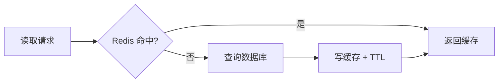

# Redis 数据结构、缓存、Session 与分布式协调

数据库查询从 20ms 变成 500ms，团队决定“加一层 Redis”。读请求变快后，用户却偶尔看到旧状态，某个热门 Key 过期时数据库瞬间被打满。

Redis 不是一个透明加速开关。它提供内存数据结构、过期、原子命令和持久化能力。本章先学数据结构，再完成缓存旁路、Session、限流和带租约的协调。

## 先根据操作选择数据结构

| 类型 | 适合操作 | 示例 |
| --- | --- | --- |
| String | 单值、计数、序列化对象 | 缓存、Session、幂等结果 |
| Hash | 同一对象多个字段 | 小型配置、状态字段 |
| List | 两端推拉 | 简单队列，但可靠任务优先用专业 Broker |
| Set | 去重和集合运算 | 权限主体、在线标记 |
| Sorted Set | 带分数排序 | 延迟队列、排行榜、滑动窗口 |
| Stream | 有 ID 的消息流和消费组 | 事件流、小型任务分发 |

选择看读写操作，而不是“JSON 都放 String”。大 Hash 或大集合会造成大 Key、慢删除和网络阻塞，需要监控元素数量和序列化大小。

## Cache-Aside：应用控制数据库和缓存

读流程：先读缓存，未命中再读数据库，把结果写入缓存。写流程：先提交数据库，再删除或更新缓存。



数据库是事实源，缓存是可重建副本。Key 要包含租户、资源、版本等维度，例如 `tenant:42:task:100:v3`。不要把用户权限不同的数据放进同一个公共 Key。

写流程常采用“数据库提交后删除缓存”。若先删缓存再提交，另一个读请求可能在事务提交前读旧数据库并把旧值写回。即使提交后删除，也存在删除失败窗口，所以需要 TTL、重试/事件或版本化 Key。

## 穿透、击穿和雪崩分别是什么

### 穿透

请求大量不存在 ID，缓存一直未命中并访问数据库。可以缓存短 TTL 的“未找到”结果、校验 ID 格式、限流或使用布隆过滤器。负缓存要区分“真的不存在”和“当前用户无权”，避免泄露资源存在性。

### 击穿

一个热门 Key 过期，大量请求同时回源。可以使用请求合并、互斥重建或逻辑过期。获得重建权的请求查询数据库，其他请求等待短时间或使用允许的旧值。

### 雪崩

大量 Key 同时过期或 Redis 故障，数据库承受全部流量。使用 TTL 抖动、分批预热、并发限制和数据库容量保护。不能假设缓存永久可用。

## 一致性从版本和业务容忍度开始

缓存不是强事务系统。先问业务允许多旧：产品名称可以短暂旧几秒，账户余额和权限通常不能依赖旧缓存直接决定。

常见策略：

- 短 TTL + 提交后失效，适合允许短暂陈旧；
- 版本化 Key，写入新版本后切换稳定指针；
- 数据库事件驱动失效，消费者幂等处理；
- 高风险读直接查数据库或验证版本；
- 缓存值带 `dataVersion`，旧版本拒绝使用。

权限撤销要即时生效时，缓存键包含策略版本或读取时二次校验，不能等一小时 TTL。

## Session 存储

Session ID 是随机凭证，Cookie 只保存 ID，Redis 保存会话：主体、创建时间、最后活动、过期和设备摘要。

Session Key 设置 TTL，刷新策略要防止永不过期；退出删除会话；高风险操作可要求近期认证。Redis 故障时系统通常应拒绝需要认证的请求，而不是把用户当匿名或绕过验证。

若 Session 是关键登录状态，评估 Redis 持久化、主从切换和数据丢失窗口。持久化并不等于业务备份，恢复流程仍需测试。

## 原子计数和限流

固定窗口限流可以用 `INCR` + `EXPIRE`，但两条命令之间进程中断会留下无过期 Key。Lua Script 或事务把更新原子执行。

滑动窗口可用 Sorted Set 保存时间戳：删除窗口外成员、计数、写入当前请求、设置过期。脚本仍要限制 Key 大小和时间复杂度。

限流维度包括 IP、用户、租户、模型和全局。返回 429 和 `Retry-After`，同时监控被拒绝数量。Redis 不可用时选择 fail-open 还是 fail-closed 取决于风险：登录防爆破更倾向关闭，低风险推荐接口可以降级。

## 分布式锁不是事务

单 Redis 实例上常见获取：

```text
SET lock:task:42 <owner-token> NX PX 10000
```

只有不存在时设置，并带 10 秒租约。释放时不能直接 DEL，要用 Lua 比较 owner token 后删除，防止 A 租约过期后误删 B 的锁。

锁持有者还要处理：

- 任务超过租约怎样续期；
- 续期失败后立即停止写入；
- 业务资源是否用 fencing token 拒绝旧所有者；
- Redis 故障或主从切换时安全需求；
- 是否可以用数据库唯一约束、行锁或任务 Lease 更简单解决。

锁只协调“谁先执行”，不能把数据库与外部 API 变成一个原子事务。

## Lua 脚本的边界

Lua 在 Redis 服务器原子执行，适合“检查所有者再删除”“滑动限流”等短逻辑。脚本执行期间会阻塞 Redis 主线程，不应进行大循环或遍历大 Key。

脚本输入和 Key 数量要有限，返回结构稳定，使用 Redis Functions 或脚本缓存时处理版本。原子只覆盖 Redis 内部命令，不覆盖数据库。

## 一次缓存实践

用测试环境完成：

1. 建一个 `GET /tasks/:id`；
2. 首次查询记录数据库耗时并写 30 秒缓存；
3. 第二次确认命中；
4. 更新数据库后删除 Key；
5. 模拟删除失败，观察 TTL 前的旧值；
6. 增加 `dataVersion` 或版本 Key；
7. 并发请求一个过期热门 Key，加入请求合并；
8. 停止测试 Redis，确认应用降级不会打垮数据库。

不要使用生产缓存做故障实验。

## Redis 检查表

- Key 包含租户、资源和版本维度；
- 值大小与集合元素有上限；
- 每类 Key 有 TTL 或明确持久理由；
- 数据库提交与缓存失效顺序明确；
- 热点重建有并发限制；
- 权限和金额不盲信陈旧值；
- Lua 短小并有超时观测；
- 锁有 owner、租约和安全释放；
- Redis 故障时 fail-open/closed 有设计；
- 持久化、备份和恢复经过验证。

下一章比较 RabbitMQ 与 Kafka。Redis 可以承载短期协调，但复杂可靠任务需要理解 Broker 的 ACK、消费组和重复消息。
