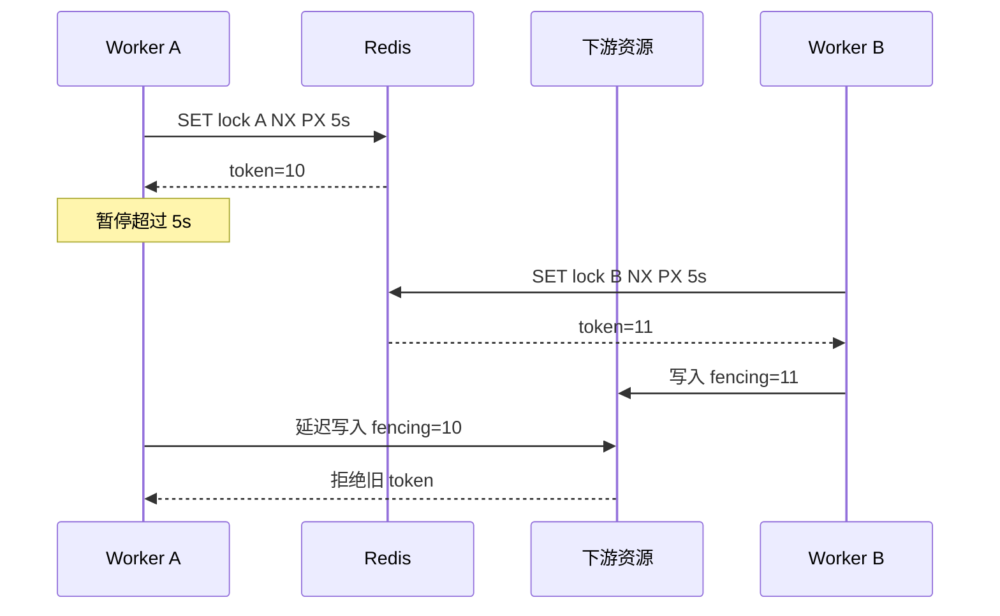

# Redis Session、限流与租约锁

Session 是服务端可撤销的登录状态，限流是按时间窗口控制请求速率，租约锁是带期限和所有者的互斥协调状态。它们都可以存放在 Redis，但分别位于认证、流量控制和跨进程任务协调层；过期只对各自的业务事实生效。

Redis 中的三类状态都依赖“状态会过期”，但过期语义完全不同：Session 到期后身份失效，限流窗口到期后额度恢复，锁到期后其他持有者可能接管。把三者都写成 `SET key value EX 60` 会掩盖所有权和失败路径。

## Session 需要撤销、绝对过期和空闲过期

Redis Session value 保存用户 ID、会话族、权限版本和绝对过期时间；key TTL 可实现空闲过期。刷新 TTL 时不能超过绝对过期。服务端登出删除或标记撤销，密码变化按用户索引撤销全部 Session。

Redis 丢数据意味着用户被登出通常比“继续放行”安全。若 Session 是核心状态，需配置持久化/高可用并监控；客户端 Cookie 的寿命不能长于服务端可验证窗口。

Lua 将“读取 Session、检查绝对到期、滑动 TTL”放入一次原子执行。伪代码中的时间由服务端统一传入。

```redis
local absolute = tonumber(redis.call('HGET', KEYS[1], 'absolute_exp'))
if not absolute or absolute <= tonumber(ARGV[1]) then
  redis.call('DEL', KEYS[1])
  return nil
end
local ttl = math.min(tonumber(ARGV[2]), absolute - tonumber(ARGV[1]))
redis.call('EXPIRE', KEYS[1], ttl)
return redis.call('HGETALL', KEYS[1])
```

脚本不能执行外部 IO，且长脚本会阻塞 Redis。时间单位、返回结构和 Cluster key slot 需要在客户端测试。

## 限流算法决定突发流量怎样被允许

固定窗口实现简单，但窗口边界可在短时间允许接近两倍配额；滑动日志精确但每请求保存时间戳；滑动计数折中；令牌桶允许受控突发并按速率补充。

限流 key 的作用域要包含 API key/用户/租户和操作，避免所有接口共享一桶。返回 429、Retry-After 和剩余额度时，不能把 Redis 错误误报为“用户超限”；依风险选择 fail-open 或 fail-closed。

| 算法 | 状态 | 适用 |
| --- | --- | --- |
| 固定窗口 | 窗口计数 + TTL | 简单低成本，接受边界突发 |
| 滑动日志 | 请求时间 Sorted Set | 低流量高精度 |
| 滑动计数 | 相邻窗口计数 | 精度和成本折中 |
| 令牌桶 | tokens + last_refill | 需要允许短突发的 API |

## 租约锁必须携带持有者随机值

`SET lock random NX PX ttl` 只在不存在时获得租约。释放时用 Lua 比较 value 后删除，避免 A 超时后 B 获锁，A 又把 B 的锁删除。续约同样要校验持有者。

租约到期只说明 Redis 允许新持有者，不证明旧持有者已经停止。暂停、网络分区或长 GC 后，两个进程可能先后执行副作用。高风险资源需要 fencing token：每次获得租约取得递增令牌，下游只接受比已见令牌更新的写入。



如果下游无法比较 fencing token，Redis 租约只能降低并发概率，不能提供严格互斥保证。数据库唯一约束或条件更新往往更合适。

## 分布式锁的适用条件

创建唯一资源可用数据库唯一约束；扣库存可用条件 UPDATE；任务去重可用幂等表。锁会引入 TTL、续约、所有权和分区问题，只有多个进程确实需要协调一个不可用条件写表达的外部资源时再使用。

监控获得失败、持有时长、续约失败、过期后仍运行和 fencing 拒绝。锁 key 不要用 KEYS 扫描管理，维护稳定前缀和业务资源 ID。

## Redis 协调还要回答

**Redis 限流故障时应该放行还是拒绝？**

登录、支付等高风险写接口倾向 fail-closed 或使用本地小额度；普通读取可 fail-open 但保护下游并告警。选择是业务风险决策，不能写成全局 catch 后总放行。

**锁 TTL 设得比任务时长长是否就安全？**

任务时长可能无上界，进程也可能暂停。过长 TTL 延长故障占用，过短增加双持有者。使用有界任务、续约、fencing 和下游幂等；无法接受双写时改用数据库裁决。

**Redis Cluster 中 Lua 为什么可能报跨 slot？**

脚本访问的多个 key 必须在同一 hash slot。使用 hash tag 把相关 key 放同 slot，或重新设计为单 key 状态；不要为了脚本把所有业务 key 集中到一个热点 slot。

**Session 每次请求都续 TTL 会有什么问题？**

每次请求都变成 Redis 写入，复制与持久化压力增加。可以仅在剩余空闲期低于阈值时滑动，并始终受绝对过期限制。

## 机制复核：Redis Session、限流与租约锁
这篇文章讨论的机制需要放回一次完整请求中验证。先记录输入约束、状态变化、外部依赖和失败结果，再确认成功路径是否留下可追踪的事实。配置、缓存、队列或数据库只承担各自职责，不能用一层的日志推断另一层已经完成。

迁移到实际项目时，优先补一条正常用例、一条重复或并发用例和一条依赖不可用用例。每条用例写明观察指标、错误分类、回滚动作与数据清理范围，测试替身的通过不能代替真实协议和权限验证。

当性能、可靠性和安全目标冲突时，先明确服务对象和可接受损失，再选择超时、容量、重试和降级策略。没有测量依据的阈值只作为待验证假设，发布后用同一公式复验。
