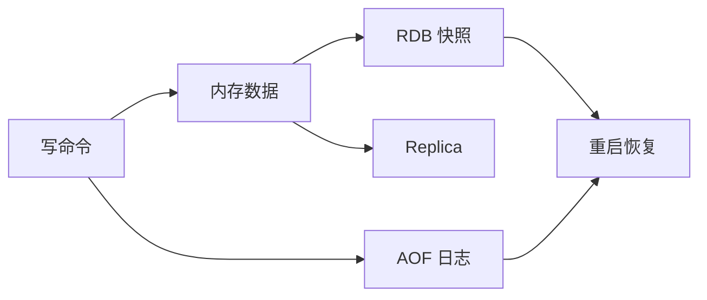

# Redis 数据结构、TTL、持久化与内存淘汰

`GET project:42` 返回的是字符串，`HGETALL user:7` 返回字段集合，`ZRANGE rank 0 9` 按分数取有序成员。Redis 不是只有 GET/SET 的内存对象，它的数据类型决定原子操作、内存布局和访问成本；TTL 与持久化则决定进程重启和时间到期后还剩什么。

## 数据类型应匹配要执行的原子操作

String 可保存文本、JSON、计数器和二进制，`INCR` 能原子递增；Hash 适合字段级读写；Set 表达无序唯一成员；Sorted Set 用 score 排序；List 适合两端操作；Stream 保存带 ID 的追加事件。

选择类型前先写读写动作，而不是先把数据库对象整体 JSON 化。需要单字段计数却每次读改写整段 JSON，会产生竞态和带宽浪费；需要事务事实则不应因 Redis 操作原子就取代 MySQL 约束。

| 需求 | 类型与命令 | 要注意 |
| --- | --- | --- |
| 短时对象缓存 | String + GET/SET | 序列化版本与 TTL |
| 用户会话字段 | Hash + HGET/HSET | 敏感字段与整体过期 |
| 唯一在线用户 | Set + SADD/SREM | 断线清理 |
| 延迟/排行榜 | Sorted Set + ZADD | score 精度与清理 |
| 事件消费 | Stream + consumer group | ACK、pending 与裁剪 |

## TTL 表达缓存状态的最长寿命

过期时间绑定在 key 上，不绑定 Hash 的单个 field。到期 key 通过惰性删除和主动采样删除被移除，因此物理内存释放时间可能略晚，但逻辑读取会视为不存在。

`SET key value EX 300` 在一次命令中写值并设置 TTL，避免进程在 SET 与 EXPIRE 之间崩溃留下永久键。更新 key 的命令是否保留 TTL 要按具体命令验证，不能假设所有写入行为相同。

在隔离 Redis 执行下面命令，观察 NX、TTL 与递增行为。`tenant:...` 是示例命名，不使用真实业务标识。

```redis
SET tenant:demo:project:42 '{"version":3}' EX 300 NX
TTL tenant:demo:project:42
GET tenant:demo:project:42

SET tenant:demo:login-attempts:7 0 EX 60
INCR tenant:demo:login-attempts:7
TTL tenant:demo:login-attempts:7
```

第一次 NX 写入成功后，同键再次 NX 返回空结果。`INCR` 修改值但保留已有 TTL；若键原本不存在，INCR 创建的新键没有 TTL，需要用 Lua 或事务保证初始化与过期原子化。

## RDB、AOF 和复制不等于同一种保护

RDB 在时间点生成紧凑快照，恢复快但可能丢失两次快照之间的写入。AOF 记录写命令，可按 fsync 策略降低数据窗口，文件更大且恢复路径不同。Redis 7 还能使用混合持久化；具体配置要与版本和恢复目标匹配。

复制提高可用性，不阻止误删传播。缓存可接受丢失时可关闭持久化并从 MySQL 回源；Session、限流或任务进度若依赖 Redis，必须明确重启后行为和数据损失窗口，不能一句“Redis 是缓存”带过。



恢复演练要验证文件、版本和启动时间。Replica 与备份保留不同故障域，不能互相冒充。

## 内存达到上限时会发生淘汰或写失败

`maxmemory` 与淘汰策略决定内存满后的行为。只淘汰有 TTL 的 key 与从所有 key 中淘汰语义不同；noeviction 会让新增写失败。热点、key 数、平均大小和碎片率要一起观察。

大 key 会阻塞单线程命令执行、复制和删除。用 SCAN 与内存采样定位，采用分片结构、增量 UNLINK 或重新建模；生产排查避免一次 KEYS 扫描全部 key。

## Redis 一致性与持久化边界

**Redis 单线程为什么仍会出现竞态？**

单条命令按顺序执行，但一个业务动作常由多条命令组成，多个客户端可以交错。使用原子命令、Lua、事务或数据库约束组合，不能依赖“单线程”保护读改写序列。

**缓存 key 需要包含版本吗？**

序列化结构变化时可在 key 或 value 中带 schema version。旧版本应用与新版本同时运行时，版本化能避免互相解析失败；同时要规划旧 key 到期和内存峰值。

**为什么过期键数量下降但内存没有立即下降？**

可能是惰性/主动删除节奏、内存分配器碎片、复制缓冲或大 key 尚未清理。先比较 used_memory、used_memory_rss、expired_keys 与 keyspace，不要只看 DBSIZE。

**Redis 持久化后能否作为唯一订单库？**

Redis 有持久化与事务能力，但订单需要复杂约束、关系查询、审计与恢复策略，通常仍以关系数据库为事实源。是否用 Redis 作主存储需要独立的数据模型和一致性论证，不能因速度快直接替换。
