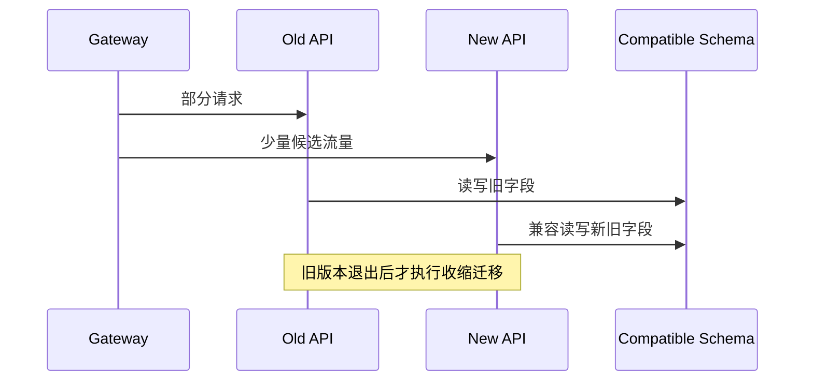

# 迁移、滚动发布、回滚与 Runbook

新版本镜像已经通过测试，但迁移删除了旧列；滚动发布期间旧 Pod 仍读取该列，错误率立刻上升。发布不是“换镜像”一个动作，而是制品、Schema、流量和后台任务在一段时间内同时存在新旧版本。

## 发布前先证明新旧版本能共存

扩展迁移先新增兼容字段/表，不删除旧结构。执行迁移并校验后，候选应用旁路连接真实依赖，验证健康、认证、CRUD 和异步任务；再开始接少量流量。

发布清单固定镜像 digest、配置版本、迁移版本、Feature Flag、负责人、观察指标、停止条件和回滚点。口头“有问题回滚”无法处理数据库已变化和后台事件已发出的情况。

| 阶段 | 通过证据 | 停止条件 |
| --- | --- | --- |
| 迁移前检查 | 备份/恢复点、磁盘、锁评估 | 不兼容或空间不足 |
| 候选旁路 | health、契约、最小业务 | Schema/Secret/依赖失败 |
| 1%/单实例 | 错误、P99、DB、队列正常 | 错误预算快速消耗 |
| 逐步扩大 | 指标与旧版对照 | 业务状态差异 |
| 稳定观察 | 任务、审计、告警完整 | 延迟故障或积压 |

## 滚动发布期间同时维护两份协议

入口会把请求分给新旧实例，数据库也被两者访问。新版本写入旧版本不认识的状态、消息 Schema 或缓存格式，会造成交叉失败。采用双读写、可选字段、版本化消息和缓存 key，直到旧实例退出。

Worker 与 Scheduler 也要考虑版本。旁路 API 不应重复运行唯一后台调度；消息消费者升级需保证旧消息仍可读，新消息不会让旧 Consumer 崩溃。



Canary 的价值是用少量真实流量验证未知差异。没有按版本拆分指标，就无法比较候选与基线。

## 应用回滚与数据回滚是两件事

镜像异常时把流量切回仍在运行的旧实例最快。只要扩展迁移保持兼容，旧实例能继续工作；删除列、不可逆数据转换和新状态写入会让简单应用回滚失效。

已经产生的新业务数据通常不能用数据库备份整体覆盖。按事件/版本修复、向前迁移或执行显式补偿。破坏性迁移推迟到新版本稳定、无旧消费者且恢复演练通过之后。

Runbook 要给出操作者能执行和判断的步骤。下面是发布异常的决策骨架。

```text
1. 冻结继续扩容，记录版本/digest/开始时间
2. 对比新旧实例 5xx、P99、DB 锁等待、队列 oldest age
3. 若候选特有且旧 Schema 兼容：入口切回旧实例
4. 验证 /health、登录、写入、任务消费
5. 保留新实例日志和 Trace，不立即清理
6. 若存在新状态：运行指定对账/补偿，不覆盖全库
```

每一步都要有命令位置、预期输出、权限和停止条件。Runbook 定期演练；事故中首次阅读的文档通常不够可靠。

## 观察期结束才进入清理

即时健康通过不代表异步链路正常。观察至少覆盖典型任务周期，确认 Outbox、DLQ、审计、缓存失效和业务转化。稳定后删除旧 Feature Flag 和兼容写路径，执行收缩迁移。

只保留当前制品和已验证回滚制品，清理前建立引用清单。发布记录保存版本、指标截图/查询、变更人、异常与最终结论，临时测试数据精确删除。

## 发布过程继续推演

### 什么时候数据库迁移可以先于应用？

迁移对旧应用兼容时，例如新增可空列或新表。若旧应用会因新约束/状态失败，就要先发布兼容应用或重新设计顺序。

### Canary 没报错是否就能全量？

还要确认样本覆盖关键租户、写路径和异步周期，且按版本观察错误、延迟和业务状态。少量流量可能没触发低频问题，扩大要分阶段。

### 为什么回滚时不立刻删新容器？

新容器保存日志、内存状态和配置证据，也是修复后旁路复验目标。先切走流量并保留，确认旧版恢复后再按清理规则处理。

### Feature Flag 关闭是否等于回滚？

只对被 Flag 包围且旧路径仍兼容的功能有效。Schema、消息、副作用和依赖变更可能已发生，需要独立补偿与数据检查。
