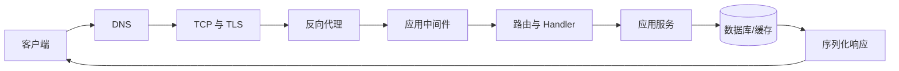

# 后端请求从连接建立到响应返回经历了什么

浏览器访问 `https://api.example.com/tasks/42`，最终看到一段 JSON。后端初学者容易把这理解为“请求进入 Controller，Controller 返回数据”，但 Controller 只是中间一站。域名解析、连接、TLS、反向代理、路由、中间件、数据库和序列化任一环节都可能失败。

本章不绑定框架。我们沿一条 GET 请求走完全程，并使用 `dig`、`curl`、代理日志和应用日志判断错误停在哪一层。

## 请求链先画出来



每一层只承担自己的职责。DNS 把域名解析成地址；TCP 建立可靠字节流；TLS 验证服务器并加密；代理把公网请求转给应用；中间件处理认证、Trace 和通用限制；路由匹配 Handler；应用服务执行用例；Repository 访问数据；最后框架把结果编码为 HTTP 响应。

## 第一步：DNS 只负责“去哪里连接”

```bash
dig api.example.com A
dig api.example.com AAAA
```

关注 `ANSWER SECTION`、TTL 和最终地址。命令输入是域名和记录类型，输出是解析状态、地址与缓存时间；没有记录时，客户端还没有连接到服务器，应用日志自然不会出现请求。若本机和公共解析结果不同，继续检查递归 DNS、缓存、hosts 文件和分线路由。不要把 DNS 返回地址当作 HTTP 成功，它只完成“找到候选地址”这一步。

DNS 成功不代表服务可用。它只告诉客户端目标地址，不检查目标端口是否监听，也不验证证书。

## 第二步：TCP 和 TLS 建立安全连接

HTTPS 通常先建立 TCP，再进行 TLS 握手。TLS 会协商协议、验证证书链和域名，并生成会话密钥。

```bash
openssl s_client -connect api.example.com:443 -servername api.example.com </dev/null
```

`-servername` 发送 SNI，使一台服务器能选择正确证书。检查证书主题、颁发者、有效期和验证结果。若证书域名不匹配，请求在进入 HTTP 前就失败。

TCP 连接超时常见于地址错误、防火墙、安全组或服务没有监听；连接被拒绝通常表示目标可达但端口没有进程接收。TLS 失败则检查证书、系统时间、协议与密码套件。

## 第三步：HTTP 请求进入反向代理

用 `curl` 同时显示响应头和连接细节：

```bash
curl -v --max-time 10 https://api.example.com/tasks/42
```

输出分三部分看：以 `*` 开头的是连接与 TLS；以 `>` 开头的是请求；以 `<` 开头的是响应。真正排障时不要把访问令牌直接贴进共享终端记录。

Nginx 等反向代理通常负责 TLS 终止、静态文件、请求大小、超时和 upstream 转发。它会为应用补充可信请求信息：

```nginx
location /api/ {
    proxy_pass http://app:8000/;
    proxy_set_header Host $host;
    proxy_set_header X-Forwarded-For $proxy_add_x_forwarded_for;
    proxy_set_header X-Forwarded-Proto $scheme;
    proxy_set_header X-Request-ID $request_id;
}
```

这段配置的输入是代理收到的公网请求，处理顺序是匹配 `/api/`、转发到 `app:8000`、补充 Host、客户端链路、协议和请求 ID，输出是应用可以关联的内部请求。应用只能信任由受控代理写入的转发头。若应用直接暴露公网，又无条件相信客户端提供的 `X-Forwarded-For`，审计 IP 和限流都可能被伪造。

## 第四步：中间件建立请求上下文

进入框架后，常见中间件按顺序处理：请求 ID、Trace、日志、安全头、CORS、认证、限流和错误映射。顺序会影响行为：若错误处理中间件放得太内层，认证异常可能无法转换成统一结构；若日志只在 Handler 内记录，路由前失败会消失。

一个请求上下文至少包含：

```text
request_id / trace_id
认证主体
租户与权限范围
开始时间与 deadline
客户端协商的信息
取消信号
```

身份来自校验后的 Session 或 Token，不来自 JSON 中的 `userId`。Deadline 和取消信号要继续传到数据库、HTTP Client 和后台调用。这个上下文的输入来自代理、认证层和服务器时钟，输出会伴随本次调用链，而不是写进可跨请求复用的全局变量。

## 第五步：路由与协议校验

路由根据 HTTP 方法和路径选择 Handler。`GET /tasks/42` 与 `POST /tasks` 是不同操作。路径、查询和 Body 先转换成 DTO，再做类型与格式校验。

协议校验通过，只证明形状正确。例如 `amount` 是正数，不代表当前用户真的有余额。业务规则在应用服务中检查，数据库约束提供最后防线。

常见状态码：

| 情况 | 状态码 | 说明 |
| --- | ---: | --- |
| 请求语法或字段非法 | 400/422 | 按框架契约选择并保持一致 |
| 未认证 | 401 | 需要有效身份 |
| 已认证但无权 | 403 | 不扩大数据范围 |
| 资源不存在 | 404 | 高敏感场景也可避免泄露存在性 |
| 状态冲突 | 409 | 版本、唯一键或当前状态冲突 |
| 依赖暂不可用 | 503 | 客户端可按策略稍后重试 |

GET 和 POST 没有“一个天然安全、一个天然不安全”的等级差异。HTTP 规范中的 safe/idempotent 描述语义，安全性仍由 TLS、认证、授权和输入处理保证。

## 第六步：应用服务和数据访问

Handler 把可信请求上下文与 DTO 转成命令，应用服务拥有用例顺序：读取数据、检查规则、开启事务、修改状态、提交，再触发事务外副作用。

Repository 封装查询，不应该让每个 Handler 自己拼 SQL。数据范围要进入 SQL：

```sql
SELECT id, status, title
FROM task
WHERE id = $1 AND tenant_id = $2;
```

参数 `$1` 是路径中的任务 ID，`$2` 是认证上下文得到的租户范围；数据库先执行两项条件过滤，再只返回三列公共字段。若没有结果，应用映射为不可见或不存在；若数据库超时，则进入依赖错误，不应返回空任务。 如果先按 ID 查全局记录，再在应用层判断租户，缓存或日志可能已经接触越界数据。数据库查询阶段过滤更稳妥。

## 第七步：响应序列化和连接结束

应用服务返回领域结果，Handler 映射成响应 DTO，框架编码 JSON，代理添加或覆盖响应头，再交给客户端。

响应已经发出后，服务器不能再可靠改变状态码。流式接口尤其如此：首个字节发出后才发生业务错误，需要通过流内事件表达。普通接口应在写响应前完成关键校验。

`Content-Type` 说明格式，`Cache-Control` 说明缓存策略，`ETag` 可支持条件请求。错误响应也要有稳定 JSON 结构和 request ID，不能把堆栈返回给用户。

## 用日志判断请求停在哪里

给代理和应用使用同一个请求 ID：

```text
proxy: request_id=r-01 status=502 upstream_status=- duration=0.004
app:   没有 r-01
```

代理返回 502 且没有 upstream 状态，应用无日志，优先检查 upstream 地址、端口和连接。另一种情况：

```text
proxy: request_id=r-02 status=500 upstream_status=500 duration=1.24
app:   request_id=r-02 route=GET /tasks/:id error=db_timeout
```

第二组日志中，代理已经拿到上游返回的 500，应用日志又记录了同一个请求 ID 和 `db_timeout`。这说明请求已经进入应用，错误来自数据库等待；不要因为用户看到 Nginx 页面就先重装 Nginx。

## 常见现象与检查层

| 现象 | 首先检查 |
| --- | --- |
| 域名不存在 | DNS 记录和本机解析 |
| 连接超时 | 地址、路由、防火墙、端口监听 |
| 证书错误 | SNI、证书链、有效期、系统时间 |
| 404 | 代理 location、应用路由、路径前缀 |
| 502 | upstream 进程、地址、端口、协议 |
| 504 | 代理超时与应用/依赖耗时 |
| 401/403 | 凭证校验和权限范围 |
| 500 | request ID 对应的应用堆栈与依赖 |

## 本文实践

对一个自己可控制的测试服务执行：

1. `dig` 保存解析结果；
2. `openssl s_client` 检查证书；
3. `curl -v` 请求正常接口；
4. 请求不存在路径，确认真实 404；
5. 停止测试应用但保留代理，观察 502；
6. 用请求 ID 关联代理和应用日志；
7. 恢复应用并再次验证。

练习只操作本地或测试环境，不用停止生产服务制造故障。

## 请求链排障卡

```text
最终 URL 与解析地址：
TCP/TLS 结果：
HTTP 状态与响应头：
代理 request_id / upstream_status：
应用 route / trace_id：
数据库或外部依赖耗时：
错误最早出现的层：
验证修复的最小请求：
```

填写排障卡时先保存原始命令输出，再写“错误最早出现的层”，避免用结论覆盖证据。修复后用同一个最小请求复测，输出应同时包含成功状态和可关联的请求 ID。下一章进入 HTTP 与接口契约，讲清一个 API 怎样让客户端知道输入、输出、错误与版本边界。
