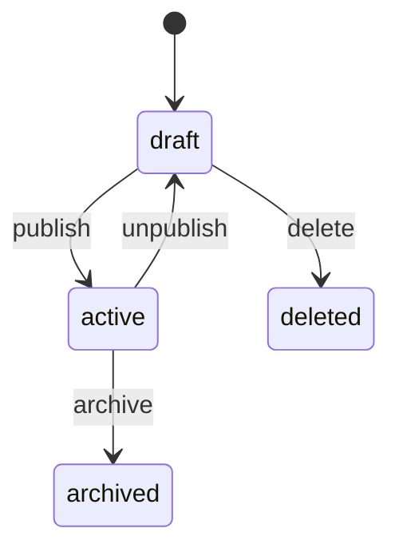

# REST 资源建模与接口边界

REST 资源建模先把业务对象表示成稳定 URI，再用 HTTP 方法和状态码表达读取、创建、替换、修改与删除。它位于客户端意图与服务端业务规则之间，让缓存、重试、授权和错误语义有共同依据。REST 不是把所有函数名改成名词，也不替代领域约束。

页面上有“保存项目”按钮，但接口设计成 `POST /saveProject` 后，重试、缓存和权限都很难推理。把项目当资源，动作映射到 HTTP 方法，客户端才能知道一次请求是否可安全重放。

## 资源路由先表达事实

集合 `/projects` 表示资源集合，`/projects/{id}` 表示单项。`POST /projects` 创建新 ID，`GET` 读取，`PATCH` 修改部分字段，`DELETE` 删除或标记删除。动词不是禁用项，但只有当动作无法表达为资源状态转换时才使用。

| 操作 | 请求 | 成功结果 |
| --- | --- | --- |
| 列出 | GET /projects?cursor=… | 200 + items + nextCursor |
| 创建 | POST /projects | 201 + resource |
| 部分更新 | PATCH /projects/{id} | 200 + new version |
| 删除 | DELETE /projects/{id} | 204 或已删除状态 |

## 幂等性由方法和业务共同决定

GET、PUT、DELETE 的重复执行应得到同一最终状态，但网络超时仍可能让客户端不知道结果。创建接口使用 `Idempotency-Key`，服务端把请求哈希和结果绑定；同一 key 搭配不同 Body 必须返回冲突，而不能复用旧结果。

下面的片段只负责展示边界和执行顺序。先确认输入，再执行副作用，最后把结果映射为协议错误；不要把它当成可以绕过鉴权的完整服务。

```ts
type CreateProject = { name: string; description?: string }

async function createProject(input: CreateProject, key: string) {
  const response = await fetch("/api/projects", {
    method: "POST",
    headers: { "content-type": "application/json", "idempotency-key": key },
    body: JSON.stringify(input)
  })
  if (!response.ok) throw new Error(`create failed: ${response.status}`)
  return response.json()
}
```

代码只负责传递幂等键。真正的去重必须在服务端事务中依赖唯一约束，否则两个并发请求仍可能同时创建。

## 状态转换要能被审计

订单从 `pending` 到 `paid` 是状态转换，不能让任何 PATCH 任意写入 `status`。Service 应检查当前状态和操作者，再在事务中写入目标状态和审计事件。这样审计日志能回答“谁在什么版本把什么改成了什么”。



## 路由可用不代表状态转换正确

| 现象 | 先确认 | 处理顺序 |
| --- | --- | --- |
| 接口返回 200 但资源没改变 | 检查是否更新了错误字段、影响行数和事务提交。 | 先查数据库事实，再查序列化和缓存 |
| PATCH 是否应该允许 status | 只有显式状态动作和状态机允许时才可改变。 | 把状态转换放进 Service，不接受任意字段 |
| 为什么 DELETE 常返回 204 | 删除成功没有新的表示时 204 足够；如果需要异步删除，可返回任务资源和状态。 | 先定义客户端需要的最终事实 |

接口验证需要同时观察协议结果和资源版本。对同一个 Idempotency-Key 并发发送两次创建请求，应只出现一个资源；用旧 ETag 更新应得到冲突；重复删除不能重新触发不可逆副作用。只检查“返回 2xx”看不出状态机、幂等记录和数据库约束是否真的工作。

## HTTP 方法与资源动作边界

**PUT 和 PATCH 怎么选？**

PUT 表示用完整表示替换资源，缺字段的语义要明确；PATCH 只修改部分字段。实际项目可统一使用 PATCH，但必须规定缺失、null 和空字符串的区别，并用版本条件避免覆盖。

**REST 是否禁止 `/projects/{id}/publish`？**

不是绝对禁止。发布是明确的状态动作，若用 PATCH 表达会让状态机和副作用不清楚。关键是接口能描述状态约束、幂等性和审计，而不是追求路由形式。

## 资源表示不等于数据库表

API 资源为客户端任务服务，一项 Project 表示可以组合负责人名称、权限和统计值；数据库则可能由多张表组成。把每张表机械暴露为 CRUD 会泄露内部关系，也让一次业务状态转换需要客户端发多次请求。

批量操作应建模为任务或明确的批量资源。一次删除一万个项目若超过请求时间预算，可以返回 202 和任务 ID；客户端随后读取任务状态或订阅 SSE。服务器必须记录每项结果，不能用一个 200 掩盖部分失败。

**创建接口为什么常返回 Location？**

201 响应可以用 Location 指向新资源地址，让客户端不依赖 ID 拼接规则。响应 Body 仍可返回资源表示；Location 表达规范地址，Body 减少一次读取，两者职责不同。
