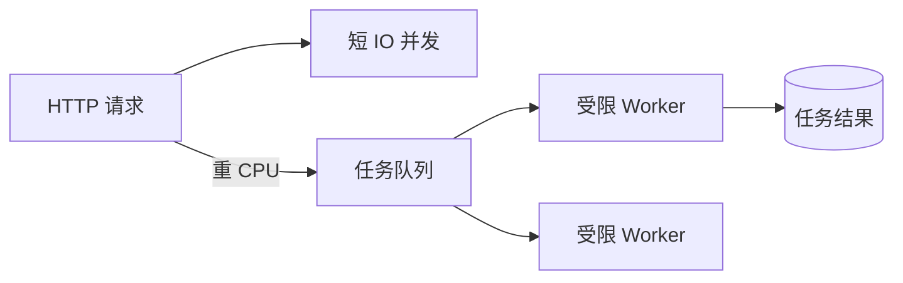

# Node.js、Python、Go 的并发运行时

三个服务都提供 `/aggregate`：同时请求用户、订单和库存。串行各等 200 ms 总计约 600 ms；并发等待理论上接近最慢的 200 ms。但只要其中一个调用是 CPU 忙循环，Node 事件循环、Python asyncio 和 Go 调度器就会表现出不同的阻塞方式。

## 并发描述重叠等待，并行描述同时计算

IO 调用发出后，大部分时间在等 socket。运行时可以让当前任务挂起，转去处理其他请求，这叫并发。CPU 任务需要多个核心或独立进程/线程真正同时计算，才形成并行。

并发不会让下游容量无限增加。一次请求并发 20 个 SQL，会更快耗尽连接池；并发聚合要有上限、总 deadline 和失败策略。

| 运行时 | 常用并发单元 | 阻塞风险 |
| --- | --- | --- |
| Node.js | Promise/事件循环回调 | 同步 CPU 或同步 IO 阻塞事件循环线程 |
| Python ASGI | asyncio Task | async 函数中的同步调用阻塞事件循环 |
| Go | goroutine | 阻塞由调度器管理，但 goroutine/连接仍可无界增长 |
| 三者共同点 | 任务 + socket/连接 | 缺少 timeout、取消和容量上限 |

## 同一聚合请求的三种写法

Node 用 `Promise.all`，Python 用 `asyncio.TaskGroup`，Go 启动受控 goroutine 并收集结果。语法不同，状态问题相同：一个子任务失败后是否取消其他任务，返回部分结果还是整体失败，deadline 是否传到 HTTP 客户端。

Node 示例使用同一个 AbortSignal。任何调用失败时 `Promise.all` 立即拒绝，但其他网络操作只有收到取消信号才会停止。

```ts
async function aggregate(signal: AbortSignal) {
  const [user, orders, stock] = await Promise.all([
    users.get(signal),
    orders.list(signal),
    inventory.get(signal),
  ])
  return { user, orders, stock }
}
```

在 Python 中用 TaskGroup 可在成员失败时取消同组任务；Go 通常用 `errgroup.WithContext`。无论哪种语言，底层客户端必须真正接收 signal/context，取消才会继续传播。

## CPU 工作不能伪装成 async

JSON 大量压缩、图片处理和密码哈希会消耗 CPU。Node 可使用 Worker Threads 或独立 Worker；Python 可用进程池/Celery；Go 能在多个系统线程运行 goroutine，但仍要限制 CPU 任务并发。

把 CPU 任务扔进线程池不代表成本消失。线程/进程切换、内存复制和队列都有成本；密码哈希还故意消耗内存。在线请求中设置小并发，长任务进入队列并返回任务 ID。



队列用于转移耗时，不会自动增加总容量。Worker 数量仍受 CPU、数据库连接和外部服务配额约束。

## 取消和背压决定系统能否停下来

客户端断开后，应用应取消仍无价值的下游读取；已经提交的写入则要完成一致性收尾，不能假设断开等于回滚。deadline 从入口向内递减，内层超时要给上层留出错误映射和清理时间。

背压是在容量用尽前拒绝、排队或降级。Node 的并发限制器、Python Semaphore、Go buffered channel 都能限制在途数。指标要观察在途任务、队列等待、取消数和下游池等待。

聚合调用的“快速失败”也不等于其他工作自动停止。`Promise.all` 返回拒绝后底层请求仍需 AbortSignal；Python TaskGroup 与 Go errgroup 会发出取消，但数据库驱动和 HTTP 客户端仍必须接收对应 Context。否则响应已经失败，在途连接还继续占用容量。

## 并发模型继续推演

### Node 单线程为什么还能处理很多连接？

JavaScript 回调主要在事件循环线程执行，网络 IO 由操作系统和运行时等待，完成后再排队回调。高连接能力依赖任务频繁让出；同步 CPU 会让所有回调排队。

### Python `async def` 会自动把同步库变异步吗？

不会。同步数据库驱动或文件解析仍会占住事件循环线程。使用异步驱动，或把不可替换的同步操作放到有上限的线程池；CPU 工作更适合进程。

### goroutine 很轻，为什么还要限制数量？

每个 goroutine 仍占栈和调度资源，并可能持有 socket、连接或大对象。下游容量有限时，无界 goroutine 会把等待转成内存和连接雪崩。

### 聚合接口一个依赖失败时应返回部分数据吗？

取决于契约。强一致页面可以整体失败；可降级面板可明确标注 unavailable。不能悄悄用空数组代替失败，否则调用方无法区分“确实为空”和“没查到”。
