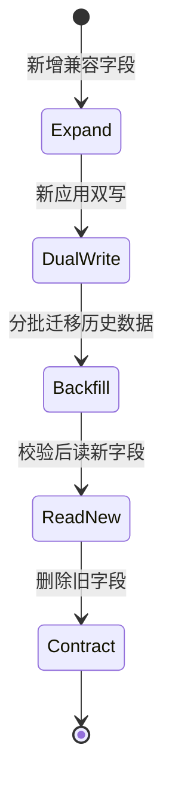

# 迁移、种子数据与 Schema 演进

新版本应用先发布，启动时立刻查询 `projects.owner_id`；数据库迁移还没执行，所有请求开始报 unknown column。Schema 变更是跨应用版本与数据库状态的协议升级，不能把一条 ALTER TABLE 当成孤立脚本。

## 迁移记录一条有顺序的 Schema 历史

迁移文件应有不可变版本号、明确的 up 操作和审查记录。已在共享环境执行的迁移不能原地修改，否则不同环境会声称同一版本却拥有不同结构。修正方式是新增下一条迁移。

应用框架的 ORM 模型描述目标结构，迁移描述从旧结构到新结构的步骤。生产环境不应使用自动同步 Schema，因为它通常缺少数据搬迁、锁风险和回滚控制。

| 对象 | 职责 | 失败表现 |
| --- | --- | --- |
| ORM Model | 应用期望的字段与关系 | 代码与库不一致 |
| 迁移文件 | 有序改变 Schema/数据 | 环境版本分叉 |
| 迁移历史表 | 记录已经执行的版本 | 重复执行或漏执行 |
| Seed | 建立可重复基础数据 | 重复记录或环境污染 |

## 扩展、迁移、收缩避免新旧版本互相破坏

把 `name` 改成 `display_name` 时，直接 RENAME 会让旧应用立刻失败。兼容流程先新增可空列，发布能同时读写新旧列的版本，分批回填，切换读取，确认无旧版本后再加约束并删除旧列。

**数据库回滚不等于执行 down。** 删除列后的数据无法凭 down 恢复。很多生产回滚选择把应用切回兼容版本并向前修复 Schema，而不是逆向执行破坏性迁移。



每一步都要有数据校验和停止条件。只要仍有旧应用实例，就不能进入会破坏旧读取的 Contract。

## 大表 DDL 与回填分开控制

DDL 是否在线、是否复制整表取决于 MySQL 版本、操作类型和表结构。执行前检查 `ALGORITHM`/`LOCK` 支持、表大小、磁盘余量与复制延迟，不能因为测试库秒级完成就假设生产安全。

历史数据回填用稳定主键分批，每批提交并记录游标；设置速率和暂停开关。回填必须幂等，重复执行不会覆盖用户已经更新的新值。

在隔离副本先用生产级数据量验证。每批记录最后一个主键、影响行数与耗时；不要用 OFFSET，因为数据变化和大偏移都会产生问题。

```sql
UPDATE projects
SET display_name = name
WHERE id > :last_id
  AND display_name IS NULL
ORDER BY id
LIMIT 1000;
```

`display_name IS NULL` 让重复批次跳过已经完成或被新应用写入的记录。所有历史行校验完成后，才考虑增加 NOT NULL。

## Seed 不是生产业务数据导入器

Seed 适合权限码、固定角色模板等系统启动所需数据。它使用稳定业务键和 upsert，重复运行结果一致。演示用户、随机订单和开发样本应留在本地 Fixture，不进入生产 Seed。

迁移 Job 需要单实例、超时、日志和失败退出码。Kubernetes 中应让迁移成功后再逐步发布依赖新 Schema 的应用，但也要避免迁移 Job 与旧应用不兼容。

## Schema 迁移的失败与兼容边界

**为什么空库迁移成功还不够？**

空库没有旧数据、锁竞争和历史版本路径。还要从上一发布版本升级、重复执行、用大表数据验证，并比较最终 information_schema。

**迁移失败到一半怎么办？**

先确认 MySQL 对该 DDL 是否原子，以及数据回填已提交到哪个批次。保存迁移历史和数据库状态；不要盲目重跑。可恢复回填从已记录游标继续，结构不确定则先停止发布。

**多个服务能否各自管理同一数据库迁移？**

容易产生顺序冲突和所有权不清。共享 Schema 应有单一迁移序列和 owner；服务独立数据库则各自管理。跨服务数据关系通过契约和事件处理。

**什么时候可以给新列直接加 NOT NULL？**

新表或确认无历史行且所有写入同时更新时可以。已有大表通常先加可空列、回填并校验，再加约束，避免旧行和旧应用立刻失败。
