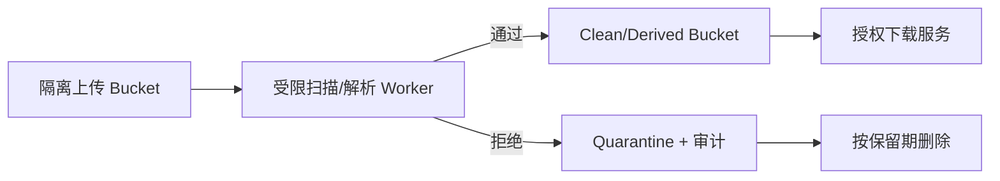

# 安全上传、下载与文件生命周期

安全文件链路是从用户声明到对象落盘、扫描/解析、授权下载和清理的一组状态与边界控制，位于 HTTP 文件接口、对象存储和隔离 Worker 之间。它解决的不是“能否上传”一个问题，而是怎样确认真实字节、阻断恶意内容、保持租户权限并在失败后可重试。

上传接口限制扩展名为 `.png`，攻击者把 HTML 或可执行内容改名后仍能上传；下载接口再原样返回 `Content-Type` 和文件名，浏览器可能执行内容。安全文件链路要把用户声明、真实字节、存储隔离、处理状态和下载响应分别控制。

## 上传前限制意图，上传后验证字节

创建上传时校验允许的业务类型、声明大小和配额，预签名限制 key、方法、过期时间与可支持的大小条件。对象到达后服务端读取 magic bytes/解析器结果，不能只信扩展名和 Content-Type。

压缩包需要限制展开层数、文件数量、展开后总大小和路径，防 Zip Bomb 与路径穿越。图片、PDF、Office 文档使用隔离 Worker 解析，设置 CPU、内存、时间和输出大小。

| 阶段 | 状态 | 允许操作 |
| --- | --- | --- |
| 待上传 | pending_upload | 只允许目标 key PUT |
| 已到达 | uploaded | 不可下载，等待校验 |
| 扫描中 | scanning | 隔离 Worker 读取 |
| 可用 | ready | 授权下载/进入业务 |
| 拒绝 | rejected | 保留最小审计后清理 |
| 删除中 | deleting | 禁止新签名，异步清理 |

## 解析器运行在不可信输入边界

文件解析库本身可能有漏洞。Worker 使用非 root、只读根文件系统、无不必要网络、临时目录配额和资源限制；解析结果写到独立 key，不覆盖源对象。

病毒扫描是一道防线，不是“安全证明”。未知格式、加密压缩包、扫描超时和解析异常默认不进入 ready；错误码对用户保持稳定，内部记录扫描引擎版本和原因。



源文件与可下载文件分区，能避免上传完成后在扫描前被访问。Quarantine 权限比普通业务 Bucket 更严格。

## 下载响应控制浏览器怎样处理内容

私有文件下载前按 file_id 查询租户、ACL 和状态，再生成短时预签名 URL，或由应用流式代理。`Content-Disposition: attachment` 降低浏览器内联执行风险；文件名使用安全编码，避免 Header 注入。

返回检测后的 Content-Type，并设置 `X-Content-Type-Options: nosniff`。需要内联预览的 PDF/图片使用隔离域名和严格 CSP，不能与管理后台共享同源 Cookie。

这是一份代理下载响应头示例。文件名经过 RFC 兼容编码，示例不包含真实用户数据。

```http
HTTP/1.1 200 OK
Content-Type: application/pdf
Content-Disposition: attachment; filename="document.pdf"; filename*=UTF-8''document.pdf
X-Content-Type-Options: nosniff
Cache-Control: private, no-store
Content-Length: 248021
```

应用流式传输时处理客户端断开并关闭对象流；大文件优先使用短时预签名下载，减少 API 带宽，但授权撤销会受到 URL 有效期窗口限制。

## 失败与清理必须可重入

上传中断留下 multipart parts、对象成功但 complete 未调用、扫描崩溃、派生对象写到一半、数据库删除后对象未删，都是正常故障。每类资源有状态、截止时间和清理任务。

清理任务按 file_id/object_key 幂等执行，删除不存在对象视为已完成；但不能只按前缀批量删而不核对租户和数据库状态。对象操作记录 requestId、file_id、checksum 和任务 attempt。

## 文件校验、隔离与审计边界

**限制文件大小为什么要在多层执行？**

浏览器声明可伪造，代理和应用若先接收完整 Body 才拒绝已经耗尽带宽/磁盘。入口限制请求大小，预签名限制上传条件，对象完成后再以 HEAD/实际字节核验。

**图片重新编码能否消除所有风险？**

可去掉部分元数据和畸形结构，但编码库本身要处理恶意输入，也可能保留不期望内容。仍需隔离、资源上限、库更新和输出验证。

**为什么预览应使用独立域名？**

用户控制内容若在后台同源渲染，浏览器可能携带后台 Cookie，并获得同源脚本能力。独立无凭证域名、CSP 和 attachment 能缩小影响。

**下载审计应该记录什么？**

记录 actor、tenant、file_id、动作、结果、requestId 和时间，不记录完整预签名 URL 或敏感文件名。对象存储 access log 可与应用授权审计关联。

## 机制复核：安全上传、下载与文件生命周期
这篇文章讨论的机制需要放回一次完整请求中验证。先记录输入约束、状态变化、外部依赖和失败结果，再确认成功路径是否留下可追踪的事实。配置、缓存、队列或数据库只承担各自职责，不能用一层的日志推断另一层已经完成。

迁移到实际项目时，优先补一条正常用例、一条重复或并发用例和一条依赖不可用用例。每条用例写明观察指标、错误分类、回滚动作与数据清理范围，测试替身的通过不能代替真实协议和权限验证。

当性能、可靠性和安全目标冲突时，先明确服务对象和可接受损失，再选择超时、容量、重试和降级策略。没有测量依据的阈值只作为待验证假设，发布后用同一公式复验。
