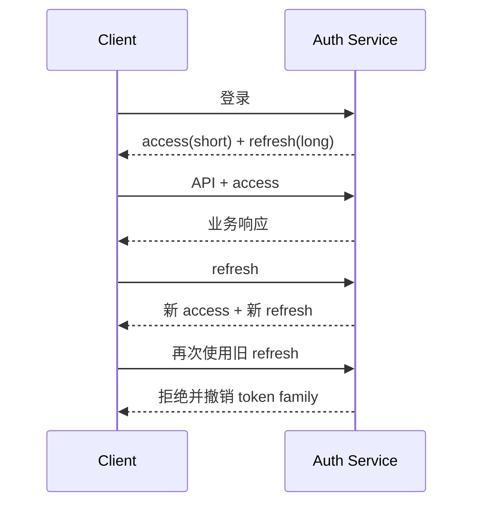

# Session、JWT、Refresh Token、RBAC 与 ACL

登录成功只解决“系统认为你是谁”。读取某份资料还要判断“这个身份是否能执行动作，以及能访问哪些数据”。认证和授权混在一个中间件里，常见结果是 Token 验证通过后默认能查全表。

本章沿登录、访问、刷新、退出和资源查询走一遍，再比较服务端 Session 与 Access/Refresh Token。

## 先分清五个对象

| 对象 | 含义 |
| --- | --- |
| 身份主体 Principal | 已验证的用户、服务或设备 |
| Session | 服务端保存的一次登录会话 |
| Access Token | 短期访问凭证 |
| Refresh Token | 用于轮换访问凭证的高价值凭证 |
| 权限范围 Scope | 主体在当前租户、资源和动作上的允许集合 |

JWT 是 Token 的一种编码和签名格式，不等于完整登录系统。它不会自动处理退出、设备管理、权限撤销和 Refresh Token 轮换。

## 方案一：服务端 Session

用户提交凭证，服务端验证后创建随机 Session ID，把会话状态存入数据库或缓存，并通过 Cookie 返回 ID。

```mermaid
sequenceDiagram
  participant B as Browser
  participant A as API
  participant S as Session Store
  B->>A: POST /login
  A->>S: 创建随机会话
  A-->>B: Set-Cookie: sid=...; HttpOnly; Secure; SameSite=Lax
  B->>A: GET /tasks + Cookie
  A->>S: 查询会话
  S-->>A: principal + expiry
  A-->>B: 响应
```

`HttpOnly` 只能由服务端通过响应头设置，前端 JavaScript 不能给 Cookie 增加这个属性。`Secure` 限制 HTTPS，`SameSite` 降低部分 CSRF 风险；仍要根据跨站流程设计 CSRF 防护。

Session 的优势是易于即时撤销和保存设备状态；代价是每次请求需要会话存储，集群要共享或稳定路由。Session ID 必须高熵、只存 ID，不在 Cookie 放敏感明文。

## 方案二：短 Access Token + 轮换 Refresh Token

Access Token 生命短，用于 API；Refresh Token 生命较长，只发送到刷新端点并安全存储。刷新时执行轮换：旧 Refresh Token 作废，新旧关系记录在一个 Token Family 中。



轮换检测到旧 Token 重放时，可能表示凭证被盗，撤销整个 Family 并要求重新登录。Refresh Token 只保存哈希，类似密码，数据库泄露时不直接得到可用凭证。

JWT Access Token 校验至少包括签名算法白名单、签发者、受众、过期时间和必要 ID。不要信任 Header 指定任意算法，也不要只 Base64 解码后使用 claims。

## Session 和 Token 怎么选

| 需求 | 倾向 |
| --- | --- |
| 同域 Web 应用、需要即时退出 | 服务端 Session 很直接 |
| 多个 API/移动端、短期无状态鉴权 | 短 Access Token + 服务端 Refresh 状态 |
| 权限变化频繁 | 不把完整权限长期写死在 JWT，读取策略版本或服务端范围 |
| 高风险操作 | 除凭证外加入近期认证、设备和二次确认 |

二者可以组合：浏览器使用 HttpOnly Session Cookie，内部网关把已验证主体传给下游；或 Access Token 无状态校验，Refresh 与撤销仍有服务端状态。

## RBAC 回答“角色能做什么”

RBAC 是 Role-Based Access Control。用户绑定角色，角色拥有权限，例如 `task:read`、`task:create`。

角色适合表达功能权限，但不足以回答“能读哪些 Task”。管理员能读所有租户还是当前租户？普通成员能读自己创建的还是团队内的？这些属于数据范围。

## ACL 和数据范围进入 SQL

ACL 可以把主体、资源和动作建立关系；也可以从租户、团队、所有者和共享记录计算范围。最终要形成确定性查询条件。

```sql
SELECT t.id, t.title, t.status
FROM task t
WHERE t.tenant_id = $1
  AND (
    t.owner_id = $2
    OR EXISTS (
      SELECT 1 FROM task_acl a
      WHERE a.task_id = t.id
        AND a.principal_id = $2
        AND a.permission = 'read'
    )
  );
```

先过滤再返回。列表、详情、搜索、导出、缓存和引用都使用相同 Scope 表达，避免某个入口漏掉权限。

高敏感系统可结合 PostgreSQL Row-Level Security 作为数据库防线，但仍要理解连接身份、策略和连接池配置，不能因为启用 RLS 就删除应用授权测试。

## 缓存也要认识权限

错误缓存键：`task:{id}`，任何用户命中同一结果。改进键可以包含租户和权限策略版本，或者缓存公共实体后读取时再次过滤。

权限撤销要求：

- 服务端 Session 或 Token Family 可失效；
- 权限策略版本变化使旧缓存失效；
- 长任务在节点边界重新检查；
- SSE/订阅连接在权限变化后关闭或过滤；
- 审计记录谁、何时、以什么范围访问。

## 退出到底要失效什么

退出不是只删除浏览器本地值。服务端要撤销当前 Session 或 Refresh Token Family；短 Access Token 可以等待过期，或高风险场景维护撤销状态。

Cookie 退出响应使用相同名称、Path 和 Domain 设为过期。若 Path 不一致，旧 Cookie 可能仍被发送。

## 测试矩阵

| 场景 | 预期 |
| --- | --- |
| 无凭证 | 401 |
| 过期 Access Token | 401，不自动提升权限 |
| 旧 Refresh Token 重放 | 拒绝并按策略撤销 Family |
| 有角色但资源不在范围 | 403/404，查询不返回实体 |
| 跨租户 ID | 始终不可见 |
| 权限撤销后缓存命中 | 二次检查拒绝或缓存版本失效 |
| 退出后刷新 | Refresh 失败 |
| 密钥轮换 | 新旧窗口按计划兼容并最终淘汰旧 key |

## 本章决策卡

```text
客户端类型：浏览器 / 移动端 / 服务
凭证存储位置：
Access 生命周期：
Refresh/Session 服务端状态：
轮换和重放检测：
角色权限：
数据范围：
SQL 过滤位置：
缓存权限策略：
撤销和退出：
审计要求：
```

这张卡的输入是客户端形态、风险等级和数据范围，输出是一套可以落实到 Cookie、Token、数据库查询与撤销流程的认证授权方案。任何一项答不出来，都说明实现仍有隐含假设。下一章进入 PostgreSQL，重点不只写 SQL，还要读执行计划、设计事务并理解锁等待。

## 参考资料

- [OWASP Session Management Cheat Sheet](https://cheatsheetseries.owasp.org/cheatsheets/Session_Management_Cheat_Sheet.html)
- [OAuth 2.0 Security Best Current Practice](https://www.rfc-editor.org/rfc/rfc9700)
- [PostgreSQL Row Security](https://www.postgresql.org/docs/current/ddl-rowsecurity.html)
