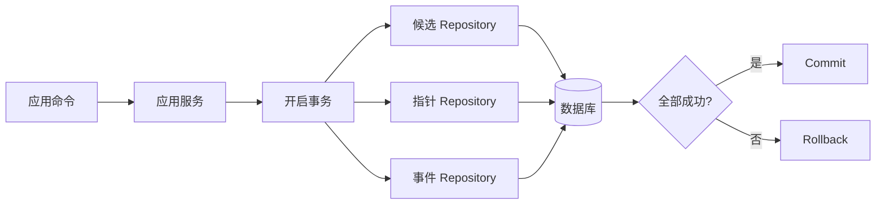

# SQLAlchemy 事务与数据访问边界

一个用例需要写任务记录、写事件，再更新文档状态。如果前两步成功、第三步失败，数据库里不应该留下一个“已完成”事件配上一条旧状态。事务就是把这几次相关写入作为一个整体提交或回滚。

本篇用“激活候选版本”说明 SQLAlchemy 的 Session、事务和 Repository 怎样配合，并处理两个请求同时激活不同版本的冲突。最后再解释为什么网络调用不应被包进长事务。

## Session、连接和事务不是同一个东西

`AsyncSession` 管理 ORM 对象和一个工作单元；它会按需从连接池取得连接。事务定义数据库操作的原子范围。一个 Session 不能在多个并发协程中共享，因为对象状态、flush 和事务上下文会互相干扰。

Repository 使用 Session 查询与写入，但不自行 `commit`。应用服务知道完整用例，因而由它决定事务何时结束。若每个 Repository 都提交一次，“保存候选”和“切换指针”就无法共同回滚。



## 步骤一：把完整不变量放进同一事务

激活操作需要确认候选属于当前租户、状态为 ready、来源版本没有过期，然后更新活动指针并追加事件。这些判断和写入共享同一个数据库快照。

下面是根据 SQLAlchemy 2.x 事务行为重写的最小示例。输入是候选 ID 和预期的当前版本，输出是新活动版本。`with_for_update()` 锁住指针行，避免两个激活请求都基于相同旧状态成功。

```py
async def activate_release(
    session: AsyncSession,
    command: ActivateRelease,
) -> ActiveRelease:
    async with session.begin():
        candidate = await releases.get_ready(
            session, command.tenant_id, command.release_id
        )
        pointer = await pointers.get(
            session, command.tenant_id, for_update=True
        )

        if pointer.version != command.expected_version:
            raise ConcurrentChange()
        if candidate.source_version != pointer.latest_source_version:
            raise SupersededCandidate()

        pointer.activate(candidate.id)
        session.add(ReleaseActivated.from_candidate(candidate))
        await session.flush()

    return ActiveRelease(candidate.id, pointer.version)
```

`flush()` 把 SQL 发给数据库并暴露约束错误，但事务仍可回滚；离开 `begin()` 后才提交。任何检查失败都会终止整组写入，在线指针继续指向旧版本。

## 步骤二：让数据库约束承担最后防线

应用检查便于给出清晰错误，唯一约束、外键和 Check Constraint 才能处理并发竞态。例如 `(tenant_id, source_id, version)` 建唯一约束，状态字段限制合法值，事件引用有效任务。两个请求同时认为“记录不存在”时，数据库仍只允许一个插入。

捕获 `IntegrityError` 后，要先回滚当前事务，再按已知约束名称转换为稳定业务错误。不要把所有完整 SQL 和参数返回给客户端，也不要把未知约束冲突伪装成“记录已存在”。

乐观并发适合冲突少的更新：`UPDATE ... WHERE id=:id AND version=:expected`，影响行数为零表示读取后已变化。悲观锁适合必须串行决定的短临界区。锁不是越多越安全，顺序不一致会造成死锁，长事务会增加等待。

## 步骤三：外部调用离开数据库事务

模型、对象存储和消息 Broker 的网络延迟不可控。若在持有行锁时等待外部响应，连接池和锁都会被占用，失败后也无法由数据库自动撤销已经发送的外部请求。

更稳妥的做法是分阶段：短事务记录意图和稳定状态，事务外执行可幂等的外部操作，再用另一个短事务提交结果。需要可靠派发时，事务内写 Outbox，独立发布器在提交后发送。补偿操作是显式业务流程，不是假装跨系统拥有一个数据库事务。

## 步骤四：管理加载和映射边界

Repository 返回领域所需的明确投影，不把带懒加载关系的 ORM 对象传到响应层。异步代码中意外访问懒加载属性会产生隐式 I/O，甚至在 Session 关闭后失败。使用显式 `selectinload`、投影查询或映射函数，把查询成本放在可见位置。

分页和批处理需要稳定排序；大批量读取使用游标或主键窗口，不把全表加载到 Session identity map。批量写入后及时释放引用，避免长任务内存持续增长。

## 正常结果和失败结果

| 场景 | 预期 |
| --- | --- |
| 候选有效且版本匹配 | 指针、版本和事件共同提交 |
| 事件插入违反约束 | 所有写入回滚 |
| 两个请求同时激活 | 一个成功，另一个并发冲突 |
| 候选属于其他租户 | 查询不到，不加载正文 |
| 外部存储超时 | 数据库不持有长事务等待 |
| Session 被两个协程共享 | 测试应禁止这种用法 |

集成测试要使用隔离数据库，真实验证约束、锁、回滚和隔离级别。SQLite 的并发和锁语义与 PostgreSQL 不同，不能替代所有生产数据库测试。记录事务耗时、连接池等待和死锁重试原因，才能知道瓶颈究竟在 ORM 还是数据库。

## 下一步

事务保证关系数据一致，却不决定检索怎样排序。下一篇将同一租户和 Release 约束下推到全文与向量查询，再用名次融合组合不同分数体系。

## 用并发更新理解事务边界

模拟两个请求同时修改同一份任务状态。请求 A 读取版本 3 并准备更新，请求 B 也读取版本 3 且先提交为版本 4。A 提交时使用 `WHERE id = ? AND version = 3`，影响行数为 0，于是返回可判断的并发冲突，而不是覆盖 B 的结果。

| 事务内适合完成 | 事务外适合完成 |
| --- | --- |
| 读取并锁定业务事实 | 调用慢速第三方接口 |
| 校验状态转换 | 发送邮件或对象上传 |
| 写业务记录与事件事实 | 根据已提交事实派发任务 |
| 提交或整体回滚 | 失败后的有限补派与对账 |

SQLAlchemy Session 表示一个工作单元，不应作为全局单例跨请求或跨协程共享。应用服务决定事务开始与提交，Repository 使用同一 Session 完成查询和保存，但不在每个方法里擅自提交。异常退出时回滚并关闭 Session。

外部调用放在事务中会长时间占用连接与锁，放在提交后又会产生“数据库成功、外部调用失败”的窗口。根据业务选择任务记录、可补派事件或补偿流程，并在文章或代码中明确当前采用哪种方案。测试覆盖成功、规则拒绝、并发冲突和外部派发失败，确认每条路径的数据库事实清楚。

## 参考资料

- [SQLAlchemy Session Basics](https://docs.sqlalchemy.org/en/20/orm/session_basics.html)
- [SQLAlchemy AsyncIO](https://docs.sqlalchemy.org/en/20/orm/extensions/asyncio.html)
- [PostgreSQL Transaction Isolation](https://www.postgresql.org/docs/current/transaction-iso.html)
- [PostgreSQL Explicit Locking](https://www.postgresql.org/docs/current/explicit-locking.html)
