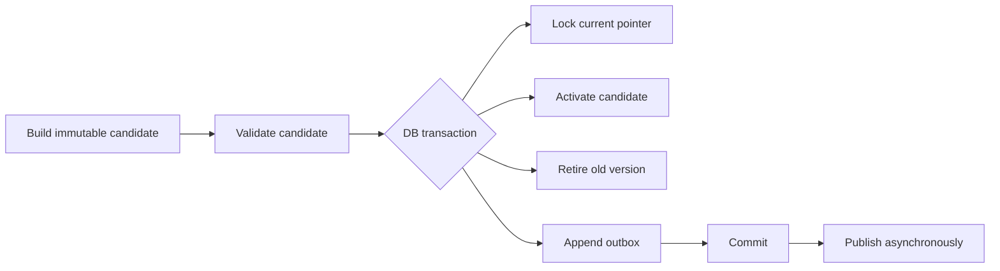

# SQLAlchemy 事务与数据访问边界

SQLAlchemy 的 `Session` 不是普通的数据访问工具类，而是工作单元、身份映射和事务状态的组合。很多并发缺陷并非 SQL 写错，而是 Session 生命周期与业务用例不一致：跨请求复用、在流式响应期间持有事务、Repository 各自提交，或者异常后继续使用已经失败的 Session。

本文以 SQLAlchemy 2.x Async API 为基础，讨论边界而非某一种目录结构。核心原则是：应用用例决定事务，Session 只在该用例的受控范围内存在；跨网络、队列和长计算的流程用状态机连接，不用一个数据库事务包住整个世界。

## Session 同时管理哪些状态

一个 Session 维护：

- 当前数据库事务及连接借用关系；
- 已加载对象的 identity map；
- 待 flush 的新增、修改和删除；
- 提交/回滚后的对象过期策略；
- flush 失败后的失败状态。

因此 AsyncSession 不能被多个并发协程共享。两个 `asyncio.gather` 分支同时执行查询或 flush，会竞争同一事务状态。每个并发任务创建自己的 Session，并通过显式命令和稳定标识协作。

```py
from collections.abc import AsyncIterator

from sqlalchemy.ext.asyncio import AsyncSession, async_sessionmaker


async def session_scope(
    factory: async_sessionmaker[AsyncSession],
) -> AsyncIterator[AsyncSession]:
    async with factory() as session:
        async with session.begin():
            yield session
```

框架依赖通常只负责创建/关闭 Session，不应无条件提交所有请求。更清晰的选择是应用服务在确定写用例的地方进入 `session.begin()`；只读用例不伪造提交，异常自然回滚。

## 事务边界跟随业务不变量

假设“激活候选版本”要求：候选状态变为 active、旧版本失活、当前指针更新、Outbox 事件写入，四者必须同时成功。它们属于一个数据库事务。上传文件、调用 Embedding 或通知下游不属于这个原子范围，因为数据库无法回滚远端副作用。



```py
class ReleaseService:
    def __init__(self, session: AsyncSession) -> None:
        self.session = session
        self.releases = ReleaseRepository(session)
        self.outbox = OutboxRepository(session)

    async def activate(self, command: ActivateRelease) -> ReleaseView:
        async with self.session.begin():
            current = await self.releases.lock_current(
                tenant_id=command.tenant_id,
                resource_id=command.resource_id,
            )
            candidate = await self.releases.get_candidate(
                tenant_id=command.tenant_id,
                release_id=command.release_id,
            )
            candidate.assert_activatable(expected_source=command.source_version)

            await self.releases.activate(candidate, replaces=current)
            await self.outbox.append(candidate.pull_events())
            return ReleaseView.from_domain(candidate)
```

Repository 不调用 `commit()`。否则第一个 Repository 已提交，第二个失败，应用服务无法恢复原子性。Repository 可以在确有需要时 `flush()` 获取数据库生成值，但 flush 不等于 commit，之后仍可能回滚。

## `autobegin`、flush 与异常状态

SQLAlchemy 2.x 在首次数据库操作时自动开始事务。看似无害的查询可能占用连接直到 Session 结束。长时间处理前先提取必要的不可变数据并结束事务，不能拿着 ORM 对象做数分钟模型调用。

`flush()` 会把 Unit of Work 发到数据库并触发约束，但事务仍未提交。flush 失败后必须 rollback；捕获 `IntegrityError` 后继续查询同一 Session，会得到 `PendingRollbackError`。

```py
try:
    async with session.begin():
        session.add(record)
        await session.flush()
except IntegrityError as exc:
    # begin 上下文已回滚；在边界转换成稳定业务错误
    raise DuplicateIdempotencyKey() from exc
```

不要把所有 `IntegrityError` 都映射为“重复”。根据约束名称或显式查询上下文分类，但避免把原始 SQL 和字段值暴露到 API。

`expire_on_commit=False` 在 Async 应用中可避免提交后访问属性触发隐式 I/O，但也意味着对象可能是旧快照。跨事务边界返回 DTO，不让 ORM 对象长期逃逸，语义更清楚。

## 乐观并发与悲观锁的选择

乐观并发适合冲突较少、处理前可基于版本判断的写入。SQL 更新携带旧版本：

```sql
UPDATE document_records
SET state = :next_state,
    version = version + 1,
    updated_at = now()
WHERE tenant_id = :tenant_id
  AND public_id = :document_id
  AND version = :expected_version;
```

影响行数为零不是简单“未找到”，还可能是版本冲突或范围不符。服务端重新查询可见范围内的记录再返回稳定 404/409。

悲观锁 `SELECT ... FOR UPDATE` 适合短临界区：分配连续序号、消费有限余额、切换唯一当前指针。锁必须在相同事务中读取和写入，锁期间不进行外部网络调用。多个资源按稳定顺序加锁，降低死锁；即便如此仍把死锁作为可重试的暂时故障处理，并限制总预算。

```py
statement = (
    select(CurrentRelease)
    .where(
        CurrentRelease.tenant_id == tenant_id,
        CurrentRelease.resource_id == resource_id,
    )
    .with_for_update()
)
current = (await session.execute(statement)).scalar_one_or_none()
```

`SKIP LOCKED` 适合多个 Worker 竞争领取任务，不适合普通用户查询，因为它会静默跳过正在处理的记录。锁语义是业务协议的一部分，不能仅为了“提高性能”随意添加。

## 隔离级别与写偏差

默认 READ COMMITTED 下，每条语句看到自己的已提交快照。它能防止脏读，但不能自动保护跨多行不变量。例如两个事务都查询“当前没有主版本”，随后各插入一行，查询条件本身没有被锁住。

优先用数据库约束表达不变量：

```sql
CREATE UNIQUE INDEX one_active_release_per_resource
ON releases (tenant_id, resource_id)
WHERE state = 'active';
```

约束比“先查再写”更能承受并发。无法用约束表达时，再选择锁定稳定父行、SERIALIZABLE 隔离加有限重试，或重新设计数据模型。提高全局隔离级别会增加冲突和延迟，应针对关键事务验证。

| 风险 | 推荐保护 | 不充分做法 |
| --- | --- | --- |
| 相同幂等键重复创建 | 唯一约束 + 冲突读取 | 应用内存 Set |
| 同记录并发编辑 | 版本条件更新 | 最后写入覆盖 |
| 唯一当前版本 | 部分唯一索引/锁定父行 | 先 SELECT 再 INSERT |
| 多 Worker 领取 | 行锁 + `SKIP LOCKED` + 租约 | 查询后逐个更新 |
| 跨多行复杂不变量 | 明确锁顺序或 Serializable | 假设单请求执行 |

## 嵌套事务不是跨系统事务

`session.begin_nested()` 创建数据库 Savepoint，适合批量处理中隔离单条可预期约束失败。它不能回滚已经发送的 HTTP 请求、消息或对象存储写入，也不应掩盖外层事务已经失败。

```py
async with session.begin():
    for item in batch:
        try:
            async with session.begin_nested():
                await repository.insert_item(item)
        except DuplicateItem:
            duplicates += 1
```

Savepoint 有数据库成本。大批量导入应分批提交、保存检查点并允许重放，而不是一个巨大事务嵌套数万 Savepoint。需要数据库与 Broker 协作时使用 Outbox；跨多个独立服务用 Saga/补偿和状态机，不把两阶段提交当默认方案。

## 连接池和事件循环是同一容量问题

Async 不会增加数据库最大连接数。若每个 Web 进程池大小 10，部署 8 个进程，再加 6 个 Worker，各自独立建池，总连接可能远超数据库上限。容量公式必须覆盖所有角色、发布时新旧副本并存和管理连接。

连接池设置 `pool_pre_ping` 可发现部分陈旧连接，但不能替代请求 deadline。`pool_timeout` 应小于业务总超时，使连接饥饿快速暴露；监控 checkout 等待、使用中连接、查询时长和事务时长。

流式响应尤其危险：如果生成器还依赖请求 Session，客户端慢读会长时间占有连接。先在短事务内持久化任务或读取游标，结束 Session，再流式读取独立事件源。

## 多租户与权限必须进入 Repository 契约

Repository 的受保护查询要求 `tenant_id` 和范围约束为必填。先按主键加载，再在 Service 比较租户，会让 identity map、ORM Hook、日志和缓存先接触越权对象。

```py
async def find_visible_document(
    self,
    *,
    tenant_id: str,
    document_id: str,
    allowed_scope_ids: Sequence[str],
) -> Document | None:
    statement = select(DocumentRow).where(
        DocumentRow.tenant_id == tenant_id,
        DocumentRow.public_id == document_id,
        DocumentRow.scope_id.in_(allowed_scope_ids),
        DocumentRow.deleted_at.is_(None),
    )
    row = (await self.session.execute(statement)).scalar_one_or_none()
    return map_row(row) if row else None
```

数据库 RLS 可以提供纵深防御，但应用仍要传递可靠租户上下文，并解决连接池复用时 `SET LOCAL` 的生命周期。RLS 策略、后台 Worker 和管理员路径都需要集成测试。

## 验证：必须使用真实隔离数据库

Mock 能验证服务调用顺序，不能证明唯一索引、锁、隔离级别和 SQL 范围。事务测试连接专用数据库，并行测试使用独立 schema/database 或可证明隔离的事务策略。

```py
async def test_only_one_concurrent_activation_wins(factory) -> None:
    async with factory() as left, factory() as right:
        results = await asyncio.gather(
            ReleaseService(left).activate(command(version=3)),
            ReleaseService(right).activate(command(version=3)),
            return_exceptions=True,
        )

    assert sum(isinstance(value, ReleaseView) for value in results) == 1
    assert sum(isinstance(value, StaleReleaseVersion) for value in results) == 1
    assert await count_active_releases(factory, command.resource_id) == 1
```

验证矩阵至少包括：

- Repository 所有查询都带租户与范围，不同租户使用相同 public ID；
- 第二个并发版本更新得到 409 类冲突，不覆盖第一个结果；
- Outbox 插入失败时业务状态一起回滚；
- flush 约束失败后 Session 被正确回滚；
- Worker 被杀后未提交事务不留下半状态；
- 连接池耗尽时在明确时间内失败并可观测；
- 数据库迁移期间新旧应用版本都能读写兼容 Schema。

## 常见误区

- 全局共享一个 AsyncSession，或在并发协程间传递 Session。
- Repository 各自 commit，应用用例无法形成原子事务。
- 在数据库事务内调用模型、文件服务或第三方 HTTP。
- 把 ORM 对象跨请求、队列和流式响应传递。
- 用“先查是否存在”代替唯一约束。
- 认为默认隔离级别可以自动保护跨行不变量。
- 把 Savepoint 当成外部副作用的回滚机制。
- 只按单进程配置连接池，忽略 Web、Worker 和滚动发布总量。

## 参考资料

- [SQLAlchemy Session Basics](https://docs.sqlalchemy.org/en/20/orm/session_basics.html)：Session 状态、flush、commit、rollback 与生命周期。
- [SQLAlchemy Transactions](https://docs.sqlalchemy.org/en/20/orm/session_transaction.html)：事务上下文、Savepoint 和连接管理。
- [SQLAlchemy AsyncIO](https://docs.sqlalchemy.org/en/20/orm/extensions/asyncio.html)：AsyncSession 不能跨并发任务共享的边界。
- [PostgreSQL Transaction Isolation](https://www.postgresql.org/docs/current/transaction-iso.html)：隔离级别、序列化失败与并发异常。
- [PostgreSQL Explicit Locking](https://www.postgresql.org/docs/current/explicit-locking.html)：行锁、表锁与死锁处理。
